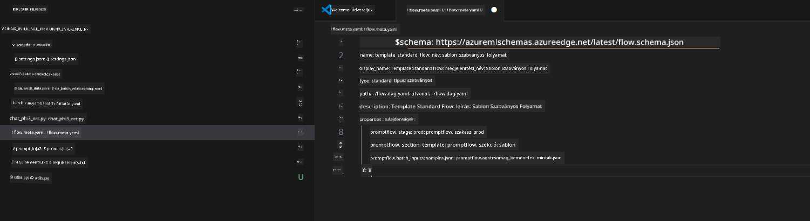
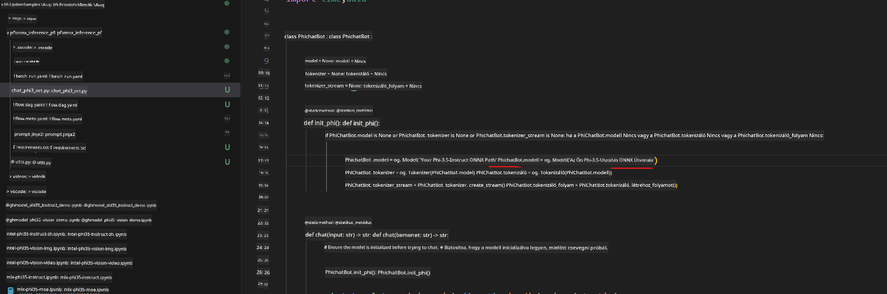
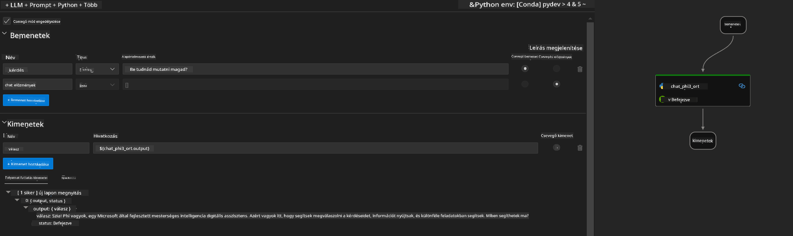
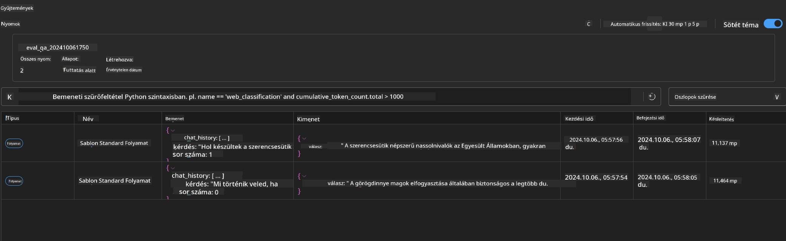

<!--
CO_OP_TRANSLATOR_METADATA:
{
  "original_hash": "92e7dac1e5af0dd7c94170fdaf6860fe",
  "translation_date": "2025-07-17T03:03:02+00:00",
  "source_file": "md/02.Application/01.TextAndChat/Phi3/UsingPromptFlowWithONNX.md",
  "language_code": "hu"
}
-->
# Windows GPU használata Prompt flow megoldás létrehozásához Phi-3.5-Instruct ONNX-szel

A következő dokumentum egy példa arra, hogyan használhatjuk a PromptFlow-t ONNX (Open Neural Network Exchange) segítségével Phi-3 modelleken alapuló AI alkalmazások fejlesztéséhez.

A PromptFlow egy fejlesztői eszközkészlet, amely az LLM-alapú (Nagy Nyelvi Modell) AI alkalmazások teljes fejlesztési ciklusát egyszerűsíti, az ötleteléstől és prototípus-készítéstől kezdve a tesztelésen és értékelésen át.

A PromptFlow és az ONNX integrálásával a fejlesztők képesek:

- Modell teljesítményének optimalizálása: Használja az ONNX-et a hatékony modell-inferenciához és telepítéshez.
- Fejlesztés egyszerűsítése: A PromptFlow segítségével kezelheti a munkafolyamatot és automatizálhatja az ismétlődő feladatokat.
- Együttműködés javítása: Egységes fejlesztői környezet biztosításával elősegíti a csapattagok közötti jobb együttműködést.

**A Prompt flow** egy fejlesztői eszközkészlet, amely az LLM-alapú AI alkalmazások teljes fejlesztési ciklusát egyszerűsíti, az ötleteléstől, prototípus-készítéstől, tesztelésen, értékelésen át egészen a termelési telepítésig és monitorozásig. Megkönnyíti a prompt tervezést, és lehetővé teszi, hogy termelési minőségű LLM alkalmazásokat építsen.

A Prompt flow képes kapcsolódni az OpenAI-hoz, az Azure OpenAI szolgáltatáshoz, valamint testreszabható modellekhez (Huggingface, helyi LLM/SLM). Célunk, hogy a Phi-3.5 kvantált ONNX modelljét helyi alkalmazásokba telepítsük. A Prompt flow segíthet jobban megtervezni az üzletet, és helyi megoldásokat létrehozni Phi-3.5 alapján. Ebben a példában az ONNX Runtime GenAI könyvtárat kombináljuk, hogy Windows GPU alapú Prompt flow megoldást valósítsunk meg.

## **Telepítés**

### **ONNX Runtime GenAI Windows GPU-hoz**

Olvassa el ezt az útmutatót az ONNX Runtime GenAI Windows GPU-hoz történő beállításához [ide kattintva](./ORTWindowGPUGuideline.md)

### **Prompt flow beállítása VSCode-ban**

1. Telepítse a Prompt flow VS Code bővítményt


2. A Prompt flow VS Code bővítmény telepítése után kattintson a bővítményre, majd válassza az **Installation dependencies** lehetőséget, és kövesse az útmutatót a Prompt flow SDK környezetbe történő telepítéséhez


3. Töltse le a [példakódot](../../../../../../code/09.UpdateSamples/Aug/pf/onnx_inference_pf) és nyissa meg VS Code-ban ezt a mintát



4. Nyissa meg a **flow.dag.yaml** fájlt, és válassza ki a Python környezetét


   Nyissa meg a **chat_phi3_ort.py** fájlt, és módosítsa a Phi-3.5-instruct ONNX modell helyét



5. Futtassa a prompt flow-t teszteléshez

Nyissa meg a **flow.dag.yaml** fájlt, és kattintson a vizuális szerkesztőre


Kattintás után futtassa a tesztelést



1. Terminálban is futtathat batch-et a további eredmények ellenőrzéséhez


```bash

pf run create --file batch_run.yaml --stream --name 'Your eval qa name'    

```

Az eredményeket az alapértelmezett böngészőben tekintheti meg




**Jogi nyilatkozat**:  
Ez a dokumentum az AI fordító szolgáltatás, a [Co-op Translator](https://github.com/Azure/co-op-translator) segítségével készült. Bár a pontosságra törekszünk, kérjük, vegye figyelembe, hogy az automatikus fordítások hibákat vagy pontatlanságokat tartalmazhatnak. Az eredeti dokumentum az anyanyelvén tekintendő hiteles forrásnak. Fontos információk esetén szakmai, emberi fordítást javaslunk. Nem vállalunk felelősséget az ebből a fordításból eredő félreértésekért vagy téves értelmezésekért.