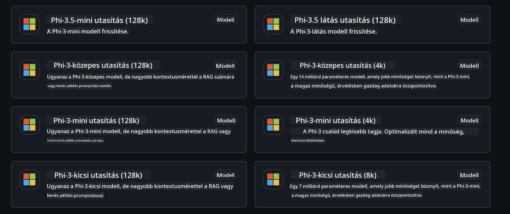
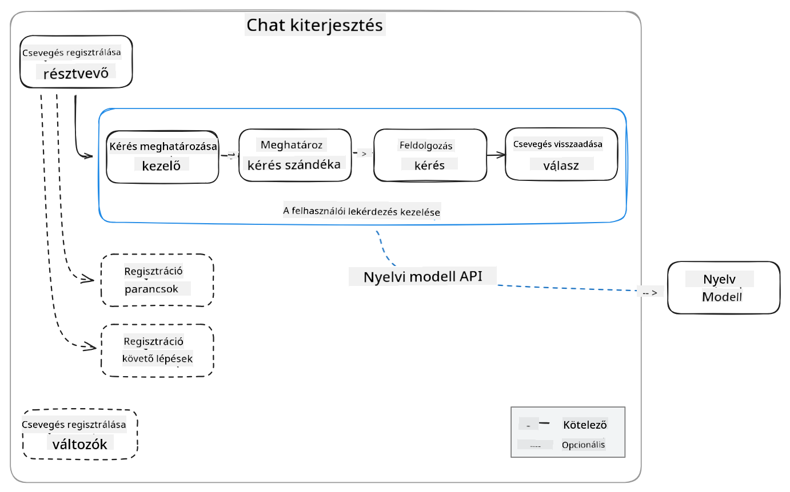
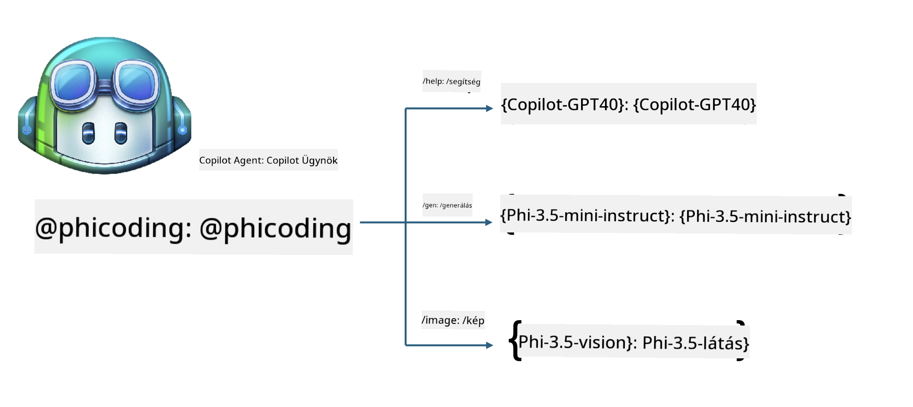
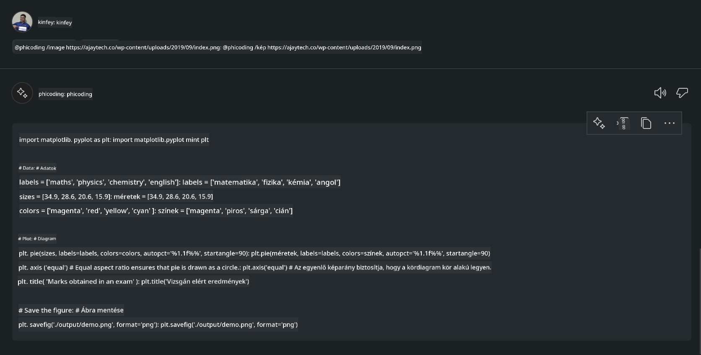

<!--
CO_OP_TRANSLATOR_METADATA:
{
  "original_hash": "35bf81388ac6917277b8d9a0c39bdc70",
  "translation_date": "2025-07-17T03:29:27+00:00",
  "source_file": "md/02.Application/02.Code/Phi3/CreateVSCodeChatAgentWithGitHubModels.md",
  "language_code": "hu"
}
-->
# **Hozd létre saját Visual Studio Code Chat Copilot Agentedet a Phi-3.5-tel a GitHub Models segítségével**

Használod a Visual Studio Code Copilotot? Különösen a Chat funkcióban különböző agenteket használhatsz, hogy javítsd a projektek létrehozásának, írásának és karbantartásának képességét a Visual Studio Code-ban. A Visual Studio Code egy API-t biztosít, amely lehetővé teszi cégek és egyének számára, hogy üzleti igényeik alapján különböző agenteket hozzanak létre, ezzel bővítve képességeiket különféle szakterületeken. Ebben a cikkben a GitHub Models **Phi-3.5-mini-instruct (128k)** és **Phi-3.5-vision-instruct (128k)** modelljeire fókuszálunk, hogy elkészítsd saját Visual Studio Code Agentedet.

## **A Phi-3.5-ről a GitHub Models-en**

Tudjuk, hogy a Phi-3/3.5-mini-instruct a Phi-3/3.5 családban erős kódértési és generálási képességekkel rendelkezik, és előnyökkel bír a Gemma-2-9b és a Mistral-Nemo-12B-instruct-2407 modellekkel szemben.


A legújabb GitHub Models már elérhetővé teszi a Phi-3.5-mini-instruct (128k) és a Phi-3.5-vision-instruct (128k) modelleket. A fejlesztők az OpenAI SDK-n, az Azure AI Inference SDK-n és a REST API-n keresztül férhetnek hozzájuk.



***Megjegyzés:*** Ajánlott itt az Azure AI Inference SDK használata, mert a gyártási környezetben jobban tud váltani az Azure Model Cataloggal.

Az alábbiakban a **Phi-3.5-mini-instruct (128k)** és a **Phi-3.5-vision-instruct (128k)** kódgenerálási eredményei láthatók a GitHub Models-hez való csatlakozás után, valamint előkészítjük a következő példákat.

**Demo: GitHub Models Phi-3.5-mini-instruct (128k) kód generálása Prompt alapján** ([kattints ide](../../../../../../code/09.UpdateSamples/Aug/ghmodel_phi35_instruct_demo.ipynb))

**Demo: GitHub Models Phi-3.5-vision-instruct (128k) kód generálása kép alapján** ([kattints ide](../../../../../../code/09.UpdateSamples/Aug/ghmodel_phi35_vision_demo.ipynb))


## **A GitHub Copilot Chat Agent-ről**

A GitHub Copilot Chat Agent különböző feladatokat képes elvégezni különböző projekt szcenáriókban a kód alapján. A rendszer négy agentből áll: workspace, github, terminal, vscode


Az agent nevének '@' jellel történő megadásával gyorsan elvégezheted a hozzá tartozó feladatokat. Vállalatok számára, ha hozzáadod saját üzleti tartalmadat, például követelményeket, kódolást, teszt specifikációkat és kiadást, akkor erősebb vállalati privát funkciókat érhetsz el a GitHub Copilot alapjain.

A Visual Studio Code Chat Agent most hivatalosan is kiadta az API-ját, amely lehetővé teszi vállalatok vagy vállalati fejlesztők számára, hogy különböző szoftver üzleti ökoszisztémák alapján fejlesszenek agenteket. A Visual Studio Code Extension fejlesztési módszerén alapulva könnyen hozzáférhetsz a Visual Studio Code Chat Agent API felületéhez. Ezen a folyamaton alapulva fejleszthetünk.



A fejlesztési szcenárió támogatja harmadik fél modell API-khoz való hozzáférést (például GitHub Models, Azure Model Catalog, és nyílt forráskódú modellekre épülő saját szolgáltatások), valamint használhatja a GitHub Copilot által biztosított gpt-35-turbo, gpt-4 és gpt-4o modelleket is.

## **Agent hozzáadása @phicoding néven Phi-3.5 alapokon**

Megpróbáljuk integrálni a Phi-3.5 programozási képességeit, hogy kódírást, képgeneráláshoz kapcsolódó kódot és egyéb feladatokat végezzünk el. Elkészítünk egy Phi-3.5 köré épülő Agentet - @PHI, az alábbi funkciókkal:

1. Önbemutató generálása a GitHub Copilot által biztosított GPT-4o alapján a **@phicoding /help** parancs segítségével

2. Kód generálása különböző programozási nyelveken a **Phi-3.5-mini-instruct (128k)** modell alapján a **@phicoding /gen** parancs segítségével

3. Kód generálása a **Phi-3.5-vision-instruct (128k)** modell és kép alapján a **@phicoding /image** parancs segítségével



## **Kapcsolódó lépések**

1. Telepítsd a Visual Studio Code Extension fejlesztési támogatást npm-mel

```bash

npm install --global yo generator-code 

```
2. Hozz létre egy Visual Studio Code Extension plugint (Typescript fejlesztési módban, phiext néven)

```bash

yo code 

```

3. Nyisd meg a létrehozott projektet és módosítsd a package.json-t. Itt találhatók a kapcsolódó utasítások és konfigurációk, valamint a GitHub Models konfigurációja. Figyelj rá, hogy ide be kell illesztened a GitHub Models tokenedet.

```json

{
  "name": "phiext",
  "displayName": "phiext",
  "description": "",
  "version": "0.0.1",
  "engines": {
    "vscode": "^1.93.0"
  },
  "categories": [
    "AI",
    "Chat"
  ],
  "activationEvents": [],
  "enabledApiProposals": [
      "chatVariableResolver"
  ],
  "main": "./dist/extension.js",
  "contributes": {
    "chatParticipants": [
        {
            "id": "chat.phicoding",
            "name": "phicoding",
            "description": "Hey! I am Microsoft Phi-3.5, She can help me with coding problems, such as generation code with your natural language, or even generation code about chart from images. Just ask me anything!",
            "isSticky": true,
            "commands": [
                {
                    "name": "help",
                    "description": "Introduce myself to you"
                },
                {
                    "name": "gen",
                    "description": "Generate code for you with Microsoft Phi-3.5-mini-instruct"
                },
                {
                    "name": "image",
                    "description": "Generate code for chart from image(png or jpg) with Microsoft Phi-3.5-vision-instruct, please add image url like this : https://ajaytech.co/wp-content/uploads/2019/09/index.png"
                }
            ]
        }
    ],
    "commands": [
        {
            "command": "phicoding.namesInEditor",
            "title": "Use Microsoft Phi 3.5 in Editor"
        }
    ],
    "configuration": {
      "type": "object",
      "title": "githubmodels",
      "properties": {
        "githubmodels.endpoint": {
          "type": "string",
          "default": "https://models.inference.ai.azure.com",
          "description": "Your GitHub Models Endpoint",
          "order": 0
        },
        "githubmodels.api_key": {
          "type": "string",
          "default": "Your GitHub Models Token",
          "description": "Your GitHub Models Token",
          "order": 1
        },
        "githubmodels.phi35instruct": {
          "type": "string",
          "default": "Phi-3.5-mini-instruct",
          "description": "Your Phi-35-Instruct Model",
          "order": 2
        },
        "githubmodels.phi35vision": {
          "type": "string",
          "default": "Phi-3.5-vision-instruct",
          "description": "Your Phi-35-Vision Model",
          "order": 3
        }
      }
    }
  },
  "scripts": {
    "vscode:prepublish": "npm run package",
    "compile": "webpack",
    "watch": "webpack --watch",
    "package": "webpack --mode production --devtool hidden-source-map",
    "compile-tests": "tsc -p . --outDir out",
    "watch-tests": "tsc -p . -w --outDir out",
    "pretest": "npm run compile-tests && npm run compile && npm run lint",
    "lint": "eslint src",
    "test": "vscode-test"
  },
  "devDependencies": {
    "@types/vscode": "^1.93.0",
    "@types/mocha": "^10.0.7",
    "@types/node": "20.x",
    "@typescript-eslint/eslint-plugin": "^8.3.0",
    "@typescript-eslint/parser": "^8.3.0",
    "eslint": "^9.9.1",
    "typescript": "^5.5.4",
    "ts-loader": "^9.5.1",
    "webpack": "^5.94.0",
    "webpack-cli": "^5.1.4",
    "@vscode/test-cli": "^0.0.10",
    "@vscode/test-electron": "^2.4.1"
  },
  "dependencies": {
    "@types/node-fetch": "^2.6.11",
    "node-fetch": "^3.3.2",
    "@azure-rest/ai-inference": "latest",
    "@azure/core-auth": "latest",
    "@azure/core-sse": "latest"
  }
}


```

4. Módosítsd a src/extension.ts fájlt

```typescript

// The module 'vscode' contains the VS Code extensibility API
// Import the module and reference it with the alias vscode in your code below
import * as vscode from 'vscode';
import ModelClient from "@azure-rest/ai-inference";
import { AzureKeyCredential } from "@azure/core-auth";


interface IPhiChatResult extends vscode.ChatResult {
    metadata: {
        command: string;
    };
}


const MODEL_SELECTOR: vscode.LanguageModelChatSelector = { vendor: 'copilot', family: 'gpt-4o' };

function isValidImageUrl(url: string): boolean {
    const regex = /^(https?:\/\/.*\.(?:png|jpg))$/i;
    return regex.test(url);
}
  

// This method is called when your extension is activated
// Your extension is activated the very first time the command is executed
export function activate(context: vscode.ExtensionContext) {

    const codinghandler: vscode.ChatRequestHandler = async (request: vscode.ChatRequest, context: vscode.ChatContext, stream: vscode.ChatResponseStream, token: vscode.CancellationToken): Promise<IPhiChatResult> => {


        const config : any = vscode.workspace.getConfiguration('githubmodels');
        const endPoint: string = config.get('endpoint');
        const apiKey: string = config.get('api_key');
        const phi35instruct: string = config.get('phi35instruct');
        const phi35vision: string = config.get('phi35vision');
        
        if (request.command === 'help') {

            const content = "Welcome to Coding assistant with Microsoft Phi-3.5"; 
            stream.progress(content);


            try {
                const [model] = await vscode.lm.selectChatModels(MODEL_SELECTOR);
                if (model) {
                    const messages = [
                        vscode.LanguageModelChatMessage.User("Please help me express this content in a humorous way: I am a programming assistant who can help you convert natural language into code and generate code based on the charts in the images. output format like this : Hey I am Phi ......")
                    ];
                    const chatResponse = await model.sendRequest(messages, {}, token);
                    for await (const fragment of chatResponse.text) {
                        stream.markdown(fragment);
                    }
                }
            } catch(err) {
                console.log(err);
            }


            return { metadata: { command: 'help' } };

        }

        
        if (request.command === 'gen') {

            const content = "Welcome to use phi-3.5 to generate code";

            stream.progress(content);

            const client = new ModelClient(endPoint, new AzureKeyCredential(apiKey));

            const response = await client.path("/chat/completions").post({
              body: {
                messages: [
                  { role:"system", content: "You are a coding assistant.Help answer all code generation questions." },
                  { role:"user", content: request.prompt }
                ],
                model: phi35instruct,
                temperature: 0.4,
                max_tokens: 1000,
                top_p: 1.
              }
            });

            stream.markdown(response.body.choices[0].message.content);

            return { metadata: { command: 'gen' } };

        }


        
        if (request.command === 'image') {


            const content = "Welcome to use phi-3.5 to generate code from image(png or jpg),image url like this:https://ajaytech.co/wp-content/uploads/2019/09/index.png";

            stream.progress(content);

            if (!isValidImageUrl(request.prompt)) {
                stream.markdown('Please provide a valid image URL');
                return { metadata: { command: 'image' } };
            }
            else
            {

                const client = new ModelClient(endPoint, new AzureKeyCredential(apiKey));
    
                const response = await client.path("/chat/completions").post({
                    body: {
                      messages: [
                        { role: "system", content: "You are a helpful assistant that describes images in details." },
                        { role: "user", content: [
                            { type: "text", text: "Please generate code according to the chart in the picture according to the following requirements\n1. Keep all information in the chart, including data and text\n2. Do not generate additional information that is not included in the chart\n3. Please extract data from the picture, do not generate it from csv\n4. Please save the regenerated chart as a chart and save it to ./output/demo.png"},
                            { type: "image_url", image_url: {url: request.prompt}
                            }
                          ]
                        }
                      ],
                      model: phi35vision,
                      temperature: 0.4,
                      max_tokens: 2048,
                      top_p: 1.
                    }
                  });
    
                
                stream.markdown(response.body.choices[0].message.content);
    
                return { metadata: { command: 'image' } };
            }


        }


        return { metadata: { command: '' } };
    };


    const phi_ext = vscode.chat.createChatParticipant("chat.phicoding", codinghandler);

    phi_ext.iconPath = new vscode.ThemeIcon('sparkle');


    phi_ext.followupProvider = {
        provideFollowups(result: IPhiChatResult, context: vscode.ChatContext, token: vscode.CancellationToken) {
            return [{
                prompt: 'Let us coding with Phi-3.5 😋😋😋😋',
                label: vscode.l10n.t('Enjoy coding with Phi-3.5'),
                command: 'help'
            } satisfies vscode.ChatFollowup];
        }
    };

    context.subscriptions.push(phi_ext);
}

// This method is called when your extension is deactivated
export function deactivate() {}


```

6. Futtatás

***/help***


***@phicoding /help***


***@phicoding /gen***


***@phicoding /image***



Letöltheted a mintakódot: [kattints ide](../../../../../../code/09.UpdateSamples/Aug/vscode)

## **Források**

1. Regisztráció a GitHub Models-re [https://gh.io/models](https://gh.io/models)

2. Tanulj meg Visual Studio Code Extension fejlesztést [https://code.visualstudio.com/api/get-started/your-first-extension](https://code.visualstudio.com/api/get-started/your-first-extension)

3. Ismerd meg a Visual Studio Code Copilot Chat API-t [https://code.visualstudio.com/api/extension-guides/chat](https://code.visualstudio.com/api/extension-guides/chat)

**Jogi nyilatkozat**:  
Ez a dokumentum az AI fordító szolgáltatás, a [Co-op Translator](https://github.com/Azure/co-op-translator) segítségével készült. Bár a pontosságra törekszünk, kérjük, vegye figyelembe, hogy az automatikus fordítások hibákat vagy pontatlanságokat tartalmazhatnak. Az eredeti dokumentum az anyanyelvén tekintendő hiteles forrásnak. Fontos információk esetén professzionális emberi fordítást javaslunk. Nem vállalunk felelősséget a fordítás használatából eredő félreértésekért vagy téves értelmezésekért.