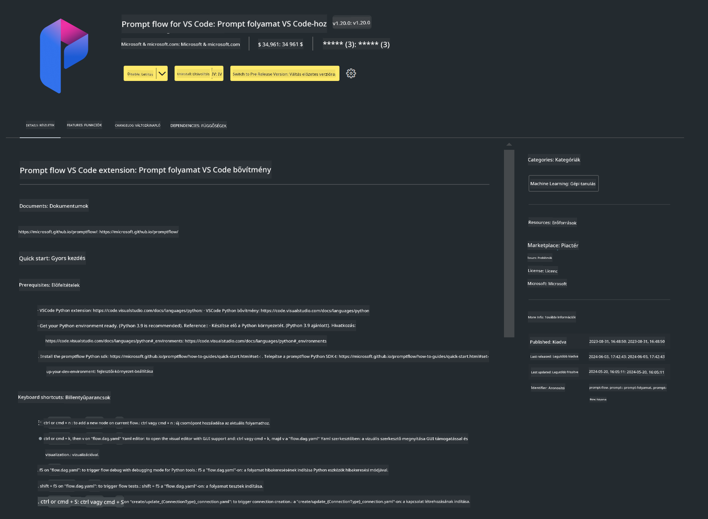

<!--
CO_OP_TRANSLATOR_METADATA:
{
  "original_hash": "a4ef39027902e82f2c33d568d2a2259a",
  "translation_date": "2025-07-17T03:52:13+00:00",
  "source_file": "md/02.Application/02.Code/Phi3/VSCodeExt/HOL/AIPC/01.Installations.md",
  "language_code": "hu"
}
-->
# **Lab 0 - Telepítés**

Amikor belépünk a laborba, be kell állítanunk a megfelelő környezetet:


### **1. Python 3.11+**

Ajánlott a miniforge használata a Python környezet beállításához

A miniforge beállításához kérjük, tekintse meg a [https://github.com/conda-forge/miniforge](https://github.com/conda-forge/miniforge) oldalt

A miniforge beállítása után futtassa a következő parancsot Power Shell-ben

```bash

conda create -n pyenv python==3.11.8 -y

conda activate pyenv

```


### **2. Prompt flow SDK telepítése**

A Lab 1-ben a Prompt flow-t használjuk, ezért be kell állítania a Prompt flow SDK-t.

```bash

pip install promptflow --upgrade

```

Ezzel a paranccsal ellenőrizheti a promptflow sdk telepítését


```bash

pf --version

```

### **3. Visual Studio Code Prompt flow bővítmény telepítése**




### **4. Intel NPU gyorsító könyvtár**

Az Intel új generációs processzorai támogatják az NPU-t. Ha helyben szeretne LLM-eket / SLM-eket futtatni NPU-val, használhatja az ***Intel NPU Acceleration Library***-t. Ha többet szeretne megtudni, olvassa el a [https://github.com/microsoft/PhiCookBook/blob/main/md/01.Introduction/03/AIPC_Inference.md](https://github.com/microsoft/PhiCookBook/blob/main/md/01.Introduction/03/AIPC_Inference.md) oldalt.

Intel NPU gyorsító könyvtár telepítése bash-ben


```bash

pip install intel-npu-acceleration-library

```

***Megjegyzés***: Kérjük, vegye figyelembe, hogy ez a könyvtár a transformers ***4.40.2*** verzióját támogatja, kérjük, ellenőrizze a verziót


### **5. Egyéb Python könyvtárak**


Hozzon létre egy requirements.txt fájlt, és adja hozzá a következő tartalmat

```txt

notebook
numpy 
scipy 
scikit-learn 
matplotlib 
pandas 
pillow 
graphviz

```


### **6. NVM telepítése**

NVM telepítése Powershell-ben


```bash

winget install -e --id CoreyButler.NVMforWindows

```

Nodejs 18.20 telepítése


```bash

nvm install 18.20.0

nvm use 18.20.0

```

### **7. Visual Studio Code fejlesztői támogatás telepítése**


```bash

npm install --global yo generator-code

```

Gratulálunk! Sikeresen beállította az SDK-t. Most folytassa a gyakorlati lépésekkel.

**Jogi nyilatkozat**:  
Ez a dokumentum az AI fordító szolgáltatás, a [Co-op Translator](https://github.com/Azure/co-op-translator) segítségével készült. Bár a pontosságra törekszünk, kérjük, vegye figyelembe, hogy az automatikus fordítások hibákat vagy pontatlanságokat tartalmazhatnak. Az eredeti dokumentum az anyanyelvén tekintendő hiteles forrásnak. Kritikus információk esetén professzionális emberi fordítást javaslunk. Nem vállalunk felelősséget a fordítás használatából eredő félreértésekért vagy téves értelmezésekért.