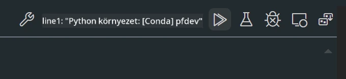

# **2. labor - Prompt flow futtatása Phi-3-mini modellel AIPC-n**

## **Mi az a Prompt flow**

A Prompt flow egy fejlesztői eszközkészlet, amely az LLM-alapú AI alkalmazások teljes fejlesztési ciklusát egyszerűsíti, az ötleteléstől, prototípus készítésen, tesztelésen, értékelésen át a termelési bevezetésig és monitorozásig. Megkönnyíti a prompt mérnöki munkát, és lehetővé teszi, hogy professzionális minőségű LLM alkalmazásokat építs.

A Prompt flow segítségével képes leszel:

- Olyan folyamatokat létrehozni, amelyek összekapcsolják az LLM-eket, promptokat, Python kódot és más eszközöket egy futtatható munkafolyamatban.

- Könnyedén hibakeresni és iterálni a folyamataidat, különösen az LLM-ekkel való interakciókat.

- Értékelni a folyamataidat, minőségi és teljesítmény mutatókat számolni nagyobb adathalmazokon.

- Integrálni a tesztelést és értékelést a CI/CD rendszeredbe, hogy biztosítsd a folyamat minőségét.

- Kiválasztott kiszolgáló platformra telepíteni a folyamataidat, vagy egyszerűen beépíteni az alkalmazásod kódjába.

- (Opcionális, de erősen ajánlott) Csapatoddal együttműködni a Prompt flow Azure AI felhő verziójának használatával.

## **Mi az az AIPC**

Az AI PC egy olyan számítógép, amely CPU-val, GPU-val és NPU-val rendelkezik, mindegyik speciális AI gyorsítási képességekkel. Az NPU, vagyis a neurális feldolgozó egység, egy speciális gyorsító, amely az AI és gépi tanulási feladatokat közvetlenül a gépeden végzi, anélkül, hogy az adatokat a felhőbe küldené feldolgozásra. A GPU és a CPU is képes ezeket a feladatokat ellátni, de az NPU különösen hatékony az alacsony energiafogyasztású AI számításokban. Az AI PC alapvető változást jelent a számítógépek működésében. Nem egy korábban nem létező problémára kínál megoldást, hanem hatalmas előrelépést ígér a mindennapi PC használatban.

Hogyan működik? A generatív AI-hoz és a hatalmas, nyilvános adatokon tanított nagy nyelvi modellekhez képest az AI, amely a gépeden fut, sokkal hozzáférhetőbb szinte minden szinten. Az elképzelés könnyebben érthető, és mivel a saját adataidon tanul, felhő hozzáférés nélkül, az előnyök azonnal vonzóbbak egy szélesebb közönség számára.

Rövid távon az AI PC világa személyi asszisztenseket és kisebb AI modelleket jelent, amelyek közvetlenül a gépeden futnak, a saját adataidat használva, hogy személyes, privát és biztonságos AI fejlesztéseket nyújtsanak a mindennapi tevékenységeidhez – például jegyzeteléshez értekezleteken, fantasy focibajnokság szervezéséhez, fotó- és videószerkesztés automatizált fejlesztéséhez, vagy a családi összejövetel tökéletes útitervének összeállításához az érkezési és távozási idők alapján.

## **Generációs kódfolyamatok építése AIPC-n**

***Megjegyzés***: Ha még nem végezted el a környezet telepítését, kérjük, látogass el a [Lab 0 - Telepítések](./01.Installations.md) oldalra.

1. Nyisd meg a Prompt flow bővítményt a Visual Studio Code-ban, és hozz létre egy üres flow projektet


2. Adj hozzá bemeneti és kimeneti paramétereket, majd adj hozzá Python kódot új flow-ként


A flow felépítéséhez hivatkozhatsz erre a struktúrára (flow.dag.yaml)

```yaml

inputs:
  question:
    type: string
    default: how to write Bubble Algorithm
outputs:
  answer:
    type: string
    reference: ${Chat_With_Phi3.output}
nodes:
- name: Chat_With_Phi3
  type: python
  source:
    type: code
    path: Chat_With_Phi3.py
  inputs:
    question: ${inputs.question}


```

3. Írd meg a kódot a ***Chat_With_Phi3.py*** fájlban

```python


from promptflow.core import tool

# import torch
from transformers import AutoTokenizer, pipeline,TextStreamer
import intel_npu_acceleration_library as npu_lib

import warnings

import asyncio
import platform

class Phi3CodeAgent:
    
    model = None
    tokenizer = None
    text_streamer = None
    
    model_id = "microsoft/Phi-3-mini-4k-instruct"

    @staticmethod
    def init_phi3():
        
        if Phi3CodeAgent.model is None or Phi3CodeAgent.tokenizer is None or Phi3CodeAgent.text_streamer is None:
            Phi3CodeAgent.model = npu_lib.NPUModelForCausalLM.from_pretrained(
                                    Phi3CodeAgent.model_id,
                                    torch_dtype="auto",
                                    dtype=npu_lib.int4,
                                    trust_remote_code=True
                                )
            Phi3CodeAgent.tokenizer = AutoTokenizer.from_pretrained(Phi3CodeAgent.model_id)
            Phi3CodeAgent.text_streamer = TextStreamer(Phi3CodeAgent.tokenizer, skip_prompt=True)

    

    @staticmethod
    def chat_with_phi3(prompt):
        
        Phi3CodeAgent.init_phi3()

        messages = "<|system|>You are a AI Python coding assistant. Please help me to generate code in Python.The answer only genertated Python code, but any comments and instructions do not need to be generated<|end|><|user|>" + prompt +"<|end|><|assistant|>"


        generation_args = {
            "max_new_tokens": 1024,
            "return_full_text": False,
            "temperature": 0.3,
            "do_sample": False,
            "streamer": Phi3CodeAgent.text_streamer,
        }

        pipe = pipeline(
            "text-generation",
            model=Phi3CodeAgent.model,
            tokenizer=Phi3CodeAgent.tokenizer,
            # **generation_args
        )

        result = ''

        with warnings.catch_warnings():
            warnings.simplefilter("ignore")
            response = pipe(messages, **generation_args)
            result =response[0]['generated_text']
            return result


@tool
def my_python_tool(question: str) -> str:
    if platform.system() == 'Windows':
        asyncio.set_event_loop_policy(asyncio.WindowsSelectorEventLoopPolicy())
    return Phi3CodeAgent.chat_with_phi3(question)


```

4. Tesztelheted a folyamatot a Debug vagy Run funkcióval, hogy ellenőrizd, működik-e a generációs kód



5. Futtasd a folyamatot fejlesztői API-ként a terminálban

```

pf flow serve --source ./ --port 8080 --host localhost   

```

Tesztelheted Postman-ben vagy Thunder Client-ben

### **Megjegyzés**

1. Az első futtatás hosszabb időt vesz igénybe. Ajánlott a phi-3 modellt a Hugging face CLI segítségével letölteni.

2. Az Intel NPU korlátozott számítási kapacitása miatt ajánlott a Phi-3-mini-4k-instruct modellt használni.

3. Az Intel NPU gyorsítást INT4 kvantálásra használjuk, de ha újraindítod a szolgáltatást, törölnöd kell a cache és nc_workshop mappákat.

## **Források**

1. Ismerd meg a Promptflow-t [https://microsoft.github.io/promptflow/](https://microsoft.github.io/promptflow/)

2. Ismerd meg az Intel NPU gyorsítást [https://github.com/intel/intel-npu-acceleration-library](https://github.com/intel/intel-npu-acceleration-library)

3. Minta kód, letöltés [Local NPU Agent Sample Code](../../../../../../../../../code/07.Lab/01/AIPC)

**Jogi nyilatkozat**:  
Ez a dokumentum az AI fordító szolgáltatás, a [Co-op Translator](https://github.com/Azure/co-op-translator) segítségével készült. Bár a pontosságra törekszünk, kérjük, vegye figyelembe, hogy az automatikus fordítások hibákat vagy pontatlanságokat tartalmazhatnak. Az eredeti dokumentum az anyanyelvén tekintendő hiteles forrásnak. Fontos információk esetén szakmai, emberi fordítást javaslunk. Nem vállalunk felelősséget a fordítás használatából eredő félreértésekért vagy téves értelmezésekért.