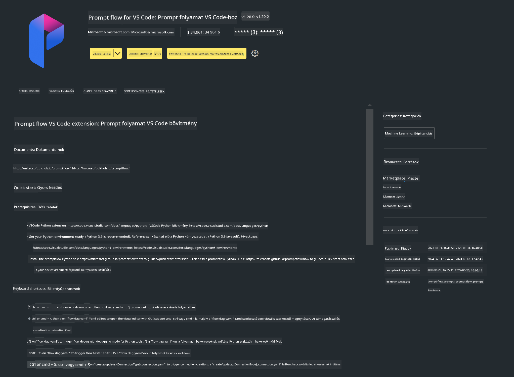

<!--
CO_OP_TRANSLATOR_METADATA:
{
  "original_hash": "4b16264917d9b93169745d92b8ce8c65",
  "translation_date": "2025-05-09T19:36:52+00:00",
  "source_file": "md/02.Application/02.Code/Phi3/VSCodeExt/HOL/Apple/01.Installations.md",
  "language_code": "hu"
}
-->
# **Lab 0 - Telepítés**

Amikor belépünk a laborba, be kell állítanunk a szükséges környezetet:


### **1. Python 3.11+**

Ajánlott a miniforge használata a Python környezet konfigurálásához.

A miniforge beállításához kérjük, nézd meg a [https://github.com/conda-forge/miniforge](https://github.com/conda-forge/miniforge) oldalt.

A miniforge konfigurálása után futtasd a következő parancsot Power Shell-ben

```bash

conda create -n pyenv python==3.11.8 -y

conda activate pyenv

```


### **2. Prompt flow SDK telepítése**

A Lab 1-ben a Prompt flow-t használjuk, ezért szükséges a Prompt flow SDK beállítása.

```bash

pip install promptflow --upgrade

```

Ezzel a paranccsal ellenőrizheted a promptflow sdk-t


```bash

pf --version

```

### **3. Visual Studio Code Prompt flow bővítmény telepítése**



### **4. Apple MLX Framework**

Az MLX egy tömbkeretrendszer gépi tanulási kutatásokhoz Apple Silicon platformon, az Apple gépi tanulási kutatói által fejlesztve. Az **Apple MLX framework** segítségével felgyorsíthatod az LLM / SLM folyamatokat Apple Siliconon. Ha többet szeretnél megtudni, olvasd el a [https://github.com/microsoft/PhiCookBook/blob/main/md/01.Introduction/03/MLX_Inference.md](https://github.com/microsoft/PhiCookBook/blob/main/md/01.Introduction/03/MLX_Inference.md) oldalt.

Az MLX framework könyvtár telepítése bash-ben


```bash

pip install mlx-lm

```


### **5. Egyéb Python könyvtárak**

Hozd létre a requirements.txt fájlt és másold bele az alábbi tartalmat

```txt

notebook
numpy 
scipy 
scikit-learn 
matplotlib 
pandas 
pillow 
graphviz

```


### **6. NVM telepítése**

NVM telepítése Powershell-ben


```bash

brew install nvm

```

Nodejs 18.20 telepítése


```bash

nvm install 18.20.0

nvm use 18.20.0

```

### **7. Visual Studio Code fejlesztői támogatás telepítése**


```bash

npm install --global yo generator-code

```

Gratulálunk! Sikeresen beállítottad az SDK-t. Most folytasd a gyakorlati lépésekkel.

**Nyilatkozat:**  
Ezt a dokumentumot az AI fordító szolgáltatás [Co-op Translator](https://github.com/Azure/co-op-translator) segítségével fordítottuk le. Bár igyekszünk a pontosságra, kérjük, vegye figyelembe, hogy az automatikus fordítások hibákat vagy pontatlanságokat tartalmazhatnak. Az eredeti dokumentum a saját nyelvén tekintendő hivatalos forrásnak. Kritikus információk esetén professzionális, emberi fordítást javaslunk. Nem vállalunk felelősséget a fordítás használatából eredő félreértésekért vagy félreértelmezésekért.