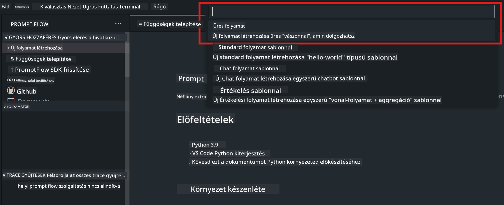
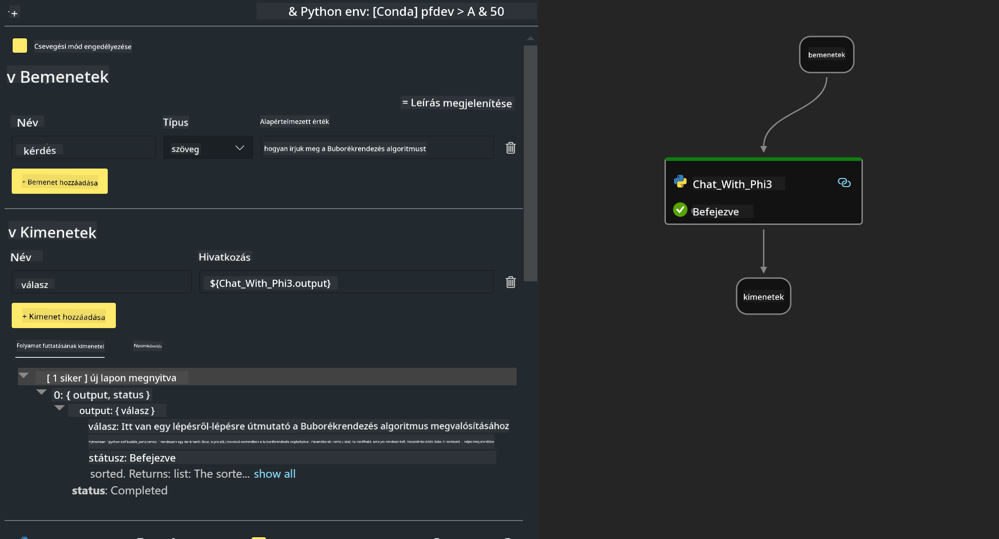

<!--
CO_OP_TRANSLATOR_METADATA:
{
  "original_hash": "3dbbf568625b1ee04b354c2dc81d3248",
  "translation_date": "2025-05-09T19:41:11+00:00",
  "source_file": "md/02.Application/02.Code/Phi3/VSCodeExt/HOL/Apple/02.PromptflowWithMLX.md",
  "language_code": "hu"
}
-->
# **2. labor - Prompt flow futtatása Phi-3-mini modellel az AIPC-ben**

## **Mi az a Prompt flow**

A Prompt flow egy fejlesztői eszközkészlet, amely megkönnyíti az LLM alapú AI alkalmazások teljes fejlesztési ciklusát az ötleteléstől, prototípus készítésen, tesztelésen és értékelésen át egészen a termelési bevezetésig és monitorozásig. Jelentősen leegyszerűsíti a prompt tervezést, és lehetővé teszi, hogy professzionális minőségű LLM alkalmazásokat építs.

A Prompt flow segítségével képes leszel:

- Olyan folyamatokat létrehozni, amelyek összekapcsolják az LLM-eket, promptokat, Python kódot és egyéb eszközöket egy végrehajtható munkafolyamatba.

- Könnyedén hibakeresni és iterálni a folyamataidat, különösen az LLM-ekkel való interakciókat.

- Értékelni a folyamataidat, minőségi és teljesítmény mutatókat számolni nagyobb adathalmazokon.

- Beépíteni a tesztelést és értékelést a CI/CD rendszeredbe a folyamatok minőségének biztosításához.

- Kiválasztott kiszolgáló platformra telepíteni a folyamataidat vagy könnyen integrálni az alkalmazásod kódjába.

- (Nem kötelező, de erősen ajánlott) Csapatoddal együttműködni az Azure AI felhő verziójának használatával.


## **Generációs kód folyamatok építése Apple Siliconon**

***Megjegyzés***: Ha még nem végezted el a környezet telepítését, kérjük, látogasd meg a [Lab 0 - Installációk](./01.Installations.md) oldalt.

1. Nyisd meg a Prompt flow kiterjesztést a Visual Studio Code-ban, és hozz létre egy üres flow projektet



2. Add hozzá a bemeneti és kimeneti paramétereket, majd adj hozzá Python kódot új flow-ként




A flow felépítéséhez hivatkozhatsz erre a szerkezetre (flow.dag.yaml)

```yaml

inputs:
  prompt:
    type: string
    default: Write python code for Fibonacci serie. Please use markdown as output
outputs:
  result:
    type: string
    reference: ${gen_code_by_phi3.output}
nodes:
- name: gen_code_by_phi3
  type: python
  source:
    type: code
    path: gen_code_by_phi3.py
  inputs:
    prompt: ${inputs.prompt}


```

3. Phi-3-mini kvantálása

Célunk, hogy hatékonyabban futtassuk az SLM-et helyi eszközökön. Általában kvantáljuk a modellt (INT4, FP16, FP32)

```bash

python -m mlx_lm.convert --hf-path microsoft/Phi-3-mini-4k-instruct

```

**Megjegyzés:** az alapértelmezett mappa mlx_model

4. Kód hozzáadása a ***Chat_With_Phi3.py*** fájlban

```python


from promptflow import tool

from mlx_lm import load, generate


# The inputs section will change based on the arguments of the tool function, after you save the code
# Adding type to arguments and return value will help the system show the types properly
# Please update the function name/signature per need
@tool
def my_python_tool(prompt: str) -> str:

    model_id = './mlx_model_phi3_mini'

    model, tokenizer = load(model_id)

    # <|user|>\nWrite python code for Fibonacci serie. Please use markdown as output<|end|>\n<|assistant|>

    response = generate(model, tokenizer, prompt="<|user|>\n" + prompt  + "<|end|>\n<|assistant|>", max_tokens=2048, verbose=True)

    return response


```

4. A flow-t tesztelheted Debug vagy Run módban, hogy ellenőrizd, működik-e a generációs kód


5. A flow-t futtathatod fejlesztési API-ként a terminálból

```

pf flow serve --source ./ --port 8080 --host localhost   

```

Tesztelheted Postman-ben vagy Thunder Client-ben


### **Megjegyzés**

1. Az első futtatás hosszabb időt vesz igénybe. Ajánlott a phi-3 modellt a Hugging face CLI segítségével letölteni.

2. Tekintettel az Intel NPU korlátozott számítási kapacitására, javasolt a Phi-3-mini-4k-instruct használata.

3. Az Intel NPU gyorsítást használjuk az INT4 kvantáláshoz, de ha újraindítod a szolgáltatást, törölnöd kell a cache és nc_workshop mappákat.


## **Források**

1. Ismerd meg a Promptflow-t [https://microsoft.github.io/promptflow/](https://microsoft.github.io/promptflow/)

2. Ismerd meg az Intel NPU gyorsítást [https://github.com/intel/intel-npu-acceleration-library](https://github.com/intel/intel-npu-acceleration-library)

3. Minta kód, letöltés [Local NPU Agent Sample Code](../../../../../../../../../code/07.Lab/01/AIPC/local-npu-agent)

**Jogi nyilatkozat**:  
Ezt a dokumentumot az AI fordító szolgáltatás [Co-op Translator](https://github.com/Azure/co-op-translator) segítségével fordítottuk le. Bár a pontosságra törekszünk, kérjük, vegye figyelembe, hogy az automatikus fordítások tartalmazhatnak hibákat vagy pontatlanságokat. Az eredeti dokumentum az anyanyelvén tekintendő hivatalos forrásnak. Kritikus információk esetén szakmai, emberi fordítást javaslunk. Nem vállalunk felelősséget az ebből a fordításból eredő félreértésekért vagy téves értelmezésekért.