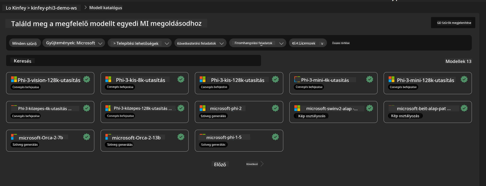
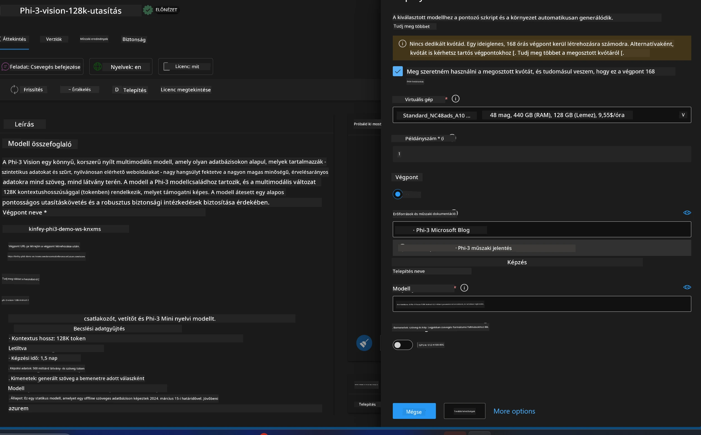
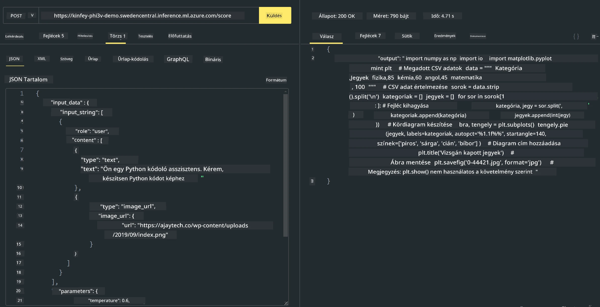

<!--
CO_OP_TRANSLATOR_METADATA:
{
  "original_hash": "20cb4e6ac1686248e8be913ccf6c2bc2",
  "translation_date": "2025-07-17T04:35:23+00:00",
  "source_file": "md/02.Application/02.Code/Phi3/VSCodeExt/HOL/Apple/03.DeployPhi3VisionOnAzure.md",
  "language_code": "hu"
}
-->
# **3. labor - Phi-3-vision telepítése az Azure Machine Learning Service-re**

Az NPU-t használjuk a helyi kód éles környezetbe való telepítéséhez, majd ezen keresztül szeretnénk bevezetni a PHI-3-VISION képességét, hogy képekből kódot generáljunk.

Ebben a bevezetőben gyorsan felépíthetünk egy Model As Service Phi-3 Vision szolgáltatást az Azure Machine Learning Service-ben.

***Note***: A Phi-3 Vision nagyobb számítási kapacitást igényel a gyorsabb tartalomgeneráláshoz. Ehhez felhőalapú számítási erőforrásokra van szükségünk.


### **1. Azure Machine Learning Service létrehozása**

Az Azure Portalon létre kell hoznunk egy Azure Machine Learning Service-t. Ha szeretnéd megtanulni, hogyan kell, látogass el erre a linkre: [https://learn.microsoft.com/azure/machine-learning/quickstart-create-resources?view=azureml-api-2](https://learn.microsoft.com/azure/machine-learning/quickstart-create-resources?view=azureml-api-2)


### **2. Phi-3 Vision kiválasztása az Azure Machine Learning Service-ben**




### **3. Phi-3-Vision telepítése az Azure-ban**





### **4. Végpont tesztelése Postman-ben**





***Note***

1. A továbbítandó paramétereknek tartalmazniuk kell az Authorization, azureml-model-deployment és Content-Type értékeket. Ezeket a telepítési információk között találod meg.

2. A paraméterek továbbításához a Phi-3-Vision egy kép linkjét várja. Kérjük, tekintsd meg a GPT-4-Vision módszert a paraméterek továbbításához, például

```json

{
  "input_data":{
    "input_string":[
      {
        "role":"user",
        "content":[ 
          {
            "type": "text",
            "text": "You are a Python coding assistant.Please create Python code for image "
          },
          {
              "type": "image_url",
              "image_url": {
                "url": "https://ajaytech.co/wp-content/uploads/2019/09/index.png"
              }
          }
        ]
      }
    ],
    "parameters":{
          "temperature": 0.6,
          "top_p": 0.9,
          "do_sample": false,
          "max_new_tokens": 2048
    }
  }
}

```

3. A **/score** végpontot Post metódussal hívd meg

**Gratulálunk**! Sikeresen befejezted a gyors PHI-3-VISION telepítést, és kipróbáltad, hogyan lehet képekből kódot generálni. Ezután NPUs és felhő kombinációjával építhetünk alkalmazásokat.

**Jogi nyilatkozat**:  
Ez a dokumentum az AI fordító szolgáltatás, a [Co-op Translator](https://github.com/Azure/co-op-translator) segítségével készült. Bár a pontosságra törekszünk, kérjük, vegye figyelembe, hogy az automatikus fordítások hibákat vagy pontatlanságokat tartalmazhatnak. Az eredeti dokumentum az anyanyelvén tekintendő hiteles forrásnak. Kritikus információk esetén professzionális emberi fordítást javaslunk. Nem vállalunk felelősséget a fordítás használatából eredő félreértésekért vagy téves értelmezésekért.