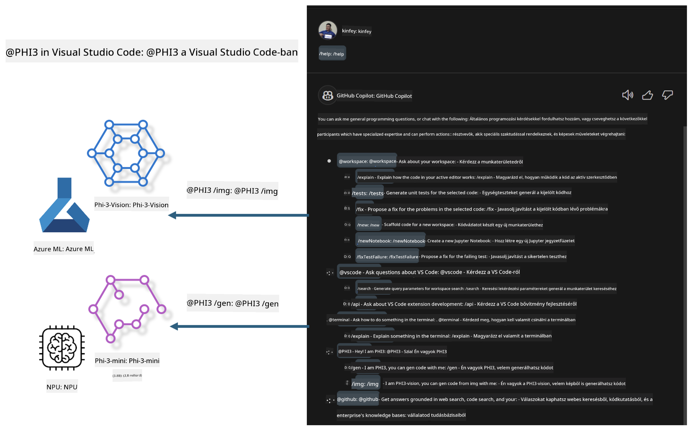

<!--
CO_OP_TRANSLATOR_METADATA:
{
  "original_hash": "00b7a699de8ac405fa821f4c0f7fc0ab",
  "translation_date": "2025-05-09T19:16:28+00:00",
  "source_file": "md/02.Application/02.Code/Phi3/VSCodeExt/README.md",
  "language_code": "hu"
}
-->
# **Építsd meg saját Visual Studio Code GitHub Copilot Chat-ed a Microsoft Phi-3 családdal**

Használtad már a workspace agent-et a GitHub Copilot Chat-ben? Szeretnéd megalkotni a saját csapatod kódügynökét? Ez a gyakorlati labor arra törekszik, hogy az open source modellt ötvözze egy vállalati szintű kódügynök létrehozásához.

## **Alapok**

### **Miért válaszd a Microsoft Phi-3-at**

A Phi-3 egy család, amely tartalmazza a phi-3-mini, phi-3-small és phi-3-medium modelleket, különböző tanítási paraméterekkel szöveg generálásra, párbeszéd befejezésére és kód generálásra. Emellett létezik a phi-3-vision is, amely Vision alapú. Ez alkalmas vállalatok vagy különböző csapatok számára offline generatív AI megoldások létrehozására.

Ajánlott elolvasni ezt a linket [https://github.com/microsoft/PhiCookBook/blob/main/md/01.Introduction/01/01.PhiFamily.md](https://github.com/microsoft/PhiCookBook/blob/main/md/01.Introduction/01/01.PhiFamily.md)

### **Microsoft GitHub Copilot Chat**

A GitHub Copilot Chat kiterjesztés egy csevegőfelületet biztosít, amelyen keresztül közvetlenül a VS Code-on belül kommunikálhatsz a GitHub Copilot-tal, és választ kaphatsz kódolással kapcsolatos kérdésekre anélkül, hogy dokumentációt kellene böngészned vagy online fórumokat keresgélned.

A Copilot Chat használhat szintaxiskiemelést, behúzást és egyéb formázási funkciókat, hogy átláthatóbbá tegye a generált választ. A kérdés típusától függően a válasz tartalmazhat hivatkozásokat a Copilot által használt kontextusra, például forráskód fájlokra vagy dokumentációra, illetve gombokat a VS Code funkcióinak eléréséhez.

- A Copilot Chat beépül a fejlesztői munkafolyamatodba, és ott segít, ahol szükséged van rá:

- Indíts inline csevegést közvetlenül a szerkesztőből vagy a terminálból, ha kódolás közben segítségre van szükséged

- Használd a Chat nézetet, hogy mindig legyen egy AI asszisztensed a segítségedre

- Indítsd el a Quick Chat-et, hogy gyors kérdést tegyél fel és folytasd a munkát

A GitHub Copilot Chat különböző helyzetekben használható, például:

- Kódolási kérdések megválaszolására, hogyan oldj meg egy problémát a legjobban

- Mások kódjának magyarázatára és fejlesztési javaslatokra

- Kódjavítási javaslatokra

- Egységtesztes esetek generálására

- Kóddokumentáció generálására

Ajánlott elolvasni ezt a linket [https://code.visualstudio.com/docs/copilot/copilot-chat](https://code.visualstudio.com/docs/copilot/copilot-chat?WT.mc_id=aiml-137032-kinfeylo)

###  **Microsoft GitHub Copilot Chat @workspace**

Az **@workspace** használata a Copilot Chat-ben lehetővé teszi, hogy a teljes kódbázisodra vonatkozó kérdéseket tegyél fel. A kérdés alapján a Copilot intelligensen lekéri a releváns fájlokat és szimbólumokat, amelyeket aztán hivatkozásként és kódpéldaként használ a válaszában.

A kérdésed megválaszolásához az **@workspace** ugyanazokat a forrásokat vizsgálja, amelyeket egy fejlesztő is használna a kódbázis böngészésekor a VS Code-ban:

- Az összes fájl a workspace-ben, kivéve azokat, amelyeket a .gitignore fájl figyelmen kívül hagy

- Könyvtárstruktúra, beleértve a beágyazott mappákat és fájlneveket

- GitHub kódkutató indexe, ha a workspace egy GitHub repository és a kódkutató indexeli

- Szimbólumok és definíciók a workspace-ben

- Az aktuálisan kijelölt vagy a látható szöveg az aktív szerkesztőben

Megjegyzés: A .gitignore figyelmen kívül hagyása érvényes, ha egy fájl meg van nyitva vagy szöveg van kijelölve egy figyelmen kívül hagyott fájlban.

Ajánlott elolvasni ezt a linket [[https://code.visualstudio.com/docs/copilot/copilot-chat](https://code.visualstudio.com/docs/copilot/workspace-context?WT.mc_id=aiml-137032-kinfeylo)]

## **Tudj meg többet erről a laborról**

A GitHub Copilot jelentősen javította a vállalatok programozási hatékonyságát, és minden vállalat szeretné testreszabni a GitHub Copilot releváns funkcióit. Sok vállalat készített testreszabott bővítményeket, amelyek hasonlóak a GitHub Copilothoz, saját üzleti szcenárióik és open source modelljeik alapján. A vállalatok számára a testreszabott bővítmények könnyebben kezelhetők, de ez befolyásolhatja a felhasználói élményt is. Hiszen a GitHub Copilot erősebb funkciókkal rendelkezik az általános helyzetek és a szakmaiság kezelésében. Ha az élmény konzisztens maradhat, jobb a vállalat saját bővítményének testreszabása. A GitHub Copilot Chat releváns API-kat biztosít a vállalatoknak a Chat élmény bővítésére. A konzisztens élmény fenntartása és a testreszabott funkciók jobb felhasználói élményt nyújtanak.

Ez a labor főként a Phi-3 modellt használja, amelyet a helyi NPU-val és az Azure hibriddel kombinálva egyedi Agent-et épít a GitHub Copilot Chat-ben ***@PHI3*** néven, hogy segítsen a vállalati fejlesztőknek a kód generálásában***(@PHI3 /gen)*** és képek alapján történő kódgenerálásban ***(@PHI3 /img)***.

### ***Megjegyzés:*** 

Ez a labor jelenleg az Intel CPU és Apple Silicon AIPC-n fut. Továbbra is frissítjük a Qualcomm NPU verzióját.

## **Labor**

| Név | Leírás | AIPC | Apple |
| ------------ | ----------- | -------- |-------- |
| Lab0 - Telepítés(✅) | Kapcsolódó környezetek és telepítőeszközök konfigurálása és telepítése | [Go](./HOL/AIPC/01.Installations.md) |[Go](./HOL/Apple/01.Installations.md) |
| Lab1 - Prompt flow futtatása Phi-3-mini-vel (✅) | AIPC / Apple Silicon kombinálása, helyi NPU használata kódgeneráláshoz Phi-3-mini segítségével | [Go](./HOL/AIPC/02.PromptflowWithNPU.md) |  [Go](./HOL/Apple/02.PromptflowWithMLX.md) |
| Lab2 - Phi-3-vision telepítése Azure Machine Learning Service-en (✅) | Kód generálása az Azure Machine Learning Service Model Catalog - Phi-3-vision képpel történő telepítésével | [Go](./HOL/AIPC/03.DeployPhi3VisionOnAzure.md) |[Go](./HOL/Apple/03.DeployPhi3VisionOnAzure.md) |
| Lab3 - Egy @phi-3 agent létrehozása a GitHub Copilot Chat-ben (✅)  | Egyedi Phi-3 agent létrehozása a GitHub Copilot Chat-ben kódgenerálás, grafikus kódgenerálás, RAG stb. elvégzéséhez | [Go](./HOL/AIPC/04.CreatePhi3AgentInVSCode.md) | [Go](./HOL/Apple/04.CreatePhi3AgentInVSCode.md) |
| Minta kód (✅)  | Minta kód letöltése | [Go](../../../../../../../code/07.Lab/01/AIPC) | [Go](../../../../../../../code/07.Lab/01/Apple) |

## **Források**

1. Phi-3 Cookbook [https://github.com/microsoft/Phi-3CookBook](https://github.com/microsoft/Phi-3CookBook)

2. Tudj meg többet a GitHub Copilot-ról [https://learn.microsoft.com/training/paths/copilot/](https://learn.microsoft.com/training/paths/copilot/?WT.mc_id=aiml-137032-kinfeylo)

3. Tudj meg többet a GitHub Copilot Chatről [https://learn.microsoft.com/training/paths/accelerate-app-development-using-github-copilot/](https://learn.microsoft.com/training/paths/accelerate-app-development-using-github-copilot/?WT.mc_id=aiml-137032-kinfeylo)

4. Tudj meg többet a GitHub Copilot Chat API-ról [https://code.visualstudio.com/api/extension-guides/chat](https://code.visualstudio.com/api/extension-guides/chat?WT.mc_id=aiml-137032-kinfeylo)

5. Tudj meg többet az Azure AI Foundry-ról [https://learn.microsoft.com/training/paths/create-custom-copilots-ai-studio/](https://learn.microsoft.com/training/paths/create-custom-copilots-ai-studio/?WT.mc_id=aiml-137032-kinfeylo)

6. Tudj meg többet az Azure AI Foundry Model Catalog-járól [https://learn.microsoft.com/azure/ai-studio/how-to/model-catalog-overview](https://learn.microsoft.com/azure/ai-studio/how-to/model-catalog-overview)

**Nyilatkozat**:  
Ez a dokumentum az AI fordító szolgáltatás, a [Co-op Translator](https://github.com/Azure/co-op-translator) segítségével készült. Bár igyekszünk a pontosságra, kérjük, vegye figyelembe, hogy az automatikus fordítások hibákat vagy pontatlanságokat tartalmazhatnak. Az eredeti dokumentum az anyanyelvén tekintendő hivatalos forrásnak. Fontos információk esetén szakmai, emberi fordítást javaslunk. Nem vállalunk felelősséget a fordítás használatából eredő félreértésekért vagy félreértelmezésekért.