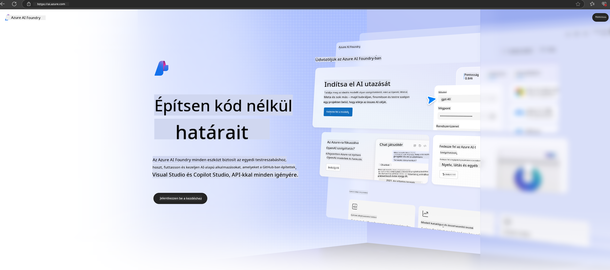

<!--
CO_OP_TRANSLATOR_METADATA:
{
  "original_hash": "3a1e48b628022485aac989c9f733e792",
  "translation_date": "2025-05-09T20:14:15+00:00",
  "source_file": "md/02.QuickStart/AzureAIFoundry_QuickStart.md",
  "language_code": "hu"
}
-->
# **Phi-3 használata az Azure AI Foundry-ban**

A generatív MI fejlődésével egy egységes platformot szeretnénk használni különböző LLM és SLM modellek kezelésére, vállalati adatintegrációra, finomhangolásra/RAG műveletekre, valamint az LLM és SLM integrálása utáni vállalati üzletek értékelésére, hogy a generatív MI okos alkalmazásokban még hatékonyabban hasznosulhasson. Az [Azure AI Foundry](https://ai.azure.com) egy vállalati szintű generatív MI alkalmazásplatform.

Az Azure AI Foundry-val értékelheted a nagy nyelvi modellek (LLM) válaszait, és prompt flow segítségével összehangolhatod a prompt alkalmazás komponenseit a jobb teljesítmény érdekében. A platform lehetővé teszi a skálázhatóságot, így a proof of concept-eket könnyedén alakíthatod át teljes értékű termelési környezetté. A folyamatos felügyelet és finomítás támogatja a hosszú távú sikert.

Gyorsan telepíthetjük a Phi-3 modellt az Azure AI Foundry-ban néhány egyszerű lépésben, majd az Azure AI Foundry segítségével végezhetjük el a Phi-3-hoz kapcsolódó Playground/Chat, finomhangolás, értékelés és egyéb feladatokat.

## **1. Előkészületek**

Ha már telepítetted az [Azure Developer CLI](https://learn.microsoft.com/azure/developer/azure-developer-cli/overview?WT.mc_id=aiml-138114-kinfeylo) eszközt a gépedre, ennek a sablonnak a használata olyan egyszerű, mint egy parancs futtatása egy új könyvtárban.

## Kézi létrehozás

Egy Microsoft Azure AI Foundry projekt és hub létrehozása nagyszerű módja az MI munkáid rendszerezésének és kezelésének. Íme egy lépésről lépésre útmutató, hogy elkezdhessük:

### Projekt létrehozása az Azure AI Foundry-ban

1. **Lépj be az Azure AI Foundry-ba**: Jelentkezz be az Azure AI Foundry portálra.
2. **Projekt létrehozása**:
   - Ha már egy projektben vagy, a bal felső sarokban válaszd az „Azure AI Foundry”-t, hogy visszatérj a kezdőlapra.
   - Válaszd a „+ Create project” lehetőséget.
   - Írj be egy nevet a projektnek.
   - Ha van hubod, az alapértelmezettként lesz kiválasztva. Ha több hubhoz is hozzáférsz, választhatsz másikat a legördülő menüből. Új hub létrehozásához válaszd a „Create new hub” opciót, és adj meg egy nevet.
   - Kattints a „Create” gombra.

### Hub létrehozása az Azure AI Foundry-ban

1. **Lépj be az Azure AI Foundry-ba**: Jelentkezz be az Azure fiókoddal.
2. **Hub létrehozása**:
   - A bal oldali menüből válaszd a Management center-t.
   - Válaszd az „All resources” menüpontot, majd a „+ New project” melletti lefelé mutató nyilat, és válaszd a „+ New hub” lehetőséget.
   - A „Create a new hub” párbeszédablakban adj meg egy nevet a hubnak (például contoso-hub), és módosítsd a többi mezőt igény szerint.
   - Kattints a „Next”-re, ellenőrizd az adatokat, majd válaszd a „Create”-et.

Részletesebb útmutatóért tekintsd meg a hivatalos [Microsoft dokumentációt](https://learn.microsoft.com/azure/ai-studio/how-to/create-projects).

A sikeres létrehozás után az általad készített stúdiót az [ai.azure.com](https://ai.azure.com/) oldalon érheted el.

Egy AI Foundry-n belül több projekt is lehet. Hozz létre egy projektet az AI Foundry-ban az előkészületekhez.

Hozz létre Azure AI Foundry [QuickStartokat](https://learn.microsoft.com/azure/ai-studio/quickstarts/get-started-code)

## **2. Phi modell telepítése az Azure AI Foundry-ban**

Kattints a projekt Explore opciójára, hogy belépj a Model Catalog-ba, majd válaszd ki a Phi-3 modellt.

Válaszd ki a Phi-3-mini-4k-instruct modellt.

Kattints a 'Deploy' gombra a Phi-3-mini-4k-instruct modell telepítéséhez.

> [!NOTE]
>
> A telepítés során választhatsz számítási kapacitást

## **3. Playground Chat Phi az Azure AI Foundry-ban**

Lépj a telepítési oldalra, válaszd a Playground-t, és chatelj az Azure AI Foundry Phi-3 modelljével.

## **4. Modell telepítése az Azure AI Foundry-ból**

Modell telepítéséhez az Azure Model Catalogból kövesd az alábbi lépéseket:

- Jelentkezz be az Azure AI Foundry-ba.
- Válaszd ki a telepíteni kívánt modellt az Azure AI Foundry modell katalógusából.
- A modell részletei oldalon válaszd a Deploy lehetőséget, majd válaszd a Serverless API with Azure AI Content Safety opciót.
- Válaszd ki azt a projektet, amelyben telepíteni szeretnéd a modellt. A Serverless API használatához a munkaterületnek az East US 2 vagy Sweden Central régióban kell lennie. A Deployment nevet testre szabhatod.
- A telepítési varázslóban válaszd a Pricing and terms részt, hogy megismerd az árképzést és a használati feltételeket.
- Kattints a Deploy gombra. Várj, amíg a telepítés elkészül, és átirányítanak a Deployments oldalra.
- Válaszd az Open in playground opciót, hogy elkezdhess interakciót a modellel.
- Visszatérhetsz a Deployments oldalra, kiválaszthatod a telepítést, és megtekintheted a végpont Target URL-jét és a Secret Key-t, amelyeket a telepítés hívásához és válaszok generálásához használhatsz.
- A végpont adatait, URL-jét és hozzáférési kulcsait bármikor megtalálod a Build fülön, a Components szekcióban a Deployments kiválasztásával.

> [!NOTE]
> Fontos, hogy a fiókod rendelkezzen Azure AI Developer szerepkör jogosultságokkal az adott Resource Groupon a fenti lépések végrehajtásához.

## **5. Phi API használata az Azure AI Foundry-ban**

A https://{Your project name}.region.inference.ml.azure.com/swagger.json címet elérheted Postman GET kéréssel, és a kulccsal együtt használva megismerheted a rendelkezésre álló interfészeket.

Nagyon kényelmesen hozzáférhetsz a kérés paramétereihez, valamint a válasz paramétereihez is.

**Jogi nyilatkozat**:  
Ezt a dokumentumot az AI fordító szolgáltatás, a [Co-op Translator](https://github.com/Azure/co-op-translator) használatával fordítottuk le. Bár a pontosságra törekszünk, kérjük, vegye figyelembe, hogy az automatikus fordítások hibákat vagy pontatlanságokat tartalmazhatnak. Az eredeti dokumentum az anyanyelvén tekintendő hiteles forrásnak. Fontos információk esetén szakmai, emberi fordítást javaslunk. Nem vállalunk felelősséget az ebből a fordításból eredő félreértésekért vagy félreértelmezésekért.