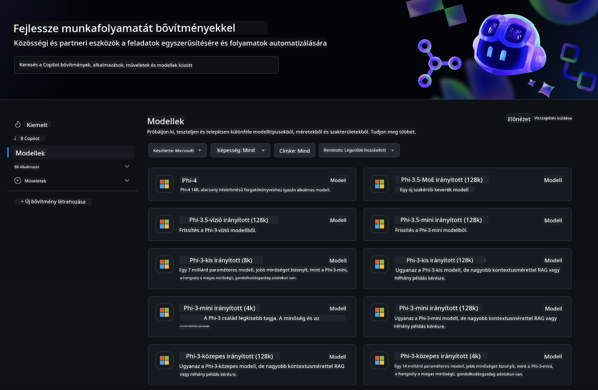
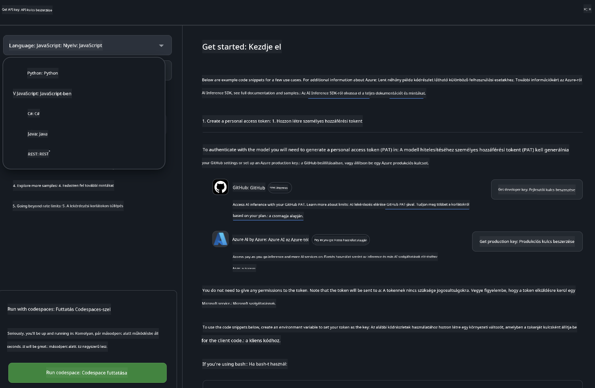
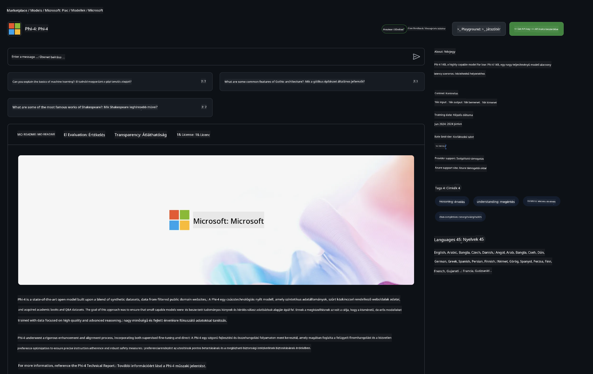

<!--
CO_OP_TRANSLATOR_METADATA:
{
  "original_hash": "5113634b77370af6790f9697d5d7de90",
  "translation_date": "2025-05-09T20:20:59+00:00",
  "source_file": "md/02.QuickStart/GitHubModel_QuickStart.md",
  "language_code": "hu"
}
-->
## GitHub Models - Korlátozott nyilvános béta

Üdvözlünk a [GitHub Models](https://github.com/marketplace/models) oldalán! Minden készen áll, hogy felfedezd az Azure AI-n futó AI modelleket.



További információkért a GitHub Models által kínált modellekről, nézd meg a [GitHub Model Marketplace](https://github.com/marketplace/models) oldalt.

## Elérhető modellek

Minden modellhez külön játszótér és példa kód tartozik.


### Phi-3 modellek a GitHub Model Katalógusban

[Phi-3-Medium-128k-Instruct](https://github.com/marketplace/models/azureml/Phi-3-medium-128k-instruct)

[Phi-3-medium-4k-instruct](https://github.com/marketplace/models/azureml/Phi-3-medium-4k-instruct)

[Phi-3-mini-128k-instruct](https://github.com/marketplace/models/azureml/Phi-3-mini-128k-instruct)

[Phi-3-mini-4k-instruct](https://github.com/marketplace/models/azureml/Phi-3-mini-4k-instruct)

[Phi-3-small-128k-instruct](https://github.com/marketplace/models/azureml/Phi-3-small-128k-instruct)

[Phi-3-small-8k-instruct](https://github.com/marketplace/models/azureml/Phi-3-small-8k-instruct)

## Első lépések

Néhány alap példa készen áll a futtatásra. Ezeket a samples mappában találod. Ha inkább egy adott nyelvvel szeretnél azonnal dolgozni, az alábbi nyelvekhez találsz példákat:

- Python
- JavaScript
- cURL

Van egy dedikált Codespaces környezet is a példák és modellek futtatásához.



## Példa kód

Az alábbiakban néhány példa kódrészletet találsz különböző felhasználási esetekhez. Az Azure AI Inference SDK-ról további információkat és példákat a teljes dokumentációban találsz.

## Beállítás

1. Hozz létre egy személyes hozzáférési tokent  
Nem szükséges külön engedélyeket adni a tokennek. Figyelem, a token egy Microsoft szolgáltatásnak lesz elküldve.

A lenti kódrészletek használatához állíts be egy környezeti változót, amely a tokenedet tartalmazza, így a kliens kód ezt használhatja kulcsként.

Ha bash-t használsz:  
```
export GITHUB_TOKEN="<your-github-token-goes-here>"
```  
Ha powershell-t használsz:  

```
$Env:GITHUB_TOKEN="<your-github-token-goes-here>"
```  

Ha Windows parancssort használsz:  

```
set GITHUB_TOKEN=<your-github-token-goes-here>
```  

## Python példa

### Függőségek telepítése  
Telepítsd az Azure AI Inference SDK-t pip segítségével (Szükséges: Python >=3.8):

```
pip install azure-ai-inference
```  
### Egy alapvető példa futtatása

Ez a példa bemutat egy egyszerű hívást a chat completion API-hoz. A GitHub AI modell inferencia végpontját és a GitHub tokenedet használja. A hívás szinkron.

```
import os
from azure.ai.inference import ChatCompletionsClient
from azure.ai.inference.models import SystemMessage, UserMessage
from azure.core.credentials import AzureKeyCredential

endpoint = "https://models.inference.ai.azure.com"
# Replace Model_Name 
model_name = "Phi-3-small-8k-instruct"
token = os.environ["GITHUB_TOKEN"]

client = ChatCompletionsClient(
    endpoint=endpoint,
    credential=AzureKeyCredential(token),
)

response = client.complete(
    messages=[
        SystemMessage(content="You are a helpful assistant."),
        UserMessage(content="What is the capital of France?"),
    ],
    model=model_name,
    temperature=1.,
    max_tokens=1000,
    top_p=1.
)

print(response.choices[0].message.content)
```

### Többfordulós beszélgetés futtatása

Ez a példa bemutat egy többfordulós beszélgetést a chat completion API-val. Chat alkalmazás esetén neked kell kezelni a beszélgetés előzményeit, és az utolsó üzeneteket küldeni a modellnek.

```
import os
from azure.ai.inference import ChatCompletionsClient
from azure.ai.inference.models import AssistantMessage, SystemMessage, UserMessage
from azure.core.credentials import AzureKeyCredential

token = os.environ["GITHUB_TOKEN"]
endpoint = "https://models.inference.ai.azure.com"
# Replace Model_Name
model_name = "Phi-3-small-8k-instruct"

client = ChatCompletionsClient(
    endpoint=endpoint,
    credential=AzureKeyCredential(token),
)

messages = [
    SystemMessage(content="You are a helpful assistant."),
    UserMessage(content="What is the capital of France?"),
    AssistantMessage(content="The capital of France is Paris."),
    UserMessage(content="What about Spain?"),
]

response = client.complete(messages=messages, model=model_name)

print(response.choices[0].message.content)
```

### Kimenet streamelése

Jobb felhasználói élmény érdekében érdemes a modell válaszát streamelni, hogy az első tokenek korán megjelenjenek, és ne kelljen hosszú válaszokra várni.

```
import os
from azure.ai.inference import ChatCompletionsClient
from azure.ai.inference.models import SystemMessage, UserMessage
from azure.core.credentials import AzureKeyCredential

token = os.environ["GITHUB_TOKEN"]
endpoint = "https://models.inference.ai.azure.com"
# Replace Model_Name
model_name = "Phi-3-small-8k-instruct"

client = ChatCompletionsClient(
    endpoint=endpoint,
    credential=AzureKeyCredential(token),
)

response = client.complete(
    stream=True,
    messages=[
        SystemMessage(content="You are a helpful assistant."),
        UserMessage(content="Give me 5 good reasons why I should exercise every day."),
    ],
    model=model_name,
)

for update in response:
    if update.choices:
        print(update.choices[0].delta.content or "", end="")

client.close()
```

## JavaScript

### Függőségek telepítése

Telepítsd a Node.js-t.

Másold be a következő szöveget egy package.json nevű fájlba a mappádban.

```
{
  "type": "module",
  "dependencies": {
    "@azure-rest/ai-inference": "latest",
    "@azure/core-auth": "latest",
    "@azure/core-sse": "latest"
  }
}
```

Megjegyzés: az @azure/core-sse csak akkor szükséges, ha a chat completion válaszát streamelni szeretnéd.

Nyiss egy terminált ebben a mappában, és futtasd az npm install parancsot.

Az alábbi kódrészleteket másold be egy sample.js nevű fájlba, és futtasd a node sample.js parancsal.

### Egy alapvető példa futtatása

Ez a példa bemutat egy egyszerű hívást a chat completion API-hoz. A GitHub AI modell inferencia végpontját és a GitHub tokenedet használja. A hívás szinkron.

```
import ModelClient from "@azure-rest/ai-inference";
import { AzureKeyCredential } from "@azure/core-auth";

const token = process.env["GITHUB_TOKEN"];
const endpoint = "https://models.inference.ai.azure.com";
// Update your modelname
const modelName = "Phi-3-small-8k-instruct";

export async function main() {

  const client = new ModelClient(endpoint, new AzureKeyCredential(token));

  const response = await client.path("/chat/completions").post({
    body: {
      messages: [
        { role:"system", content: "You are a helpful assistant." },
        { role:"user", content: "What is the capital of France?" }
      ],
      model: modelName,
      temperature: 1.,
      max_tokens: 1000,
      top_p: 1.
    }
  });

  if (response.status !== "200") {
    throw response.body.error;
  }
  console.log(response.body.choices[0].message.content);
}

main().catch((err) => {
  console.error("The sample encountered an error:", err);
});
```

### Többfordulós beszélgetés futtatása

Ez a példa bemutat egy többfordulós beszélgetést a chat completion API-val. Chat alkalmazás esetén neked kell kezelni a beszélgetés előzményeit, és az utolsó üzeneteket küldeni a modellnek.

```
import ModelClient from "@azure-rest/ai-inference";
import { AzureKeyCredential } from "@azure/core-auth";

const token = process.env["GITHUB_TOKEN"];
const endpoint = "https://models.inference.ai.azure.com";
// Update your modelname
const modelName = "Phi-3-small-8k-instruct";

export async function main() {

  const client = new ModelClient(endpoint, new AzureKeyCredential(token));

  const response = await client.path("/chat/completions").post({
    body: {
      messages: [
        { role: "system", content: "You are a helpful assistant." },
        { role: "user", content: "What is the capital of France?" },
        { role: "assistant", content: "The capital of France is Paris." },
        { role: "user", content: "What about Spain?" },
      ],
      model: modelName,
    }
  });

  if (response.status !== "200") {
    throw response.body.error;
  }

  for (const choice of response.body.choices) {
    console.log(choice.message.content);
  }
}

main().catch((err) => {
  console.error("The sample encountered an error:", err);
});
```

### Kimenet streamelése

Jobb felhasználói élmény érdekében érdemes a modell válaszát streamelni, hogy az első tokenek korán megjelenjenek, és ne kelljen hosszú válaszokra várni.

```
import ModelClient from "@azure-rest/ai-inference";
import { AzureKeyCredential } from "@azure/core-auth";
import { createSseStream } from "@azure/core-sse";

const token = process.env["GITHUB_TOKEN"];
const endpoint = "https://models.inference.ai.azure.com";
// Update your modelname
const modelName = "Phi-3-small-8k-instruct";

export async function main() {

  const client = new ModelClient(endpoint, new AzureKeyCredential(token));

  const response = await client.path("/chat/completions").post({
    body: {
      messages: [
        { role: "system", content: "You are a helpful assistant." },
        { role: "user", content: "Give me 5 good reasons why I should exercise every day." },
      ],
      model: modelName,
      stream: true
    }
  }).asNodeStream();

  const stream = response.body;
  if (!stream) {
    throw new Error("The response stream is undefined");
  }

  if (response.status !== "200") {
    stream.destroy();
    throw new Error(`Failed to get chat completions, http operation failed with ${response.status} code`);
  }

  const sseStream = createSseStream(stream);

  for await (const event of sseStream) {
    if (event.data === "[DONE]") {
      return;
    }
    for (const choice of (JSON.parse(event.data)).choices) {
        process.stdout.write(choice.delta?.content ?? ``);
    }
  }
}

main().catch((err) => {
  console.error("The sample encountered an error:", err);
});
```

## REST

### Egy alapvető példa futtatása

Illeszd be a következőt egy shell-be:

```
curl -X POST "https://models.inference.ai.azure.com/chat/completions" \
    -H "Content-Type: application/json" \
    -H "Authorization: Bearer $GITHUB_TOKEN" \
    -d '{
        "messages": [
            {
                "role": "system",
                "content": "You are a helpful assistant."
            },
            {
                "role": "user",
                "content": "What is the capital of France?"
            }
        ],
        "model": "Phi-3-small-8k-instruct"
    }'
```  
### Többfordulós beszélgetés futtatása

Hívd meg a chat completion API-t és küldd el a beszélgetés előzményeit:

```
curl -X POST "https://models.inference.ai.azure.com/chat/completions" \
    -H "Content-Type: application/json" \
    -H "Authorization: Bearer $GITHUB_TOKEN" \
    -d '{
        "messages": [
            {
                "role": "system",
                "content": "You are a helpful assistant."
            },
            {
                "role": "user",
                "content": "What is the capital of France?"
            },
            {
                "role": "assistant",
                "content": "The capital of France is Paris."
            },
            {
                "role": "user",
                "content": "What about Spain?"
            }
        ],
        "model": "Phi-3-small-8k-instruct"
    }'
```  
### Kimenet streamelése

Ez egy példa a végpont hívására és a válasz streamelésére.

```
curl -X POST "https://models.inference.ai.azure.com/chat/completions" \
    -H "Content-Type: application/json" \
    -H "Authorization: Bearer $GITHUB_TOKEN" \
    -d '{
        "messages": [
            {
                "role": "system",
                "content": "You are a helpful assistant."
            },
            {
                "role": "user",
                "content": "Give me 5 good reasons why I should exercise every day."
            }
        ],
        "stream": true,
        "model": "Phi-3-small-8k-instruct"
    }'
```

## INGYENES használat és korlátozások a GitHub Modellekhez



A [játszótér és az ingyenes API használatának korlátai](https://docs.github.com/en/github-models/prototyping-with-ai-models#rate-limits) arra szolgálnak, hogy kísérletezhess a modellekkel és prototípust készíthess az AI alkalmazásodhoz. Ezeken a határokon túl, ha élesben szeretnéd használni az alkalmazást és méretezni, akkor Azure fiókból kell erőforrásokat biztosítanod, és onnan kell hitelesítened a GitHub személyes hozzáférési token helyett. A kódodban más változtatásra nincs szükség. Ezen a linken megtalálod, hogyan léphetsz túl az ingyenes szint korlátain az Azure AI-ban.

### Figyelmeztetések

Ne feledd, hogy amikor egy modellel dolgozol, akkor AI-val kísérletezel, így előfordulhatnak tartalmi hibák.

A szolgáltatás különböző korlátokkal rendelkezik (pl. kérések percenként, naponta, tokenek kérésenként, párhuzamos kérések száma), és nem alkalmas éles használatra.

A GitHub Models az Azure AI Content Safety-t használja. Ezeket a szűrőket nem lehet kikapcsolni a GitHub Models használata közben. Ha fizetős szolgáltatáson keresztül szeretnél modelleket alkalmazni, kérjük, állítsd be a tartalomszűrőket az igényeidnek megfelelően.

Ez a szolgáltatás a GitHub előzetes kiadási feltételei szerint működik.

**Jogi nyilatkozat**:  
Ez a dokumentum az AI fordító szolgáltatás, a [Co-op Translator](https://github.com/Azure/co-op-translator) segítségével készült. Bár a pontosságra törekszünk, kérjük, vegye figyelembe, hogy az automatikus fordítások hibákat vagy pontatlanságokat tartalmazhatnak. Az eredeti dokumentum az anyanyelvén tekintendő hiteles forrásnak. Fontos információk esetén professzionális, emberi fordítást javaslunk. Nem vállalunk felelősséget a fordítás használatából eredő félreértésekért vagy félreértelmezésekért.