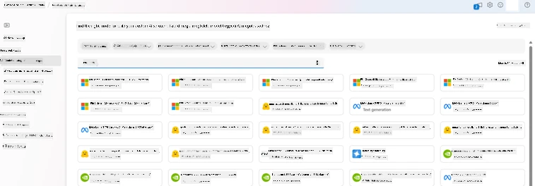
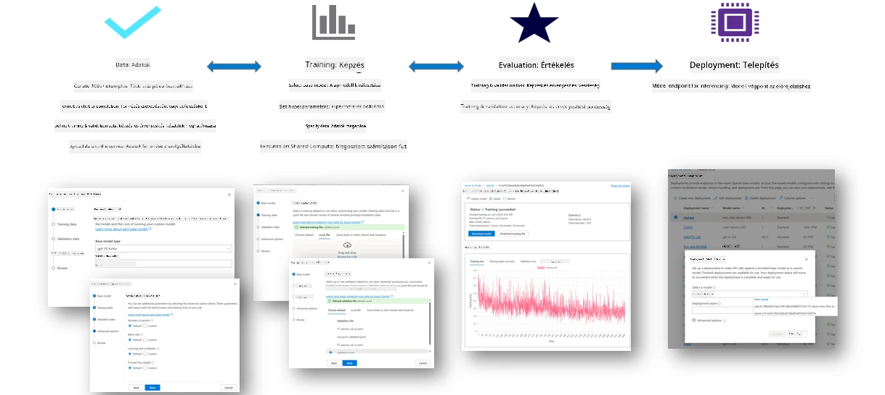
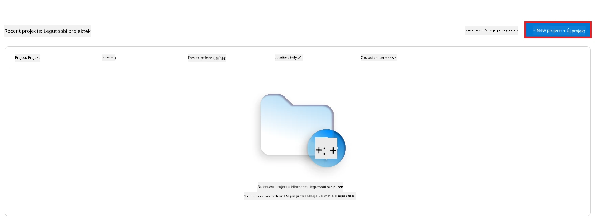
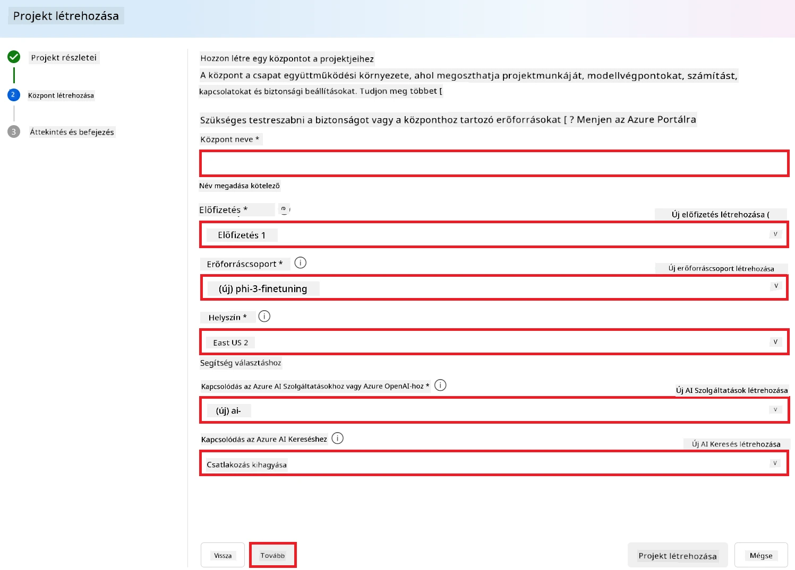
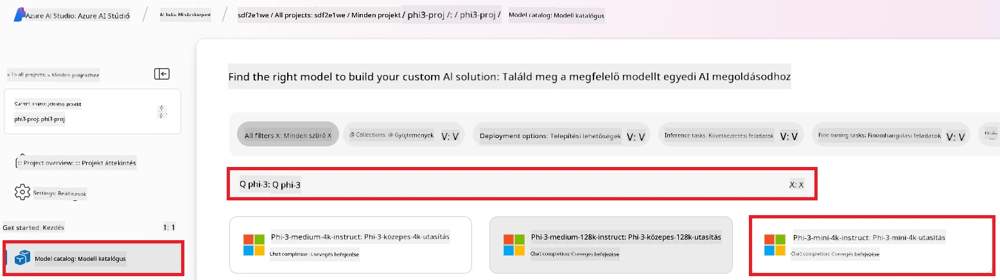
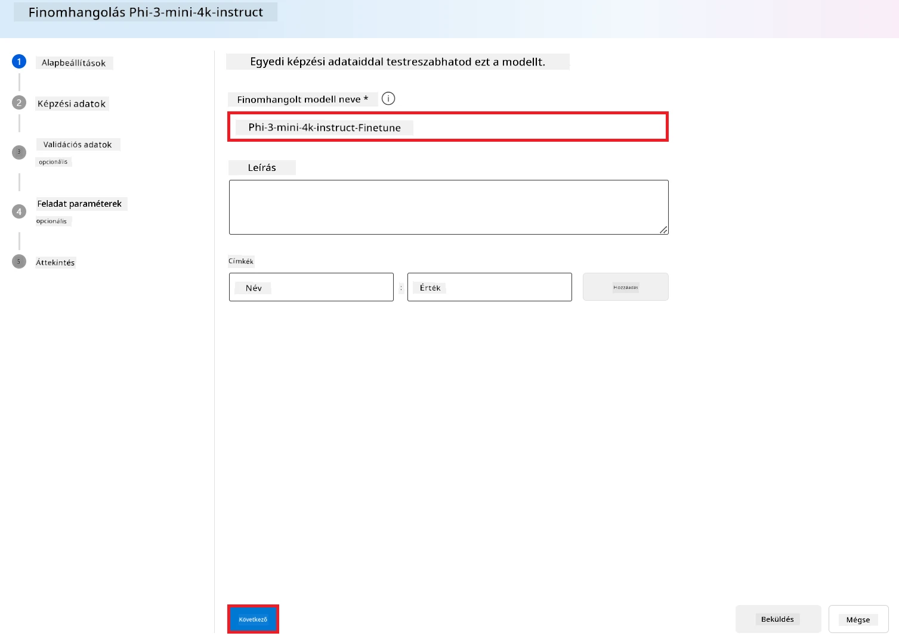
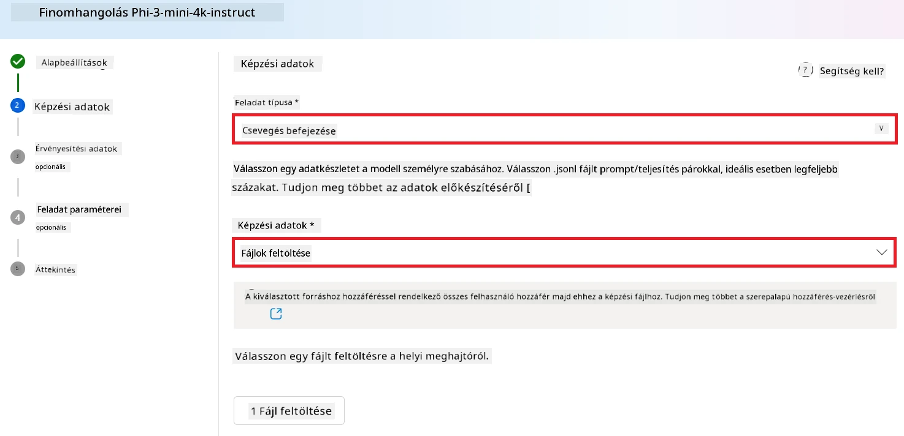
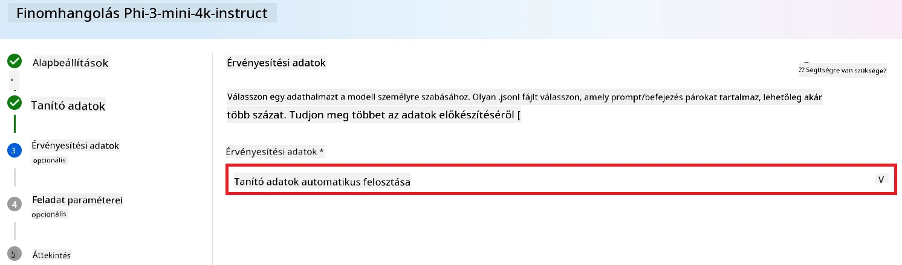
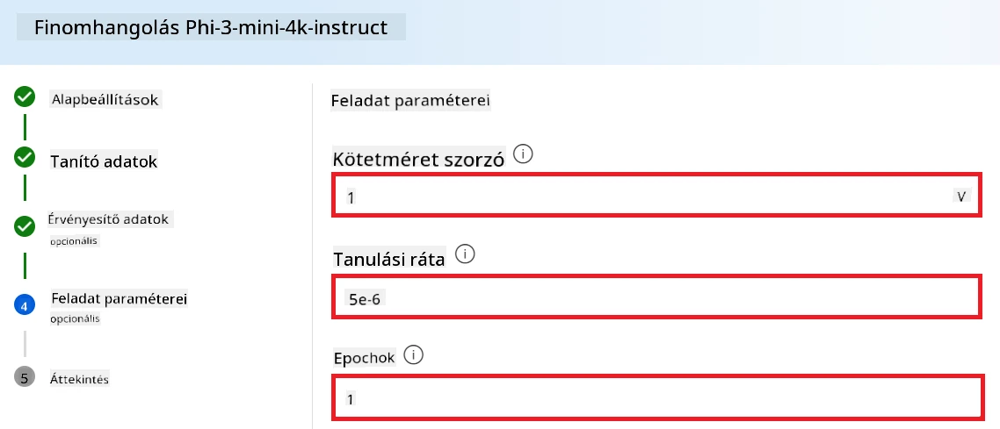
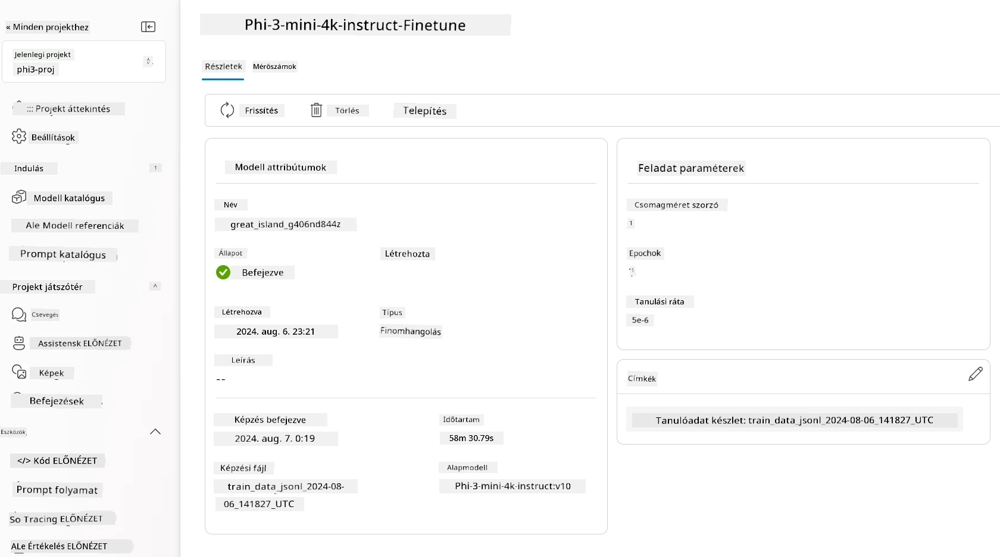

<!--
CO_OP_TRANSLATOR_METADATA:
{
  "original_hash": "c1559c5af6caccf6f623fd43a6b3a9a3",
  "translation_date": "2025-07-17T06:11:37+00:00",
  "source_file": "md/03.FineTuning/FineTuning_AIFoundry.md",
  "language_code": "hu"
}
-->
# Phi-3 finomhangolása Azure AI Foundry-val

Nézzük meg, hogyan lehet finomhangolni a Microsoft Phi-3 Mini nyelvi modellt az Azure AI Foundry segítségével. A finomhangolás lehetővé teszi, hogy a Phi-3 Mini-t specifikus feladatokra szabjuk, így még hatékonyabbá és kontextusérzékenyebbé válik.

## Szempontok

- **Képességek:** Mely modellek finomhangolhatók? Mire lehet a bázismodellt finomhangolni?
- **Költség:** Milyen árképzési modell vonatkozik a finomhangolásra?
- **Testreszabhatóság:** Mennyire lehet módosítani az alapmodellt – és milyen módokon?
- **Kényelem:** Hogyan zajlik a finomhangolás – kell-e egyedi kódot írni? Kell-e saját számítási kapacitást biztosítani?
- **Biztonság:** A finomhangolt modellek ismerten biztonsági kockázatokat hordoznak – vannak-e védőintézkedések a nem kívánt károk elkerülésére?



## Előkészületek a finomhangoláshoz

### Előfeltételek

> [!NOTE]
> A Phi-3 család modelljei esetén a pay-as-you-go modell finomhangolási lehetősége csak az **East US 2** régióban létrehozott hubokkal érhető el.

- Egy Azure előfizetés. Ha még nincs, hozz létre egy [fizetős Azure fiókot](https://azure.microsoft.com/pricing/purchase-options/pay-as-you-go) a kezdéshez.

- Egy [AI Foundry projekt](https://ai.azure.com?WT.mc_id=aiml-138114-kinfeylo).
- Az Azure szerepalapú hozzáférés-vezérlés (Azure RBAC) biztosítja az Azure AI Foundry műveletekhez való hozzáférést. A cikkben leírt lépések végrehajtásához a felhasználói fiókodnak __Azure AI Developer szerepkörrel__ kell rendelkeznie az erőforráscsoporton.

### Előfizetés szolgáltató regisztrációja

Ellenőrizd, hogy az előfizetés regisztrálva van-e a `Microsoft.Network` erőforrás-szolgáltatóhoz.

1. Jelentkezz be az [Azure portálra](https://portal.azure.com).
1. Válaszd ki a bal oldali menüből a **Subscriptions** menüpontot.
1. Válaszd ki a használni kívánt előfizetést.
1. A bal oldali menüből válaszd az **AI project settings** > **Resource providers** menüpontot.
1. Ellenőrizd, hogy a **Microsoft.Network** szerepel-e az erőforrás-szolgáltatók listájában. Ha nem, add hozzá.

### Adatelőkészítés

Készítsd elő a tanító és validációs adataidat a modell finomhangolásához. A tanító és validációs adatkészletek bemeneti és kimeneti példákat tartalmaznak arra, hogy hogyan szeretnéd, hogy a modell működjön.

Győződj meg róla, hogy minden tanító példa megfelel a várt formátumnak az inferencia során. A hatékony finomhangoláshoz kiegyensúlyozott és változatos adatkészletre van szükség.

Ez magában foglalja az adatok egyensúlyának fenntartását, különböző forgatókönyvek bevonását, valamint az adatok időszakos finomítását a valós elvárásokhoz igazítva, ami pontosabb és kiegyensúlyozottabb modellválaszokat eredményez.

Különböző modell típusok eltérő formátumú tanító adatokat igényelnek.

### Chat Completion

A használt tanító és validációs adatokat **JSON Lines (JSONL)** formátumban kell megadni. A `Phi-3-mini-128k-instruct` esetén a finomhangolási adatkészletnek a Chat completions API által használt beszélgetés-alapú formátumban kell lennie.

### Példa fájlformátum

```json
    {"messages": [{"role": "system", "content": "You are an Xbox customer support agent whose primary goal is to help users with issues they are experiencing with their Xbox devices. You are friendly and concise. You only provide factual answers to queries, and do not provide answers that are not related to Xbox."}, {"role": "user", "content": "Is Xbox better than PlayStation?"}, {"role": "assistant", "content": "I apologize, but I cannot provide personal opinions. My primary job is to assist you with any issues related to your Xbox device. Do you have any Xbox-related issues that need addressing?"}]}
    {"messages": [{"role": "system", "content": "You are an Xbox customer support agent whose primary goal is to help users with issues they are experiencing with their Xbox devices. You are friendly and concise. You only provide factual answers to queries, and do not provide answers that are not related to Xbox."}, {"role": "user", "content": "Can I play PC games on my Xbox?"}, {"role": "assistant", "content": "While Xbox consoles don't natively support PC games, they can play an array of Xbox games, many of which are also available on PC. Can I assist you with finding games compatible with your Xbox device?"}]}
    {"messages": [{"role": "system", "content": "You are an Xbox customer support agent whose primary goal is to help users with issues they are experiencing with their Xbox devices. You are friendly and concise. You only provide factual answers to queries, and do not provide answers that are not related to Xbox."}, {"role": "user", "content": "I'm having trouble connecting my Xbox to the Wi-Fi."}, {"role": "assistant", "content": "No worries, let's go through the network settings on your Xbox. Can you please tell me what happens when you try to connect it to the Wi-Fi?"}]}
```

A támogatott fájltípus a JSON Lines. A fájlokat a alapértelmezett adattárolóba töltik fel, és elérhetővé teszik a projektedben.

## Phi-3 finomhangolása Azure AI Foundry-val

Az Azure AI Foundry lehetővé teszi, hogy nagy nyelvi modelleket személyes adatkészleteidhez igazíts finomhangolás segítségével. A finomhangolás jelentős értéket ad azáltal, hogy testreszabást és optimalizálást tesz lehetővé specifikus feladatokra és alkalmazásokra. Ez jobb teljesítményt, költséghatékonyságot, csökkentett késleltetést és személyre szabott eredményeket eredményez.



### Új projekt létrehozása

1. Jelentkezz be az [Azure AI Foundry](https://ai.azure.com) oldalra.

1. Válaszd a **+New project** lehetőséget egy új projekt létrehozásához az Azure AI Foundry-ban.

    

1. Végezze el a következő lépéseket:

    - Projekt **Hub neve**. Egyedi érték kell legyen.
    - Válaszd ki a használni kívánt **Hubot** (ha szükséges, hozz létre újat).

    

1. Új hub létrehozásához végezd el a következőket:

    - Add meg a **Hub nevét**. Egyedi érték kell legyen.
    - Válaszd ki az Azure **Előfizetésedet**.
    - Válaszd ki a használni kívánt **Erőforráscsoportot** (ha szükséges, hozz létre újat).
    - Válaszd ki a kívánt **Helyszínt**.
    - Válaszd ki a használni kívánt **Connect Azure AI Services**-t (ha szükséges, hozz létre újat).
    - A **Connect Azure AI Search** esetén válaszd a **Skip connecting** lehetőséget.

    

1. Válaszd a **Next** gombot.
1. Válaszd a **Create a project** lehetőséget.

### Adatelőkészítés

A finomhangolás előtt gyűjts vagy hozz létre egy a feladatodhoz releváns adatkészletet, például chat utasításokat, kérdés-válasz párokat vagy bármilyen más releváns szöveges adatot. Tisztítsd és előfeldolgozd az adatokat zajszűréssel, hiányzó értékek kezelésével és tokenizálással.

### Phi-3 modellek finomhangolása Azure AI Foundry-ban

> [!NOTE]
> A Phi-3 modellek finomhangolása jelenleg csak az East US 2 régióban található projektekben támogatott.

1. Válaszd a bal oldali fülön a **Model catalog** menüpontot.

1. Írd be a keresősávba a *phi-3* kifejezést, majd válaszd ki a használni kívánt phi-3 modellt.

    

1. Válaszd a **Fine-tune** lehetőséget.

    

1. Add meg a **Finomhangolt modell nevét**.

    

1. Válaszd a **Next** gombot.

1. Végezze el a következőket:

    - Válaszd ki a **feladattípust**: **Chat completion**.
    - Válaszd ki a használni kívánt **tanító adatokat**. Feltöltheted az Azure AI Foundry adatain keresztül vagy a helyi környezetedből.

    

1. Válaszd a **Next** gombot.

1. Töltsd fel a használni kívánt **validációs adatokat**, vagy válaszd az **Automatic split of training data** lehetőséget.

    

1. Válaszd a **Next** gombot.

1. Végezze el a következőket:

    - Válaszd ki a használni kívánt **Batch size multiplier** értéket.
    - Válaszd ki a használni kívánt **Learning rate** értéket.
    - Válaszd ki a használni kívánt **Epochs** számát.

    

1. Válaszd a **Submit** gombot a finomhangolási folyamat elindításához.

    

1. Amint a modell finomhangolása befejeződik, az állapot **Completed** lesz, ahogy az alábbi képen látható. Ekkor telepítheted a modellt, és használhatod saját alkalmazásodban, a playground-ban vagy prompt flow-ban. További információért lásd: [Hogyan telepítsük a Phi-3 család kis nyelvi modelljeit Azure AI Foundry-val](https://learn.microsoft.com/azure/ai-studio/how-to/deploy-models-phi-3?tabs=phi-3-5&pivots=programming-language-python).

    

> [!NOTE]
> Részletesebb információkért a Phi-3 finomhangolásáról látogass el a [Fine-tune Phi-3 models in Azure AI Foundry](https://learn.microsoft.com/azure/ai-studio/how-to/fine-tune-phi-3?tabs=phi-3-mini) oldalra.

## Finomhangolt modellek törlése

A finomhangolt modellt törölheted az [Azure AI Foundry](https://ai.azure.com) finomhangolási modell listájából vagy a modell részletező oldaláról. Válaszd ki a törölni kívánt finomhangolt modellt a Fine-tuning oldalon, majd kattints a Törlés gombra.

> [!NOTE]
> Egyedi modellt nem törölhetsz, ha az már telepítve van. Először a modell telepítését kell törölnöd, mielőtt az egyedi modellt törölheted.

## Költségek és kvóták

### Költség- és kvóta szempontok a Phi-3 modellek szolgáltatásként történő finomhangolásához

A Phi modelleket, amelyeket szolgáltatásként finomhangolnak, a Microsoft kínálja, és integrálva vannak az Azure AI Foundry-val. Az árakat megtalálod a modellek [telepítésekor](https://learn.microsoft.com/azure/ai-studio/how-to/deploy-models-phi-3?tabs=phi-3-5&pivots=programming-language-python) vagy finomhangolásakor a telepítési varázsló Ár és feltételek fülén.

## Tartalomszűrés

A pay-as-you-go szolgáltatásként telepített modelleket az Azure AI Content Safety védi. Valós idejű végpontokra telepítve kikapcsolhatod ezt a funkciót. Az Azure AI tartalombiztonság engedélyezése esetén a prompt és a válasz is átesik egy osztályozó modellekből álló rendszeren, amely célja a káros tartalom felismerése és megakadályozása. A tartalomszűrő rendszer felismeri és kezeli a potenciálisan káros tartalom bizonyos kategóriáit mind a bemeneti promptokban, mind a kimeneti válaszokban. További információ: [Azure AI Content Safety](https://learn.microsoft.com/azure/ai-studio/concepts/content-filtering).

**Finomhangolási beállítások**

Hyperparaméterek: Határozd meg a tanulási rátát, a batch méretet és az epochok számát.

**Veszteségfüggvény**

Válassz a feladatodnak megfelelő veszteségfüggvényt (pl. keresztentrópia).

**Optimalizáló**

Válassz optimalizálót (pl. Adam) a gradiens frissítésekhez a tanítás során.

**Finomhangolási folyamat**

- Betöltés: Töltsd be a Phi-3 Mini előre betanított modelljét.
- Egyedi rétegek hozzáadása: Adj hozzá feladatspecifikus rétegeket (pl. osztályozó fej chat utasításokhoz).

**Modell tanítása**

Finomhangold a modellt az előkészített adatkészlettel. Kövesd nyomon a tanítás előrehaladását, és szükség szerint állítsd a hyperparamétereket.

**Értékelés és validáció**

Validációs készlet: Oszd szét az adatokat tanító és validációs részre.

**Teljesítmény értékelése**

Használj metrikákat, mint pontosság, F1-score vagy perplexity a modell teljesítményének mérésére.

## Finomhangolt modell mentése

**Ellenőrzőpont**

Mentsd el a finomhangolt modell ellenőrzőpontját későbbi használatra.

## Telepítés

- Webszolgáltatásként telepítés: Telepítsd a finomhangolt modellt webszolgáltatásként az Azure AI Foundry-ban.
- Végpont tesztelése: Küldj teszt lekérdezéseket a telepített végpontra a működés ellenőrzéséhez.

## Iterálás és fejlesztés

Iterálás: Ha a teljesítmény nem kielégítő, módosítsd a hyperparamétereket, adj hozzá több adatot, vagy finomhangolj további epochokon keresztül.

## Figyelés és finomítás

Folyamatosan figyeld a modell viselkedését, és szükség szerint finomítsd.

## Testreszabás és bővítés

Egyedi feladatok: A Phi-3 Mini finomhangolható más feladatokra is a chat utasításokon túl. Fedezd fel a további lehetőségeket!
Kísérletezés: Próbálj ki különböző architektúrákat, rétegkombinációkat és technikákat a teljesítmény javítására.

> [!NOTE]
> A finomhangolás iteratív folyamat. Kísérletezz, tanulj, és igazítsd a modellt, hogy a legjobb eredményt érd el a saját feladatodhoz!

**Jogi nyilatkozat**:  
Ez a dokumentum az AI fordító szolgáltatás, a [Co-op Translator](https://github.com/Azure/co-op-translator) segítségével készült. Bár a pontosságra törekszünk, kérjük, vegye figyelembe, hogy az automatikus fordítások hibákat vagy pontatlanságokat tartalmazhatnak. Az eredeti dokumentum az anyanyelvén tekintendő hiteles forrásnak. Fontos információk esetén szakmai, emberi fordítást javaslunk. Nem vállalunk felelősséget a fordítás használatából eredő félreértésekért vagy téves értelmezésekért.