<!--
CO_OP_TRANSLATOR_METADATA:
{
  "original_hash": "c1559c5af6caccf6f623fd43a6b3a9a3",
  "translation_date": "2025-05-09T20:36:03+00:00",
  "source_file": "md/03.FineTuning/FineTuning_AIFoundry.md",
  "language_code": "hu"
}
-->
# Phi-3 finomhangolása Azure AI Foundry-val

Nézzük meg, hogyan lehet finomhangolni a Microsoft Phi-3 Mini nyelvi modellt az Azure AI Foundry segítségével. A finomhangolás lehetővé teszi, hogy a Phi-3 Mini-t egyedi feladatokra szabjuk, így még hatékonyabbá és kontextusérzékenyebbé válik.

## Szempontok

- **Képességek:** Mely modellek finomhangolhatók? Mire lehet finomhangolni az alapmodellt?
- **Költség:** Milyen árazási modell vonatkozik a finomhangolásra?
- **Testreszabhatóság:** Mennyire és milyen módon módosítható az alapmodell?
- **Kényelmi szempontok:** Hogyan zajlik a finomhangolás – kell-e saját kódot írni? Szükséges saját számítási kapacitás?
- **Biztonság:** A finomhangolt modellek biztonsági kockázatokkal járhatnak – vannak-e védőintézkedések a nem kívánt károk elkerülésére?

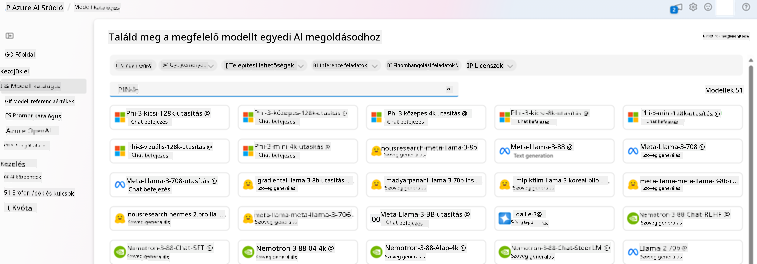

## Felkészülés a finomhangolásra

### Előfeltételek

> [!NOTE]
> A Phi-3 család modelljei esetén a pay-as-you-go finomhangolási lehetőség csak az **East US 2** régióban létrehozott hubokhoz érhető el.

- Azure előfizetés. Ha nincs Azure előfizetésed, hozz létre egy [fizetős Azure fiókot](https://azure.microsoft.com/pricing/purchase-options/pay-as-you-go).

- Egy [AI Foundry projekt](https://ai.azure.com?WT.mc_id=aiml-138114-kinfeylo).
- Az Azure szerepkör alapú hozzáférés-vezérlés (Azure RBAC) használatos az Azure AI Foundry műveletekhez való hozzáféréshez. A cikk lépéseinek végrehajtásához a felhasználói fióknak __Azure AI Developer szerepkörrel__ kell rendelkeznie az erőforráscsoporton.

### Előfizetés szolgáltató regisztrációja

Ellenőrizd, hogy az előfizetés regisztrálva van-e a `Microsoft.Network` erőforrás-szolgáltatóhoz.

1. Jelentkezz be az [Azure portálra](https://portal.azure.com).
1. Válaszd a bal oldali menüből az **Előfizetések** pontot.
1. Válaszd ki a használni kívánt előfizetést.
1. A bal oldali menüből válaszd az **AI projekt beállítások** > **Erőforrás-szolgáltatók** pontot.
1. Ellenőrizd, hogy a **Microsoft.Network** szerepel-e az erőforrás-szolgáltatók között. Ha nem, add hozzá.

### Adatelőkészítés

Készítsd elő a tanító és validációs adataidat a modell finomhangolásához. Ezek az adathalmazok bemeneti és kimeneti példákat tartalmaznak arra vonatkozóan, hogy milyen módon szeretnéd, hogy a modell működjön.

Győződj meg róla, hogy minden tanító példa megfelel a várt formátumnak az inferencia során. A hatékony finomhangoláshoz kiegyensúlyozott és sokszínű adathalmaz szükséges.

Ez magában foglalja az adatok egyensúlyának fenntartását, különböző szcenáriók bevonását, valamint az adatok időszakos finomhangolását, hogy azok jobban tükrözzék a valós igényeket, ezáltal pontosabb és kiegyensúlyozottabb modellválaszokat eredményezve.

Különböző modell típusokhoz eltérő formátumú tanító adatok szükségesek.

### Chat Completion

A használt tanító és validációs adatokat **JSON Lines (JSONL)** formátumban kell megadni. `Phi-3-mini-128k-instruct` esetén a finomhangolási adathalmazt a Chat completions API által használt beszélgetési formátumban kell megadni.

### Példa fájlformátum

```json
    {"messages": [{"role": "system", "content": "You are an Xbox customer support agent whose primary goal is to help users with issues they are experiencing with their Xbox devices. You are friendly and concise. You only provide factual answers to queries, and do not provide answers that are not related to Xbox."}, {"role": "user", "content": "Is Xbox better than PlayStation?"}, {"role": "assistant", "content": "I apologize, but I cannot provide personal opinions. My primary job is to assist you with any issues related to your Xbox device. Do you have any Xbox-related issues that need addressing?"}]}
    {"messages": [{"role": "system", "content": "You are an Xbox customer support agent whose primary goal is to help users with issues they are experiencing with their Xbox devices. You are friendly and concise. You only provide factual answers to queries, and do not provide answers that are not related to Xbox."}, {"role": "user", "content": "Can I play PC games on my Xbox?"}, {"role": "assistant", "content": "While Xbox consoles don't natively support PC games, they can play an array of Xbox games, many of which are also available on PC. Can I assist you with finding games compatible with your Xbox device?"}]}
    {"messages": [{"role": "system", "content": "You are an Xbox customer support agent whose primary goal is to help users with issues they are experiencing with their Xbox devices. You are friendly and concise. You only provide factual answers to queries, and do not provide answers that are not related to Xbox."}, {"role": "user", "content": "I'm having trouble connecting my Xbox to the Wi-Fi."}, {"role": "assistant", "content": "No worries, let's go through the network settings on your Xbox. Can you please tell me what happens when you try to connect it to the Wi-Fi?"}]}
```

A támogatott fájltípus JSON Lines. A fájlokat a alapértelmezett adattárba töltjük fel, és elérhetővé tesszük a projektedben.

## Phi-3 finomhangolása Azure AI Foundry-val

Az Azure AI Foundry lehetővé teszi, hogy nagy nyelvi modelleket személyes adathalmazokra szabj finomhangolás segítségével. A finomhangolás nagy értéket teremt azáltal, hogy testreszabást és optimalizálást tesz lehetővé konkrét feladatokra és alkalmazásokra. Ez jobb teljesítményt, költséghatékonyságot, csökkentett késleltetést és személyre szabott kimeneteket eredményez.

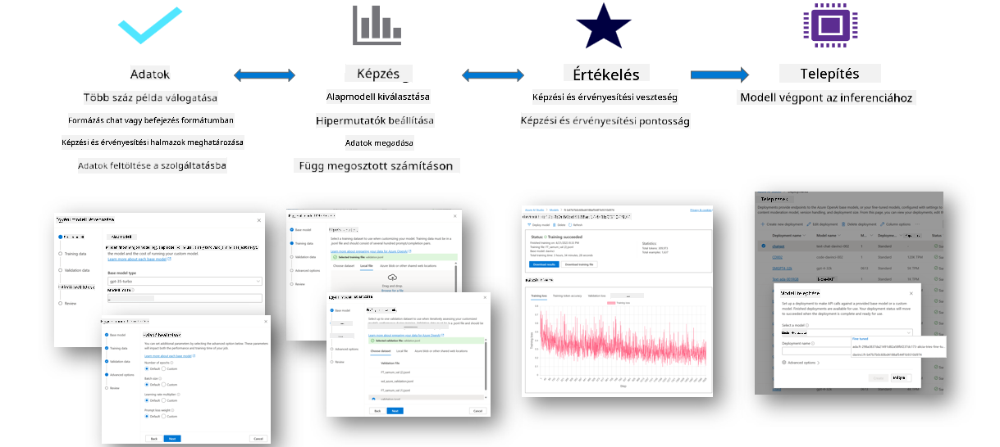

### Új projekt létrehozása

1. Jelentkezz be az [Azure AI Foundry](https://ai.azure.com) oldalra.

1. Válaszd a **+New project** lehetőséget új projekt létrehozásához.

    

1. Végezze el a következő lépéseket:

    - Projekt **Hub neve**. Egyedi értéknek kell lennie.
    - Válaszd ki a használni kívánt **Hub-ot** (szükség esetén hozz létre újat).

    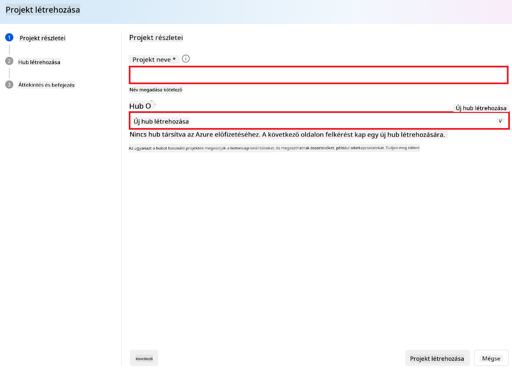

1. Új hub létrehozásához végezd el a következőket:

    - Add meg a **Hub nevét**. Egyedi érték legyen.
    - Válaszd ki az Azure **Előfizetést**.
    - Válaszd ki a használni kívánt **Erőforráscsoportot** (szükség esetén hozz létre újat).
    - Válaszd ki a használni kívánt **Helyszínt**.
    - Válaszd ki a használni kívánt **Connect Azure AI Services** szolgáltatást (szükség esetén hozz létre újat).
    - A **Connect Azure AI Search** esetén válaszd a **Skip connecting** opciót.

    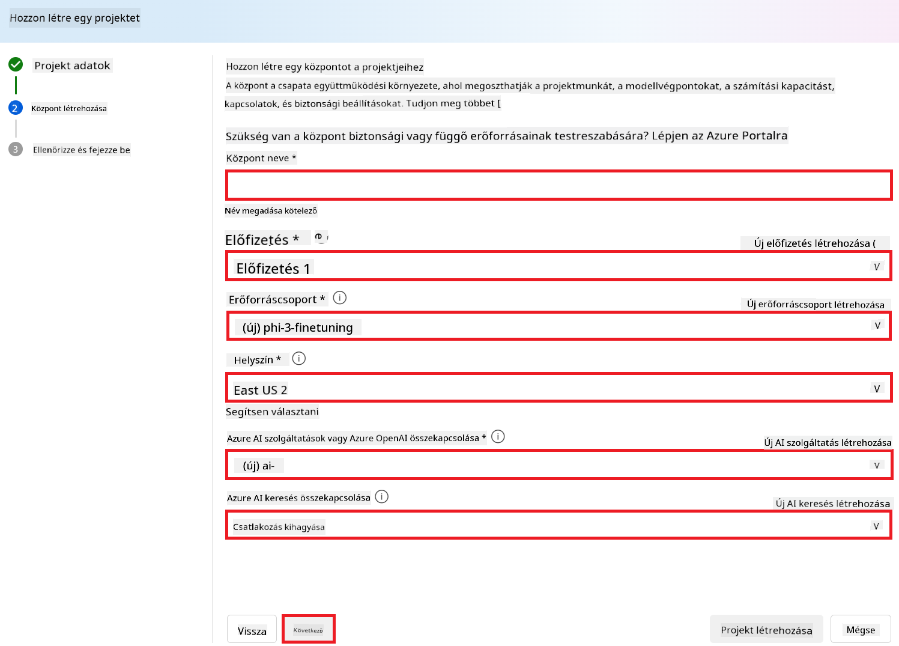

1. Válaszd a **Next**-et.
1. Válaszd a **Create a project** lehetőséget.

### Adatelőkészítés

A finomhangolás előtt gyűjts vagy hozz létre egy, a feladatodhoz illeszkedő adathalmazt, például chat utasításokat, kérdés-válasz párokat vagy más releváns szöveges adatokat. Tisztítsd és előfeldolgozd ezeket az adatokat, távolítsd el a zajt, kezeld a hiányzó értékeket, és tokenizáld a szöveget.

### Phi-3 modellek finomhangolása Azure AI Foundry-ban

> [!NOTE]
> A Phi-3 modellek finomhangolása jelenleg csak az East US 2 régióban található projektekben támogatott.

1. Válaszd a bal oldali fülön a **Model catalog** lehetőséget.

1. Írd be a keresőmezőbe, hogy *phi-3*, majd válaszd ki a használni kívánt phi-3 modellt.

    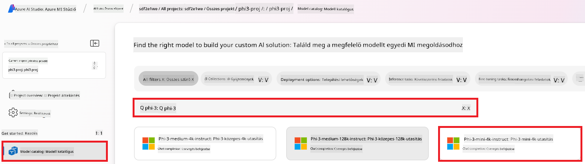

1. Válaszd a **Fine-tune** opciót.

    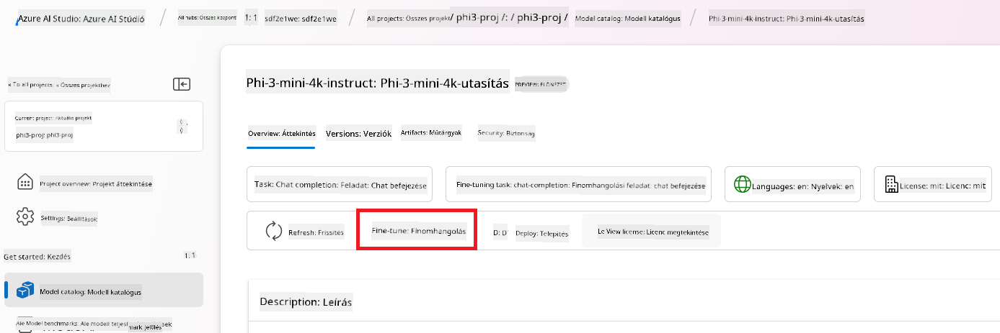

1. Írd be a **Finomhangolt modell nevét**.

    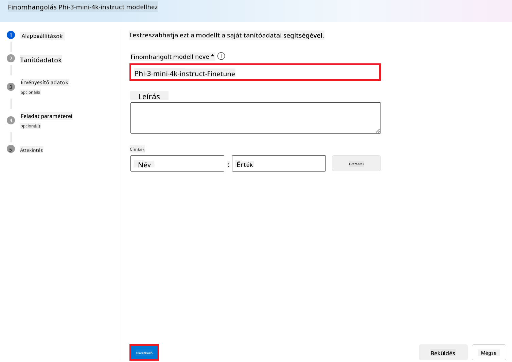

1. Válaszd a **Next**-et.

1. Végezze el a következőket:

    - Válaszd ki a **feladattípust**: **Chat completion**.
    - Válaszd ki a használni kívánt **tanító adatokat**. Feltöltheted az Azure AI Foundry adatain keresztül vagy a helyi környezetedből.

    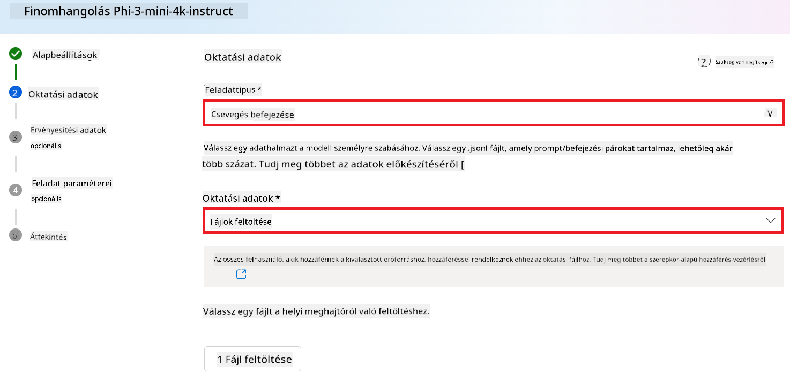

1. Válaszd a **Next**-et.

1. Töltsd fel a használni kívánt **validációs adatokat**, vagy válaszd az **Automatikus tanító adat felosztást**.

    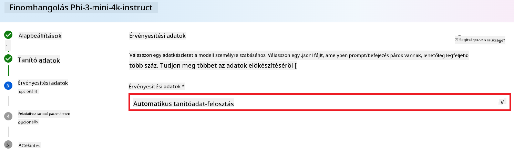

1. Válaszd a **Next**-et.

1. Végezze el a következőket:

    - Válaszd ki a használni kívánt **Batch size multiplikátort**.
    - Válaszd ki a használni kívánt **tanulási rátát**.
    - Válaszd ki a használni kívánt **epokszámot**.

    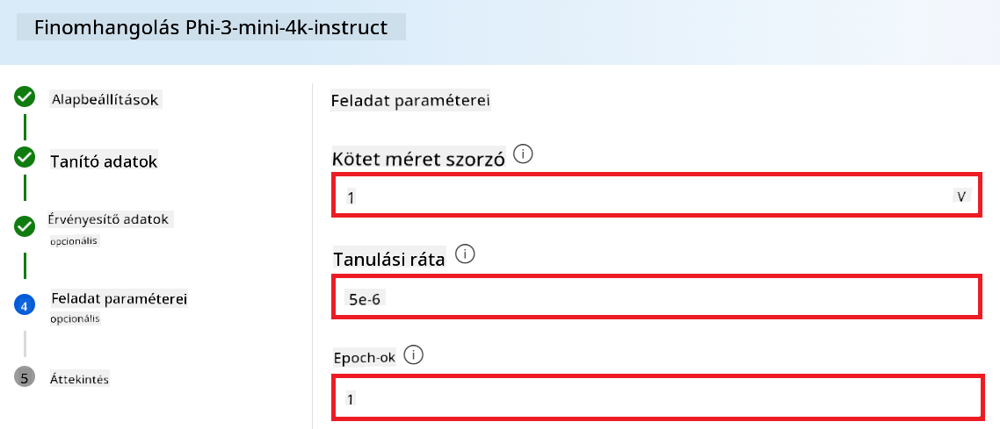

1. Válaszd a **Submit** gombot a finomhangolás elindításához.

    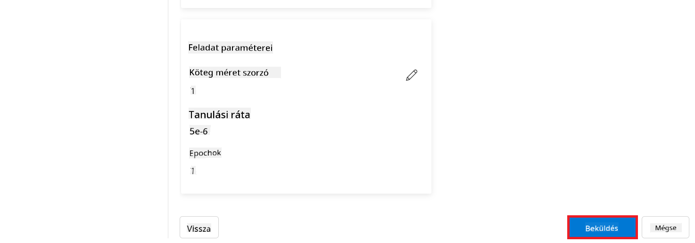

1. Amint a modell finomhangolása befejeződik, az állapot **Completed** lesz, ahogy az alábbi képen látható. Ekkor telepítheted a modellt, és használhatod saját alkalmazásodban, a playground-ban vagy prompt flow-ban. További információkért lásd a [Phi-3 család kis nyelvi modelljeinek telepítése Azure AI Foundry-val](https://learn.microsoft.com/azure/ai-studio/how-to/deploy-models-phi-3?tabs=phi-3-5&pivots=programming-language-python) útmutatót.

    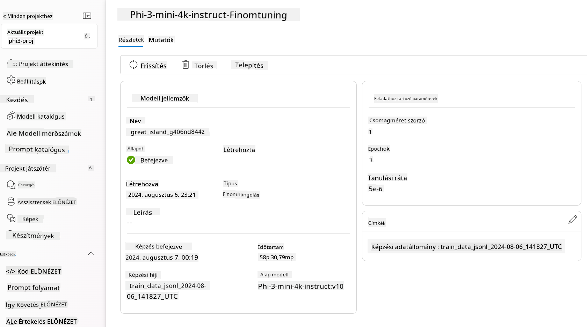

> [!NOTE]
> Részletesebb információkért a Phi-3 finomhangolásáról lásd a [Fine-tune Phi-3 models in Azure AI Foundry](https://learn.microsoft.com/azure/ai-studio/how-to/fine-tune-phi-3?tabs=phi-3-mini) oldalt.

## Finomhangolt modellek törlése

Törölhetsz finomhangolt modellt az [Azure AI Foundry](https://ai.azure.com) finomhangolási modell listájából vagy a modell részletező oldaláról. Válaszd ki a törölni kívánt finomhangolt modellt a Finomhangolás oldalon, majd kattints a Törlés gombra.

> [!NOTE]
> Egyedi modellt nem lehet törölni, ha van élő telepítése. Először törölnöd kell a modell telepítését, mielőtt a modellt törölheted.

## Költségek és kvóták

### Költség- és kvóta szempontok a Phi-3 modellek szolgáltatásként történő finomhangolásához

A Phi modelleket, amelyeket szolgáltatásként finomhangolnak, a Microsoft kínálja, és integrálva vannak az Azure AI Foundry-val. Az árakat megtalálod a modell [telepítése](https://learn.microsoft.com/azure/ai-studio/how-to/deploy-models-phi-3?tabs=phi-3-5&pivots=programming-language-python) vagy finomhangolása során a Pricing and terms fül alatt a telepítési varázslóban.

## Tartalomszűrés

A pay-as-you-go alapon szolgáltatásként telepített modelleket az Azure AI Content Safety védi. Valós idejű végpontokra telepítés esetén kikapcsolhatod ezt a funkciót. Az Azure AI Content Safety engedélyezése esetén a prompt és a válasz egyaránt átmegy egy osztályozó modellekből álló rendszeren, amelynek célja a káros tartalom észlelése és megakadályozása. A tartalomszűrő rendszer észleli és kezeli a potenciálisan káros tartalom bizonyos kategóriáit mind a bemeneti promptokban, mind a kimeneti válaszokban. További információkért lásd az [Azure AI Content Safety](https://learn.microsoft.com/azure/ai-studio/concepts/content-filtering) oldalt.

**Finomhangolási beállítások**

Hipermparaméterek: Határozd meg a hipermparamétereket, mint például a tanulási ráta, batch méret és epokszám.

**Veszteségfüggvény**

Válassz a feladatnak megfelelő veszteségfüggvényt (pl. keresztentrópia).

**Optimalizáló**

Válassz optimalizálót (pl. Adam) a gradiens frissítéshez a tanulás során.

**Finomhangolási folyamat**

- Betöltés: Töltsd be a Phi-3 Mini előre betanított ellenőrzőpontját.
- Egyedi rétegek hozzáadása: Adj hozzá feladatspecifikus rétegeket (pl. osztályozó fej chat utasításokhoz).

**Modell tanítása**  
Finomhangold a modellt a előkészített adathalmazzal. Figyeld a tanulási folyamatot, és szükség szerint módosítsd a hipermparamétereket.

**Értékelés és validálás**

Validációs halmaz: Oszd meg az adatokat tanító és validációs halmazokra.

**Teljesítmény értékelése**

Használj mérőszámokat, mint a pontosság, F1-érték vagy perplexitás a modell teljesítményének értékeléséhez.

## Finomhangolt modell mentése

**Ellenőrzőpont**  
Mentse el a finomhangolt modell ellenőrzőpontját későbbi használatra.

## Telepítés

- Webszolgáltatásként telepítés: Telepítsd finomhangolt modelled webszolgáltatásként az Azure AI Foundry-ban.
- Végpont tesztelése: Küldj tesztkéréseket a telepített végpontra a működés ellenőrzéséhez.

## Ismétlés és fejlesztés

Ismételj: Ha a teljesítmény nem kielégítő, módosítsd a hipermparamétereket, adj hozzá több adatot vagy finomhangolj több epokszámon keresztül.

## Figyelés és finomítás

Folyamatosan figyeld a modell viselkedését, és szükség szerint finomítsd.

## Testreszabás és bővítés

Egyedi feladatok: A Phi-3 Mini finomhangolható különféle feladatokra a chat utasításokon túl is. Fedezz fel más alkalmazási területeket!  
Kísérletezz: Próbálj ki különböző architektúrákat, rétegkombinációkat és technikákat a teljesítmény javítására.

> [!NOTE]
> A finomhangolás iteratív folyamat. Kísérletezz, tanulj, és igazítsd a modellt, hogy a legjobb eredményt érd el a saját feladatodhoz!

**Felelősség kizárása**:  
Ezt a dokumentumot az AI fordító szolgáltatás [Co-op Translator](https://github.com/Azure/co-op-translator) segítségével fordítottuk le. Bár igyekszünk pontos fordítást biztosítani, kérjük, vegye figyelembe, hogy az automatikus fordítások hibákat vagy pontatlanságokat tartalmazhatnak. Az eredeti dokumentum az anyanyelvén tekintendő hiteles forrásnak. Kritikus információk esetén szakmai emberi fordítást javaslunk. Nem vállalunk felelősséget a fordítás használatából eredő félreértésekért vagy félreértelmezésekért.