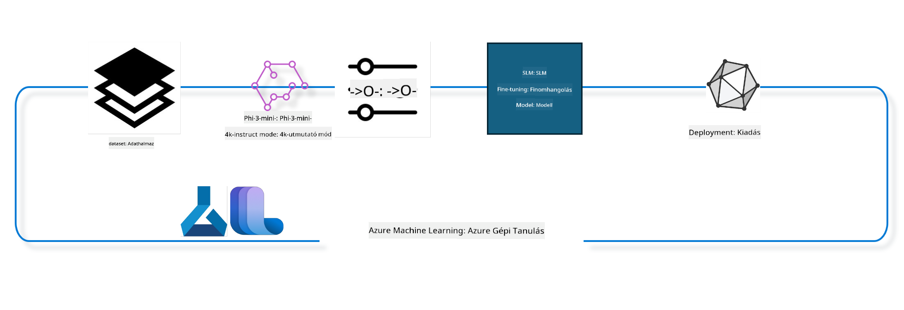

<!--
CO_OP_TRANSLATOR_METADATA:
{
  "original_hash": "944949f040e61b2ea25b3460f7394fd4",
  "translation_date": "2025-05-09T21:30:22+00:00",
  "source_file": "md/03.FineTuning/FineTuning_MLSDK.md",
  "language_code": "hu"
}
-->
## Hogyan használjuk az Azure ML rendszerregiszter chat-completion komponenseit modell finomhangolásához

Ebben a példában a Phi-3-mini-4k-instruct modellt finomhangoljuk, hogy egy két személy közötti beszélgetést fejezzen be az ultrachat_200k adathalmaz segítségével.



A példa bemutatja, hogyan végezhetünk finomhangolást az Azure ML SDK és Python segítségével, majd hogyan telepíthetjük a finomhangolt modellt valós idejű lekérdezésre egy online végpontra.

### Tanító adatok

Az ultrachat_200k adathalmazt használjuk. Ez az UltraChat adathalmaz erősen szűrt változata, amelyet a Zephyr-7B-β, egy csúcstechnológiás 7 milliárd paraméteres chat modell betanításához használtak.

### Modell

A Phi-3-mini-4k-instruct modellt használjuk, hogy megmutassuk, hogyan lehet egy modellt finomhangolni chat-completion feladatra. Ha ezt a jegyzetfüzetet egy adott modell kártyájából nyitottad meg, ne felejtsd el lecserélni a modellspecifikus nevet.

### Feladatok

- Válassz egy modellt a finomhangoláshoz.
- Válassz és vizsgáld meg a tanító adatokat.
- Állítsd be a finomhangolási feladatot.
- Futtasd a finomhangolási feladatot.
- Tekintsd át a tanulási és értékelési mutatókat.
- Regisztráld a finomhangolt modellt.
- Telepítsd a finomhangolt modellt valós idejű lekérdezéshez.
- Tisztítsd meg az erőforrásokat.

## 1. Előfeltételek beállítása

- Telepítsd a függőségeket
- Csatlakozz az AzureML Workspace-hez. További információ a SDK hitelesítés beállításáról. Cseréld ki az alábbi <WORKSPACE_NAME>, <RESOURCE_GROUP> és <SUBSCRIPTION_ID> helyőrzőket.
- Csatlakozz az azureml rendszerregiszterhez
- Állíts be opcionális kísérlet nevet
- Ellenőrizd vagy hozd létre a számítási erőforrást.

> [!NOTE]
> Egyetlen GPU node több GPU kártyát is tartalmazhat. Például a Standard_NC24rs_v3 node-on 4 NVIDIA V100 GPU található, míg a Standard_NC12s_v3 node-on 2 NVIDIA V100 GPU van. Erről a dokumentációban találsz részleteket. A node-onkénti GPU kártyák számát az alábbi gpus_per_node paraméter határozza meg. Ennek helyes beállítása biztosítja az összes GPU kihasználását a node-ban. A javasolt GPU compute SKU-k itt és itt találhatók.

### Python könyvtárak

Telepítsd a függőségeket az alábbi cella futtatásával. Ez nem opcionális lépés új környezetben.

```bash
pip install azure-ai-ml
pip install azure-identity
pip install datasets==2.9.0
pip install mlflow
pip install azureml-mlflow
```

### Kapcsolódás az Azure ML-hez

1. Ez a Python szkript az Azure Machine Learning (Azure ML) szolgáltatással való interakcióra szolgál. A működése a következő:

    - Importálja a szükséges modulokat az azure.ai.ml, azure.identity és azure.ai.ml.entities csomagokból, valamint a time modult.

    - Megpróbál bejelentkezni a DefaultAzureCredential() segítségével, amely egyszerűsített hitelesítést biztosít Azure környezetben futó alkalmazásokhoz. Ha ez nem sikerül, az InteractiveBrowserCredential()-re vált, amely interaktív bejelentkezési ablakot nyit.

    - Ezután megpróbál létrehozni egy MLClient példányt a from_config metódussal, amely az alapértelmezett config fájlból (config.json) olvassa be a beállításokat. Ha ez nem sikerül, manuálisan hozza létre az MLClient-et a subscription_id, resource_group_name és workspace_name megadásával.

    - Egy másik MLClient példányt hoz létre az "azureml" nevű Azure ML regiszterhez, ahol a modellek, finomhangolási pipeline-ok és környezetek vannak tárolva.

    - Beállítja az experiment_name értékét "chat_completion_Phi-3-mini-4k-instruct"-ra.

    - Egyedi időbélyeget generál a jelenlegi idő (másodpercben, lebegőpontos számként) egész számra konvertálásával, majd sztringgé alakításával. Ezt az időbélyeget egyedi nevek és verziók létrehozására használhatjuk.

    ```python
    # Import necessary modules from Azure ML and Azure Identity
    from azure.ai.ml import MLClient
    from azure.identity import (
        DefaultAzureCredential,
        InteractiveBrowserCredential,
    )
    from azure.ai.ml.entities import AmlCompute
    import time  # Import time module
    
    # Try to authenticate using DefaultAzureCredential
    try:
        credential = DefaultAzureCredential()
        credential.get_token("https://management.azure.com/.default")
    except Exception as ex:  # If DefaultAzureCredential fails, use InteractiveBrowserCredential
        credential = InteractiveBrowserCredential()
    
    # Try to create an MLClient instance using the default config file
    try:
        workspace_ml_client = MLClient.from_config(credential=credential)
    except:  # If that fails, create an MLClient instance by manually providing the details
        workspace_ml_client = MLClient(
            credential,
            subscription_id="<SUBSCRIPTION_ID>",
            resource_group_name="<RESOURCE_GROUP>",
            workspace_name="<WORKSPACE_NAME>",
        )
    
    # Create another MLClient instance for the Azure ML registry named "azureml"
    # This registry is where models, fine-tuning pipelines, and environments are stored
    registry_ml_client = MLClient(credential, registry_name="azureml")
    
    # Set the experiment name
    experiment_name = "chat_completion_Phi-3-mini-4k-instruct"
    
    # Generate a unique timestamp that can be used for names and versions that need to be unique
    timestamp = str(int(time.time()))
    ```

## 2. Válassz egy alapmodellt a finomhangoláshoz

1. A Phi-3-mini-4k-instruct egy 3,8 milliárd paraméteres, könnyű, csúcstechnológiás nyílt modell, amely a Phi-2-höz használt adathalmazokra épül. A modell a Phi-3 családhoz tartozik, a Mini verzió pedig két változatban érhető el: 4K és 128K, ami a támogatott kontextushossz (tokenekben). A modellt a saját célunkra kell finomhangolni. Ezeket a modelleket megtekintheted az AzureML Studio Modell Katalógusában, szűrve a chat-completion feladatra. Ebben a példában a Phi-3-mini-4k-instruct modellt használjuk. Ha más modellhez nyitottad meg a jegyzetfüzetet, cseréld ki a modellt és verzióját ennek megfelelően.

    > [!NOTE]
    > A modell id tulajdonsága. Ezt adjuk át a finomhangolási feladatnak bemenetként. Ez megtalálható az AzureML Studio Modell Katalógus modell részletei között az Asset ID mezőben.

2. Ez a Python szkript az Azure Machine Learning (Azure ML) szolgáltatással lép kapcsolatba. A működése a következő:

    - Beállítja a model_name értékét "Phi-3-mini-4k-instruct"-ra.

    - A registry_ml_client models get metódusával lekéri a megadott nevű modell legújabb verzióját az Azure ML regiszterből. A get metódus két paraméterrel hívódik: a modell neve és egy címke, amely jelzi, hogy a legfrissebb verziót kérjük.

    - Kiír egy üzenetet a konzolra, amely jelzi a finomhangoláshoz használt modell nevét, verzióját és azonosítóját. A format metódussal illeszti be ezeket az értékeket az üzenetbe. A név, verzió és id a foundation_model objektum tulajdonságai.

    ```python
    # Set the model name
    model_name = "Phi-3-mini-4k-instruct"
    
    # Get the latest version of the model from the Azure ML registry
    foundation_model = registry_ml_client.models.get(model_name, label="latest")
    
    # Print the model name, version, and id
    # This information is useful for tracking and debugging
    print(
        "\n\nUsing model name: {0}, version: {1}, id: {2} for fine tuning".format(
            foundation_model.name, foundation_model.version, foundation_model.id
        )
    )
    ```

## 3. Hozz létre számítási erőforrást a feladathoz

A finomhangolási feladat CSAK GPU számítást használ. A számítási erőforrás mérete a modell nagyságától függ, és sokszor nehéz megtalálni a megfelelő méretet. Ebben a cellában útmutatást adunk a megfelelő számítás kiválasztásához.

> [!NOTE]
> Az alábbi számítások a legoptimálisabb konfigurációval működnek. Bármilyen konfigurációs változtatás Cuda Out Of Memory hibához vezethet. Ilyen esetben próbáld meg nagyobb méretű számításra váltani.

> [!NOTE]
> A compute_cluster_size kiválasztásakor győződj meg róla, hogy a számítási erőforrás elérhető a resource groupodban. Ha egy adott számítás nem elérhető, kérhetsz hozzáférést.

### A modell finomhangolási támogatásának ellenőrzése

1. Ez a Python szkript egy Azure Machine Learning (Azure ML) modellel lép kapcsolatba. A működése:

    - Importálja az ast modult, amely a Python absztrakt szintaxisfájának feldolgozására szolgáló funkciókat tartalmaz.

    - Ellenőrzi, hogy a foundation_model objektum rendelkezik-e finetune_compute_allow_list nevű címkével. Az Azure ML-ben a címkék kulcs-érték párok, amelyeket a modellek szűrésére és rendezésére használhatunk.

    - Ha a finetune_compute_allow_list címke jelen van, az ast.literal_eval segítségével biztonságosan átalakítja a címke értékét (sztringet) Python listává, amelyet a computes_allow_list változóhoz rendel. Ezután kiír egy üzenetet, hogy a számítást a listából kell választani.

    - Ha nincs ilyen címke, a computes_allow_list értéke None lesz, és erről tájékoztatást ad.

    - Összefoglalva: a szkript ellenőrzi, hogy a modell metaadatai között van-e egy speciális címke, és ha igen, listaként értelmezi azt, majd visszajelzést ad.

    ```python
    # Import the ast module, which provides functions to process trees of the Python abstract syntax grammar
    import ast
    
    # Check if the 'finetune_compute_allow_list' tag is present in the model's tags
    if "finetune_compute_allow_list" in foundation_model.tags:
        # If the tag is present, use ast.literal_eval to safely parse the tag's value (a string) into a Python list
        computes_allow_list = ast.literal_eval(
            foundation_model.tags["finetune_compute_allow_list"]
        )  # convert string to python list
        # Print a message indicating that a compute should be created from the list
        print(f"Please create a compute from the above list - {computes_allow_list}")
    else:
        # If the tag is not present, set computes_allow_list to None
        computes_allow_list = None
        # Print a message indicating that the 'finetune_compute_allow_list' tag is not part of the model's tags
        print("`finetune_compute_allow_list` is not part of model tags")
    ```

### Számítási példány ellenőrzése

1. Ez a Python szkript az Azure Machine Learning (Azure ML) szolgáltatással lép kapcsolatba, és több ellenőrzést végez egy számítási példányon. A működése:

    - Megpróbálja lekérni a compute_cluster nevű számítási példányt az Azure ML workspace-ből. Ha a példány provisioning állapota "failed", hibát dob.

    - Ellenőrzi, hogy a computes_allow_list nem None-e. Ha nem, az összes méretet kisbetűssé alakítja, majd ellenőrzi, hogy a jelenlegi számítási példány mérete szerepel-e a listában. Ha nem, hibát dob.

    - Ha a computes_allow_list None, akkor ellenőrzi, hogy a számítási példány mérete nem szerepel-e a nem támogatott GPU VM méretek listájában. Ha igen, hibát dob.

    - Lekéri az összes elérhető számítási méretet a workspace-ből, majd végigiterál rajtuk. Ha talál olyan méretet, amely megegyezik a jelenlegi számítás méretével, lekéri a GPU-k számát és gpu_count_found értéket True-ra állítja.

    - Ha gpu_count_found True, kiírja a GPU-k számát a számítási példányban. Ha False, hibát dob.

    - Összefoglalva: a szkript több ellenőrzést végez egy számítási példányon, beleértve az állapotát, méretét az engedélyezett vagy tiltott listák alapján, valamint a GPU-k számát.

    ```python
    # Print the exception message
    print(e)
    # Raise a ValueError if the compute size is not available in the workspace
    raise ValueError(
        f"WARNING! Compute size {compute_cluster_size} not available in workspace"
    )
    
    # Retrieve the compute instance from the Azure ML workspace
    compute = workspace_ml_client.compute.get(compute_cluster)
    # Check if the provisioning state of the compute instance is "failed"
    if compute.provisioning_state.lower() == "failed":
        # Raise a ValueError if the provisioning state is "failed"
        raise ValueError(
            f"Provisioning failed, Compute '{compute_cluster}' is in failed state. "
            f"please try creating a different compute"
        )
    
    # Check if computes_allow_list is not None
    if computes_allow_list is not None:
        # Convert all compute sizes in computes_allow_list to lowercase
        computes_allow_list_lower_case = [x.lower() for x in computes_allow_list]
        # Check if the size of the compute instance is in computes_allow_list_lower_case
        if compute.size.lower() not in computes_allow_list_lower_case:
            # Raise a ValueError if the size of the compute instance is not in computes_allow_list_lower_case
            raise ValueError(
                f"VM size {compute.size} is not in the allow-listed computes for finetuning"
            )
    else:
        # Define a list of unsupported GPU VM sizes
        unsupported_gpu_vm_list = [
            "standard_nc6",
            "standard_nc12",
            "standard_nc24",
            "standard_nc24r",
        ]
        # Check if the size of the compute instance is in unsupported_gpu_vm_list
        if compute.size.lower() in unsupported_gpu_vm_list:
            # Raise a ValueError if the size of the compute instance is in unsupported_gpu_vm_list
            raise ValueError(
                f"VM size {compute.size} is currently not supported for finetuning"
            )
    
    # Initialize a flag to check if the number of GPUs in the compute instance has been found
    gpu_count_found = False
    # Retrieve a list of all available compute sizes in the workspace
    workspace_compute_sku_list = workspace_ml_client.compute.list_sizes()
    available_sku_sizes = []
    # Iterate over the list of available compute sizes
    for compute_sku in workspace_compute_sku_list:
        available_sku_sizes.append(compute_sku.name)
        # Check if the name of the compute size matches the size of the compute instance
        if compute_sku.name.lower() == compute.size.lower():
            # If it does, retrieve the number of GPUs for that compute size and set gpu_count_found to True
            gpus_per_node = compute_sku.gpus
            gpu_count_found = True
    # If gpu_count_found is True, print the number of GPUs in the compute instance
    if gpu_count_found:
        print(f"Number of GPU's in compute {compute.size}: {gpus_per_node}")
    else:
        # If gpu_count_found is False, raise a ValueError
        raise ValueError(
            f"Number of GPU's in compute {compute.size} not found. Available skus are: {available_sku_sizes}."
            f"This should not happen. Please check the selected compute cluster: {compute_cluster} and try again."
        )
    ```

## 4. Válaszd ki az adathalmazt a modell finomhangolásához

1. Az ultrachat_200k adathalmazt használjuk. Az adathalmaz négy részre van bontva, amely alkalmas felügyelt finomhangolásra (sft). A példák száma az egyes részekben a következő:

    ```bash
    train_sft test_sft  train_gen  test_gen
    207865  23110  256032  28304
    ```

1. A következő néhány cella az alapvető adat-előkészítést mutatja be a finomhangoláshoz:

### Néhány adat sor vizualizálása

Szeretnénk, ha ez a mintafuttatás gyors lenne, ezért a train_sft és test_sft fájlokat csak az eredeti adatok 5%-ával mentjük el. Ez azt jelenti, hogy a finomhangolt modell pontossága alacsonyabb lesz, így nem ajánlott valós használatra.

A download-dataset.py szkript az ultrachat_200k adathalmaz letöltésére és a finomhangolási pipeline komponens számára feldolgozására szolgál. Mivel az adathalmaz nagy, itt csak egy részét használjuk.

1. Az alábbi szkript csak az adatok 5%-át tölti le. Ez az érték a dataset_split_pc paraméter módosításával növelhető.

    > [!NOTE]
    > Egyes nyelvi modellek eltérő nyelvkódokat használnak, ezért az adathalmaz oszlopneveinek is ennek megfelelően kell tükrözniük ezt.

1. Íme egy példa arra, hogy hogyan néz ki az adat:

A chat-completion adathalmaz parquet formátumban van tárolva, minden bejegyzés a következő sémát követi:

    - Ez egy JSON (JavaScript Object Notation) dokumentum, amely egy népszerű adatcsere formátum. Nem futtatható kód, hanem adat tárolására és továbbítására szolgál. A struktúrája:

    - "prompt": Egy szöveg, amely egy feladatot vagy kérdést tartalmaz az AI asszisztens számára.

    - "messages": Egy objektum tömb, amely egy felhasználó és egy AI asszisztens közötti beszélgetés üzeneteit tartalmazza. Minden üzenet objektumnak két kulcsa van:

    - "content": Az üzenet szövege.
    - "role": Az üzenetet küldő szerepe, lehet "user" vagy "assistant".
    - "prompt_id": Egyedi azonosító a prompt számára.

1. Ebben a JSON dokumentumban egy beszélgetés jelenik meg, ahol a felhasználó egy disztópikus történet főhősének létrehozását kéri az AI asszisztenstől. Az asszisztens válaszol, majd a felhasználó további részleteket kér, amire az asszisztens beleegyezik. Az egész beszélgetés egy adott prompt azonosítóhoz kötött.

    ```python
    {
        // The task or question posed to an AI assistant
        "prompt": "Create a fully-developed protagonist who is challenged to survive within a dystopian society under the rule of a tyrant. ...",
        
        // An array of objects, each representing a message in a conversation between a user and an AI assistant
        "messages":[
            {
                // The content of the user's message
                "content": "Create a fully-developed protagonist who is challenged to survive within a dystopian society under the rule of a tyrant. ...",
                // The role of the entity that sent the message
                "role": "user"
            },
            {
                // The content of the assistant's message
                "content": "Name: Ava\n\n Ava was just 16 years old when the world as she knew it came crashing down. The government had collapsed, leaving behind a chaotic and lawless society. ...",
                // The role of the entity that sent the message
                "role": "assistant"
            },
            {
                // The content of the user's message
                "content": "Wow, Ava's story is so intense and inspiring! Can you provide me with more details.  ...",
                // The role of the entity that sent the message
                "role": "user"
            }, 
            {
                // The content of the assistant's message
                "content": "Certainly! ....",
                // The role of the entity that sent the message
                "role": "assistant"
            }
        ],
        
        // A unique identifier for the prompt
        "prompt_id": "d938b65dfe31f05f80eb8572964c6673eddbd68eff3db6bd234d7f1e3b86c2af"
    }
    ```

### Adatok letöltése

1. Ez a Python szkript egy letöltő szkriptet futtat a download-dataset.py segítségével. A működése:

    - Importálja az os modult, amely hordozható módon teszi elérhetővé az operációs rendszer funkcióit.

    - Az os.system függvénnyel futtatja a download-dataset.py szkriptet shell-ben, megadva a letöltendő adathalmaz nevét (HuggingFaceH4/ultrachat_200k), a célkönyvtárat (ultrachat_200k_dataset) és a letöltési százalékot (5). Az os.system visszatérési értéke az exit_status változóba kerül.

    - Ellenőrzi, hogy az exit_status nem 0-e. Unix-szerű rendszereken a 0 sikeres futást jelez, más érték hibát. Ha hiba történt, kivételt dob.

    - Összefoglalva: ez a szkript egy segédprogrammal letölti az adathalmazt, és hibát jelez, ha a letöltés sikertelen.

    ```python
    # Import the os module, which provides a way of using operating system dependent functionality
    import os
    
    # Use the os.system function to run the download-dataset.py script in the shell with specific command-line arguments
    # The arguments specify the dataset to download (HuggingFaceH4/ultrachat_200k), the directory to download it to (ultrachat_200k_dataset), and the percentage of the dataset to split (5)
    # The os.system function returns the exit status of the command it executed; this status is stored in the exit_status variable
    exit_status = os.system(
        "python ./download-dataset.py --dataset HuggingFaceH4/ultrachat_200k --download_dir ultrachat_200k_dataset --dataset_split_pc 5"
    )
    
    # Check if exit_status is not 0
    # In Unix-like operating systems, an exit status of 0 usually indicates that a command has succeeded, while any other number indicates an error
    # If exit_status is not 0, raise an Exception with a message indicating that there was an error downloading the dataset
    if exit_status != 0:
        raise Exception("Error downloading dataset")
    ```

### Adatok betöltése DataFrame-be

1. Ez a Python szkript JSON Lines fájlt tölt be pandas DataFrame-be és megjeleníti az első 5 sort. A működése:

    - Importálja a pandas könyvtárat, amely hatékony adatkezelési és elemzési eszköz.

    - Beállítja a pandas megjelenítési opcióit úgy, hogy a oszlopok maximális szélessége 0 legyen, azaz a teljes szöveg látszódjon.

    - A pd.read_json függvénnyel betölti a train_sft.jsonl fájlt az ultrachat_200k_dataset könyvtárból. A lines=True paraméter jelzi, hogy JSON Lines formátumról van szó, ahol minden sor külön JSON objektum.

    - A head metódussal megjeleníti az első 5 sort (vagy kevesebbet, ha kevesebb sor van).

    - Összefoglalva: betölti a JSON Lines fájlt DataFrame-be és megjeleníti az első 5 sort teljes oszlopszöveggel.

    ```python
    # Import the pandas library, which is a powerful data manipulation and analysis library
    import pandas as pd
    
    # Set the maximum column width for pandas' display options to 0
    # This means that the full text of each column will be displayed without truncation when the DataFrame is printed
    pd.set_option("display.max_colwidth", 0)
    
    # Use the pd.read_json function to load the train_sft.jsonl file from the ultrachat_200k_dataset directory into a DataFrame
    # The lines=True argument indicates that the file is in JSON Lines format, where each line is a separate JSON object
    df = pd.read_json("./ultrachat_200k_dataset/train_sft.jsonl", lines=True)
    
    # Use the head method to display the first 5 rows of the DataFrame
    # If the DataFrame has less than 5 rows, it will display all of them
    df.head()
    ```

## 5. Küldd be a finomhangolási feladatot a modell és az adatok használatával

Hozd létre a chat-completion pipeline komponenst használó feladatot. Tudj meg többet a finomhangolás támogatott paramétereiről.

### Finomhangolási paraméterek definiálása

1. A finomhangolási paraméterek két csoportra oszthatók – tanulási paraméterek és optimalizációs paraméterek.

1. A tanulási paraméterek határozzák meg a tanulás részleteit, például:

    - Az alkalmazott optimalizáló és ütemező
    - A finomhangolás során optimalizálandó mérőszám
    - A tanulási lépések száma, batch méret és egyéb beállítások
    - Az optimalizációs paraméterek segítenek a GPU memória hatékony használatában és a számítási erőforrások kihasználásában.

1. Az alábbiakban néhány példa az optimalizációs paraméterekre, amelyek modellfüggőek és a modellhez csomagolva vannak a különbségek kezelésére:


training pipeline különböző paraméterek alapján, majd kiírja ezt a megjelenítendő nevet. ```python
    # Define a function to generate a display name for the training pipeline
    def get_pipeline_display_name():
        # Calculate the total batch size by multiplying the per-device batch size, the number of gradient accumulation steps, the number of GPUs per node, and the number of nodes used for fine-tuning
        batch_size = (
            int(finetune_parameters.get("per_device_train_batch_size", 1))
            * int(finetune_parameters.get("gradient_accumulation_steps", 1))
            * int(gpus_per_node)
            * int(finetune_parameters.get("num_nodes_finetune", 1))
        )
        # Retrieve the learning rate scheduler type
        scheduler = finetune_parameters.get("lr_scheduler_type", "linear")
        # Retrieve whether DeepSpeed is applied
        deepspeed = finetune_parameters.get("apply_deepspeed", "false")
        # Retrieve the DeepSpeed stage
        ds_stage = finetune_parameters.get("deepspeed_stage", "2")
        # If DeepSpeed is applied, include "ds" followed by the DeepSpeed stage in the display name; if not, include "nods"
        if deepspeed == "true":
            ds_string = f"ds{ds_stage}"
        else:
            ds_string = "nods"
        # Retrieve whether Layer-wise Relevance Propagation (LoRa) is applied
        lora = finetune_parameters.get("apply_lora", "false")
        # If LoRa is applied, include "lora" in the display name; if not, include "nolora"
        if lora == "true":
            lora_string = "lora"
        else:
            lora_string = "nolora"
        # Retrieve the limit on the number of model checkpoints to keep
        save_limit = finetune_parameters.get("save_total_limit", -1)
        # Retrieve the maximum sequence length
        seq_len = finetune_parameters.get("max_seq_length", -1)
        # Construct the display name by concatenating all these parameters, separated by hyphens
        return (
            model_name
            + "-"
            + "ultrachat"
            + "-"
            + f"bs{batch_size}"
            + "-"
            + f"{scheduler}"
            + "-"
            + ds_string
            + "-"
            + lora_string
            + f"-save_limit{save_limit}"
            + f"-seqlen{seq_len}"
        )
    
    # Call the function to generate the display name
    pipeline_display_name = get_pipeline_display_name()
    # Print the display name
    print(f"Display name used for the run: {pipeline_display_name}")
    ```

### Pipeline konfigurálása

Ez a Python szkript egy gépi tanulási pipeline-t definiál és konfigurál az Azure Machine Learning SDK segítségével. Íme, mit csinál lépésről lépésre:

1. Importálja a szükséges modulokat az Azure AI ML SDK-ból.
2. Lekéri a "chat_completion_pipeline" nevű pipeline komponenst a regiszterből.
3. Definiál egy pipeline munkát a `@pipeline` decorator and the function `create_pipeline`. The name of the pipeline is set to `pipeline_display_name`.

1. Inside the `create_pipeline` function, it initializes the fetched pipeline component with various parameters, including the model path, compute clusters for different stages, dataset splits for training and testing, the number of GPUs to use for fine-tuning, and other fine-tuning parameters.

1. It maps the output of the fine-tuning job to the output of the pipeline job. This is done so that the fine-tuned model can be easily registered, which is required to deploy the model to an online or batch endpoint.

1. It creates an instance of the pipeline by calling the `create_pipeline` function.

1. It sets the `force_rerun` setting of the pipeline to `True`, meaning that cached results from previous jobs will not be used.

1. It sets the `continue_on_step_failure` setting of the pipeline to `False` használatával, ami azt jelenti, hogy a pipeline leáll, ha bármelyik lépés hibát jelez.
4. Összefoglalva, ez a szkript egy gépi tanulási pipeline-t definiál és konfigurál chat befejező feladathoz az Azure Machine Learning SDK-val.

```python
    # Import necessary modules from the Azure AI ML SDK
    from azure.ai.ml.dsl import pipeline
    from azure.ai.ml import Input
    
    # Fetch the pipeline component named "chat_completion_pipeline" from the registry
    pipeline_component_func = registry_ml_client.components.get(
        name="chat_completion_pipeline", label="latest"
    )
    
    # Define the pipeline job using the @pipeline decorator and the function create_pipeline
    # The name of the pipeline is set to pipeline_display_name
    @pipeline(name=pipeline_display_name)
    def create_pipeline():
        # Initialize the fetched pipeline component with various parameters
        # These include the model path, compute clusters for different stages, dataset splits for training and testing, the number of GPUs to use for fine-tuning, and other fine-tuning parameters
        chat_completion_pipeline = pipeline_component_func(
            mlflow_model_path=foundation_model.id,
            compute_model_import=compute_cluster,
            compute_preprocess=compute_cluster,
            compute_finetune=compute_cluster,
            compute_model_evaluation=compute_cluster,
            # Map the dataset splits to parameters
            train_file_path=Input(
                type="uri_file", path="./ultrachat_200k_dataset/train_sft.jsonl"
            ),
            test_file_path=Input(
                type="uri_file", path="./ultrachat_200k_dataset/test_sft.jsonl"
            ),
            # Training settings
            number_of_gpu_to_use_finetuning=gpus_per_node,  # Set to the number of GPUs available in the compute
            **finetune_parameters
        )
        return {
            # Map the output of the fine tuning job to the output of pipeline job
            # This is done so that we can easily register the fine tuned model
            # Registering the model is required to deploy the model to an online or batch endpoint
            "trained_model": chat_completion_pipeline.outputs.mlflow_model_folder
        }
    
    # Create an instance of the pipeline by calling the create_pipeline function
    pipeline_object = create_pipeline()
    
    # Don't use cached results from previous jobs
    pipeline_object.settings.force_rerun = True
    
    # Set continue on step failure to False
    # This means that the pipeline will stop if any step fails
    pipeline_object.settings.continue_on_step_failure = False
    ```

### A munka beküldése

1. Ez a Python szkript egy gépi tanulási pipeline munkát küld be egy Azure Machine Learning munkaterületre, majd megvárja a munka befejezését. Íme, mit csinál:

- Meghívja a workspace_ml_client jobs objektumának create_or_update metódusát, hogy beküldje a pipeline munkát. A futtatandó pipeline-t a pipeline_object határozza meg, az alá tartozó kísérletet pedig az experiment_name.
- Ezután meghívja a workspace_ml_client jobs objektumának stream metódusát, hogy megvárja a pipeline munka befejezését. A várakozandó munka a pipeline_job objektum name attribútuma.
- Összefoglalva, ez a szkript egy gépi tanulási pipeline munkát küld be az Azure Machine Learning munkaterületre, majd megvárja a munka befejezését.

```python
    # Submit the pipeline job to the Azure Machine Learning workspace
    # The pipeline to be run is specified by pipeline_object
    # The experiment under which the job is run is specified by experiment_name
    pipeline_job = workspace_ml_client.jobs.create_or_update(
        pipeline_object, experiment_name=experiment_name
    )
    
    # Wait for the pipeline job to complete
    # The job to wait for is specified by the name attribute of the pipeline_job object
    workspace_ml_client.jobs.stream(pipeline_job.name)
    ```

## 6. A finomhangolt modell regisztrálása a munkaterületen

A finomhangolási munka kimenetéből regisztráljuk a modellt. Ez nyomon követi a kapcsolatot a finomhangolt modell és a finomhangolási munka között. A finomhangolási munka továbbá követi a kapcsolatot az alapmodelltől, az adatoktól és a tanító kódtól.

### A gépi tanulási modell regisztrálása

1. Ez a Python szkript egy gépi tanulási modellt regisztrál, amelyet egy Azure Machine Learning pipeline-ban tanítottak. Íme, mit csinál:

- Importálja a szükséges modulokat az Azure AI ML SDK-ból.
- Ellenőrzi, hogy a pipeline munkából elérhető-e a trained_model kimenet a workspace_ml_client jobs objektumának get metódusával és az outputs attribútumán keresztül.
- Összeállít egy elérési utat a tanított modellhez a pipeline munka neve és a "trained_model" kimenet neve alapján.
- Meghatároz egy nevet a finomhangolt modellnek az eredeti modellnévhez hozzáfűzve a "-ultrachat-200k" végződést, és a perjeleket kötőjelekkel helyettesíti.
- Előkészíti a modell regisztrálását egy Model objektum létrehozásával különféle paraméterekkel, beleértve az elérési utat, a modell típusát (MLflow modell), a modell nevét és verzióját, valamint a modell leírását.
- Regisztrálja a modellt a workspace_ml_client models objektumának create_or_update metódusával, a Model objektumot átadva argumentumként.
- Kiírja a regisztrált modellt.
2. Összefoglalva, ez a szkript egy gépi tanulási modellt regisztrál, amelyet egy Azure Machine Learning pipeline-ban tanítottak.

```python
    # Import necessary modules from the Azure AI ML SDK
    from azure.ai.ml.entities import Model
    from azure.ai.ml.constants import AssetTypes
    
    # Check if the `trained_model` output is available from the pipeline job
    print("pipeline job outputs: ", workspace_ml_client.jobs.get(pipeline_job.name).outputs)
    
    # Construct a path to the trained model by formatting a string with the name of the pipeline job and the name of the output ("trained_model")
    model_path_from_job = "azureml://jobs/{0}/outputs/{1}".format(
        pipeline_job.name, "trained_model"
    )
    
    # Define a name for the fine-tuned model by appending "-ultrachat-200k" to the original model name and replacing any slashes with hyphens
    finetuned_model_name = model_name + "-ultrachat-200k"
    finetuned_model_name = finetuned_model_name.replace("/", "-")
    
    print("path to register model: ", model_path_from_job)
    
    # Prepare to register the model by creating a Model object with various parameters
    # These include the path to the model, the type of the model (MLflow model), the name and version of the model, and a description of the model
    prepare_to_register_model = Model(
        path=model_path_from_job,
        type=AssetTypes.MLFLOW_MODEL,
        name=finetuned_model_name,
        version=timestamp,  # Use timestamp as version to avoid version conflict
        description=model_name + " fine tuned model for ultrachat 200k chat-completion",
    )
    
    print("prepare to register model: \n", prepare_to_register_model)
    
    # Register the model by calling the create_or_update method of the models object in the workspace_ml_client with the Model object as the argument
    registered_model = workspace_ml_client.models.create_or_update(
        prepare_to_register_model
    )
    
    # Print the registered model
    print("registered model: \n", registered_model)
    ```

## 7. A finomhangolt modell telepítése online végpontra

Az online végpontok tartós REST API-t biztosítanak, amely alkalmazásokkal integrálható a modell használatához.

### Végpont kezelése

1. Ez a Python szkript egy kezelt online végpontot hoz létre az Azure Machine Learning-ben egy regisztrált modellhez. Íme, mit csinál:

- Importálja a szükséges modulokat az Azure AI ML SDK-ból.
- Egyedi nevet definiál az online végpontnak azzal, hogy egy időbélyeget fűz a "ultrachat-completion-" szöveghez.
- Előkészíti az online végpont létrehozását egy ManagedOnlineEndpoint objektummal, amely tartalmazza a végpont nevét, leírását és az autentikációs módot ("key").
- Létrehozza az online végpontot a workspace_ml_client begin_create_or_update metódusával, majd megvárja a létrehozási művelet befejezését a wait metódussal.
2. Összefoglalva, ez a szkript egy kezelt online végpontot hoz létre az Azure Machine Learning-ben egy regisztrált modellhez.

```python
    # Import necessary modules from the Azure AI ML SDK
    from azure.ai.ml.entities import (
        ManagedOnlineEndpoint,
        ManagedOnlineDeployment,
        ProbeSettings,
        OnlineRequestSettings,
    )
    
    # Define a unique name for the online endpoint by appending a timestamp to the string "ultrachat-completion-"
    online_endpoint_name = "ultrachat-completion-" + timestamp
    
    # Prepare to create the online endpoint by creating a ManagedOnlineEndpoint object with various parameters
    # These include the name of the endpoint, a description of the endpoint, and the authentication mode ("key")
    endpoint = ManagedOnlineEndpoint(
        name=online_endpoint_name,
        description="Online endpoint for "
        + registered_model.name
        + ", fine tuned model for ultrachat-200k-chat-completion",
        auth_mode="key",
    )
    
    # Create the online endpoint by calling the begin_create_or_update method of the workspace_ml_client with the ManagedOnlineEndpoint object as the argument
    # Then wait for the creation operation to complete by calling the wait method
    workspace_ml_client.begin_create_or_update(endpoint).wait()
    ```

> [!NOTE]  
> Itt találod a telepítéshez támogatott SKU-k listáját - [Managed online endpoints SKU list](https://learn.microsoft.com/azure/machine-learning/reference-managed-online-endpoints-vm-sku-list)

### Gépi tanulási modell telepítése

1. Ez a Python szkript egy regisztrált gépi tanulási modellt telepít egy kezelt online végpontra az Azure Machine Learning-ben. Íme, mit csinál:

- Importálja az ast modult, amely funkciókat biztosít a Python absztrakt szintaxisfa feldolgozásához.
- Beállítja a telepítés példány típusát "Standard_NC6s_v3"-ra.
- Ellenőrzi, hogy az alapmodell tartalmazza-e az inference_compute_allow_list címkét. Ha igen, a címke értékét szövegből Python listává alakítja és hozzárendeli az inference_computes_allow_list változóhoz. Ha nem, None értéket ad neki.
- Ellenőrzi, hogy a megadott példány típus szerepel-e az engedélyezett listában. Ha nem, kiír egy üzenetet, amelyben arra kéri a felhasználót, hogy válasszon az engedélyezett lista példány típusai közül.
- Előkészíti a telepítést egy ManagedOnlineDeployment objektum létrehozásával, amely tartalmazza a telepítés nevét, a végpont nevét, a modell azonosítóját, a példány típusát és számát, az életképességi ellenőrzés beállításait és a kérések beállításait.
- Létrehozza a telepítést a workspace_ml_client begin_create_or_update metódusával, majd megvárja a létrehozás befejezését a wait metódussal.
- Beállítja a végpont forgalmát úgy, hogy a forgalom 100%-át a "demo" telepítéshez irányítsa.
- Frissíti a végpontot a workspace_ml_client begin_create_or_update metódusával, majd megvárja a frissítés befejezését a result metódussal.
2. Összefoglalva, ez a szkript egy regisztrált gépi tanulási modellt telepít egy kezelt online végpontra az Azure Machine Learning-ben.

```python
    # Import the ast module, which provides functions to process trees of the Python abstract syntax grammar
    import ast
    
    # Set the instance type for the deployment
    instance_type = "Standard_NC6s_v3"
    
    # Check if the `inference_compute_allow_list` tag is present in the foundation model
    if "inference_compute_allow_list" in foundation_model.tags:
        # If it is, convert the tag value from a string to a Python list and assign it to `inference_computes_allow_list`
        inference_computes_allow_list = ast.literal_eval(
            foundation_model.tags["inference_compute_allow_list"]
        )
        print(f"Please create a compute from the above list - {computes_allow_list}")
    else:
        # If it's not, set `inference_computes_allow_list` to `None`
        inference_computes_allow_list = None
        print("`inference_compute_allow_list` is not part of model tags")
    
    # Check if the specified instance type is in the allow list
    if (
        inference_computes_allow_list is not None
        and instance_type not in inference_computes_allow_list
    ):
        print(
            f"`instance_type` is not in the allow listed compute. Please select a value from {inference_computes_allow_list}"
        )
    
    # Prepare to create the deployment by creating a `ManagedOnlineDeployment` object with various parameters
    demo_deployment = ManagedOnlineDeployment(
        name="demo",
        endpoint_name=online_endpoint_name,
        model=registered_model.id,
        instance_type=instance_type,
        instance_count=1,
        liveness_probe=ProbeSettings(initial_delay=600),
        request_settings=OnlineRequestSettings(request_timeout_ms=90000),
    )
    
    # Create the deployment by calling the `begin_create_or_update` method of the `workspace_ml_client` with the `ManagedOnlineDeployment` object as the argument
    # Then wait for the creation operation to complete by calling the `wait` method
    workspace_ml_client.online_deployments.begin_create_or_update(demo_deployment).wait()
    
    # Set the traffic of the endpoint to direct 100% of the traffic to the "demo" deployment
    endpoint.traffic = {"demo": 100}
    
    # Update the endpoint by calling the `begin_create_or_update` method of the `workspace_ml_client` with the `endpoint` object as the argument
    # Then wait for the update operation to complete by calling the `result` method
    workspace_ml_client.begin_create_or_update(endpoint).result()
    ```

## 8. A végpont tesztelése mintaadatokkal

Néhány mintaadatot fogunk lekérni a teszt adatállományból, és elküldjük az online végpontra inferenciára. Ezután megjelenítjük a pontozott címkéket a valós címkék mellett.

### Az eredmények beolvasása

1. Ez a Python szkript egy JSON Lines fájlt olvas be egy pandas DataFrame-be, vesz egy véletlenszerű mintát, majd visszaállítja az indexet. Íme, mit csinál:

- Beolvassa a ./ultrachat_200k_dataset/test_gen.jsonl fájlt pandas DataFrame-be. A read_json függvényt a lines=True paraméterrel használja, mert a fájl JSON Lines formátumú, ahol minden sor külön JSON objektum.
- Egy véletlenszerű mintát vesz 1 sorral a DataFrame-ből. A sample függvényt az n=1 paraméterrel hívja meg, hogy egy véletlenszerű sort válasszon ki.
- Visszaállítja a DataFrame indexét a reset_index függvénnyel, drop=True paraméterrel, hogy eldobja az eredeti indexet és új, alapértelmezett egész szám indexet hozzon létre.
- Megjeleníti a DataFrame első 2 sorát a head függvénnyel 2 paraméterrel. Mivel a minta csak egy sort tartalmaz, csak azt az egy sort jeleníti meg.
2. Összefoglalva, ez a szkript egy JSON Lines fájlt olvas be egy pandas DataFrame-be, vesz egy véletlenszerű 1 soros mintát, visszaállítja az indexet és megjeleníti az első sort.

```python
    # Import pandas library
    import pandas as pd
    
    # Read the JSON Lines file './ultrachat_200k_dataset/test_gen.jsonl' into a pandas DataFrame
    # The 'lines=True' argument indicates that the file is in JSON Lines format, where each line is a separate JSON object
    test_df = pd.read_json("./ultrachat_200k_dataset/test_gen.jsonl", lines=True)
    
    # Take a random sample of 1 row from the DataFrame
    # The 'n=1' argument specifies the number of random rows to select
    test_df = test_df.sample(n=1)
    
    # Reset the index of the DataFrame
    # The 'drop=True' argument indicates that the original index should be dropped and replaced with a new index of default integer values
    # The 'inplace=True' argument indicates that the DataFrame should be modified in place (without creating a new object)
    test_df.reset_index(drop=True, inplace=True)
    
    # Display the first 2 rows of the DataFrame
    # However, since the DataFrame only contains one row after the sampling, this will only display that one row
    test_df.head(2)
    ```

### JSON objektum létrehozása

1. Ez a Python szkript egy JSON objektumot hoz létre specifikus paraméterekkel, és menti azt fájlba. Íme, mit csinál:

- Importálja a json modult, amely funkciókat biztosít JSON adatok kezeléséhez.
- Létrehoz egy parameters nevű szótárat, amely kulcsokat és értékeket tartalmaz a gépi tanulási modell paramétereihez. A kulcsok: "temperature", "top_p", "do_sample", és "max_new_tokens", értékeik rendre: 0.6, 0.9, True, és 200.
- Létrehoz egy másik szótárt test_json néven, amely két kulcsot tartalmaz: "input_data" és "params". Az "input_data" egy másik szótár, melynek kulcsai "input_string" és "parameters". Az "input_string" egy lista, amely a test_df DataFrame első üzenetét tartalmazza. A "parameters" a korábban létrehozott parameters szótár. A "params" egy üres szótár.
- Megnyit egy sample_score.json nevű fájlt

```python
    # Import the json module, which provides functions to work with JSON data
    import json
    
    # Create a dictionary `parameters` with keys and values that represent parameters for a machine learning model
    # The keys are "temperature", "top_p", "do_sample", and "max_new_tokens", and their corresponding values are 0.6, 0.9, True, and 200 respectively
    parameters = {
        "temperature": 0.6,
        "top_p": 0.9,
        "do_sample": True,
        "max_new_tokens": 200,
    }
    
    # Create another dictionary `test_json` with two keys: "input_data" and "params"
    # The value of "input_data" is another dictionary with keys "input_string" and "parameters"
    # The value of "input_string" is a list containing the first message from the `test_df` DataFrame
    # The value of "parameters" is the `parameters` dictionary created earlier
    # The value of "params" is an empty dictionary
    test_json = {
        "input_data": {
            "input_string": [test_df["messages"][0]],
            "parameters": parameters,
        },
        "params": {},
    }
    
    # Open a file named `sample_score.json` in the `./ultrachat_200k_dataset` directory in write mode
    with open("./ultrachat_200k_dataset/sample_score.json", "w") as f:
        # Write the `test_json` dictionary to the file in JSON format using the `json.dump` function
        json.dump(test_json, f)
    ```

### Végpont meghívása

1. Ez a Python szkript meghív egy online végpontot az Azure Machine Learning-ben, hogy pontozzon egy JSON fájlt. Íme, mit csinál:

- Meghívja a workspace_ml_client online_endpoints objektumának invoke metódusát, amely egy kérést küld az online végpontra és választ kap.
- Megadja a végpont nevét és a telepítést az endpoint_name és deployment_name argumentumokkal. Ebben az esetben a végpont neve az online_endpoint_name változóban van, a telepítés neve pedig "demo".
- Megadja a pontozandó JSON fájl elérési útját a request_file argumentumban, jelen esetben a ./ultrachat_200k_dataset/sample_score.json.
- A választ eltárolja a response változóban.
- Kiírja a nyers választ.
2. Összefoglalva, ez a szkript meghív egy online végpontot az Azure Machine Learning-ben, hogy pontozzon egy JSON fájlt, majd kiírja a választ.

```python
    # Invoke the online endpoint in Azure Machine Learning to score the `sample_score.json` file
    # The `invoke` method of the `online_endpoints` property of the `workspace_ml_client` object is used to send a request to an online endpoint and get a response
    # The `endpoint_name` argument specifies the name of the endpoint, which is stored in the `online_endpoint_name` variable
    # The `deployment_name` argument specifies the name of the deployment, which is "demo"
    # The `request_file` argument specifies the path to the JSON file to be scored, which is `./ultrachat_200k_dataset/sample_score.json`
    response = workspace_ml_client.online_endpoints.invoke(
        endpoint_name=online_endpoint_name,
        deployment_name="demo",
        request_file="./ultrachat_200k_dataset/sample_score.json",
    )
    
    # Print the raw response from the endpoint
    print("raw response: \n", response, "\n")
    ```

## 9. Az online végpont törlése

1. Ne felejtsd el törölni az online végpontot, különben a végpont által használt számítási erőforrások számlálója futni fog. Ez a Python sor egy online végpont törlését indítja el az Azure Machine Learning-ben. Íme, mit csinál:

- Meghívja a workspace_ml_client online_endpoints objektumának begin_delete metódusát, amely elindítja az online végpont törlését.
- Megadja a törlendő végpont nevét a name argumentumban, amely jelen esetben az online_endpoint_name változóban van.
- Meghívja a wait metódust, hogy megvárja a törlési művelet befejezését. Ez egy blokkoló művelet, vagyis megakadályozza a szkript további futását, amíg a törlés be nem fejeződik.
- Összefoglalva, ez a kódsor elindítja egy online végpont törlését az Azure Machine Learning-ben és megvárja a művelet befejezését.

```python
    # Delete the online endpoint in Azure Machine Learning
    # The `begin_delete` method of the `online_endpoints` property of the `workspace_ml_client` object is used to start the deletion of an online endpoint
    # The `name` argument specifies the name of the endpoint to be deleted, which is stored in the `online_endpoint_name` variable
    # The `wait` method is called to wait for the deletion operation to complete. This is a blocking operation, meaning that it will prevent the script from continuing until the deletion is finished
    workspace_ml_client.online_endpoints.begin_delete(name=online_endpoint_name).wait()
    ```

**Jogi nyilatkozat**:  
Ezt a dokumentumot az AI fordító szolgáltatás, a [Co-op Translator](https://github.com/Azure/co-op-translator) segítségével fordítottuk le. Bár igyekszünk a pontosságra, kérjük, vegye figyelembe, hogy az automatikus fordítások hibákat vagy pontatlanságokat tartalmazhatnak. Az eredeti dokumentum az anyanyelvén tekintendő hiteles forrásnak. Kritikus információk esetén szakmai, emberi fordítást javaslunk. Nem vállalunk felelősséget az ebből a fordításból eredő félreértésekért vagy téves értelmezésekért.