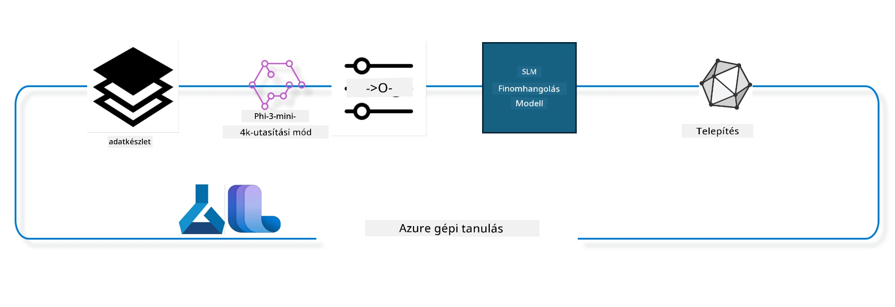

## Hogyan használjuk a chat-befejező komponenseket az Azure ML rendszerregiszteréből modell finomhangolására

Ebben a példában a Phi-3-mini-4k-instruct modellt finomhangoljuk egy beszélgetés befejezésére két ember között az ultrachat_200k adathalmaz segítségével.



A példa megmutatja, hogyan lehet finomhangolást végezni az Azure ML SDK és Python használatával, majd hogyan lehet az így finomhangolt modellt egy online végpontra telepíteni valós idejű következtetéshez.

### Tanító adatok

Az ultrachat_200k adathalmazt fogjuk használni. Ez az UltraChat adathalmaz erősen szűrt verziója, és a Zephyr-7B-β, egy csúcstechnológiás 7 milliárd paraméteres chatmodell képzéséhez használták.

### Modell

A Phi-3-mini-4k-instruct modellt fogjuk használni annak megmutatására, hogyan tud a felhasználó egy modellt finomhangolni chat-befejező feladatra. Ha egy adott modellkártyából nyitottad meg ezt a jegyzetfüzetet, ne felejtsd el pótolni a specifikus modell nevét.

### Feladatok

- Válassz ki egy modellt finomhangolásra.
- Válassz és vizsgáld meg a tanító adatokat.
- Konfiguráld a finomhangolási munkát.
- Futtasd a finomhangolási munkát.
- Tekintsd át a tanulási és értékelési metrikákat.
- Regisztráld a finomhangolt modellt.
- Telepítsd a finomhangolt modellt valós idejű következtetéshez.
- Tisztítsd meg az erőforrásokat.

## 1. Előfeltételek beállítása

- Telepítsd a függőségeket
- Csatlakozás az AzureML munkaterülethez. További tudnivalók az SDK-hitelesítés beállításánál. Cseréld le az alábbi <WORKSPACE_NAME>, <RESOURCE_GROUP> és <SUBSCRIPTION_ID> értékeket.
- Csatlakozás az azureml rendszerregiszterhez
- Állíts be egy opcionális kísérlet nevet
- Ellenőrizd vagy hozd létre a számítási erőforrást.

> [!NOTE]
> A követelmények szerint egyetlen GPU csomópont több GPU kártyát is tartalmazhat. Például egy Standard_NC24rs_v3 csomópontban 4 NVIDIA V100 GPU van, míg egy Standard_NC12s_v3 csomópontban 2 NVIDIA V100 GPU található. Ezzel kapcsolatos információkat a dokumentációban találsz. A csomópontonkénti GPU kártyák számát az alábbi gpus_per_node paraméter határozza meg. Ennek helyes beállítása biztosítja a node összes GPU-jának kihasználását. A javasolt GPU számítási SKU-k itt és itt érhetők el.

### Python könyvtárak

Telepítsd a függőségeket az alábbi cella futtatásával. Ez nem opcionális lépés új környezetben.


```bash
pip install azure-ai-ml
pip install azure-identity
pip install datasets==2.9.0
pip install mlflow
pip install azureml-mlflow
```

### Kapcsolódás az Azure ML-hez

1. Ez a Python szkript az Azure Machine Learning (Azure ML) szolgáltatással való interakcióra szolgál. A következőt végzi:

    - Beimportálja a szükséges modulokat az azure.ai.ml, azure.identity és azure.ai.ml.entities csomagokból. Emellett importálja az idő modult.

    - Megkísérli hitelesíteni magát a DefaultAzureCredential() segítségével, amely leegyszerűsíti a hitelesítést az Azure felhőben futó alkalmazások gyors fejlesztéséhez. Ha ez nem sikerül, az InteractiveBrowserCredential()-re vált, ami interaktív bejelentkezést biztosít.

    - Ezután megpróbál létrehozni egy MLClient példányt a from_config metódussal, ami az alapértelmezett konfigurációs fájlból (config.json) olvassa be a beállításokat. Ha ez nem sikerül, létrehoz egy MLClient példányt a megadott subscription_id, resource_group_name és workspace_name értékekkel.

    - Létrehoz egy másik MLClient példányt az Azure ML "azureml" nevű rendszerregiszteréhez, amelyben a modellek, a finomhangoló csővezetékek és környezetek vannak tárolva.

    - Beállítja az experiment_name értékét "chat_completion_Phi-3-mini-4k-instruct"-ra.

    - Egyedi időbélyeget generál az aktuális idő (másodpercben az epoch óta, lebegőpontos számként) visszaalakításával egész számmá, majd stringgé. Ezt az időbélyeget egyedi nevek és verziók létrehozásához lehet használni.

    ```python
    # Szükséges modulok importálása az Azure ML-ből és az Azure Identity-ból
    from azure.ai.ml import MLClient
    from azure.identity import (
        DefaultAzureCredential,
        InteractiveBrowserCredential,
    )
    from azure.ai.ml.entities import AmlCompute
    import time  # Idő modul importálása
    
    # Próbálj meg hitelesíteni DefaultAzureCredential használatával
    try:
        credential = DefaultAzureCredential()
        credential.get_token("https://management.azure.com/.default")
    except Exception as ex:  # Ha a DefaultAzureCredential nem működik, használd az InteractiveBrowserCredential-et
        credential = InteractiveBrowserCredential()
    
    # Próbálj meg egy MLClient példányt létrehozni az alapértelmezett konfigurációs fájl használatával
    try:
        workspace_ml_client = MLClient.from_config(credential=credential)
    except:  # Ha ez nem sikerül, hozz létre egy MLClient példányt manuálisan megadva az adatokat
        workspace_ml_client = MLClient(
            credential,
            subscription_id="<SUBSCRIPTION_ID>",
            resource_group_name="<RESOURCE_GROUP>",
            workspace_name="<WORKSPACE_NAME>",
        )
    
    # Hozz létre egy másik MLClient példányt az "azureml" nevű Azure ML registry-hez
    # Ez a registry az a hely, ahol a modellek, finomhangolási pipeline-ok és környezetek tárolódnak
    registry_ml_client = MLClient(credential, registry_name="azureml")
    
    # Állítsd be az kísérlet nevét
    experiment_name = "chat_completion_Phi-3-mini-4k-instruct"
    
    # Generálj egy egyedi időbélyeget, amely használható névként és verzióként, amelyeknek egyedinek kell lenniük
    timestamp = str(int(time.time()))
    ```

## 2. Válassz egy alapmodellt a finomhangoláshoz

1. A Phi-3-mini-4k-instruct egy 3,8 milliárd paraméteres, könnyű, korszerű, nyílt modell, amely azon adathalmazokon alapul, amelyeket a Phi-2-höz használtak. A modell a Phi-3 modellcsaládhoz tartozik, és a Mini verzió két változatban érhető el: 4K és 128K a támogatott kontextushossz (tokenekben). A modellt meg kell finomhangolni a specifikus célunkhoz. Ezeket a modelleket megtekintheted az AzureML Studio Modell katalógusában, a chat-befejező feladatra szűrve. Ebben a példában a Phi-3-mini-4k-instruct modellt használjuk. Ha ezt a jegyzetfüzetet más modellhez nyitottad meg, cseréld le a modell nevét és verzióját ennek megfelelően.

> [!NOTE]
> a modell azonosító tulajdonsága. Ezt adjuk majd át bemenetként a finomhangolási munkához. Ez elérhető az Asset ID mezőben is az AzureML Studio Modell katalógus modell részleteinél.

2. Ez a Python szkript az Azure Machine Learning (Azure ML) szolgáltatással működik együtt. A következőket végzi:

    - A modell nevét "Phi-3-mini-4k-instruct" értékre állítja.

    - A registry_ml_client objektum models tulajdonságának get metódusával lekéri a megadott nevű modell legfrissebb verzióját az Azure ML rendszerregiszterből. A get metódus két argumentummal hívódik: a modell nevével és egy címkével, amely azt jelzi, hogy a modell legújabb verzióját kérjük.

    - Kiír egy üzenetet a konzolra, amely tartalmazza a finomhangoláshoz használni kívánt modell nevét, verzióját és azonosítóját. A formátum metódus segítségével illeszti be a modell nevét, verzióját és azonosítóját az üzenetbe. Ezek az adatok a foundation_model objektum tulajdonságaiként érhetők el.

    ```python
    # Állítsa be a modell nevét
    model_name = "Phi-3-mini-4k-instruct"
    
    # Szerezze be a modell legújabb verzióját az Azure ML nyilvántartásból
    foundation_model = registry_ml_client.models.get(model_name, label="latest")
    
    # Nyomtassa ki a modell nevét, verzióját és azonosítóját
    # Ezek az információk hasznosak a nyomon követéshez és a hibakereséshez
    print(
        "\n\nUsing model name: {0}, version: {1}, id: {2} for fine tuning".format(
            foundation_model.name, foundation_model.version, foundation_model.id
        )
    )
    ```

## 3. Hozz létre egy számítási erőforrást a munka végrehajtásához

A finomhangolási munka CSAK GPU-s számítást használ. A számítás mérete attól függ, mekkora a modell, és sokszor nehéz megtalálni a megfelelő számítási kapacitást a munkához. Ebben a cellában útmutatást adunk a megfelelő számítás kiválasztásához.

> [!NOTE]
> Az alábbi számítások a legoptimálisabb konfigurációval működnek. A konfiguráció megváltoztatása CUDA Out Of Memory hibához vezethet. Ilyenkor próbáld meg nagyobb méretű számításra váltani.

> [!NOTE]
> Az alábbi compute_cluster_size kiválasztásakor győződj meg arról, hogy a szükséges számítás elérhető az erőforrás csoportodban. Ha egy adott számítás nem érhető el, kérj jogosultságot a hozzáféréshez.

### Modell támogatásának ellenőrzése finomhangoláshoz

1. Ez a Python szkript egy Azure Machine Learning (Azure ML) modellel működik együtt. A következőket teszi:

    - Importálja az ast modult, amely a Python absztrakt szintaxisfájának feldolgozására szolgáló függvényeket biztosít.

    - Ellenőrzi, hogy a foundation_model objektumnak (az Azure ML modell) van-e finetune_compute_allow_list nevű címkéje. Az Azure ML címkék kulcs-érték párok, amelyeket a modellek szűrésére és rendezésére használhatsz.

    - Ha van ilyen címke, az ast.literal_eval függvény segítségével biztonságosan elemzi a címke értékét (ami egy string), és listává alakítja, majd ezt a listát a computes_allow_list változóhoz rendeli. Ezután kiír egy üzenetet, hogy a számítást a listából kell létrehozni.

    - Ha nincs ilyen címke, a computes_allow_list None értéket kap, és egy üzenetet ír ki, hogy a címke nem található a modell címkéi között.

    - Összefoglalva, ez a szkript egy adott címkét ellenőriz a modell metaadataiban, a címke értékét listává alakítja ha van, és visszajelzést ad a felhasználónak.

    ```python
    # Importálja az ast modult, amely funkciókat biztosít a Python absztrakt szintaxis gráf fáinak feldolgozásához
    import ast
    
    # Ellenőrzi, hogy a 'finetune_compute_allow_list' címke jelen van-e a modell címkéi között
    if "finetune_compute_allow_list" in foundation_model.tags:
        # Ha a címke jelen van, az ast.literal_eval segítségével biztonságosan elemzi a címke értékét (egy karakterláncot) egy Python listává
        computes_allow_list = ast.literal_eval(
            foundation_model.tags["finetune_compute_allow_list"]
        )  # karakterlánc átalakítása python listává
        # Kiír egy üzenetet, amely jelzi, hogy egy számítást kell létrehozni a listából
        print(f"Please create a compute from the above list - {computes_allow_list}")
    else:
        # Ha a címke nem jelenik meg, a computes_allow_list értékét None-ra állítja
        computes_allow_list = None
        # Kiír egy üzenetet, amely jelzi, hogy a 'finetune_compute_allow_list' címke nincs a modell címkéi között
        print("`finetune_compute_allow_list` is not part of model tags")
    ```

### Számítási példány ellenőrzése

1. Ez a Python szkript az Azure Machine Learning (Azure ML) szolgáltatással működik és több ellenőrzést végez egy számítási példányon. A következőket teszi:

    - Megkísérli lekérni a compute_cluster nevű változóban tárolt névvel rendelkező számítási példányt az Azure ML munkaterületről. Ha a példány provisioning állapota "failed", hibát dob.

    - Ellenőrzi, hogy a computes_allow_list nem None-e. Ha nem, a lista összes számítási méretét kisbetűssé alakítja, és megvizsgálja, hogy a jelenlegi számítás mérete szerepel-e a listában. Ha nem, hibát dob.

    - Ha a computes_allow_list None, megnézi, hogy a számítási példány mérete szerepel-e az alábbi nem támogatott GPU VM méretek listájában. Ha igen, hibát dob.

    - Lekéri az összes elérhető számítási méret listáját a munkaterületen. Ezután bejárja a listát, és megvizsgálja, hogy létezik-e olyan számítási méret, amely megegyezik a jelenlegi példány méretével. Ha igen, lekéri az adott mérethez tartozó GPU-k számát, és gpu_count_found változó értékét True-ra állítja.

    - Ha gpu_count_found True, kiírja az adott példányban lévő GPU-k számát. Ha False, hibát dob.

    - Összefoglalva tehát ez a szkript több ellenőrzést hajt végre egy Azure ML munkaterületi számítási példányon, beleértve az állapotát, mérete illeszkedését egy engedélyezett vagy tiltó listára, valamint a GPU-k számát.

    
    ```python
    # Nyomtasd ki a kivétel üzenetét
    print(e)
    # Dobj ValueError-t, ha a számítási méret nem elérhető a munkaterületen
    raise ValueError(
        f"WARNING! Compute size {compute_cluster_size} not available in workspace"
    )
    
    # Szerezd be a számítási példányt az Azure ML munkaterületről
    compute = workspace_ml_client.compute.get(compute_cluster)
    # Ellenőrizd, hogy a számítási példány előkészítési állapota "failed"-e
    if compute.provisioning_state.lower() == "failed":
        # Dobj ValueError-t, ha az előkészítési állapot "failed"
        raise ValueError(
            f"Provisioning failed, Compute '{compute_cluster}' is in failed state. "
            f"please try creating a different compute"
        )
    
    # Ellenőrizd, hogy a computes_allow_list nem None-e
    if computes_allow_list is not None:
        # Alakítsd az összes számítási méretet, ami a computes_allow_list-ben van, kisbetűssé
        computes_allow_list_lower_case = [x.lower() for x in computes_allow_list]
        # Ellenőrizd, hogy a számítási példány mérete benne van-e a computes_allow_list_lower_case-ben
        if compute.size.lower() not in computes_allow_list_lower_case:
            # Dobj ValueError-t, ha a számítási példány mérete nincs benne a computes_allow_list_lower_case-ben
            raise ValueError(
                f"VM size {compute.size} is not in the allow-listed computes for finetuning"
            )
    else:
        # Definiálj egy listát a nem támogatott GPU VM méretekről
        unsupported_gpu_vm_list = [
            "standard_nc6",
            "standard_nc12",
            "standard_nc24",
            "standard_nc24r",
        ]
        # Ellenőrizd, hogy a számítási példány mérete benne van-e az unsupported_gpu_vm_list-ben
        if compute.size.lower() in unsupported_gpu_vm_list:
            # Dobj ValueError-t, ha a számítási példány mérete benne van az unsupported_gpu_vm_list-ben
            raise ValueError(
                f"VM size {compute.size} is currently not supported for finetuning"
            )
    
    # Inicializálj egy jelzőt annak megállapítására, hogy megtaláltad-e a GPU-k számát a számítási példányban
    gpu_count_found = False
    # Szerezd meg az összes elérhető számítási méret listáját a munkaterületen
    workspace_compute_sku_list = workspace_ml_client.compute.list_sizes()
    available_sku_sizes = []
    # Iterálj végig az elérhető számítási méretek listáján
    for compute_sku in workspace_compute_sku_list:
        available_sku_sizes.append(compute_sku.name)
        # Ellenőrizd, hogy a számítási méret neve megegyezik-e a számítási példány méretével
        if compute_sku.name.lower() == compute.size.lower():
            # Ha igen, szerezd meg a GPU-k számát az adott számítási mérethez, és állítsd a gpu_count_found értékét True-ra
            gpus_per_node = compute_sku.gpus
            gpu_count_found = True
    # Ha gpu_count_found True, írd ki a számítási példányban lévő GPU-k számát
    if gpu_count_found:
        print(f"Number of GPU's in compute {compute.size}: {gpus_per_node}")
    else:
        # Ha gpu_count_found False, dobj ValueError-t
        raise ValueError(
            f"Number of GPU's in compute {compute.size} not found. Available skus are: {available_sku_sizes}."
            f"This should not happen. Please check the selected compute cluster: {compute_cluster} and try again."
        )
    ```

## 4. Válasszuk ki az adathalmazt a modell finomhangolásához

1. Az ultrachat_200k adathalmazt használjuk. Az adathalmaz négy részből áll, amely alkalmas felügyelt finomhangolásra (sft).
Generáció rangsorolása (gen). Az egyes részekhez tartozó példák száma a következő:

    ```bash
    train_sft test_sft  train_gen  test_gen
    207865  23110  256032  28304
    ```

1. A következő néhány cella az alapvető adat-előkészítést mutatja be a finomhangoláshoz:

### Adatsorok megjelenítése

Azért, hogy ez a minta gyorsan fusson, a train_sft, test_sft fájlokat úgy mentjük el, hogy csak az már levágott sorok 5%-át tartalmazzák. Ez azt jelenti, hogy a finomhangolt modell pontossága alacsonyabb lesz, így nem használható éles környezetben.
A download-dataset.py szkript az ultrachat_200k adathalmaz letöltésére és feldolgozására szolgál finomhangoló csővezetéki alkatrész által fogyasztható formátumba. Mivel az adathalmaz nagy, itt csak egy részét használjuk.

1. Az alábbi szkript csak az adathalmaz 5%-át tölti le. Ez az érték a dataset_split_pc paraméterrel növelhető a kívánt százalékra.

> [!NOTE]
> Egyes nyelvi modellek különböző nyelvkódokat használnak, ezért az oszlopneveknek az adathalmazban ennek megfelelően kell tükrözniük ezt.

1. Íme egy példa arra, hogyan nézzen ki az adat
A chat-befejező adathalmaz parquet formátumban tárolódik, minden bejegyzés az alábbi séma szerint:

    - Ez egy JSON (JavaScript Object Notation) dokumentum, amely népszerű adatcsere formátum. Nem végrehajtható kód, hanem egy adat tárolási és átviveli mód. A szerkezete a következő:

    - "prompt": Ez a kulcs egy sztringet tartalmaz, amely egy AI-asszisztens felé tett feladatot vagy kérdést jelöl.

    - "messages": Ez a kulcs egy objektumokat tartalmazó tömböt tartalmaz. Minden objektum egy üzenetet jelöl egy felhasználó és egy AI-asszisztens közötti beszélgetésben. Minden üzenet objektumnak két kulcsa van:

    - "content": Ez a kulcs tartalmazza az üzenet tartalmát szövegként.
    - "role": Ez a kulcs jelzi, hogy az üzenetet milyen szerepben küldte az entitás; lehet "user" vagy "assistant".
    - "prompt_id": Ez a kulcs egyedi azonosítót tartalmaz a prompt számára.

1. Ebben a konkrét JSON dokumentumban egy beszélgetés látható, ahol a felhasználó egy AI-asszisztensnek egy disztópikus történet főszereplőjének létrehozását kéri. Az asszisztens válaszol, majd a felhasználó további részleteket kér. Az asszisztens beleegyezik a részletesebb információk megadásába. Az egész beszélgetés egy adott prompt azonosítóhoz tartozik.

    ```python
    {
        // The task or question posed to an AI assistant
        "prompt": "Create a fully-developed protagonist who is challenged to survive within a dystopian society under the rule of a tyrant. ...",
        
        // An array of objects, each representing a message in a conversation between a user and an AI assistant
        "messages":[
            {
                // The content of the user's message
                "content": "Create a fully-developed protagonist who is challenged to survive within a dystopian society under the rule of a tyrant. ...",
                // The role of the entity that sent the message
                "role": "user"
            },
            {
                // The content of the assistant's message
                "content": "Name: Ava\n\n Ava was just 16 years old when the world as she knew it came crashing down. The government had collapsed, leaving behind a chaotic and lawless society. ...",
                // The role of the entity that sent the message
                "role": "assistant"
            },
            {
                // The content of the user's message
                "content": "Wow, Ava's story is so intense and inspiring! Can you provide me with more details.  ...",
                // The role of the entity that sent the message
                "role": "user"
            }, 
            {
                // The content of the assistant's message
                "content": "Certainly! ....",
                // The role of the entity that sent the message
                "role": "assistant"
            }
        ],
        
        // A unique identifier for the prompt
        "prompt_id": "d938b65dfe31f05f80eb8572964c6673eddbd68eff3db6bd234d7f1e3b86c2af"
    }
    ```

### Adatok letöltése

1. Ez a Python szkript egy letöltő segédprogram, a download-dataset.py futtatására szolgál az adathalmaz letöltéséhez. A következőket teszi:

    - Importálja az os modult, amely hordozható módot kínál az operációs rendszer függő funkcióinak használatára.

    - Az os.system függvényt használja a download-dataset.py szkript futtatásához a shellben, a következő parancssori argumentumokkal: az adathalmaz neve (HuggingFaceH4/ultrachat_200k), a letöltési könyvtár (ultrachat_200k_dataset), és a megosztandó adathalmaz százaléka (5). Az os.system visszatérési értéke a parancs kilépési státusza, amit az exit_status változóban tárol.

    - Ellenőrzi, hogy az exit_status nem 0-e. Unix-szerű rendszereken a 0 az sikeres futást jelez, más érték hibát. Ha az exit_status nem 0, kivételt dob, amely jelzi, hogy hiba történt az adathalmaz letöltése során.

    - Összefoglalva, ez a szkript egy segédprogram futtatásával tölti le az adathalmazt, és hibát jelez, ha a letöltés nem sikerül.
    
    ```python
    # Importálja az os modult, amely lehetőséget biztosít az operációs rendszer függő funkcionalitás használatára
    import os
    
    # Használja az os.system függvényt a download-dataset.py szkript futtatására a shellben specifikus parancssori argumentumokkal
    # Az argumentumok megadják a letöltendő adatkészletet (HuggingFaceH4/ultrachat_200k), a letöltési könyvtárat (ultrachat_200k_dataset) és az adatkészlet felosztásának százalékát (5)
    # Az os.system függvény visszaadja a végrehajtott parancs kilépési státuszát; ezt a státuszt az exit_status változóban tárolja
    exit_status = os.system(
        "python ./download-dataset.py --dataset HuggingFaceH4/ultrachat_200k --download_dir ultrachat_200k_dataset --dataset_split_pc 5"
    )
    
    # Ellenőrizze, hogy az exit_status nem 0-e
    # Unix-szerű operációs rendszerekben a 0 kilépési státusz általában sikeres parancsot jelez, míg bármely más szám hibát jelent
    # Ha az exit_status nem 0, dobjon kivételt egy üzenettel, amely jelzi, hogy hiba történt az adatkészlet letöltése során
    if exit_status != 0:
        raise Exception("Error downloading dataset")
    ```

### Az adatok betöltése DataFrame-be
1. Ez a Python szkript egy JSON Lines fájlt tölt be egy pandas DataFrame-be, és megjeleníti az első 5 sort. Íme, mit csinál pontosan:

    - Importálja a pandas könyvtárat, amely egy erőteljes adatmanipulációs és elemző könyvtár.

    - Beállítja a pandas megjelenítési opcióinak maximális oszlopszélességét 0-ra. Ez azt jelenti, hogy az egyes oszlopok teljes szövege megjelenik, levágás nélkül, amikor a DataFrame kiírásra kerül.

    - A pd.read_json függvényt használja, hogy betöltse az ultrachat_200k_dataset könyvtárban található train_sft.jsonl fájlt egy DataFrame-be. A lines=True argumentum jelzi, hogy a fájl JSON Lines formátumban van, ahol minden sor egy külön JSON objektum.

    - A head metódust használja, hogy megjelenítse a DataFrame első 5 sorát. Ha kevesebb mint 5 sor van a DataFrame-ben, akkor az összeset megjeleníti.

    - Összefoglalva, ez a szkript betölt egy JSON Lines fájlt DataFrame-be és megjeleníti az első 5 sort a teljes oszlopszöveggel.
    
    ```python
    # Importáld a pandas könyvtárat, amely egy erőteljes adatmanipulációs és elemző könyvtár
    import pandas as pd
    
    # Állítsd be a pandas megjelenítési opcióinak maximális oszlopszélességét 0-ra
    # Ez azt jelenti, hogy a DataFrame kiírásakor minden oszlop teljes szövege truncálás nélkül jelenik meg
    pd.set_option("display.max_colwidth", 0)
    
    # Használd a pd.read_json függvényt, hogy betöltsd a train_sft.jsonl fájlt az ultrachat_200k_dataset könyvtárból egy DataFrame-be
    # A lines=True argumentum azt jelzi, hogy a fájl JSON Lines formátumú, ahol minden sor egy külön JSON objektum
    df = pd.read_json("./ultrachat_200k_dataset/train_sft.jsonl", lines=True)
    
    # Használd a head metódust, hogy megjelenítsd a DataFrame első 5 sorát
    # Ha a DataFrame kevesebb, mint 5 sort tartalmaz, akkor az összes sort megjeleníti
    df.head()
    ```

## 5. A finomhangolási munkafolyamat benyújtása a modell és adatok bemenetként való használatával

Hozd létre azt a munkát, amely a chat-completion pipeline komponenst használja. Tudj meg többet az összes finomhangoláshoz támogatott paraméterről.

### Finomhangolási paraméterek meghatározása

1. A finomhangolási paraméterek két kategóriába sorolhatók - képzési paraméterek és optimalizálási paraméterek.

1. A képzési paraméterek meghatározzák a képzés aspektusait, például -

    - Az optimalizáló és az ütemező, amelyet használni kell
    - A finomhangolás optimalizálására szolgáló metrika
    - A képzési lépések száma, a batch méret stb.
    - Az optimalizálási paraméterek segítenek a GPU memória optimalizálásában és a számítási erőforrások hatékony használatában.

1. Az alábbiakban néhány olyan paraméter található, amelyek ehhez a kategóriához tartoznak. Az optimalizálási paraméterek modellfüggőek, és a modellhez csomagolva kezelik ezeket az eltéréseket.

    - DeepSpeed és LoRA engedélyezése
    - Vegyes precizitású képzés engedélyezése
    - Többcsomópontos (multi-node) képzés engedélyezése

> [!NOTE]
> A felügyelt finomhangolás esetén előfordulhat, hogy az összehangoltság elveszik vagy katasztrofális felejtés következik be. Javasoljuk, hogy ezt ellenőrizd és futtass összehangolási lépést a finomhangolás után.

### Finomhangolási paraméterek

1. Ez a Python szkript finomhangolási paramétereket állít be egy gépi tanuló modellhez. Íme, mit csinál pontosan:

    - Alapértelmezett képzési paramétereket állít be, például az epochok számát, a tanulási és értékelési batch méreteket, a tanulási rátát és a tanulási ráta ütemező típusát.

    - Alapértelmezett optimalizálási paramétereket állít be, például hogy alkalmaz-e Layer-wise Relevance Propagation-t (LoRa) és DeepSpeed-et, valamint a DeepSpeed szakaszát.

    - Egyesíti a képzési és optimalizálási paramétereket egyetlen szótárba, finetune_parameters néven.

    - Ellenőrzi, hogy a foundation_model tartalmaz-e modell-specifikus alapértelmezett paramétereket. Ha igen, figyelmeztető üzenetet ír ki, és frissíti a finetune_parameters szótárt ezekkel a modellekhez kötött alapértelmezettekkel. Az ast.literal_eval függvényt használja, hogy a model-specifikus alapértelmezett értékeket sztringből Python szótárrá alakítsa.

    - Kiírja a futtatáshoz használatos végső finomhangolási paramétereket.

    - Összefoglalva, ez a szkript beállítja és megjeleníti egy gépi tanuló modell finomhangolási paramétereit, lehetőséget adva a modell-specifikus alapértelmezettekkel való felülírásra.

    ```python
    # Állítsa be az alapértelmezett tanulási paramétereket, például a tanulási epochok számát, a tanulási és értékelési batch méreteket, a tanulási rátát és a tanulási ráta ütemező típusát
    training_parameters = dict(
        num_train_epochs=3,
        per_device_train_batch_size=1,
        per_device_eval_batch_size=1,
        learning_rate=5e-6,
        lr_scheduler_type="cosine",
    )
    
    # Állítsa be az alapértelmezett optimalizációs paramétereket, például hogy alkalmazza-e a Layer-wise Relevance Propagation (LoRa) és a DeepSpeed-ot, valamint a DeepSpeed szakaszt
    optimization_parameters = dict(
        apply_lora="true",
        apply_deepspeed="true",
        deepspeed_stage=2,
    )
    
    # Egyesítse a tanulási és optimalizációs paramétereket egy finetune_parameters nevű szótárba
    finetune_parameters = {**training_parameters, **optimization_parameters}
    
    # Ellenőrizze, hogy a foundation_model rendelkezik-e bármilyen modell-specifikus alapértelmezett paraméterrel
    # Ha igen, írjon ki egy figyelmeztető üzenetet, és frissítse a finetune_parameters szótárt ezekkel a modell-specifikus alapértelmezettekkel
    # Az ast.literal_eval függvény használatos a modell-specifikus alapértelmezett értékek szövegből Python szótárrá való konvertálására
    if "model_specific_defaults" in foundation_model.tags:
        print("Warning! Model specific defaults exist. The defaults could be overridden.")
        finetune_parameters.update(
            ast.literal_eval(  # konvertálja a sztringet Python szótárrá
                foundation_model.tags["model_specific_defaults"]
            )
        )
    
    # Írja ki a végső finomhangolási paramétereket, amelyeket a futtatáshoz használnak
    print(
        f"The following finetune parameters are going to be set for the run: {finetune_parameters}"
    )
    ```

### Képzési folyamat

1. Ez a Python szkript egy függvényt definiál, amely megjelenítési nevet generál egy gépi tanulási képzési munkafolyamathoz, majd meghívja ezt a függvényt, hogy létrehozza és kiírja a megjelenítési nevet. Íme, mit csinál pontosan:

1. Definiálja a get_pipeline_display_name függvényt. Ez a függvény egy megjelenítési nevet állít elő különböző, a képzési folyamat paramétereitől függően.

1. A függvényen belül kiszámolja az össz-batch méretet úgy, hogy megszorozza az eszközönkénti batch méretet, a gradiens akumulációs lépések számát, az egy csomópont alatt lévő GPU-k számát és a finomhangoláshoz használt csomópontok számát.

1. Lekéri a tanulási ráta ütemező típusát, hogy használják-e a DeepSpeed-et, a DeepSpeed szakaszát, hogy használják-e a Layer-wise Relevance Propagation-t (LoRa), a megtartandó modell ellenőrzőpontok számának korlátját, és a maximális szekvencia hosszát.

1. Létrehoz egy sztringet, amely tartalmazza ezeket a paramétereket, kötőjellel elválasztva. Ha használják a DeepSpeed-et vagy LoRa-t, a sztring tartalmazza a "ds" kifejezést a DeepSpeed szakaszával vagy "lora"-t. Ha nem, akkor "nods" vagy "nolora" szerepel.

1. A függvény visszaadja ezt a sztringet, amely a képzési pipeline megjelenítési neveként szolgál.

1. A függvény definiálása után meghívja azt, létrehozza a megjelenítési nevet, majd kiírja.

1. Összefoglalva, ez a szkript egy gépi tanuló képzési pipeline megjelenítési nevét generálja különböző paraméterek alapján, majd kiírja ezt a nevet.

    ```python
    # Definiálj egy függvényt a tanítási folyamat megjelenítendő nevének generálására
    def get_pipeline_display_name():
        # Számítsd ki az összesített batch méretet az eszközönkénti batch méret, a gradiens akkumulációs lépések száma, a node-onkénti GPU-k száma és az apróhangoláshoz használt node-ok számának szorzataként
        batch_size = (
            int(finetune_parameters.get("per_device_train_batch_size", 1))
            * int(finetune_parameters.get("gradient_accumulation_steps", 1))
            * int(gpus_per_node)
            * int(finetune_parameters.get("num_nodes_finetune", 1))
        )
        # Szerezd meg a tanulási ráta ütemező típusát
        scheduler = finetune_parameters.get("lr_scheduler_type", "linear")
        # Szerezd meg, hogy alkalmazva van-e a DeepSpeed
        deepspeed = finetune_parameters.get("apply_deepspeed", "false")
        # Szerezd meg a DeepSpeed színpadát
        ds_stage = finetune_parameters.get("deepspeed_stage", "2")
        # Ha a DeepSpeed alkalmazva van, akkor a megjelenítendő névben szerepeljen a "ds" a DeepSpeed színpadával; ha nem, akkor legyen "nods"
        if deepspeed == "true":
            ds_string = f"ds{ds_stage}"
        else:
            ds_string = "nods"
        # Szerezd meg, hogy alkalmazzák-e a rétegenkénti relevancia propagálást (LoRa)
        lora = finetune_parameters.get("apply_lora", "false")
        # Ha alkalmazva van a LoRa, akkor a megjelenítendő névben szerepeljen a "lora"; ha nem, akkor legyen "nolora"
        if lora == "true":
            lora_string = "lora"
        else:
            lora_string = "nolora"
        # Szerezd meg a modell mentések megtartásának korlátját
        save_limit = finetune_parameters.get("save_total_limit", -1)
        # Szerezd meg a maximális szekvencia hosszúságot
        seq_len = finetune_parameters.get("max_seq_length", -1)
        # Készítsd el a megjelenítendő nevet az összes paraméter kötőjellel elválasztott összefűzésével
        return (
            model_name
            + "-"
            + "ultrachat"
            + "-"
            + f"bs{batch_size}"
            + "-"
            + f"{scheduler}"
            + "-"
            + ds_string
            + "-"
            + lora_string
            + f"-save_limit{save_limit}"
            + f"-seqlen{seq_len}"
        )
    
    # Hívd meg a függvényt a megjelenítendő név generálására
    pipeline_display_name = get_pipeline_display_name()
    # Írd ki a megjelenítendő nevet
    print(f"Display name used for the run: {pipeline_display_name}")
    ```

### Pipeline konfigurálása

Ez a Python szkript egy gépi tanulási pipeline-t definiál és konfigurál az Azure Machine Learning SDK segítségével. Íme, mit csinál pontosan:

1. Importálja az Azure AI ML SDK szükséges moduljait.

1. Lekéri a "chat_completion_pipeline" nevű pipeline komponenst a regiszterből.

1. Definiál egy pipeline munkát a `@pipeline` dekorátorral és a `create_pipeline` függvénnyel. A pipeline neve `pipeline_display_name` lesz.

1. A `create_pipeline` függvényen belül inicializálja a lekért pipeline komponenst több paraméterrel, beleértve a modell elérési útját, a különböző szakaszokhoz tartozó számítási klasztereket, a képzési és tesztelési adathalmazi részeket, a finomhangoláshoz használandó GPU-k számát és egyéb finomhangolási paramétereket.

1. Leképezi a finomhangolási munka kimenetét a pipeline munka kimenetére, hogy a finomhangolt modellt könnyen lehessen regisztrálni, ami szükséges a modell online vagy batch végpontra történő telepítéséhez.

1. Létrehozza a pipeline példányát a `create_pipeline` függvény meghívásával.

1. Beállítja a pipeline `force_rerun` opcióját `True` értékre, vagyis az előző munkák előző eredményei nem kerülnek felhasználásra.

1. Beállítja a pipeline `continue_on_step_failure` opcióját `False` értékre, ami azt jelenti, hogy ha bármelyik lépés hibázik, a pipeline megáll.

1. Összefoglalva, ez a szkript egy Azure Machine Learning SDK-val definiál és konfigurál egy gépi tanulási pipeline-t egy chat befejező feladathoz.

    ```python
    # Szükséges modulok importálása az Azure AI ML SDK-ból
    from azure.ai.ml.dsl import pipeline
    from azure.ai.ml import Input
    
    # A "chat_completion_pipeline" nevű pipeline komponenst lekéri a regisztrációból
    pipeline_component_func = registry_ml_client.components.get(
        name="chat_completion_pipeline", label="latest"
    )
    
    # A pipeline munkafolyamat definiálása az @pipeline dekorátorral és a create_pipeline függvénnyel
    # A pipeline neve a pipeline_display_name változóra van állítva
    @pipeline(name=pipeline_display_name)
    def create_pipeline():
        # A lekért pipeline komponenst inicializáljuk különböző paraméterekkel
        # Ezek közé tartozik a modell útvonala, a különböző fázisokhoz tartozó számítási klaszterek, az edzéshez és teszthez használt adatbeli megosztások, a finomhangoláshoz használt GPU-k száma és egyéb finomhangolási paraméterek
        chat_completion_pipeline = pipeline_component_func(
            mlflow_model_path=foundation_model.id,
            compute_model_import=compute_cluster,
            compute_preprocess=compute_cluster,
            compute_finetune=compute_cluster,
            compute_model_evaluation=compute_cluster,
            # Az adatbeli megosztások hozzárendelése a paraméterekhez
            train_file_path=Input(
                type="uri_file", path="./ultrachat_200k_dataset/train_sft.jsonl"
            ),
            test_file_path=Input(
                type="uri_file", path="./ultrachat_200k_dataset/test_sft.jsonl"
            ),
            # Edzési beállítások
            number_of_gpu_to_use_finetuning=gpus_per_node,  # Beállítva a számítási erőforrásban elérhető GPU-k számára
            **finetune_parameters
        )
        return {
            # A finomhangoló munka kimenetének hozzárendelése a pipeline munka kimenetéhez
            # Ezt azért tesszük, hogy könnyen regisztrálhassuk a finomhangolt modellt
            # A modell regisztrálása szükséges a modell online vagy kötegelt végpontra történő telepítéséhez
            "trained_model": chat_completion_pipeline.outputs.mlflow_model_folder
        }
    
    # A pipeline példányosítása a create_pipeline függvény meghívásával
    pipeline_object = create_pipeline()
    
    # Ne használjuk a korábbi munkák gyorsítótárazott eredményeit
    pipeline_object.settings.force_rerun = True
    
    # Állítsuk be a lépéshibánál folytatást hamisra
    # Ez azt jelenti, hogy a pipeline megáll, ha bármelyik lépés hibát jelez
    pipeline_object.settings.continue_on_step_failure = False
    ```

### Munkafolyamat benyújtása

1. Ez a Python szkript egy gépi tanulási pipeline munkát ad be egy Azure Machine Learning munkaterületre, majd várja a munka befejeződését. Íme, mit csinál pontosan:

    - Meghívja a workspace_ml_client jobs objektumának create_or_update metódusát, hogy beadja a pipeline munkát. A futtatandó pipeline a pipeline_object, a kísérlet neve pedig az experiment_name.

    - Ezután meghívja a jobs objektum stream metódusát, hogy várja a pipeline munka befejeződését. A várakozandó munka a pipeline_job objektum name attribútuma.

    - Összefoglalva, ez a szkript egy gépi tanulási pipeline munkát ad be egy Azure Machine Learning munkaterületre, majd vár a munka befejeződésére.

    ```python
    # Küldje be a pipeline munkát az Azure Machine Learning munkaterületre
    # A futtatandó pipeline-t a pipeline_object határozza meg
    # A kísérlet, amely alatt a munkát futtatják, az experiment_name által van meghatározva
    pipeline_job = workspace_ml_client.jobs.create_or_update(
        pipeline_object, experiment_name=experiment_name
    )
    
    # Várjon a pipeline munka befejeződésére
    # A várakozandó munkát a pipeline_job objektum name attribútuma határozza meg
    workspace_ml_client.jobs.stream(pipeline_job.name)
    ```

## 6. A finomhangolt modell regisztrálása a munkaterületen

A finomhangolási munkából származó modellt regisztrálni fogjuk. Ez nyomon követi a kapcsolatot a finomhangolt modell és a finomhangolási munka között. A finomhangolási munka pedig megőrzi a kapcsolatot az alapmodelltől, az adathalmaztól és a képzési kódtól.

### Az ML modell regisztrálása

1. Ez a Python szkript regisztrál egy gépi tanulási modellt, amelyet az Azure Machine Learning pipeline-jában treníroztak. Íme, mit csinál pontosan:

    - Importálja az Azure AI ML SDK szükséges moduljait.

    - Ellenőrzi, hogy a pipeline munkából elérhető-e a trained_model kimenet a workspace_ml_client jobs get metódusával, majd kimenetének outputs attribútumán keresztül.

    - Összeállít egy útvonalat a trained modellhez a pipeline munka neve és a kimenet neve ("trained_model") alapján.

    - Definiál egy nevet a finomhangolt modellhez az eredeti modellnévhez hozzáfűzve a "-ultrachat-200k" végződést, az esetleges perjeleket kötőjelekkel helyettesítve.

    - Előkészíti a modell regisztrálását egy Model objektum létrehozásával, beállítva több paramétert, beleértve az útvonalat, a modell típusát (MLflow modell), a nevet, a verziót és egy leírást.

    - Regisztrálja a modellt a workspace_ml_client models create_or_update metódusával a Model objektummal argumentumként.

    - Kiírja a regisztrált modellt.

1. Összefoglalva, ez a szkript regisztrál egy Azure Machine Learning pipeline-ban betanított gépi tanulási modellt.
    
    ```python
    # Szükséges modulok importálása az Azure AI ML SDK-ból
    from azure.ai.ml.entities import Model
    from azure.ai.ml.constants import AssetTypes
    
    # Ellenőrizze, hogy a `trained_model` kimenet elérhető-e a pipeline munkából
    print("pipeline job outputs: ", workspace_ml_client.jobs.get(pipeline_job.name).outputs)
    
    # Útvonal létrehozása a betanított modellhez úgy, hogy a pipeline munka nevét és a "trained_model" kimenet nevét egy formázott stringbe helyezi
    model_path_from_job = "azureml://jobs/{0}/outputs/{1}".format(
        pipeline_job.name, "trained_model"
    )
    
    # Finomhangolt modell nevének meghatározása úgy, hogy az eredeti modellnévhez hozzáfűzi a "-ultrachat-200k" végződést és a perjeleket kötőjelekre cseréli
    finetuned_model_name = model_name + "-ultrachat-200k"
    finetuned_model_name = finetuned_model_name.replace("/", "-")
    
    print("path to register model: ", model_path_from_job)
    
    # A modell regisztrálására való előkészület egy Model objektum létrehozásával különböző paraméterekkel
    # Ezek közé tartozik a modell útvonala, a modell típusa (MLflow modell), a modell neve és verziója, valamint a modell leírása
    prepare_to_register_model = Model(
        path=model_path_from_job,
        type=AssetTypes.MLFLOW_MODEL,
        name=finetuned_model_name,
        version=timestamp,  # Verzióütközés elkerülése érdekében időbélyeg használata verzióként
        description=model_name + " fine tuned model for ultrachat 200k chat-completion",
    )
    
    print("prepare to register model: \n", prepare_to_register_model)
    
    # A modell regisztrálása azzal, hogy meghívja a workspace_ml_client models objektumának create_or_update metódusát a Model objektummal argumentumként
    registered_model = workspace_ml_client.models.create_or_update(
        prepare_to_register_model
    )
    
    # A regisztrált modell kiíratása
    print("registered model: \n", registered_model)
    ```

## 7. A finomhangolt modell telepítése online végpontra

Az online végpont tartós REST API-t biztosít, amely segítségével a modell integrálható az alkalmazásokkal.

### Végpont kezelése

1. Ez a Python szkript egy kezelendő online végpontot hoz létre az Azure Machine Learning-ben egy regisztrált modellhez. Íme, mit csinál pontosan:

    - Importálja az Azure AI ML SDK szükséges moduljait.

    - Egy egyedi nevet definiál az online végpontnak, amely az "ultrachat-completion-" sztringhez egy időbélyeget csatol.

    - Előkészíti az online végpont létrehozását egy ManagedOnlineEndpoint objektum létrehozásával, beállítva több paramétert, mint a végpont neve, leírása és az autentikációs mód ("key").

    - Létrehozza az online végpontot a workspace_ml_client begin_create_or_update metódusának meghívásával a ManagedOnlineEndpoint objektummal, majd megvárja a művelet befejeződését a wait metódussal.

1. Összefoglalva, ez a szkript egy kezelendő online végpontot hoz létre az Azure Machine Learning-ben egy regisztrált modellhez.

    ```python
    # Szükséges modulok importálása az Azure AI ML SDK-ból
    from azure.ai.ml.entities import (
        ManagedOnlineEndpoint,
        ManagedOnlineDeployment,
        ProbeSettings,
        OnlineRequestSettings,
    )
    
    # Egyedi név definiálása az online végpont számára az "ultrachat-completion-" szöveghez időbélyegző hozzáfűzésével
    online_endpoint_name = "ultrachat-completion-" + timestamp
    
    # Az online végpont létrehozására való előkészítés egy ManagedOnlineEndpoint objektum létrehozásával különböző paraméterekkel
    # Ezek közé tartozik a végpont neve, a végpont leírása és az autentikációs mód ("key")
    endpoint = ManagedOnlineEndpoint(
        name=online_endpoint_name,
        description="Online endpoint for "
        + registered_model.name
        + ", fine tuned model for ultrachat-200k-chat-completion",
        auth_mode="key",
    )
    
    # Az online végpont létrehozása a workspace_ml_client begin_create_or_update metódusának meghívásával, a ManagedOnlineEndpoint objektumot argumentumként adva át
    # Ezután várakozás a létrehozási művelet befejezésére a wait metódus meghívásával
    workspace_ml_client.begin_create_or_update(endpoint).wait()
    ```

> [!NOTE]
> Itt található a telepítés támogatott SKU-inak listája - [Managed online endpoints SKU list](https://learn.microsoft.com/azure/machine-learning/reference-managed-online-endpoints-vm-sku-list)

### ML modell telepítése

1. Ez a Python szkript egy regisztrált gépi tanulási modellt telepít egy kezelt online végpontra az Azure Machine Learning-ben. Íme, mit csinál pontosan:

    - Importálja az ast modult, amely a Python absztrakt szintaxisfájának feldolgozásához nyújt függvényeket.

    - Beállítja a telepítési példány típusát "Standard_NC6s_v3"-ra.

    - Ellenőrzi, hogy a foundation_model tartalmazza-e az inference_compute_allow_list címkét. Ha igen, a címke értékét sztringből Python listává konvertálja, és hozzárendeli az inference_computes_allow_list változóhoz. Ha nem, akkor None-ra állítja.

    - Megvizsgálja, hogy a megadott példánytípus az engedélyezett listán van-e. Ha nincs, üzenetet ír ki, hogy válasszon példánytípust az engedélyezett listából.

    - Előkészíti a telepítést, egy ManagedOnlineDeployment objektum létrehozásával, több paraméterrel, beleértve a telepítés nevét, a végpont nevét, a modellazonosítót, a példány típusát és számát, élőellenőrző beállításokat és kéréskezelési beállításokat.

    - Létrehozza a telepítést a workspace_ml_client begin_create_or_update metódusának meghívásával a ManagedOnlineDeployment objektummal, majd vár a művelet befejeződésére a wait metódussal.

    - Beállítja, hogy a végpont a forgalom 100%-át a "demo" telepítéshez irányítsa.

    - Frissíti a végpontot a workspace_ml_client begin_create_or_update metódusának meghívásával a végpont objektummal, majd megvárja a frissítés eredményét a result metódussal.

1. Összefoglalva, ez a szkript egy regisztrált gépi tanulási modellt telepít egy kezelt online végpontra az Azure Machine Learning-ben.

    ```python
    # Importálja az ast modult, amely függvényeket biztosít a Python absztrakt szintaxis fáinak feldolgozásához
    import ast
    
    # Beállítja a telepítéshez használt példány típust
    instance_type = "Standard_NC6s_v3"
    
    # Ellenőrzi, hogy a `inference_compute_allow_list` címke jelen van-e az alapmodellben
    if "inference_compute_allow_list" in foundation_model.tags:
        # Ha igen, akkor a címke értékét sztringből Python listává alakítja, és hozzárendeli az `inference_computes_allow_list`-hez
        inference_computes_allow_list = ast.literal_eval(
            foundation_model.tags["inference_compute_allow_list"]
        )
        print(f"Please create a compute from the above list - {computes_allow_list}")
    else:
        # Ha nem, akkor az `inference_computes_allow_list` értékét `None`-ra állítja
        inference_computes_allow_list = None
        print("`inference_compute_allow_list` is not part of model tags")
    
    # Ellenőrzi, hogy a megadott példány típus szerepel-e az engedélyezett listán
    if (
        inference_computes_allow_list is not None
        and instance_type not in inference_computes_allow_list
    ):
        print(
            f"`instance_type` is not in the allow listed compute. Please select a value from {inference_computes_allow_list}"
        )
    
    # Előkészíti a telepítést egy `ManagedOnlineDeployment` objektum létrehozásával különböző paraméterekkel
    demo_deployment = ManagedOnlineDeployment(
        name="demo",
        endpoint_name=online_endpoint_name,
        model=registered_model.id,
        instance_type=instance_type,
        instance_count=1,
        liveness_probe=ProbeSettings(initial_delay=600),
        request_settings=OnlineRequestSettings(request_timeout_ms=90000),
    )
    
    # Létrehozza a telepítést azzal, hogy meghívja a `workspace_ml_client` `begin_create_or_update` metódusát a `ManagedOnlineDeployment` objektummal argumentumként
    # Ezután vár a létrehozási művelet befejeződésére a `wait` metódus hívásával
    workspace_ml_client.online_deployments.begin_create_or_update(demo_deployment).wait()
    
    # Beállítja a végpont forgalmát úgy, hogy a forgalom 100%-át a "demo" telepítésre irányítsa
    endpoint.traffic = {"demo": 100}
    
    # Frissíti a végpontot azzal, hogy meghívja a `workspace_ml_client` `begin_create_or_update` metódusát az `endpoint` objektummal argumentumként
    # Ezután vár a frissítési művelet befejeződésére a `result` metódus hívásával
    workspace_ml_client.begin_create_or_update(endpoint).result()
    ```

## 8. A végpont tesztelése mintaadatokkal

Betöltünk néhány mintát a teszt adathalmazból, majd beküldjük az online végpontra inferenciára. Ezután megjelenítjük az előrejelzett címkéket a tényleges címkékkel összehasonlítva.

### Az eredmények olvasása

1. Ez a Python szkript egy JSON Lines fájlt tölt be pandas DataFrame-be, véletlenszerű mintát vesz és visszaállítja a indexet. Íme, mit csinál pontosan:

    - Beolvassa a ./ultrachat_200k_dataset/test_gen.jsonl fájlt egy pandas DataFrame-be. A read_json függvényt a lines=True argumentummal használja, mert a fájl JSON Lines formátumú, ahol minden sor egy külön JSON objektum.

    - Véletlenszerűen kiválaszt 1 sort a DataFrame-ből. A sample függvényt n=1 argumentummal hívja, hogy meghatározza az elemek számát.

    - Visszaállítja a DataFrame indexét. A reset_index függvényt drop=True argumentummal használja, hogy az eredeti indexet eldobja és alapértelmezett egész szám indexet hozzon létre.

    - Megjeleníti a DataFrame első 2 sorát a head(2) függvénnyel, de mivel csak 1 sor marad a mintavétel után, csak ezt az egy sort fogja megjeleníteni.

1. Összefoglalva, ez a szkript betölt egy JSON Lines fájlt pandas DataFrame-be, véletlenszerűen kivesz 1 sort, visszaállítja az indexet, majd megjeleníti az első sort.
    
    ```python
    # Pandas könyvtár importálása
    import pandas as pd
    
    # A JSON Lines fájl './ultrachat_200k_dataset/test_gen.jsonl' beolvasása egy pandas DataFrame-be
    # A 'lines=True' argumentum azt jelzi, hogy a fájl JSON Lines formátumú, ahol minden sor egy külön JSON objektum
    test_df = pd.read_json("./ultrachat_200k_dataset/test_gen.jsonl", lines=True)
    
    # Véletlenszerű mintavétel 1 sorból a DataFrame-ből
    # Az 'n=1' argumentum megadja a kiválasztandó véletlenszerű sorok számát
    test_df = test_df.sample(n=1)
    
    # A DataFrame indexének visszaállítása
    # A 'drop=True' argumentum azt jelzi, hogy az eredeti indexet el kell dobni, és egy új alapértelmezett egész értékű index kerül beállításra
    # Az 'inplace=True' argumentum azt jelzi, hogy a DataFrame módosítása helyben történjen (új objektum létrehozása nélkül)
    test_df.reset_index(drop=True, inplace=True)
    
    # A DataFrame első 2 sorának megjelenítése
    # Mivel azonban a mintavétel után csak egy sor van a DataFrame-ben, ez csak azt az egy sort fogja megjeleníteni
    test_df.head(2)
    ```

### JSON objektum létrehozása
1. Ez a Python szkript létrehoz egy JSON objektumot meghatározott paraméterekkel, és elmenti egy fájlba. Íme egy bontás, hogy mit csinál:

    - Importálja a json modult, amely funkciókat biztosít a JSON adatok kezeléséhez.

    - Létrehoz egy parameters szótárat kulcsokkal és értékekkel, amelyek egy gépi tanulási modell paramétereit képviselik. A kulcsok a "temperature", "top_p", "do_sample" és "max_new_tokens", a hozzájuk tartozó értékek pedig rendre 0.6, 0.9, True és 200.

    - Létrehoz egy másik test_json szótárat két kulccsal: "input_data" és "params". Az "input_data" értéke egy újabb szótár, amelynek kulcsai "input_string" és "parameters". Az "input_string" értéke egy lista, amely tartalmazza a test_df DataFrame első üzenetét. A "parameters" értéke a korábban létrehozott parameters szótár. A "params" értéke egy üres szótár.

    - Megnyit egy sample_score.json nevű fájlt
    
    ```python
    # Importáld a json modult, amely funkciókat biztosít JSON adatok kezeléséhez
    import json
    
    # Hozz létre egy `parameters` nevű szótárt, amely kulcsokat és értékeket tartalmaz egy gépi tanulási modell paramétereinek ábrázolására
    # A kulcsok "temperature", "top_p", "do_sample" és "max_new_tokens", értékeik pedig rendre 0.6, 0.9, True, és 200
    parameters = {
        "temperature": 0.6,
        "top_p": 0.9,
        "do_sample": True,
        "max_new_tokens": 200,
    }
    
    # Hozz létre egy másik `test_json` nevű szótárt két kulccsal: "input_data" és "params"
    # Az "input_data" értéke egy másik szótár, amely tartalmazza az "input_string" és "parameters" kulcsokat
    # Az "input_string" értéke egy lista, amely az első üzenetet tartalmazza a `test_df` DataFrame-ből
    # A "parameters" értéke a korábban létrehozott `parameters` szótár
    # A "params" értéke egy üres szótár
    test_json = {
        "input_data": {
            "input_string": [test_df["messages"][0]],
            "parameters": parameters,
        },
        "params": {},
    }
    
    # Nyiss meg egy `sample_score.json` nevű fájlt a `./ultrachat_200k_dataset` könyvtárban írási módban
    with open("./ultrachat_200k_dataset/sample_score.json", "w") as f:
        # Írd a `test_json` szótárt a fájlba JSON formátumban a `json.dump` függvénnyel
        json.dump(test_json, f)
    ```

### Végpont meghívása

1. Ez a Python szkript egy Azure Machine Learning online végpontot hív meg, hogy értékelje a JSON fájlt. Íme a folyamat részletezése:

    - Meghívja a workspace_ml_client objektum online_endpoints tulajdonságának invoke metódusát. Ezt a metódust egy kérés elküldésére és válasz fogadására használják egy online végpontról.

    - Megadja a végpont nevét és a telepítést az endpoint_name és deployment_name argumentumokkal. Ebben az esetben a végpont neve az online_endpoint_name változóban van tárolva, a telepítés neve pedig "demo".

    - Megadja a JSON fájl elérési útját a request_file argumentumban, amelyet ki kell értékelni. Ebben az esetben a fájl: ./ultrachat_200k_dataset/sample_score.json.

    - Elmenti a végpont válaszát a response változóba.

    - Kiírja a nyers választ.

1. Összefoglalva, ez a szkript egy Azure Machine Learning online végpontot hív meg egy JSON fájl értékelésére, és kiírja a választ.

    ```python
    # Hívd meg az Azure Machine Learning online végpontját a `sample_score.json` fájl pontozásához
    # A `workspace_ml_client` objektum `online_endpoints` tulajdonságának `invoke` metódusa használatos egy kérés elküldésére egy online végpontra és a válasz fogadására
    # Az `endpoint_name` argumentum adja meg a végpont nevét, amely az `online_endpoint_name` változóban van tárolva
    # A `deployment_name` argumentum adja meg a telepítés nevét, ami "demo"
    # A `request_file` argumentum adja meg a pontozandó JSON fájl elérési útját, ami `./ultrachat_200k_dataset/sample_score.json`
    response = workspace_ml_client.online_endpoints.invoke(
        endpoint_name=online_endpoint_name,
        deployment_name="demo",
        request_file="./ultrachat_200k_dataset/sample_score.json",
    )
    
    # Nyomtasd ki a végpont nyers válaszát
    print("raw response: \n", response, "\n")
    ```

## 9. Online végpont törlése

1. Ne felejtsd el törölni az online végpontot, különben a végpont által használt számítási erőforrások után díjszámlálás folyhat. Ez a Python kódsor egy online végpont törlését végzi Azure Machine Learningben. Íme a részletek:

    - Meghívja a workspace_ml_client objektum online_endpoints tulajdonságának begin_delete metódusát. Ezzel indítja el egy online végpont törlését.

    - Megadja a törölni kívánt végpont nevét a name argumentumban. Ebben az esetben a végpont neve az online_endpoint_name változóban van tárolva.

    - Meghívja a wait metódust, hogy megvárja a törlési művelet befejezését. Ez egy blokkoló művelet, ami megakadályozza a szkript folytatását a törlés befejezéséig.

    - Összefoglalva, ez a kódsor elindítja egy online végpont törlését Azure Machine Learningben és megvárja a művelet befejezését.

    ```python
    # Törölje az online végpontot az Azure Machine Learning-ben
    # A `workspace_ml_client` objektum `online_endpoints` tulajdonságának `begin_delete` metódusa az online végpont törlésének megkezdésére szolgál
    # A `name` argumentum adja meg a törlendő végpont nevét, amely az `online_endpoint_name` változóban van tárolva
    # A `wait` metódust hívják meg, hogy megvárják a törlési művelet befejezését. Ez egy blokkoló művelet, ami azt jelenti, hogy megakadályozza, hogy a szkript folytatódjon, amíg a törlés be nem fejeződik
    workspace_ml_client.online_endpoints.begin_delete(name=online_endpoint_name).wait()
    ```

---

<!-- CO-OP TRANSLATOR DISCLAIMER START -->
**Jogi nyilatkozat**:  
Ezt a dokumentumot az AI fordítószolgáltatás [Co-op Translator](https://github.com/Azure/co-op-translator) segítségével fordítottuk le. Bár a pontosságra törekszünk, kérjük, vegye figyelembe, hogy az automatikus fordítások hibákat vagy pontatlanságokat tartalmazhatnak. Az eredeti dokumentum anyanyelven írt változata tekintendő hiteles forrásnak. Fontos információk esetén professzionális, emberi fordítást javasolunk. Nem vállalunk felelősséget a fordítás használatából eredő félreértésekért vagy téves értelmezésekért.
<!-- CO-OP TRANSLATOR DISCLAIMER END -->