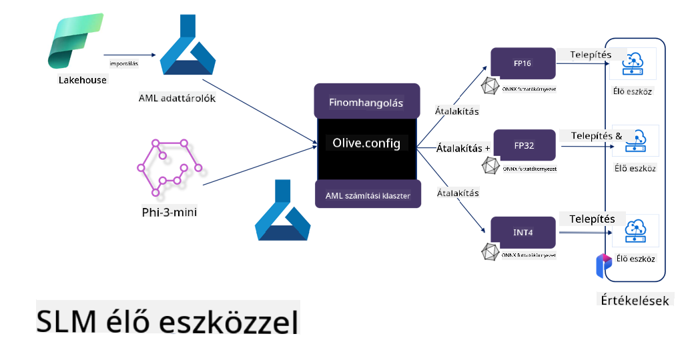

<!--
CO_OP_TRANSLATOR_METADATA:
{
  "original_hash": "5764be88ad2eb4f341e742eb8f14fab1",
  "translation_date": "2025-07-17T06:49:55+00:00",
  "source_file": "md/03.FineTuning/FineTuning_MicrosoftOlive.md",
  "language_code": "hu"
}
-->
# **Phi-3 finomhangolása Microsoft Olive-dal**

[Olive](https://github.com/microsoft/OLive?WT.mc_id=aiml-138114-kinfeylo) egy könnyen használható, hardverhez optimalizált modelloptimalizáló eszköz, amely iparági vezető technikákat egyesít a modell tömörítés, optimalizálás és fordítás területén.

Az a célja, hogy leegyszerűsítse a gépi tanulási modellek optimalizálásának folyamatát, biztosítva, hogy a modellek a lehető leghatékonyabban használják ki a specifikus hardverarchitektúrákat.

Legyen szó felhőalapú alkalmazásokról vagy élő eszközökről, az Olive lehetővé teszi, hogy modelleidet könnyedén és hatékonyan optimalizáld.

## Főbb jellemzők:
- Az Olive összegyűjti és automatizálja az optimalizációs technikákat a kívánt hardvercélokhoz.
- Nincs olyan egyetlen optimalizációs módszer, amely minden helyzetben működik, ezért az Olive lehetőséget ad az iparági szakértőknek, hogy saját optimalizációs újításaikat integrálják.

## Mérsékeld a fejlesztői erőfeszítést:
- A fejlesztőknek gyakran több hardvergyártó-specifikus eszközkészletet kell megtanulniuk és használniuk a betanított modellek telepítés előtti előkészítéséhez és optimalizálásához.
- Az Olive leegyszerűsíti ezt a folyamatot azáltal, hogy automatizálja az optimalizációs technikákat a kívánt hardverhez.

## Kész, használatra kész end-to-end optimalizációs megoldás:

Az integrált technikák összeállításával és hangolásával az Olive egységes megoldást kínál az end-to-end optimalizációra.
Figyelembe veszi a pontosság és késleltetés korlátait a modellek optimalizálása során.

## Microsoft Olive használata finomhangoláshoz

A Microsoft Olive egy nagyon könnyen használható, nyílt forráskódú modelloptimalizáló eszköz, amely lefedi mind a finomhangolást, mind a referenciaalkalmazásokat a generatív mesterséges intelligencia területén. Egyszerű konfigurációt igényel, és nyílt forráskódú kis nyelvi modellekkel, valamint kapcsolódó futtatókörnyezetekkel (AzureML / helyi GPU, CPU, DirectML) kombinálva automatikus optimalizációval végezhető el a modell finomhangolása vagy referenciája, így megtalálható a legjobb modell, amelyet felhőbe vagy élő eszközökre lehet telepíteni. Lehetővé teszi a vállalatok számára, hogy saját iparági vertikális modelljeiket helyben és a felhőben is felépítsék.


## Phi-3 finomhangolása Microsoft Olive-dal



## Phi-3 Olive példa kód és példa
Ebben a példában az Olive segítségével:

- Finomhangolunk egy LoRA adaptert, hogy a kifejezéseket Sad, Joy, Fear, Surprise kategóriákba sorolja.
- Egyesítjük az adapter súlyokat az alapmodellbe.
- Optimalizáljuk és kvantáljuk a modellt int4 formátumba.

[Sample Code](../../code/03.Finetuning/olive-ort-example/README.md)

### Microsoft Olive telepítése

A Microsoft Olive telepítése nagyon egyszerű, és telepíthető CPU, GPU, DirectML és Azure ML környezetekhez is.

```bash
pip install olive-ai
```

Ha ONNX modellt szeretnél CPU-n futtatni, használhatod a következőt:

```bash
pip install olive-ai[cpu]
```

Ha ONNX modellt szeretnél GPU-n futtatni, használhatod a következőt:

```python
pip install olive-ai[gpu]
```

Ha Azure ML-t szeretnél használni, akkor:

```python
pip install git+https://github.com/microsoft/Olive#egg=olive-ai[azureml]
```

**Figyelem**
Operációs rendszer követelmény: Ubuntu 20.04 / 22.04

### **Microsoft Olive Config.json**

A telepítés után a Config fájl segítségével különböző modell-specifikus beállításokat konfigurálhatsz, beleértve az adatokat, számítási erőforrásokat, tanítást, telepítést és modellgenerálást.

**1. Adatok**

A Microsoft Olive támogatja a helyi és felhőalapú adatokon történő tanítást, melyek beállíthatók a konfigurációban.

*Helyi adat beállítások*

Egyszerűen beállíthatod a finomhangoláshoz szükséges tanító adatokat, általában json formátumban, és a megfelelő adat sablonnal kell igazítani. Ezt a modelltől függően kell módosítani (például igazítani a Microsoft Phi-3-mini által megkövetelt formátumra. Ha más modelled van, kérjük, nézd meg az adott modell finomhangolási formátumát).

```json

    "data_configs": [
        {
            "name": "dataset_default_train",
            "type": "HuggingfaceContainer",
            "load_dataset_config": {
                "params": {
                    "data_name": "json", 
                    "data_files":"dataset/dataset-classification.json",
                    "split": "train"
                }
            },
            "pre_process_data_config": {
                "params": {
                    "dataset_type": "corpus",
                    "text_cols": [
                            "phrase",
                            "tone"
                    ],
                    "text_template": "### Text: {phrase}\n### The tone is:\n{tone}",
                    "corpus_strategy": "join",
                    "source_max_len": 2048,
                    "pad_to_max_len": false,
                    "use_attention_mask": false
                }
            }
        }
    ],
```

**Felhőalapú adatforrás beállítások**

Az Azure AI Studio/Azure Machine Learning Service adattárolójának összekapcsolásával a felhőben lévő adatokat is beemelheted. Különböző adatforrásokat hozhatsz be az Azure AI Studio/Azure Machine Learning Service-be Microsoft Fabric és Azure Data segítségével, támogatva ezzel a finomhangoláshoz szükséges adatokat.

```json

    "data_configs": [
        {
            "name": "dataset_default_train",
            "type": "HuggingfaceContainer",
            "load_dataset_config": {
                "params": {
                    "data_name": "json", 
                    "data_files": {
                        "type": "azureml_datastore",
                        "config": {
                            "azureml_client": {
                                "subscription_id": "Your Azure Subscrition ID",
                                "resource_group": "Your Azure Resource Group",
                                "workspace_name": "Your Azure ML Workspaces name"
                            },
                            "datastore_name": "workspaceblobstore",
                            "relative_path": "Your train_data.json Azure ML Location"
                        }
                    },
                    "split": "train"
                }
            },
            "pre_process_data_config": {
                "params": {
                    "dataset_type": "corpus",
                    "text_cols": [
                            "Question",
                            "Best Answer"
                    ],
                    "text_template": "<|user|>\n{Question}<|end|>\n<|assistant|>\n{Best Answer}\n<|end|>",
                    "corpus_strategy": "join",
                    "source_max_len": 2048,
                    "pad_to_max_len": false,
                    "use_attention_mask": false
                }
            }
        }
    ],
    
```

**2. Számítási konfiguráció**

Ha helyi környezetben dolgozol, közvetlenül használhatod a helyi adatforrásokat. Ha az Azure AI Studio / Azure Machine Learning Service erőforrásait szeretnéd használni, akkor az ehhez szükséges Azure paramétereket, számítási erőforrás nevét stb. kell konfigurálni.

```json

    "systems": {
        "aml": {
            "type": "AzureML",
            "config": {
                "accelerators": ["gpu"],
                "hf_token": true,
                "aml_compute": "Your Azure AI Studio / Azure Machine Learning Service Compute Name",
                "aml_docker_config": {
                    "base_image": "Your Azure AI Studio / Azure Machine Learning Service docker",
                    "conda_file_path": "conda.yaml"
                }
            }
        },
        "azure_arc": {
            "type": "AzureML",
            "config": {
                "accelerators": ["gpu"],
                "aml_compute": "Your Azure AI Studio / Azure Machine Learning Service Compute Name",
                "aml_docker_config": {
                    "base_image": "Your Azure AI Studio / Azure Machine Learning Service docker",
                    "conda_file_path": "conda.yaml"
                }
            }
        }
    },
```

***Figyelem***

Mivel az Azure AI Studio/Azure Machine Learning Service konténeren keresztül fut, a szükséges környezetet konfigurálni kell. Ez a conda.yaml környezetben történik.

```yaml

name: project_environment
channels:
  - defaults
dependencies:
  - python=3.8.13
  - pip=22.3.1
  - pip:
      - einops
      - accelerate
      - azure-keyvault-secrets
      - azure-identity
      - bitsandbytes
      - datasets
      - huggingface_hub
      - peft
      - scipy
      - sentencepiece
      - torch>=2.2.0
      - transformers
      - git+https://github.com/microsoft/Olive@jiapli/mlflow_loading_fix#egg=olive-ai[gpu]
      - --extra-index-url https://aiinfra.pkgs.visualstudio.com/PublicPackages/_packaging/ORT-Nightly/pypi/simple/ 
      - ort-nightly-gpu==1.18.0.dev20240307004
      - --extra-index-url https://aiinfra.pkgs.visualstudio.com/PublicPackages/_packaging/onnxruntime-genai/pypi/simple/
      - onnxruntime-genai-cuda

    

```

**3. Válaszd ki az SLM-et**

Használhatod a modellt közvetlenül a Hugging Face-ről, vagy az Azure AI Studio / Azure Machine Learning Model Catalog-jával kombinálva választhatod ki a használni kívánt modellt. Az alábbi kódpéldában a Microsoft Phi-3-mini modellt használjuk példaként.

Ha a modell helyileg van, ezt a módszert használhatod:

```json

    "input_model":{
        "type": "PyTorchModel",
        "config": {
            "hf_config": {
                "model_name": "model-cache/microsoft/phi-3-mini",
                "task": "text-generation",
                "model_loading_args": {
                    "trust_remote_code": true
                }
            }
        }
    },
```

Ha az Azure AI Studio / Azure Machine Learning Service-ből szeretnél modellt használni, ezt a módszert alkalmazhatod:

```json

    "input_model":{
        "type": "PyTorchModel",
        "config": {
            "model_path": {
                "type": "azureml_registry_model",
                "config": {
                    "name": "microsoft/Phi-3-mini-4k-instruct",
                    "registry_name": "azureml-msr",
                    "version": "11"
                }
            },
             "model_file_format": "PyTorch.MLflow",
             "hf_config": {
                "model_name": "microsoft/Phi-3-mini-4k-instruct",
                "task": "text-generation",
                "from_pretrained_args": {
                    "trust_remote_code": true
                }
            }
        }
    },
```

**Figyelem:**
Integrálni kell az Azure AI Studio / Azure Machine Learning Service-szel, ezért a modell beállításakor figyelj a verziószámra és a kapcsolódó elnevezésekre.

Az Azure-on lévő összes modellnek PyTorch.MLflow formátumban kell lennie.

Szükséged lesz egy Hugging Face fiókra, és a kulcsot hozzá kell kötni az Azure AI Studio / Azure Machine Learning kulcsértékéhez.

**4. Algoritmus**

A Microsoft Olive nagyon jól becsomagolja a Lora és QLora finomhangolási algoritmusokat. Csak néhány releváns paramétert kell beállítani. Itt a QLora példáját mutatjuk be.

```json
        "lora": {
            "type": "LoRA",
            "config": {
                "target_modules": [
                    "o_proj",
                    "qkv_proj"
                ],
                "double_quant": true,
                "lora_r": 64,
                "lora_alpha": 64,
                "lora_dropout": 0.1,
                "train_data_config": "dataset_default_train",
                "eval_dataset_size": 0.3,
                "training_args": {
                    "seed": 0,
                    "data_seed": 42,
                    "per_device_train_batch_size": 1,
                    "per_device_eval_batch_size": 1,
                    "gradient_accumulation_steps": 4,
                    "gradient_checkpointing": false,
                    "learning_rate": 0.0001,
                    "num_train_epochs": 3,
                    "max_steps": 10,
                    "logging_steps": 10,
                    "evaluation_strategy": "steps",
                    "eval_steps": 187,
                    "group_by_length": true,
                    "adam_beta2": 0.999,
                    "max_grad_norm": 0.3
                }
            }
        },
```

Ha kvantálási átalakítást szeretnél, a Microsoft Olive fő ága már támogatja az onnxruntime-genai módszert. Igény szerint beállíthatod:

1. adapter súlyok egyesítése az alapmodellbe
2. a modellt a ModelBuilder segítségével a kívánt pontosságú onnx modellre konvertálni

például kvantált INT4-re konvertálva

```json

        "merge_adapter_weights": {
            "type": "MergeAdapterWeights"
        },
        "builder": {
            "type": "ModelBuilder",
            "config": {
                "precision": "int4"
            }
        }
```

**Figyelem**  
- Ha QLoRA-t használsz, az ONNXRuntime-genai kvantálási átalakítás egyelőre nem támogatott.

- Fontos megjegyezni, hogy a fenti lépéseket igényeid szerint állíthatod be. Nem szükséges mindet teljesen konfigurálni. Az igényeidnek megfelelően közvetlenül használhatod az algoritmus lépéseit finomhangolás nélkül is. Végül a releváns motorokat kell konfigurálni.

```json

    "engine": {
        "log_severity_level": 0,
        "host": "aml",
        "target": "aml",
        "search_strategy": false,
        "execution_providers": ["CUDAExecutionProvider"],
        "cache_dir": "../model-cache/models/phi3-finetuned/cache",
        "output_dir" : "../model-cache/models/phi3-finetuned"
    }
```

**5. Finomhangolás befejezése**

A parancssorban az olive-config.json fájl könyvtárában futtasd:

```bash
olive run --config olive-config.json  
```

**Jogi nyilatkozat**:  
Ez a dokumentum az AI fordító szolgáltatás, a [Co-op Translator](https://github.com/Azure/co-op-translator) segítségével készült. Bár a pontosságra törekszünk, kérjük, vegye figyelembe, hogy az automatikus fordítások hibákat vagy pontatlanságokat tartalmazhatnak. Az eredeti dokumentum az anyanyelvén tekintendő hiteles forrásnak. Fontos információk esetén professzionális emberi fordítást javaslunk. Nem vállalunk felelősséget a fordítás használatából eredő félreértésekért vagy téves értelmezésekért.