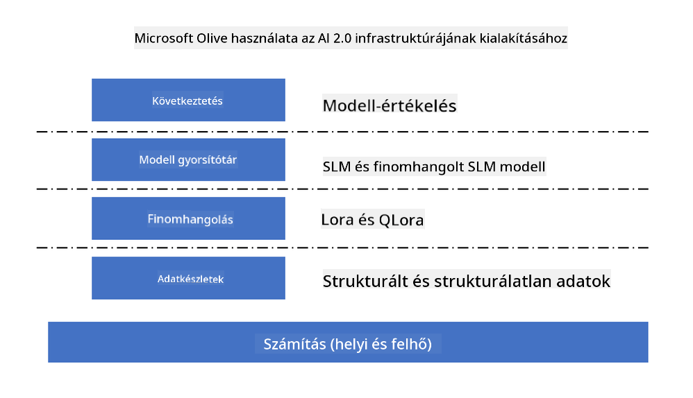
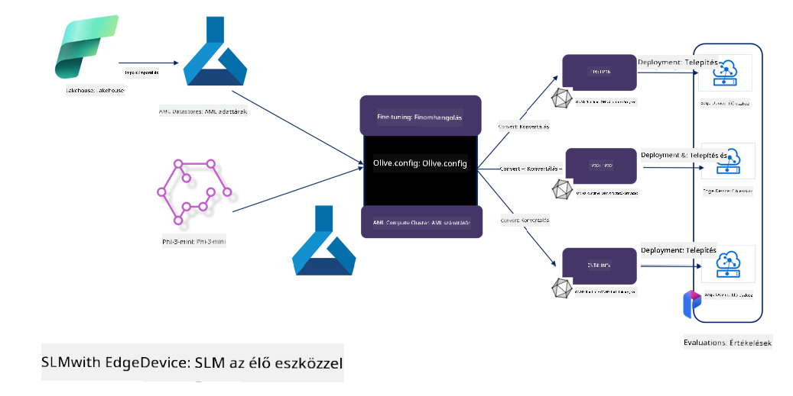

<!--
CO_OP_TRANSLATOR_METADATA:
{
  "original_hash": "5764be88ad2eb4f341e742eb8f14fab1",
  "translation_date": "2025-05-09T20:54:31+00:00",
  "source_file": "md/03.FineTuning/FineTuning_MicrosoftOlive.md",
  "language_code": "hu"
}
-->
# **Phi-3 finomhangolása Microsoft Olive-dal**

[Olive](https://github.com/microsoft/OLive?WT.mc_id=aiml-138114-kinfeylo) egy könnyen használható, hardver-specifikus modelloptimalizáló eszköz, amely iparági vezető technikákat egyesít a modell tömörítés, optimalizálás és fordítás területén.

Az a célja, hogy leegyszerűsítse a gépi tanulási modellek optimalizálását, biztosítva, hogy azok a lehető leghatékonyabban használják ki az adott hardverarchitektúrákat.

Legyen szó felhőalapú alkalmazásokról vagy élő eszközökről, az Olive lehetővé teszi a modellek egyszerű és hatékony optimalizálását.

## Főbb jellemzők:
- Az Olive összegyűjti és automatizálja az optimalizációs technikákat a kívánt hardvertámogatás érdekében.
- Nincs olyan egyetlen optimalizációs módszer, ami minden helyzetben megfelelő, ezért az Olive bővíthető, így az iparági szakértők beilleszthetik saját innovációikat.

## Mérsékeld a fejlesztői munkát:
- A fejlesztőknek gyakran több, hardverszállító-specifikus eszközkészletet kell elsajátítaniuk és használniuk a betanított modellek telepítés előtti előkészítéséhez és optimalizálásához.
- Az Olive leegyszerűsíti ezt a folyamatot azáltal, hogy automatizálja az optimalizációs lépéseket a kívánt hardverhez.

## Kész, használatra kész E2E optimalizációs megoldás:

Az integrált technikák összeállításával és hangolásával az Olive egységes megoldást kínál a teljes optimalizációs folyamatra.
Figyelembe veszi a pontosság és késleltetés korlátait a modellek optimalizálása során.

## Microsoft Olive használata finomhangoláshoz

A Microsoft Olive egy nagyon könnyen használható nyílt forráskódú modelloptimalizáló eszköz, amely lefedi a finomhangolást és a referenciát is a generatív mesterséges intelligencia területén. Egyszerű konfigurációt igényel, és nyílt forráskódú kis nyelvi modellekkel, valamint kapcsolódó futtatókörnyezetekkel (AzureML / helyi GPU, CPU, DirectML) kombinálva automatikusan elvégzi a finomhangolást vagy referenciát, így megtalálhatod a legjobb modellt a felhőbe vagy élő eszközökre történő telepítéshez. Ez lehetővé teszi a vállalatok számára, hogy saját iparági vertikális modelljeiket helyben és a felhőben építsék fel.



## Phi-3 finomhangolása Microsoft Olive-dal



## Phi-3 Olive példa kód és bemutató
Ebben a példában az Olive segítségével:

- Finomhangolunk egy LoRA adaptert, hogy a kifejezéseket Sad, Joy, Fear, Surprise kategóriákba sorolja.
- Egyesítjük az adapter súlyokat az alapmodellbe.
- Optimalizáljuk és kvantáljuk a modellt int4-re.

[Sample Code](../../code/03.Finetuning/olive-ort-example/README.md)

### Microsoft Olive telepítése

A Microsoft Olive telepítése nagyon egyszerű, és CPU, GPU, DirectML, valamint Azure ML környezetekre is telepíthető.

```bash
pip install olive-ai
```

Ha CPU-n szeretnél ONNX modellt futtatni, használhatod ezt:

```bash
pip install olive-ai[cpu]
```

Ha GPU-n szeretnéd futtatni az ONNX modellt, ezt használhatod:

```python
pip install olive-ai[gpu]
```

Azure ML használatához:

```python
pip install git+https://github.com/microsoft/Olive#egg=olive-ai[azureml]
```

**Figyelem**
Operációs rendszer követelmény: Ubuntu 20.04 / 22.04

### **Microsoft Olive Config.json**

A telepítés után különböző modell-specifikus beállításokat konfigurálhatsz a Config fájlban, beleértve az adatokat, számítást, tanítást, telepítést és modell generálást.

**1. Adatok**

Microsoft Olive támogatja a helyi és felhő alapú adatokon való tanítást, melyeket a beállításokban konfigurálhatsz.

*Helyi adat beállítások*

Egyszerűen beállíthatod a finomhangoláshoz szükséges tanító adatkészletet, általában json formátumban, és a megfelelő adat sablonnal összhangban. Ezt a modelltől függően kell igazítani (például a Microsoft Phi-3-mini által megkövetelt formátumra. Ha más modelled van, kérjük, nézd meg az adott modell finomhangolási formátumát.)

```json

    "data_configs": [
        {
            "name": "dataset_default_train",
            "type": "HuggingfaceContainer",
            "load_dataset_config": {
                "params": {
                    "data_name": "json", 
                    "data_files":"dataset/dataset-classification.json",
                    "split": "train"
                }
            },
            "pre_process_data_config": {
                "params": {
                    "dataset_type": "corpus",
                    "text_cols": [
                            "phrase",
                            "tone"
                    ],
                    "text_template": "### Text: {phrase}\n### The tone is:\n{tone}",
                    "corpus_strategy": "join",
                    "source_max_len": 2048,
                    "pad_to_max_len": false,
                    "use_attention_mask": false
                }
            }
        }
    ],
```

**Felhő adatforrás beállítások**

Az Azure AI Studio / Azure Machine Learning Service adat-tárolójának összekapcsolásával felhőben tárolt adatokhoz férhetsz hozzá, különböző adatforrásokat hozhatsz be Microsoft Fabric és Azure Data segítségével, hogy támogasd a finomhangoláshoz használt adatokat.

```json

    "data_configs": [
        {
            "name": "dataset_default_train",
            "type": "HuggingfaceContainer",
            "load_dataset_config": {
                "params": {
                    "data_name": "json", 
                    "data_files": {
                        "type": "azureml_datastore",
                        "config": {
                            "azureml_client": {
                                "subscription_id": "Your Azure Subscrition ID",
                                "resource_group": "Your Azure Resource Group",
                                "workspace_name": "Your Azure ML Workspaces name"
                            },
                            "datastore_name": "workspaceblobstore",
                            "relative_path": "Your train_data.json Azure ML Location"
                        }
                    },
                    "split": "train"
                }
            },
            "pre_process_data_config": {
                "params": {
                    "dataset_type": "corpus",
                    "text_cols": [
                            "Question",
                            "Best Answer"
                    ],
                    "text_template": "<|user|>\n{Question}<|end|>\n<|assistant|>\n{Best Answer}\n<|end|>",
                    "corpus_strategy": "join",
                    "source_max_len": 2048,
                    "pad_to_max_len": false,
                    "use_attention_mask": false
                }
            }
        }
    ],
    
```

**2. Számítási konfiguráció**

Ha helyi erőforrásokat szeretnél használni, közvetlenül a helyi adatokhoz férhetsz hozzá. Ha az Azure AI Studio / Azure Machine Learning Service erőforrásait szeretnéd használni, az ehhez szükséges Azure paramétereket, számítási kapacitás nevét stb. konfigurálnod kell.

```json

    "systems": {
        "aml": {
            "type": "AzureML",
            "config": {
                "accelerators": ["gpu"],
                "hf_token": true,
                "aml_compute": "Your Azure AI Studio / Azure Machine Learning Service Compute Name",
                "aml_docker_config": {
                    "base_image": "Your Azure AI Studio / Azure Machine Learning Service docker",
                    "conda_file_path": "conda.yaml"
                }
            }
        },
        "azure_arc": {
            "type": "AzureML",
            "config": {
                "accelerators": ["gpu"],
                "aml_compute": "Your Azure AI Studio / Azure Machine Learning Service Compute Name",
                "aml_docker_config": {
                    "base_image": "Your Azure AI Studio / Azure Machine Learning Service docker",
                    "conda_file_path": "conda.yaml"
                }
            }
        }
    },
```

***Figyelem***

Mivel az Azure AI Studio / Azure Machine Learning Service konténerben futtatja a folyamatot, a szükséges környezetet be kell állítani. Ez a conda.yaml környezetben történik.

```yaml

name: project_environment
channels:
  - defaults
dependencies:
  - python=3.8.13
  - pip=22.3.1
  - pip:
      - einops
      - accelerate
      - azure-keyvault-secrets
      - azure-identity
      - bitsandbytes
      - datasets
      - huggingface_hub
      - peft
      - scipy
      - sentencepiece
      - torch>=2.2.0
      - transformers
      - git+https://github.com/microsoft/Olive@jiapli/mlflow_loading_fix#egg=olive-ai[gpu]
      - --extra-index-url https://aiinfra.pkgs.visualstudio.com/PublicPackages/_packaging/ORT-Nightly/pypi/simple/ 
      - ort-nightly-gpu==1.18.0.dev20240307004
      - --extra-index-url https://aiinfra.pkgs.visualstudio.com/PublicPackages/_packaging/onnxruntime-genai/pypi/simple/
      - onnxruntime-genai-cuda

    

```

**3. Válaszd ki az SLM-et**

Használhatod a modellt közvetlenül a Hugging Face-ről, vagy összekapcsolhatod az Azure AI Studio / Azure Machine Learning Modell Katalógusával, hogy kiválaszd a használni kívánt modellt. Az alábbi kódpéldában a Microsoft Phi-3-mini modellt használjuk példaként.

Ha helyben van meg a modell, ezt az utat használhatod:

```json

    "input_model":{
        "type": "PyTorchModel",
        "config": {
            "hf_config": {
                "model_name": "model-cache/microsoft/phi-3-mini",
                "task": "text-generation",
                "model_loading_args": {
                    "trust_remote_code": true
                }
            }
        }
    },
```

Ha az Azure AI Studio / Azure Machine Learning Service-ből szeretnél modellt használni, ezt az utat válaszd:

```json

    "input_model":{
        "type": "PyTorchModel",
        "config": {
            "model_path": {
                "type": "azureml_registry_model",
                "config": {
                    "name": "microsoft/Phi-3-mini-4k-instruct",
                    "registry_name": "azureml-msr",
                    "version": "11"
                }
            },
             "model_file_format": "PyTorch.MLflow",
             "hf_config": {
                "model_name": "microsoft/Phi-3-mini-4k-instruct",
                "task": "text-generation",
                "from_pretrained_args": {
                    "trust_remote_code": true
                }
            }
        }
    },
```

**Figyelem:**
Az Azure AI Studio / Azure Machine Learning Service integráció szükséges, ezért a modell beállításakor vedd figyelembe a verziószámot és a kapcsolódó elnevezéseket.

Az Azure összes modelljét PyTorch.MLflow formátumban kell beállítani.

Hugging Face fiókra van szükséged, és a kulcsot az Azure AI Studio / Azure Machine Learning kulcsértékéhez kell kötni.

**4. Algoritmus**

A Microsoft Olive jól becsomagolja a Lora és QLora finomhangolási algoritmusokat. Csak néhány releváns paramétert kell beállítanod. Itt a QLora példáját mutatom be.

```json
        "lora": {
            "type": "LoRA",
            "config": {
                "target_modules": [
                    "o_proj",
                    "qkv_proj"
                ],
                "double_quant": true,
                "lora_r": 64,
                "lora_alpha": 64,
                "lora_dropout": 0.1,
                "train_data_config": "dataset_default_train",
                "eval_dataset_size": 0.3,
                "training_args": {
                    "seed": 0,
                    "data_seed": 42,
                    "per_device_train_batch_size": 1,
                    "per_device_eval_batch_size": 1,
                    "gradient_accumulation_steps": 4,
                    "gradient_checkpointing": false,
                    "learning_rate": 0.0001,
                    "num_train_epochs": 3,
                    "max_steps": 10,
                    "logging_steps": 10,
                    "evaluation_strategy": "steps",
                    "eval_steps": 187,
                    "group_by_length": true,
                    "adam_beta2": 0.999,
                    "max_grad_norm": 0.3
                }
            }
        },
```

Ha kvantálásra van szükség, a Microsoft Olive fő ág már támogatja az onnxruntime-genai módszert. Igény szerint beállíthatod:

1. adapter súlyok egyesítése az alapmodellel
2. modell átalakítása onnx modellé a kívánt pontossággal a ModelBuilder segítségével

például kvantált INT4-re történő átalakítás

```json

        "merge_adapter_weights": {
            "type": "MergeAdapterWeights"
        },
        "builder": {
            "type": "ModelBuilder",
            "config": {
                "precision": "int4"
            }
        }
```

**Figyelem**  
- Ha QLoRA-t használsz, az ONNXRuntime-genai kvantálás egyelőre nem támogatott.

- Fontos megjegyezni, hogy a fenti lépéseket a saját igényeid szerint állíthatod be. Nem kötelező mindet teljesen konfigurálni. Az algoritmus lépéseit finomhangolás nélkül is használhatod, végül pedig a releváns motorokat kell konfigurálnod.

```json

    "engine": {
        "log_severity_level": 0,
        "host": "aml",
        "target": "aml",
        "search_strategy": false,
        "execution_providers": ["CUDAExecutionProvider"],
        "cache_dir": "../model-cache/models/phi3-finetuned/cache",
        "output_dir" : "../model-cache/models/phi3-finetuned"
    }
```

**5. Finomhangolás befejezése**

A parancssorban futtasd az olive-config.json fájlt tartalmazó könyvtárban:

```bash
olive run --config olive-config.json  
```

**Jogi nyilatkozat**:  
Ezt a dokumentumot az AI fordító szolgáltatás, a [Co-op Translator](https://github.com/Azure/co-op-translator) segítségével fordítottuk le. Bár igyekszünk pontos fordítást biztosítani, kérjük, vegye figyelembe, hogy az automatikus fordítások hibákat vagy pontatlanságokat tartalmazhatnak. Az eredeti dokumentum az anyanyelvén tekintendő hiteles forrásnak. Kritikus információk esetén professzionális, emberi fordítást javaslunk. Nem vállalunk felelősséget a fordítás használatából eredő félreértésekért vagy téves értelmezésekért.