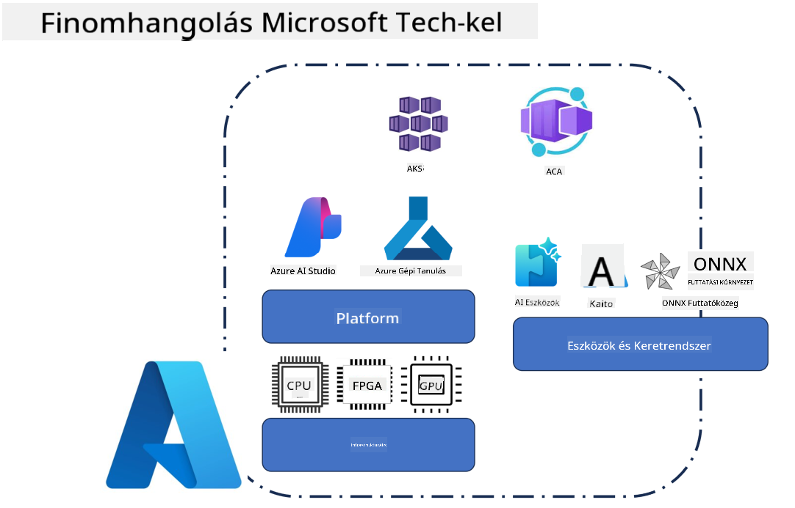
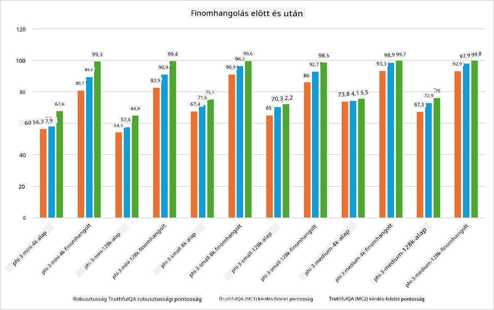

<!--
CO_OP_TRANSLATOR_METADATA:
{
  "original_hash": "cb5648935f63edc17e95ce38f23adc32",
  "translation_date": "2025-05-09T21:57:22+00:00",
  "source_file": "md/03.FineTuning/FineTuning_Scenarios.md",
  "language_code": "hu"
}
-->
## Finomhangolási forgatókönyvek

**Platform** Ide tartoznak különböző technológiák, mint az Azure AI Foundry, Azure Machine Learning, AI Tools, Kaito és az ONNX Runtime.

**Infrastruktúra** Ez magában foglalja a CPU-t és az FPGA-t, amelyek elengedhetetlenek a finomhangolási folyamathoz. Megmutatom az egyes technológiák ikonjait.

**Eszközök és keretrendszerek** Ide tartozik az ONNX Runtime. Megmutatom az egyes technológiák ikonjait.
[Az ONNX Runtime ikonok beillesztése]

A Microsoft technológiáival végzett finomhangolási folyamat számos összetevőt és eszközt foglal magában. Ezek megértésével és használatával hatékonyan finomhangolhatjuk alkalmazásainkat, és jobb megoldásokat hozhatunk létre.

## Model as Service

Finomhangold a modellt hosztolt finomhangolással, számítási erőforrás létrehozása és kezelése nélkül.

A szerver nélküli finomhangolás elérhető a Phi-3-mini és Phi-3-medium modellekhez, lehetővé téve a fejlesztők számára, hogy gyorsan és egyszerűen testre szabják a modelleket felhős és élőhelyi (edge) környezetekhez anélkül, hogy számítási erőforrást kellene biztosítaniuk. Bejelentettük azt is, hogy a Phi-3-small mostantól elérhető a Models-as-a-Service kínálatunkban, így a fejlesztők gyorsan és egyszerűen kezdhetnek AI fejlesztésbe anélkül, hogy az alapinfrastruktúrát kellene kezelniük.

## Model as a Platform

A felhasználók saját számítási erőforrásaikat kezelik a modellek finomhangolásához.

[Fine Tuning Sample](https://github.com/Azure/azureml-examples/blob/main/sdk/python/foundation-models/system/finetune/chat-completion/chat-completion.ipynb)

## Finomhangolási forgatókönyvek

| | | | | | | |
|-|-|-|-|-|-|-|
|Forgatókönyv|LoRA|QLoRA|PEFT|DeepSpeed|ZeRO|DORA|
|Előre betanított LLM-ek adaptálása specifikus feladatokra vagy területekre|Igen|Igen|Igen|Igen|Igen|Igen|
|Finomhangolás NLP feladatokra, mint szövegklasszifikáció, nevezett entitás felismerés és gépi fordítás|Igen|Igen|Igen|Igen|Igen|Igen|
|Finomhangolás kérdés-válasz feladatokra|Igen|Igen|Igen|Igen|Igen|Igen|
|Finomhangolás emberhez hasonló válaszok generálására chatbotokban|Igen|Igen|Igen|Igen|Igen|Igen|
|Finomhangolás zene, művészet vagy egyéb kreatív formák generálására|Igen|Igen|Igen|Igen|Igen|Igen|
|Számítási és pénzügyi költségek csökkentése|Igen|Igen|Nem|Igen|Igen|Nem|
|Memóriahasználat csökkentése|Nem|Igen|Nem|Igen|Igen|Igen|
|Kevesebb paraméter használata a hatékony finomhangoláshoz|Nem|Igen|Igen|Nem|Nem|Igen|
|Memóriahatékony adatpárhuzamosság, amely hozzáférést biztosít az összes elérhető GPU eszköz együttes memóriájához|Nem|Nem|Nem|Igen|Igen|Igen|

## Finomhangolási teljesítmény példák

**Nyilatkozat**:  
Ez a dokumentum az AI fordítószolgáltatás, a [Co-op Translator](https://github.com/Azure/co-op-translator) segítségével készült. Bár a pontosságra törekszünk, kérjük, vegye figyelembe, hogy az automatikus fordítások hibákat vagy pontatlanságokat tartalmazhatnak. Az eredeti dokumentum anyanyelvű változata tekintendő hiteles forrásnak. Kritikus információk esetén professzionális emberi fordítást javaslunk. Nem vállalunk felelősséget a fordítás használatából eredő félreértésekért vagy félreértelmezésekért.