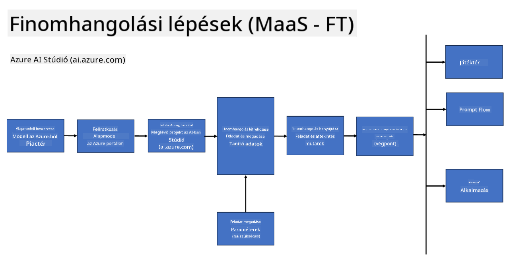
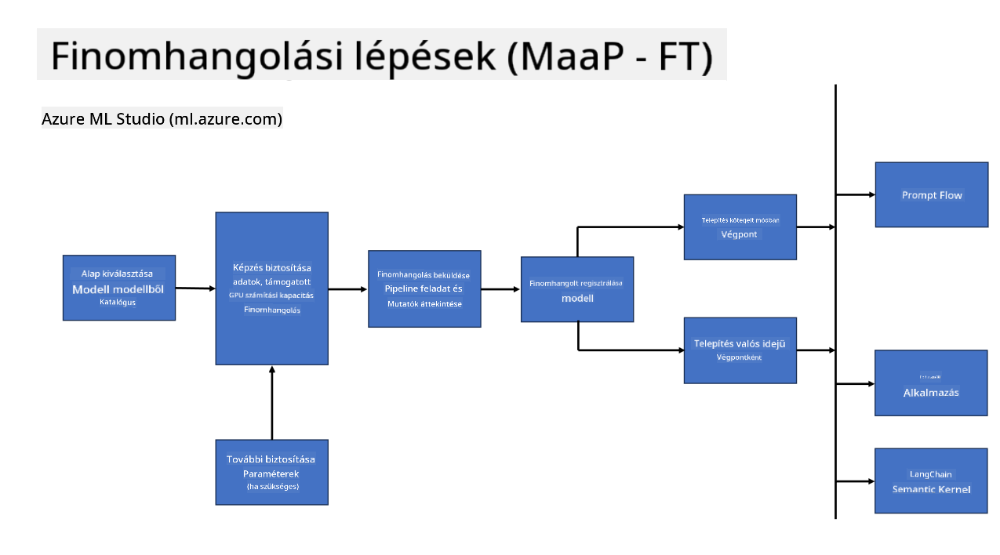

<!--
CO_OP_TRANSLATOR_METADATA:
{
  "original_hash": "cb5648935f63edc17e95ce38f23adc32",
  "translation_date": "2025-07-17T08:29:39+00:00",
  "source_file": "md/03.FineTuning/FineTuning_Scenarios.md",
  "language_code": "hu"
}
-->
## Finomhangolási forgatókönyvek

**Platform** Ide tartoznak különböző technológiák, mint az Azure AI Foundry, Azure Machine Learning, AI Tools, Kaito és ONNX Runtime.

**Infrastruktúra** Ebbe beletartozik a CPU és az FPGA, amelyek elengedhetetlenek a finomhangolási folyamathoz. Megmutatom az egyes technológiák ikonjaikat.

**Eszközök és keretrendszerek** Ide tartozik az ONNX Runtime és az ONNX Runtime. Megmutatom az egyes technológiák ikonjaikat.  
[Helyezze be az ONNX Runtime ikonokat]

A Microsoft technológiáival végzett finomhangolási folyamat több összetevőt és eszközt foglal magában. Ezek megértésével és használatával hatékonyan finomhangolhatjuk alkalmazásainkat, és jobb megoldásokat hozhatunk létre.

## Modell mint szolgáltatás

Finomhangolja a modellt hosztolt finomhangolással, számítási erőforrás létrehozása és kezelése nélkül.

A szerver nélküli finomhangolás elérhető a Phi-3-mini és Phi-3-medium modellekhez, lehetővé téve a fejlesztők számára, hogy gyorsan és egyszerűen testre szabják a modelleket felhő- és élőhelyi (edge) környezetekhez anélkül, hogy számítási erőforrást kellene biztosítaniuk. Bejelentettük továbbá, hogy a Phi-3-small mostantól elérhető a Models-as-a-Service kínálatunkban, így a fejlesztők gyorsan és egyszerűen kezdhetnek AI fejlesztésbe anélkül, hogy az alapinfrastruktúrát kellene kezelniük.

## Modell mint platform

A felhasználók saját számítási erőforrásaikat kezelik a modellek finomhangolásához.

[Finomhangolási példa](https://github.com/Azure/azureml-examples/blob/main/sdk/python/foundation-models/system/finetune/chat-completion/chat-completion.ipynb)

## Finomhangolási forgatókönyvek

| | | | | | | |
|-|-|-|-|-|-|-|
|Forgatókönyv|LoRA|QLoRA|PEFT|DeepSpeed|ZeRO|DORA|
|Előre betanított LLM-ek adaptálása specifikus feladatokra vagy területekre|Igen|Igen|Igen|Igen|Igen|Igen|
|Finomhangolás NLP feladatokra, mint szöveg osztályozás, név szerinti entitás felismerés és gépi fordítás|Igen|Igen|Igen|Igen|Igen|Igen|
|Finomhangolás kérdés-válasz feladatokra|Igen|Igen|Igen|Igen|Igen|Igen|
|Finomhangolás emberi válaszok generálására chatbotokban|Igen|Igen|Igen|Igen|Igen|Igen|
|Finomhangolás zene, művészet vagy más kreatív formák generálására|Igen|Igen|Igen|Igen|Igen|Igen|
|Számítási és pénzügyi költségek csökkentése|Igen|Igen|Nem|Igen|Igen|Nem|
|Memóriahasználat csökkentése|Nem|Igen|Nem|Igen|Igen|Igen|
|Kevesebb paraméter használata a hatékony finomhangoláshoz|Nem|Igen|Igen|Nem|Nem|Igen|
|Memóriahatékony adatpárhuzamosság, amely hozzáférést biztosít az összes elérhető GPU eszköz összesített GPU memóriájához|Nem|Nem|Nem|Igen|Igen|Igen|

## Finomhangolási teljesítmény példák

**Jogi nyilatkozat**:  
Ez a dokumentum az AI fordító szolgáltatás, a [Co-op Translator](https://github.com/Azure/co-op-translator) segítségével készült. Bár a pontosságra törekszünk, kérjük, vegye figyelembe, hogy az automatikus fordítások hibákat vagy pontatlanságokat tartalmazhatnak. Az eredeti dokumentum az anyanyelvén tekintendő hiteles forrásnak. Fontos információk esetén szakmai, emberi fordítást javaslunk. Nem vállalunk felelősséget a fordítás használatából eredő félreértésekért vagy téves értelmezésekért.