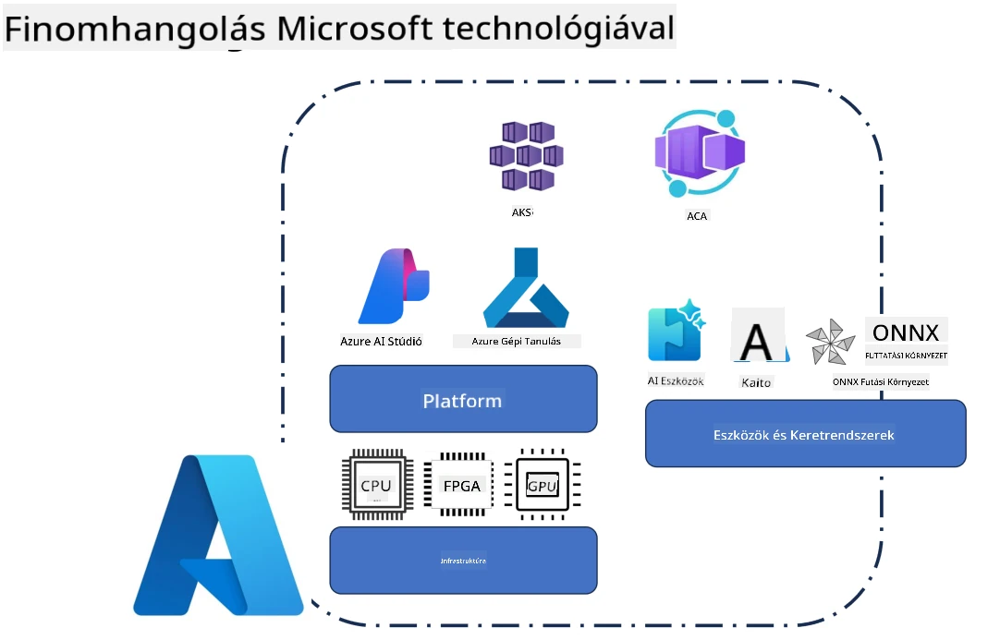
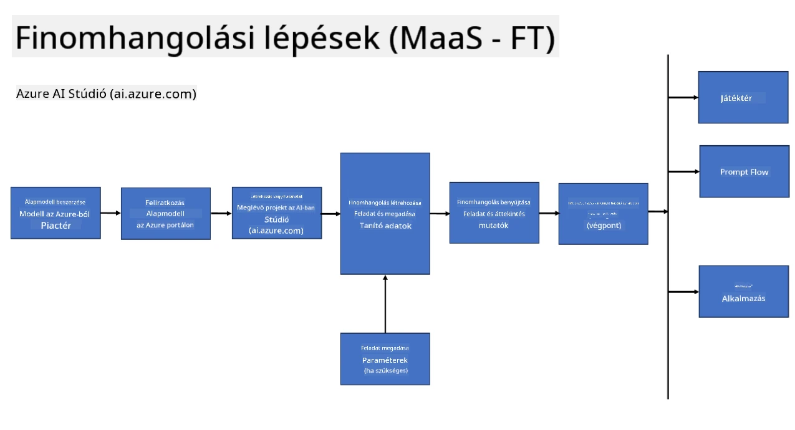
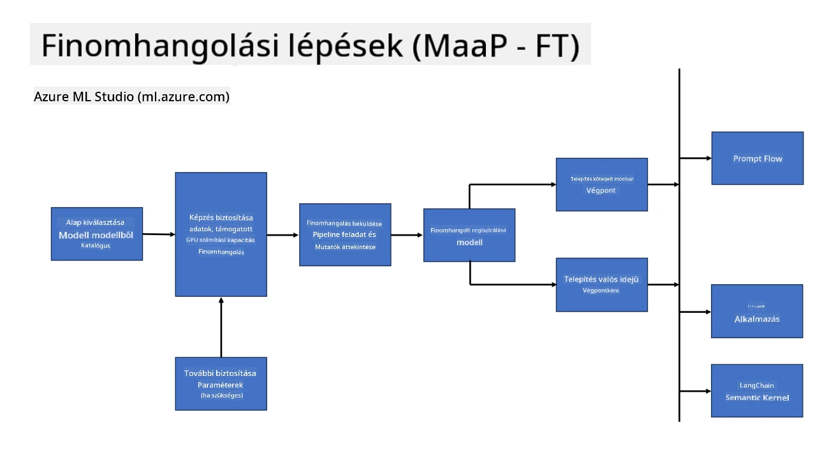
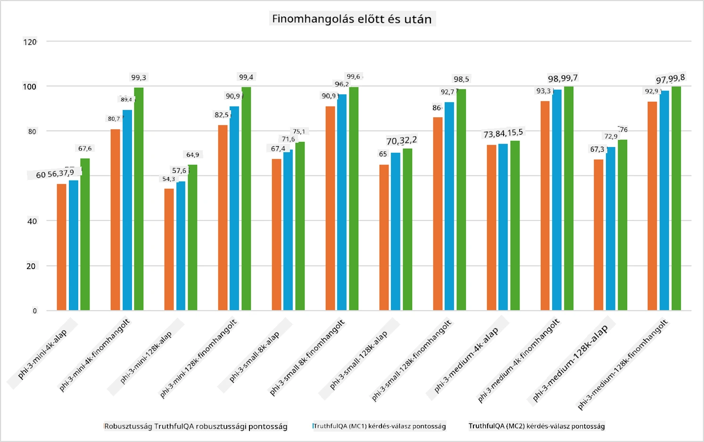

## Finomhangolási forgatókönyvek

Ez a rész áttekintést nyújt a Microsoft Foundry és Azure környezetek finomhangolási forgatókönyveiről, beleértve a telepítési modelleket, az infrastruktúra rétegeit és a gyakran használt optimalizációs technikákat.

**Platform**  
Ez magában foglalja a kezelt szolgáltatásokat, mint a Microsoft Foundry (korábban Azure AI Foundry) és az Azure Machine Learning, amelyek modellkezelést, orchestrationt, kísérletkövetést és telepítési munkafolyamatokat biztosítanak.

**Infrastruktúra**  
A finomhangolás skálázható számítási erőforrásokat igényel. Azure környezetekben ez tipikusan GPU-alapú virtuális gépeket és CPU erőforrásokat jelent könnyebb munkaterhelésekhez, valamint skálázható tárolást az adatkészletek és a checkpointok számára.

**Eszközök és keretrendszer**  
A finomhangolási munkafolyamatok gyakran támaszkodnak olyan keretrendszerekre és optimalizációs könyvtárakra, mint a Hugging Face Transformers, DeepSpeed és PEFT (Parameter-Efficient Fine-Tuning).

A Microsoft technológiáival végzett finomhangolási folyamat platformszolgáltatásokat, számítási infrastruktúrát és képzési keretrendszereket ölel fel. Ha megértjük, hogyan működnek együtt ezek az összetevők, a fejlesztők hatékonyan alakíthatják át az alapmodelleket konkrét feladatokra és éles használati esetekre.

## Model as Service

Finomhangolja a modellt hosztolt finomhangolással, anélkül, hogy számítási erőforrásokat kellene létrehozni és kezelni.

A szerver nélküli finomhangolás most elérhető a Phi-3, Phi-3.5 és Phi-4 modellcsaládokhoz, lehetővé téve a fejlesztők számára, hogy gyorsan és egyszerűen testre szabják a modelleket felhő- és edge-forgatókönyvekhez anélkül, hogy számítási erőforrásokat kellene biztosítaniuk.

## Model as a Platform 

A felhasználók a saját számítási erőforrásaikat kezelik a modellek finomhangolásához.

[Finomhangolási példa](https://github.com/Azure/azureml-examples/blob/main/sdk/python/foundation-models/system/finetune/chat-completion/chat-completion.ipynb)

## Finomhangolási technikák összehasonlítása

|Forgatókönyv|LoRA|QLoRA|PEFT|DeepSpeed|ZeRO|DoRA|
|---|---|---|---|---|---|---|
|Előre betanított LLM-ek adaptálása konkrét feladatokra vagy doménekre|Igen|Igen|Igen|Igen|Igen|Igen|
|Finomhangolás NLP-feladatokra, például szövegosztályozásra, entitásfelismerésre és gépi fordításra|Igen|Igen|Igen|Igen|Igen|Igen|
|Finomhangolás QA feladatokra|Igen|Igen|Igen|Igen|Igen|Igen|
|Finomhangolás emberhez hasonló válaszok generálására csevegőrobotokban|Igen|Igen|Igen|Igen|Igen|Igen|
|Finomhangolás zene, művészet vagy más kreatív formák generálására|Igen|Igen|Igen|Igen|Igen|Igen|
|Számítási és pénzügyi költségek csökkentése|Igen|Igen|Igen|Igen|Igen|Igen|
|Memóriahasználat csökkentése|Igen|Igen|Igen|Igen|Igen|Igen|
|Kevesebb paraméter használata a hatékony finomhangoláshoz|Igen|Igen|Igen|Nem|Nem|Igen|
|Memóriatakarékos adatpárhuzamosság, amely hozzáférést biztosít az összes rendelkezésre álló GPU eszköz aggregált GPU memóriájához|Nem|Nem|Nem|Igen|Igen|Nem|

> [!NOTE]
> A LoRA, QLoRA, PEFT és DoRA paraméter-hatékony finomhangolási módszerek, míg a DeepSpeed és a ZeRO a disztribúciós tanulásra és a memóriaoptimalizálásra fókuszálnak.

## Finomhangolási teljesítmény példák

---

<!-- CO-OP TRANSLATOR DISCLAIMER START -->
Felelősségkizárás:
Ez a dokumentum a mesterséges intelligencia-alapú fordítószolgáltatás, a Co-op Translator (https://github.com/Azure/co-op-translator) segítségével készült. Bár a pontosságra törekszünk, kérjük, vegye figyelembe, hogy az automatikus fordítások hibákat vagy pontatlanságokat tartalmazhatnak. A dokumentum eredeti, anyanyelvi változatát kell tekinteni irányadónak. Kritikus jelentőségű információk esetén szakmai, emberi fordítást javasolunk. Nem vállalunk felelősséget az ilyen fordítás használatából eredő félreértésekért vagy téves értelmezésekért.
<!-- CO-OP TRANSLATOR DISCLAIMER END -->