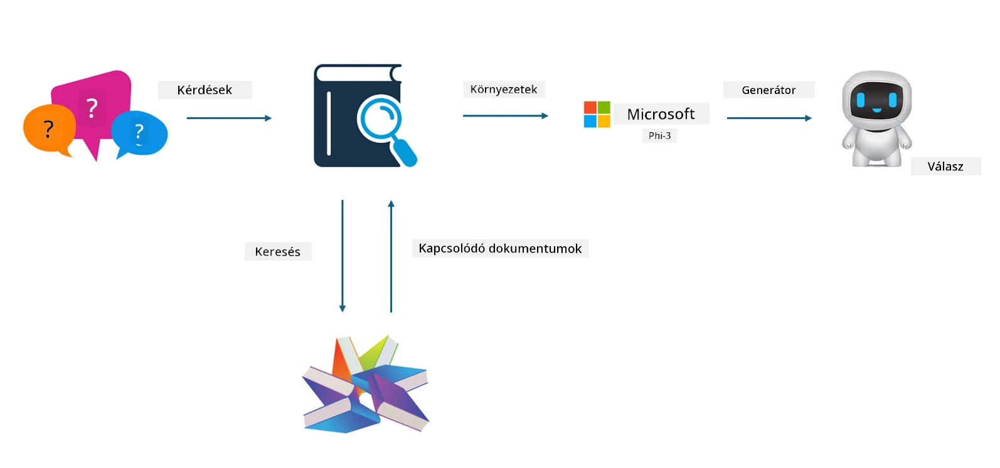

## Finomhangolás vs RAG

## Retrieval Augmented Generation

A RAG adatlekérés + szöveggenerálás. A vállalat strukturált és strukturálatlan adatai egy vektoralapú adatbázisban tárolódnak. Amikor releváns tartalmat keresünk, megtaláljuk a kapcsolódó összefoglalót és tartalmat, hogy kontextust alkossunk, majd az LLM/SLM szövegkiegészítő képességét kombinálva generáljuk a tartalmat.

## RAG folyamat

## Finomhangolás
A finomhangolás egy adott modell továbbfejlesztésén alapul. Nem kell a modell algoritmusával kezdeni, de az adatok folyamatos gyűjtése szükséges. Ha ipari alkalmazásokban pontosabb terminológiára és nyelvi kifejezésre van szükség, a finomhangolás jobb választás. Viszont ha az adatok gyakran változnak, a finomhangolás bonyolulttá válhat.

## Hogyan válasszunk
Ha a válaszunkhoz külső adatok bevonása szükséges, a RAG a legjobb választás.

Ha stabil és pontos ipari tudást kell szolgáltatni, a finomhangolás jó megoldás lehet. A RAG előnyben részesíti a releváns tartalom lekérését, de nem mindig ragadja meg a szakmai finomságokat.

A finomhangoláshoz magas minőségű adathalmaz szükséges, és ha csak kis adatkörrel dolgozunk, nem hoz jelentős változást. A RAG rugalmasabb.
A finomhangolás egy fekete doboz, egyfajta metafizika, nehéz megérteni a belső működését. Ezzel szemben a RAG könnyebbé teszi az adatok forrásának megtalálását, így hatékonyan lehet korrigálni a tévesztéseket vagy tartalmi hibákat, és jobb átláthatóságot biztosít.

**Jogi nyilatkozat**:  
Ez a dokumentum az AI fordító szolgáltatás, a [Co-op Translator](https://github.com/Azure/co-op-translator) segítségével készült. Bár a pontosságra törekszünk, kérjük, vegye figyelembe, hogy az automatikus fordítások hibákat vagy pontatlanságokat tartalmazhatnak. Az eredeti dokumentum az anyanyelvén tekintendő hiteles forrásnak. Fontos információk esetén professzionális emberi fordítást javaslunk. Nem vállalunk felelősséget a fordítás használatából eredő félreértésekért vagy téves értelmezésekért.