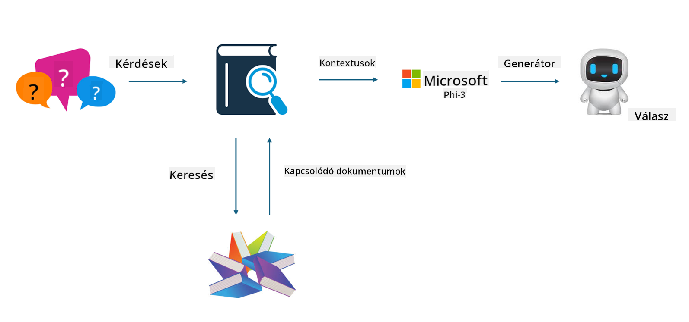

<!--
CO_OP_TRANSLATOR_METADATA:
{
  "original_hash": "e4e010400c2918557b36bb932a14004c",
  "translation_date": "2025-05-09T22:16:57+00:00",
  "source_file": "md/03.FineTuning/FineTuning_vs_RAG.md",
  "language_code": "hu"
}
-->
## Finomhangolás vs RAG

## Retrieval Augmented Generation

A RAG adatlekérést és szöveggenerálást kombinál. A vállalat strukturált és strukturálatlan adatait egy vektoralapú adatbázisban tárolják. Releváns tartalom keresésekor a kapcsolódó összefoglaló és tartalom előkerül, így kialakul egy kontextus, amit a LLM/SLM szövegkiegészítő képességével ötvözve generál tartalmat.

## RAG folyamat

## Finomhangolás
A finomhangolás egy adott modell fejlesztésén alapul. Nem kell az algoritmussal kezdeni, viszont az adatok folyamatos gyűjtése szükséges. Ha ipari alkalmazásokban pontosabb terminológiára és nyelvi megfogalmazásra van szükség, a finomhangolás jobb választás. Ha viszont az adatok gyakran változnak, a finomhangolás bonyolulttá válhat.

## Hogyan válasszunk
Ha a válaszunkhoz külső adat bevonására van szükség, a RAG a legjobb választás.

Ha stabil és pontos iparági tudás kimenetre van szükség, a finomhangolás megfelelőbb. A RAG a releváns tartalmak előhívását helyezi előtérbe, de nem mindig ragadja meg a szakmai finomságokat.

A finomhangoláshoz magas minőségű adathalmaz szükséges, és ha csak szűk körű adat áll rendelkezésre, az nem hoz jelentős változást. A RAG viszont rugalmasabb.
A finomhangolás egy fekete doboz, egy metafizika, és nehéz megérteni a belső működését. A RAG viszont könnyebben visszavezethető az adatok forrásához, így hatékonyabban lehet kezelni a téves információkat vagy tartalmi hibákat, és jobb átláthatóságot biztosít.

**Nyilatkozat**:  
Ez a dokumentum az AI fordító szolgáltatás, a [Co-op Translator](https://github.com/Azure/co-op-translator) segítségével készült. Bár a pontosságra törekszünk, kérjük, vegye figyelembe, hogy az automatikus fordítások hibákat vagy pontatlanságokat tartalmazhatnak. Az eredeti dokumentum az anyanyelvén tekintendő hiteles forrásnak. Fontos információk esetén szakmai emberi fordítást javaslunk. Nem vállalunk felelősséget a fordítás használatából eredő félreértésekért vagy téves értelmezésekért.