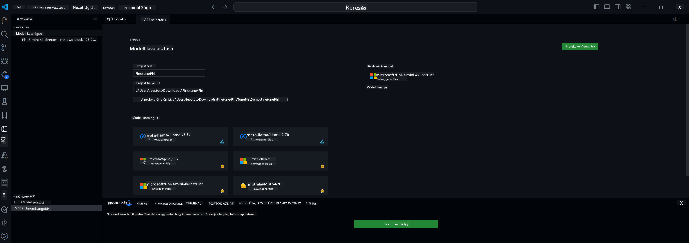

<!--
CO_OP_TRANSLATOR_METADATA:
{
  "original_hash": "c2bc0950f44919ac75a88c1a871680c2",
  "translation_date": "2025-07-17T09:19:13+00:00",
  "source_file": "md/03.FineTuning/Finetuning_VSCodeaitoolkit.md",
  "language_code": "hu"
}
-->
## Üdvözlünk az AI Toolkit for VS Code-ban

Az [AI Toolkit for VS Code](https://github.com/microsoft/vscode-ai-toolkit/tree/main) különböző modelleket hoz össze az Azure AI Studio Katalógusból és más katalógusokból, például a Hugging Face-ből. A toolkit leegyszerűsíti a generatív AI eszközökkel és modellekkel történő AI alkalmazásfejlesztés gyakori feladatait az alábbi módokon:
- Kezdj a modellek felfedezésével és a játszótérrel.
- Modell finomhangolás és inferencia helyi számítási erőforrásokkal.
- Távoli finomhangolás és inferencia Azure erőforrásokkal.

[AI Toolkit for VSCode telepítése](https://marketplace.visualstudio.com/items?itemName=ms-windows-ai-studio.windows-ai-studio)



**[Private Preview]** Egykattintásos Azure Container Apps előkészítés a modell finomhangolás és inferencia futtatásához a felhőben.

Most ugorjunk bele az AI alkalmazásfejlesztésbe:

- [Üdvözlünk az AI Toolkit for VS Code-ban](../../../../md/03.FineTuning)
- [Helyi fejlesztés](../../../../md/03.FineTuning)
  - [Előkészületek](../../../../md/03.FineTuning)
  - [Conda aktiválása](../../../../md/03.FineTuning)
  - [Csak alapmodell finomhangolás](../../../../md/03.FineTuning)
  - [Modell finomhangolás és inferencia](../../../../md/03.FineTuning)
  - [Modell finomhangolás](../../../../md/03.FineTuning)
  - [Microsoft Olive](../../../../md/03.FineTuning)
  - [Finomhangolási példák és források](../../../../md/03.FineTuning)
- [**\[Private Preview\]** Távoli fejlesztés](../../../../md/03.FineTuning)
  - [Előfeltételek](../../../../md/03.FineTuning)
  - [Távoli fejlesztési projekt beállítása](../../../../md/03.FineTuning)
  - [Azure erőforrások előkészítése](../../../../md/03.FineTuning)
  - [\[Opcionális\] Huggingface token hozzáadása az Azure Container App titokhoz](../../../../md/03.FineTuning)
  - [Finomhangolás futtatása](../../../../md/03.FineTuning)
  - [Inferencia végpont előkészítése](../../../../md/03.FineTuning)
  - [Inferencia végpont telepítése](../../../../md/03.FineTuning)
  - [Haladó használat](../../../../md/03.FineTuning)

## Helyi fejlesztés
### Előkészületek

1. Győződj meg róla, hogy az NVIDIA driver telepítve van a gépen.
2. Futtasd a `huggingface-cli login` parancsot, ha HF-et használsz az adatkészlethez.
3. Az `Olive` kulcsbeállítások magyarázata minden olyan beállításhoz, ami a memóriahasználatot módosítja.

### Conda aktiválása
Mivel WSL környezetet használunk, és az megosztott, manuálisan kell aktiválnod a conda környezetet. Ezután már futtathatod a finomhangolást vagy az inferenciát.

```bash
conda activate [conda-env-name] 
```

### Csak alapmodell finomhangolás
Ha csak az alapmodellt szeretnéd kipróbálni finomhangolás nélkül, a conda aktiválása után futtasd ezt a parancsot.

```bash
cd inference

# Web browser interface allows to adjust a few parameters like max new token length, temperature and so on.
# User has to manually open the link (e.g. http://0.0.0.0:7860) in a browser after gradio initiates the connections.
python gradio_chat.py --baseonly
```

### Modell finomhangolás és inferencia

Miután a munkaterület megnyílt egy fejlesztői konténerben, nyiss egy terminált (az alapértelmezett útvonal a projekt gyökérkönyvtára), majd futtasd az alábbi parancsot egy LLM finomhangolásához a kiválasztott adatkészleten.

```bash
python finetuning/invoke_olive.py 
```

A checkpointok és a végleges modell a `models` mappába kerülnek mentésre.

Ezután futtasd az inferenciát a finomhangolt modellel csevegésekben `console`-ban, `web böngészőben` vagy `prompt flow`-ban.

```bash
cd inference

# Console interface.
python console_chat.py

# Web browser interface allows to adjust a few parameters like max new token length, temperature and so on.
# User has to manually open the link (e.g. http://127.0.0.1:7860) in a browser after gradio initiates the connections.
python gradio_chat.py
```

A `prompt flow` használatához VS Code-ban kérjük, tekintsd meg ezt a [Gyors kezdési útmutatót](https://microsoft.github.io/promptflow/how-to-guides/quick-start.html).

### Modell finomhangolás

Ezután töltsd le a következő modellt az eszközöd GPU elérhetősége alapján.

A helyi finomhangolási munkamenet elindításához QLoRA használatával válassz egy modellt a katalógusunkból, amelyet finomhangolni szeretnél.
| Platform(ok) | GPU elérhető | Modell neve | Méret (GB) |
|---------|---------|--------|--------|
| Windows | Igen | Phi-3-mini-4k-**directml**-int4-awq-block-128-onnx | 2.13GB |
| Linux | Igen | Phi-3-mini-4k-**cuda**-int4-onnx | 2.30GB |
| Windows<br>Linux | Nem | Phi-3-mini-4k-**cpu**-int4-rtn-block-32-acc-level-4-onnx | 2.72GB |

**_Megjegyzés_** Az Azure fiók nem szükséges a modellek letöltéséhez.

A Phi3-mini (int4) modell mérete körülbelül 2GB-3GB. A letöltés néhány percet is igénybe vehet a hálózati sebességtől függően.

Kezdd a projekt nevének és helyének kiválasztásával.
Ezután válassz egy modellt a katalógusból. A projekt sablon letöltésére kér majd a rendszer. Ezután kattints a „Projekt konfigurálása” gombra a különböző beállítások módosításához.

### Microsoft Olive

Az [Olive](https://microsoft.github.io/Olive/why-olive.html) segítségével futtatjuk a QLoRA finomhangolást egy PyTorch modellen a katalógusunkból. Minden beállítás alapértelmezett értékre van állítva, hogy optimalizálja a finomhangolási folyamat helyi futtatását a memóriahatékony használat érdekében, de az adott helyzetedhez igazítható.

### Finomhangolási példák és források

- [Finomhangolás kezdő útmutató](https://learn.microsoft.com/windows/ai/toolkit/toolkit-fine-tune)
- [Finomhangolás HuggingFace adatkészlettel](https://github.com/microsoft/vscode-ai-toolkit/blob/main/archive/walkthrough-hf-dataset.md)
- [Finomhangolás egyszerű adatkészlettel](https://github.com/microsoft/vscode-ai-toolkit/blob/main/archive/walkthrough-simple-dataset.md)

## **[Private Preview]** Távoli fejlesztés

### Előfeltételek

1. Ahhoz, hogy a modell finomhangolást a távoli Azure Container App környezetedben futtasd, győződj meg róla, hogy az előfizetésed rendelkezik elegendő GPU kapacitással. Küldj be egy [támogatási kérelmet](https://azure.microsoft.com/support/create-ticket/), hogy megkapd a szükséges kapacitást az alkalmazásodhoz. [További információ a GPU kapacitásról](https://learn.microsoft.com/azure/container-apps/workload-profiles-overview)
2. Ha privát adatkészletet használsz a HuggingFace-en, győződj meg róla, hogy rendelkezel [HuggingFace fiókkal](https://huggingface.co/?WT.mc_id=aiml-137032-kinfeylo) és [hozz létre hozzáférési tokent](https://huggingface.co/docs/hub/security-tokens?WT.mc_id=aiml-137032-kinfeylo)
3. Engedélyezd a Távoli finomhangolás és inferencia funkciót az AI Toolkit for VS Code-ban
   1. Nyisd meg a VS Code beállításait a *Fájl -> Beállítások -> Beállítások* menüpontban.
   2. Navigálj az *Extensions* részhez, majd válaszd az *AI Toolkit*-et.
   3. Kapcsold be az *"Enable Remote Fine-tuning And Inference"* opciót.
   4. Indítsd újra a VS Code-ot a változások érvényesítéséhez.

- [Távoli finomhangolás](https://github.com/microsoft/vscode-ai-toolkit/blob/main/archive/remote-finetuning.md)

### Távoli fejlesztési projekt beállítása
1. Futtasd a parancspalettán az `AI Toolkit: Focus on Resource View` parancsot.
2. Navigálj a *Model Fine-tuning* részhez a modell katalógus eléréséhez. Adj nevet a projektednek és válaszd ki a helyét a gépeden. Ezután kattints a *"Configure Project"* gombra.
3. Projekt konfiguráció
    1. Kerüld el a *"Fine-tune locally"* opció bekapcsolását.
    2. Megjelennek az Olive konfigurációs beállításai előre beállított alapértékekkel. Kérjük, igazítsd és töltsd ki ezeket a beállításokat az igényeid szerint.
    3. Folytasd a *Generate Project* lépéssel. Ez a lépés WSL-t használ, és egy új Conda környezetet állít be, előkészítve a jövőbeni fejlesztéseket, amelyek Dev Containereket is tartalmaznak.
4. Kattints a *"Relaunch Window In Workspace"* gombra a távoli fejlesztési projekt megnyitásához.

> **Megjegyzés:** A projekt jelenleg vagy helyileg, vagy távolról működik az AI Toolkit for VS Code-ban. Ha a projekt létrehozásakor bekapcsolod a *"Fine-tune locally"* opciót, akkor csak WSL-ben fog futni, távoli fejlesztési lehetőség nélkül. Ha nem kapcsolod be ezt az opciót, a projekt kizárólag a távoli Azure Container App környezetben fog működni.

### Azure erőforrások előkészítése
A távoli finomhangolás elindításához először elő kell készítened az Azure erőforrásokat. Ezt a parancspalettán a `AI Toolkit: Provision Azure Container Apps job for fine-tuning` parancs futtatásával teheted meg.

A folyamat állapotát az output csatornában megjelenő linken követheted nyomon.

### [Opcionális] Huggingface token hozzáadása az Azure Container App titokhoz
Ha privát HuggingFace adatkészletet használsz, állítsd be a HuggingFace tokened környezeti változóként, hogy elkerüld a kézi bejelentkezést a Hugging Face Hub-on.
Ezt megteheted az `AI Toolkit: Add Azure Container Apps Job secret for fine-tuning` paranccsal. A titok nevét állítsd [`HF_TOKEN`](https://huggingface.co/docs/huggingface_hub/package_reference/environment_variables#hftoken)-re, és a titok értékeként használd a Hugging Face tokenedet.

### Finomhangolás futtatása
A távoli finomhangolási feladat elindításához futtasd az `AI Toolkit: Run fine-tuning` parancsot.

A rendszer- és konzolnaplók megtekintéséhez látogass el az Azure portálra az output panelben található linken keresztül (további lépések a [Naplók megtekintése és lekérdezése Azure-on](https://aka.ms/ai-toolkit/remote-provision#view-and-query-logs-on-azure) oldalon). Vagy közvetlenül a VSCode output panelben is megtekintheted a konzolnaplókat az `AI Toolkit: Show the running fine-tuning job streaming logs` parancs futtatásával.
> **Megjegyzés:** A feladat sorban állhat erőforráshiány miatt. Ha a napló nem jelenik meg, futtasd újra az `AI Toolkit: Show the running fine-tuning job streaming logs` parancsot, várj egy kicsit, majd ismételd meg a parancsot a streaming napló újracsatlakoztatásához.

A folyamat során QLoRA-t használunk a finomhangoláshoz, amely LoRA adaptereket hoz létre a modell számára az inferencia során.
A finomhangolás eredményei az Azure Files-ban kerülnek tárolásra.

### Inferencia végpont előkészítése
Miután az adapterek betanultak a távoli környezetben, egy egyszerű Gradio alkalmazással léphetsz interakcióba a modellel.
Hasonlóan a finomhangolási folyamathoz, az inferencia távoli futtatásához is elő kell készítened az Azure erőforrásokat az `AI Toolkit: Provision Azure Container Apps for inference` parancs futtatásával a parancspalettán.

Alapértelmezés szerint az előfizetés és az erőforráscsoport az inferenciához megegyezik a finomhangoláshoz használtakkal. Az inferencia ugyanazt az Azure Container App környezetet használja, és hozzáfér a finomhangolás során az Azure Files-ba mentett modellhez és adapterhez.

### Inferencia végpont telepítése
Ha módosítani szeretnéd az inferencia kódját vagy újratölteni az inferencia modellt, futtasd az `AI Toolkit: Deploy for inference` parancsot. Ez szinkronizálja a legfrissebb kódodat az Azure Container App-pel, és újraindítja a replikát.

A telepítés sikeres befejezése után az inferencia API elérhetővé válik a VSCode értesítésében megjelenő „*Go to Inference Endpoint*” gombra kattintva. Vagy a web API végpont megtalálható az `ACA_APP_ENDPOINT` alatt a `./infra/inference.config.json` fájlban és az output panelben. Most már készen állsz a modell értékelésére ezen a végponton keresztül.

### Haladó használat
További információkért a távoli fejlesztésről az AI Toolkit segítségével, tekintsd meg a [Modellek távoli finomhangolása](https://aka.ms/ai-toolkit/remote-provision) és a [Finomhangolt modellel történő inferencia](https://aka.ms/ai-toolkit/remote-inference) dokumentációkat.

**Jogi nyilatkozat**:  
Ez a dokumentum az AI fordító szolgáltatás, a [Co-op Translator](https://github.com/Azure/co-op-translator) segítségével készült. Bár a pontosságra törekszünk, kérjük, vegye figyelembe, hogy az automatikus fordítások hibákat vagy pontatlanságokat tartalmazhatnak. Az eredeti dokumentum az anyanyelvén tekintendő hiteles forrásnak. Kritikus információk esetén professzionális emberi fordítást javaslunk. Nem vállalunk felelősséget a fordítás használatából eredő félreértésekért vagy téves értelmezésekért.