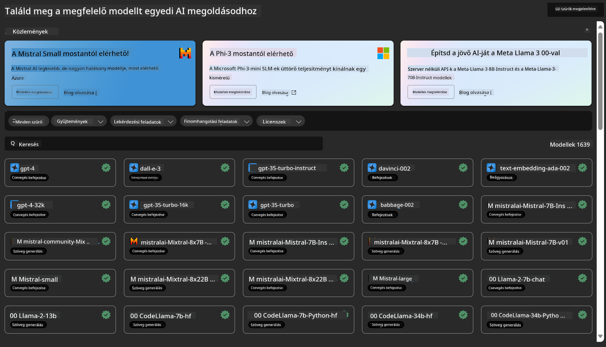

<!--
CO_OP_TRANSLATOR_METADATA:
{
  "original_hash": "7fe541373802e33568e94e13226d463c",
  "translation_date": "2025-05-09T22:23:09+00:00",
  "source_file": "md/03.FineTuning/Introduce_AzureML.md",
  "language_code": "hu"
}
-->
# **Ismerkedés az Azure Machine Learning Service-szel**

[Azure Machine Learning](https://ml.azure.com?WT.mc_id=aiml-138114-kinfeylo) egy felhőalapú szolgáltatás, amely felgyorsítja és kezeli a gépi tanulási (ML) projektek teljes életciklusát.

Az ML szakemberek, adatkutatók és mérnökök napi munkájuk során használhatják a következőkre:

- Modellek tanítása és üzembe helyezése.
- A gépi tanulási műveletek (MLOps) kezelése.
- Azure Machine Learningben létrehozhatsz egy modellt, vagy használhatsz nyílt forráskódú platformokon, például PyTorch, TensorFlow vagy scikit-learn által készített modelleket.
- Az MLOps eszközök segítenek a modellek monitorozásában, újratanításában és újraüzembe helyezésében.

## Kinek szól az Azure Machine Learning?

**Adattudósok és ML mérnökök**

Olyan eszközöket használhatnak, amelyek felgyorsítják és automatizálják a napi munkafolyamataikat.
Az Azure ML funkciókat kínál a méltányosság, magyarázhatóság, nyomon követhetőség és auditálhatóság terén.

**Alkalmazásfejlesztők**

Zökkenőmentesen integrálhatják a modelleket alkalmazásokba vagy szolgáltatásokba.

**Platformfejlesztők**

Hozzáférnek egy erőteljes eszközkészlethez, amelyet tartós Azure Resource Manager API-k támogatnak.
Ezek az eszközök lehetővé teszik fejlett ML eszközök fejlesztését.

**Vállalatok**

A Microsoft Azure felhőjében működve a vállalatok élvezhetik a megszokott biztonsági és szerepalapú hozzáférés-vezérlést.
Projektjeiket úgy állíthatják be, hogy szabályozzák a védett adatokhoz és bizonyos műveletekhez való hozzáférést.

## Hatékonyság minden csapattagnak

Az ML projektek gyakran igényelnek változatos képességekkel rendelkező csapatot az építéshez és fenntartáshoz.

Az Azure ML eszközöket biztosít, amelyek lehetővé teszik, hogy:
- Csapatoddal együttműködj megosztott jegyzetfüzeteken, számítási erőforrásokon, szerver nélküli számításon, adatokon és környezeteken keresztül.
- Modelleket fejlessz méltányosság, magyarázhatóság, nyomon követhetőség és auditálhatóság szempontjából, hogy megfeleljen a származtatási és auditkövetelményeknek.
- Gyorsan és egyszerűen telepíts ML modelleket nagy léptékben, és hatékonyan kezeld, irányítsd őket MLOps segítségével.
- Gépi tanulási munkaterheléseket futtass bárhol beépített irányítással, biztonsággal és megfeleléssel.

## Keresztplatformos eszközök

Az ML csapat bármely tagja használhatja a kedvenc eszközeit a feladat elvégzéséhez.
Legyen szó gyors kísérletezésről, hiperparaméter hangolásról, pipeline-ok építéséről vagy inferenciák kezeléséről, ismerős felületeket használhatsz, például:
- Azure Machine Learning Studio
- Python SDK (v2)
- Azure CLI (v2)
- Azure Resource Manager REST API-k

Ahogy finomítod a modelleket és együttműködsz a fejlesztési ciklus során, megoszthatod és megtalálhatod az eszközöket, erőforrásokat és mérőszámokat az Azure Machine Learning studio felületén.

## **LLM/SLM az Azure ML-ben**

Az Azure ML számos LLM/SLM-hez kapcsolódó funkciót adott hozzá, amelyek az LLMOps és SLMOps kombinálásával egy vállalati szintű generatív mesterséges intelligencia technológiai platformot hoznak létre.

### **Model Katalógus**

A vállalati felhasználók különböző modelleket telepíthetnek különböző üzleti helyzetekhez a Model Katalógus segítségével, és Model as Service szolgáltatásként elérhetővé tehetik azokat vállalati fejlesztők vagy felhasználók számára.

Az Azure Machine Learning studio Model Katalógusa az a központ, ahol széles körű modelleket fedezhetsz fel és használhatsz, amelyek segítségével generatív AI alkalmazásokat építhetsz. A katalógus több száz modellt tartalmaz különböző szolgáltatóktól, mint az Azure OpenAI service, Mistral, Meta, Cohere, Nvidia, Hugging Face, valamint Microsoft által tanított modellek. A Microsofttól eltérő szolgáltatók modelljei Non-Microsoft Products kategóriába tartoznak a Microsoft Termékfeltételei szerint, és a modellhez mellékelt feltételek vonatkoznak rájuk.

### **Job Pipeline**

A gépi tanulási pipeline lényege, hogy egy teljes gépi tanulási feladatot több lépéses munkafolyamattá bontson. Minden lépés egy kezelhető komponens, amely egyénileg fejleszthető, optimalizálható, konfigurálható és automatizálható. A lépések jól definiált interfészeken keresztül kapcsolódnak egymáshoz. Az Azure Machine Learning pipeline szolgáltatás automatikusan összehangolja a pipeline lépései közötti függőségeket.

Az SLM / LLM finomhangolásakor a pipeline segítségével kezelhetjük az adatokat, a tanítást és a generálási folyamatokat.

### **Prompt flow**

Az Azure Machine Learning prompt flow használatának előnyei  
Az Azure Machine Learning prompt flow számos előnyt kínál, amelyek segítik a felhasználókat az ötleteléstől a kísérletezésen át a végleges, gyártásra kész LLM-alapú alkalmazásokig:

**Prompt mérnökség rugalmassága**

Interaktív szerkesztési élmény: Az Azure Machine Learning prompt flow vizuálisan ábrázolja a folyamat szerkezetét, így a felhasználók könnyen átláthatják és navigálhatnak a projektjeikben. Jegyzetfüzet-szerű kódolási élményt is kínál a hatékony fejlesztéshez és hibakereséshez.  
Prompt hangolási variánsok: Több prompt variánst hozhatsz létre és hasonlíthatsz össze, támogatva az iteratív finomítást.

Értékelés: Beépített értékelő folyamatok segítik a promptok és folyamatok minőségének és hatékonyságának megítélését.

Átfogó erőforrások: A prompt flow beépített eszközöket, mintákat és sablonokat tartalmazó könyvtárral rendelkezik, amelyek fejlesztési kiindulópontként szolgálnak, ösztönözve a kreativitást és gyorsítva a munkát.

**Vállalati szintű felkészültség LLM-alapú alkalmazásokhoz**

Együttműködés: Az Azure Machine Learning prompt flow támogatja a csapatmunkát, lehetővé téve több felhasználó számára, hogy együtt dolgozzanak prompt mérnöki projekteken, megosszák tudásukat és verziókövetést alkalmazzanak.

Mindent egyben platform: A prompt flow leegyszerűsíti a teljes prompt mérnökségi folyamatot a fejlesztéstől és értékeléstől a telepítésig és monitorozásig. A felhasználók könnyedén telepíthetik folyamataikat Azure Machine Learning végpontként, és valós időben követhetik teljesítményüket, biztosítva az optimális működést és folyamatos fejlesztést.

Azure Machine Learning vállalati felkészültségi megoldások: A prompt flow kihasználja az Azure Machine Learning robusztus vállalati felkészültségi megoldásait, amelyek biztonságos, skálázható és megbízható alapot biztosítanak a fejlesztéshez, kísérletezéshez és telepítéshez.

Az Azure Machine Learning prompt flow-val a felhasználók felszabadíthatják prompt mérnökségi rugalmasságukat, hatékonyan együttműködhetnek, és vállalati szintű megoldásokat használhatnak sikeres LLM-alapú alkalmazásfejlesztéshez és telepítéshez.

Az Azure ML számítási kapacitásának, adatainak és különböző komponenseinek kombinálásával a vállalati fejlesztők könnyedén építhetik meg saját mesterséges intelligencia alkalmazásaikat.

**Nyilatkozat:**  
Ez a dokumentum az AI fordító szolgáltatás, a [Co-op Translator](https://github.com/Azure/co-op-translator) segítségével készült. Bár a pontosságra törekszünk, kérjük, vegye figyelembe, hogy az automatikus fordítások hibákat vagy pontatlanságokat tartalmazhatnak. Az eredeti dokumentum az anyanyelvén tekintendő hiteles forrásnak. Fontos információk esetén professzionális emberi fordítást javaslunk. Nem vállalunk felelősséget az ebből a fordításból eredő félreértésekért vagy téves értelmezésekért.