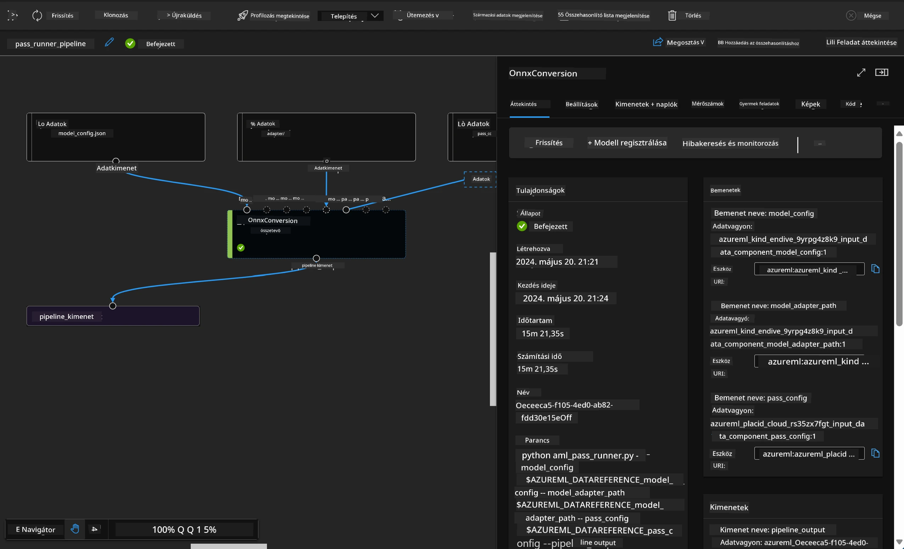

<!--
CO_OP_TRANSLATOR_METADATA:
{
  "original_hash": "7fe541373802e33568e94e13226d463c",
  "translation_date": "2025-07-17T09:46:52+00:00",
  "source_file": "md/03.FineTuning/Introduce_AzureML.md",
  "language_code": "hu"
}
-->
# **Ismerkedés az Azure Machine Learning szolgáltatással**

Az [Azure Machine Learning](https://ml.azure.com?WT.mc_id=aiml-138114-kinfeylo) egy felhőalapú szolgáltatás, amely felgyorsítja és kezeli a gépi tanulási (ML) projektek teljes életciklusát.

Az ML szakemberek, adatkutatók és mérnökök napi munkájuk során használhatják, hogy:

- Modelleket tanítsanak és telepítsenek.
- Gépi tanulási műveleteket (MLOps) kezeljenek.
- Azure Machine Learningben létrehozhatnak egy modellt, vagy használhatnak nyílt forráskódú platformokon, például PyTorch, TensorFlow vagy scikit-learn által készített modelleket.
- Az MLOps eszközök segítenek a modellek figyelésében, újratanításában és újratelepítésében.

## Kinek szól az Azure Machine Learning?

**Adatkutatók és ML mérnökök**

Olyan eszközöket használhatnak, amelyek felgyorsítják és automatizálják a napi munkafolyamataikat.  
Az Azure ML támogatja a méltányosságot, magyarázhatóságot, nyomon követést és auditálhatóságot.

**Alkalmazásfejlesztők**

Zökkenőmentesen integrálhatják a modelleket alkalmazásokba vagy szolgáltatásokba.

**Platformfejlesztők**

Hozzáférnek egy erős eszközkészlethez, amelyet tartós Azure Resource Manager API-k támogatnak.  
Ezek az eszközök lehetővé teszik fejlett ML eszközök építését.

**Vállalatok**

A Microsoft Azure felhőben dolgozva a vállalatok élvezhetik a megszokott biztonsági és szerepalapú hozzáférés-vezérlés előnyeit.  
Projektjeiket úgy állíthatják be, hogy védett adatokhoz és specifikus műveletekhez szabályozzák a hozzáférést.

## Termelékenység minden csapattagnak  
Az ML projektek gyakran igényelnek változatos képességekkel rendelkező csapatot a fejlesztéshez és karbantartáshoz.

Az Azure ML olyan eszközöket kínál, amelyek lehetővé teszik, hogy:  
- Csapatoddal együttműködj megosztott jegyzetfüzeteken, számítási erőforrásokon, szerver nélküli számításon, adatokon és környezeteken keresztül.  
- Modelleket fejlessz méltányosság, magyarázhatóság, nyomon követés és auditálhatóság figyelembevételével, hogy megfeleljen a származtatási és auditálási követelményeknek.  
- Gyorsan és egyszerűen telepíts ML modelleket nagy léptékben, és hatékonyan kezeld, irányítsd őket MLOps segítségével.  
- Gépi tanulási feladatokat futtass bárhol beépített irányítással, biztonsággal és megfeleléssel.

## Keresztplatformos eszközök

Az ML csapat bármely tagja használhatja a számára legmegfelelőbb eszközöket a feladat elvégzéséhez.  
Legyen szó gyors kísérletezésről, hiperparaméter hangolásról, pipeline-ok építéséről vagy következtetések kezeléséről, ismerős felületeket használhatsz, például:  
- Azure Machine Learning Studio  
- Python SDK (v2)  
- Azure CLI (v2)  
- Azure Resource Manager REST API-k

Ahogy finomítod a modelleket és együttműködsz a fejlesztési ciklus során, megoszthatod és megtalálhatod az eszközöket, erőforrásokat és mérőszámokat az Azure Machine Learning studio felhasználói felületén.

## **LLM/SLM az Azure ML-ben**

Az Azure ML számos LLM/SLM-hez kapcsolódó funkciót adott hozzá, ötvözve az LLMOps és SLMOps megoldásokat, hogy egy vállalati szintű generatív mesterséges intelligencia technológiai platformot hozzon létre.

### **Modellkatalógus**

A vállalati felhasználók különböző modelleket telepíthetnek különböző üzleti helyzetekhez a Modellkatalógus segítségével, és Model as Service szolgáltatásként kínálhatják azokat vállalati fejlesztők vagy felhasználók számára.

Az Azure Machine Learning studio Modellkatalógusa központként szolgál a generatív MI alkalmazások építéséhez szükséges széles körű modellek felfedezéséhez és használatához. A katalógus több száz modellt tartalmaz különböző szolgáltatóktól, mint az Azure OpenAI szolgáltatás, Mistral, Meta, Cohere, Nvidia, Hugging Face, beleértve a Microsoft által betanított modelleket is. A Microsofttól eltérő szolgáltatók modelljei a Microsoft Termékfeltételek szerint nem Microsoft termékeknek minősülnek, és a modellel együtt adott feltételek vonatkoznak rájuk.

### **Feladat pipeline**

A gépi tanulási pipeline lényege, hogy egy teljes gépi tanulási feladatot több lépésből álló munkafolyamattá bontson. Minden lépés egy kezelhető komponens, amely külön fejleszthető, optimalizálható, konfigurálható és automatizálható. A lépések jól definiált interfészeken keresztül kapcsolódnak egymáshoz. Az Azure Machine Learning pipeline szolgáltatás automatikusan összehangolja a pipeline lépései közötti függőségeket.

Az SLM / LLM finomhangolásakor a pipeline segítségével kezelhetjük az adatokat, a tanítást és a generálási folyamatokat.

### **Prompt flow**

Az Azure Machine Learning prompt flow használatának előnyei  
Az Azure Machine Learning prompt flow számos előnyt kínál, amelyek segítik a felhasználókat az ötleteléstől a kísérletezésen át a végleges, LLM-alapú alkalmazások előállításáig:

**Prompt mérnöki rugalmasság**

Interaktív szerkesztési élmény: Az Azure Machine Learning prompt flow vizuálisan ábrázolja a folyamat szerkezetét, így a felhasználók könnyen átláthatják és navigálhatnak projektjeikben. Jegyzetfüzet-szerű kódolási élményt is nyújt a hatékony fejlesztéshez és hibakereséshez.  
Prompt hangolási variánsok: Több prompt változatot hozhatnak létre és hasonlíthatnak össze, elősegítve az iteratív finomítást.

Értékelés: Beépített értékelési folyamatok segítik a promptok és folyamatok minőségének és hatékonyságának felmérését.

Átfogó erőforrások: Az Azure Machine Learning prompt flow beépített eszközök, minták és sablonok könyvtárát tartalmazza, amelyek fejlesztési kiindulópontként szolgálnak, ösztönözve a kreativitást és gyorsítva a folyamatot.

**Vállalati szintű felkészültség LLM-alapú alkalmazásokhoz**

Együttműködés: Az Azure Machine Learning prompt flow támogatja a csapatmunkát, lehetővé téve, hogy több felhasználó dolgozzon együtt prompt mérnöki projekteken, megossza a tudást és verziókövetést tartson fenn.

Minden egyben platform: Az Azure Machine Learning prompt flow leegyszerűsíti a teljes prompt mérnöki folyamatot a fejlesztéstől és értékeléstől a telepítésig és monitorozásig. A felhasználók könnyedén telepíthetik folyamataikat Azure Machine Learning végpontként, és valós időben figyelhetik teljesítményüket, biztosítva az optimális működést és folyamatos fejlesztést.

Azure Machine Learning vállalati felkészültségi megoldások: A prompt flow kihasználja az Azure Machine Learning erős vállalati felkészültségi megoldásait, biztonságos, skálázható és megbízható alapot nyújtva a folyamatok fejlesztéséhez, kísérletezéséhez és telepítéséhez.

Az Azure Machine Learning prompt flow segítségével a felhasználók kibontakoztathatják prompt mérnöki rugalmasságukat, hatékonyan működhetnek együtt, és vállalati szintű megoldásokat használhatnak sikeres LLM-alapú alkalmazások fejlesztéséhez és telepítéséhez.

Az Azure ML számítási kapacitásának, adatainak és különböző komponenseinek kombinálásával a vállalati fejlesztők könnyedén építhetnek saját mesterséges intelligencia alkalmazásokat.

**Jogi nyilatkozat**:  
Ez a dokumentum az AI fordító szolgáltatás, a [Co-op Translator](https://github.com/Azure/co-op-translator) segítségével készült. Bár a pontosságra törekszünk, kérjük, vegye figyelembe, hogy az automatikus fordítások hibákat vagy pontatlanságokat tartalmazhatnak. Az eredeti dokumentum az anyanyelvén tekintendő hiteles forrásnak. Fontos információk esetén szakmai, emberi fordítást javaslunk. Nem vállalunk felelősséget az ebből a fordításból eredő félreértésekért vagy téves értelmezésekért.