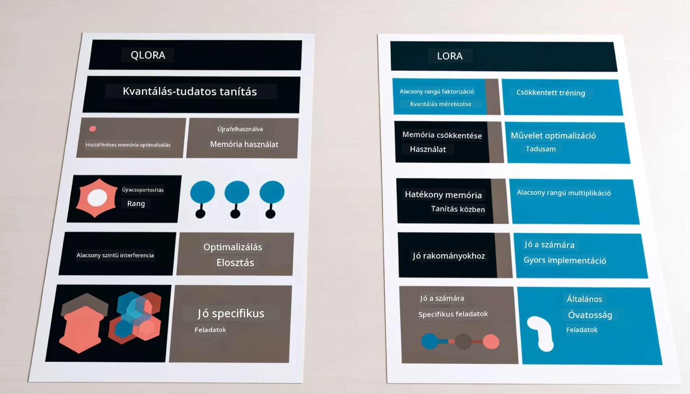

<!--
CO_OP_TRANSLATOR_METADATA:
{
  "original_hash": "743d7e9cb9c4e8ea642d77bee657a7fa",
  "translation_date": "2025-07-17T10:00:03+00:00",
  "source_file": "md/03.FineTuning/LetPhi3gotoIndustriy.md",
  "language_code": "hu"
}
-->
# **Engedd, hogy a Phi-3 iparági szakértővé váljon**

Ahhoz, hogy a Phi-3 modellt egy iparágban alkalmazzuk, iparági üzleti adatokat kell hozzáadni a Phi-3 modellhez. Két különböző lehetőségünk van: az első a RAG (Retrieval Augmented Generation), a második pedig a Fine Tuning.

## **RAG vs Fine-Tuning**

### **Retrieval Augmented Generation**

A RAG adatlekérés + szöveggenerálás. A vállalat strukturált és strukturálatlan adatait egy vektoralapú adatbázisban tároljuk. Amikor releváns tartalmat keresünk, megtaláljuk a kapcsolódó összefoglalót és tartalmat, hogy kontextust alkossunk, majd az LLM/SLM szövegkiegészítő képességét kombinálva generálunk tartalmat.

### **Fine-tuning**

A Fine-tuning egy adott modell továbbfejlesztésén alapul. Nem kell a modell algoritmusával kezdeni, de az adatok folyamatos gyűjtése szükséges. Ha pontosabb terminológiára és nyelvi kifejezésre van szükség az iparági alkalmazásokban, a fine-tuning jobb választás. Viszont ha az adatok gyakran változnak, a fine-tuning bonyolulttá válhat.

### **Hogyan válasszunk**

1. Ha a válaszunkhoz külső adatok bevonása szükséges, a RAG a legjobb választás.

2. Ha stabil és pontos iparági tudást kell szolgáltatni, a fine-tuning jó választás. A RAG a releváns tartalom előhívását helyezi előtérbe, de nem mindig ragadja meg a szakmai finomságokat.

3. A fine-tuninghoz magas minőségű adathalmaz szükséges, és ha csak kis adatkörrel dolgozunk, nem hoz jelentős különbséget. A RAG rugalmasabb.

4. A fine-tuning egy fekete doboz, egyfajta metafizika, nehéz megérteni a belső működését. Ezzel szemben a RAG könnyebbé teszi az adatforrások megtalálását, így hatékonyan lehet korrigálni a tévesztéseket vagy hibás tartalmakat, és jobb átláthatóságot biztosít.

### **Forgatókönyvek**

1. Vertikális iparágak, ahol specifikus szakmai szókincs és kifejezések szükségesek, ***Fine-tuning*** a legjobb választás.

2. Kérdés-válasz rendszerek, amelyek különböző tudáspontok szintézisét igénylik, ***RAG*** a legjobb választás.

3. Automatizált üzleti folyamatok kombinációja esetén ***RAG + Fine-tuning*** a legjobb választás.

## **Hogyan használjuk a RAG-ot**

A vektoralapú adatbázis olyan adatgyűjtemény, amely matematikai formában tárolja az adatokat. A vektoralapú adatbázisok megkönnyítik a gépi tanulási modellek számára a korábbi bemenetek megjegyzését, lehetővé téve a gépi tanulás alkalmazását olyan esetekben, mint a keresés, ajánlások és szöveggenerálás. Az adatok hasonlósági metrikák alapján azonosíthatók, nem pedig pontos egyezés alapján, így a számítógépes modellek jobban megértik az adatok kontextusát.

A vektoralapú adatbázis kulcsfontosságú a RAG megvalósításához. Az adatokat vektormodellek segítségével, mint például a text-embedding-3, jina-ai-embedding stb., alakíthatjuk át vektoros tárolóvá.

További információ a RAG alkalmazás létrehozásáról: [https://github.com/microsoft/Phi-3CookBook](https://github.com/microsoft/Phi-3CookBook?WT.mc_id=aiml-138114-kinfeylo)

## **Hogyan használjuk a Fine-tuningot**

A Fine-tuningban gyakran használt algoritmusok a Lora és a QLora. Hogyan válasszunk?
- [További információ ezzel a mintanotebookkal](../../../../code/04.Finetuning/Phi_3_Inference_Finetuning.ipynb)
- [Python FineTuning példa](../../../../code/04.Finetuning/FineTrainingScript.py)

### **Lora és QLora**

A LoRA (Low-Rank Adaptation) és a QLoRA (Quantized Low-Rank Adaptation) olyan technikák, amelyeket nagy nyelvi modellek (LLM-ek) finomhangolására használnak a Parameter Efficient Fine Tuning (PEFT) módszerével. A PEFT technikák célja, hogy hatékonyabban képezzék a modelleket, mint a hagyományos módszerek.

A LoRA egy önálló finomhangolási technika, amely csökkenti a memóriaigényt azáltal, hogy alacsony rangú közelítést alkalmaz a súlyfrissítő mátrixra. Gyors képzési időt kínál, és teljesítménye közel áll a hagyományos fine-tuninghoz.

A QLoRA a LoRA kiterjesztett változata, amely kvantálási technikákat alkalmaz a memóriahasználat további csökkentésére. A QLoRA a súlyparaméterek pontosságát 4 bitesre kvantálja a betanított LLM-ben, ami memóriahatékonyabb, mint a LoRA. Ugyanakkor a QLoRA képzés körülbelül 30%-kal lassabb a LoRA-hoz képest az extra kvantálási és dekvantálási lépések miatt.

A QLoRA a LoRA-t kiegészítőként használja a kvantálás során keletkező hibák javítására. A QLoRA lehetővé teszi hatalmas, több milliárd paraméteres modellek finomhangolását viszonylag kis, könnyen elérhető GPU-kon. Például a QLoRA képes finomhangolni egy 70 milliárd paraméteres modellt, amelyhez normál esetben 36 GPU szükséges, mindössze 2-vel.

**Jogi nyilatkozat**:  
Ez a dokumentum az AI fordító szolgáltatás, a [Co-op Translator](https://github.com/Azure/co-op-translator) segítségével készült. Bár a pontosságra törekszünk, kérjük, vegye figyelembe, hogy az automatikus fordítások hibákat vagy pontatlanságokat tartalmazhatnak. Az eredeti dokumentum az anyanyelvén tekintendő hiteles forrásnak. Kritikus információk esetén professzionális emberi fordítást javaslunk. Nem vállalunk felelősséget a fordítás használatából eredő félreértésekért vagy téves értelmezésekért.