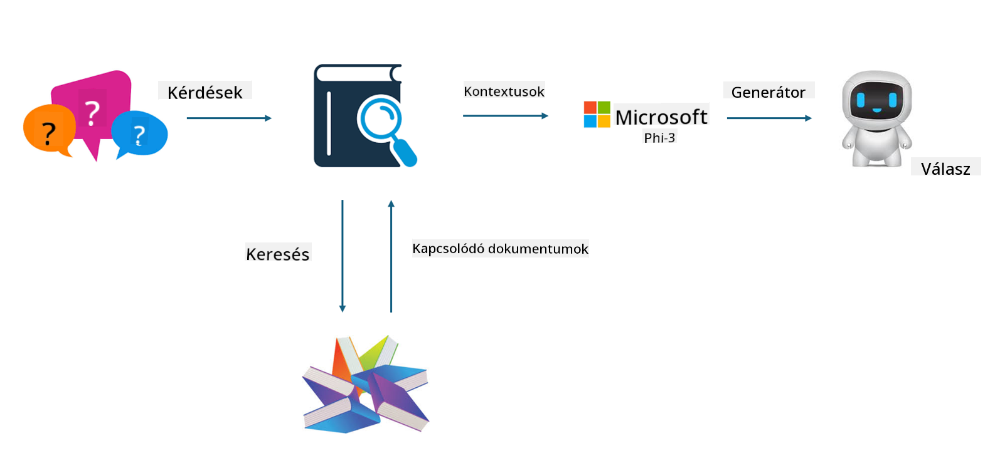

<!--
CO_OP_TRANSLATOR_METADATA:
{
  "original_hash": "743d7e9cb9c4e8ea642d77bee657a7fa",
  "translation_date": "2025-05-09T22:29:08+00:00",
  "source_file": "md/03.FineTuning/LetPhi3gotoIndustriy.md",
  "language_code": "hu"
}
-->
# **Tedd a Phi-3-at iparági szakértővé**

Ahhoz, hogy a Phi-3 modellt egy iparágban alkalmazzuk, hozzá kell adni az iparági üzleti adatokat a Phi-3 modellhez. Két lehetőségünk van: az egyik a RAG (Retrieval Augmented Generation), a másik pedig a Fine Tuning.

## **RAG vs Fine-Tuning**

### **Retrieval Augmented Generation**

A RAG adatlekérés + szöveggenerálás. A vállalat strukturált és strukturálatlan adatai egy vektordatabázisban tárolódnak. Amikor releváns tartalmat keresünk, a megfelelő összefoglaló és tartalom megtalálásával kontextust alkotunk, majd az LLM/SLM szövegkiegészítő képességét felhasználva generálunk tartalmat.

### **Fine-tuning**

A Fine-tuning egy adott modell fejlesztésén alapul. Nem szükséges a modell algoritmusával kezdeni, de az adatok folyamatos gyűjtése szükséges. Ha pontosabb terminológiára és nyelvi megfogalmazásra van szükség az iparági alkalmazásokban, a fine-tuning a jobb választás. Ha azonban az adatok gyakran változnak, a fine-tuning bonyolulttá válhat.

### **Hogyan válasszunk**

1. Ha a válaszunk külső adatok bevonását igényli, a RAG a legjobb választás.

2. Ha stabil és pontos iparági tudást kell biztosítani, a fine-tuning jó megoldás. A RAG a releváns tartalmak előhúzását helyezi előtérbe, de nem mindig ragadja meg a szakmai finomságokat.

3. A fine-tuninghoz minőségi adatkészlet szükséges, és ha csak kis adathalmazról van szó, nem hoz nagy különbséget. A RAG rugalmasabb.

4. A fine-tuning fekete doboz, egyfajta misztika, nehéz megérteni a belső működését. Ezzel szemben a RAG könnyebbé teszi az adatforrások felkutatását, így hatékonyabban korrigálhatóak a téves vagy kitalált tartalmak, és jobb átláthatóságot nyújt.

### **Forgatókönyvek**

1. Vertikális iparágak, amelyek speciális szakmai szókincset és kifejezéseket igényelnek, ***Fine-tuning*** a legjobb választás.

2. Kérdés-válasz rendszerek, amelyek különböző tudáspontok szintetizálását igénylik, ***RAG*** a legjobb választás.

3. Az automatizált üzleti folyamatok kombinációja esetén ***RAG + Fine-tuning*** a legjobb megoldás.

## **Hogyan használd a RAG-ot**

A vektordatabázis olyan adatgyűjtemény, amely matematikai formában tárolja az adatokat. A vektordatabázisok megkönnyítik a gépi tanulási modellek számára a korábbi bemenetek megjegyzését, lehetővé téve a gépi tanulás alkalmazását keresés, ajánlások és szöveggenerálás támogatására. Az adatokat hasonlósági metrikák alapján azonosítják, nem pedig pontos egyezés alapján, így a számítógépes modellek jobban értik az adatok kontextusát.

A vektordatabázis kulcsfontosságú a RAG megvalósításához. Az adatokat vektormodellek, például text-embedding-3, jina-ai-embedding segítségével alakíthatjuk át vektortárolóvá.

További információ a RAG alkalmazás létrehozásáról [https://github.com/microsoft/Phi-3CookBook](https://github.com/microsoft/Phi-3CookBook?WT.mc_id=aiml-138114-kinfeylo)

## **Hogyan használd a Fine-tuningot**

A Fine-tuningban gyakran használt algoritmusok a Lora és a QLora. Hogyan válasszunk?
- [További információ ezzel a mintanotebookkal](../../../../code/04.Finetuning/Phi_3_Inference_Finetuning.ipynb)
- [Python FineTuning példa](../../../../code/04.Finetuning/FineTrainingScript.py)

### **Lora és QLora**

A LoRA (Low-Rank Adaptation) és a QLoRA (Quantized Low-Rank Adaptation) olyan technikák, amelyeket nagy nyelvi modellek (LLM-ek) finomhangolására használnak Parameter Efficient Fine Tuning (PEFT) segítségével. A PEFT technikák hatékonyabb modelltanítást tesznek lehetővé a hagyományos módszereknél.

A LoRA egy önálló finomhangolási technika, amely alacsony rangú közelítést alkalmaz a súlyfrissítési mátrixra, így csökkenti a memóriaigényt. Gyors tanítási időt kínál, miközben közel áll a hagyományos fine-tuning teljesítményéhez.

A QLoRA a LoRA kiterjesztett változata, amely kvantálási technikákat alkalmaz a memóriahasználat további csökkentésére. A QLoRA a betanított LLM súlyparamétereinek pontosságát 4 bitesre kvantálja, ami memóriahatékonyabb, mint a LoRA. Ugyanakkor a QLoRA tanítása kb. 30%-kal lassabb a LoRA-hoz képest az extra kvantálási és dekvantálási lépések miatt.

A QLoRA a LoRA-t használja kiegészítésként, hogy korrigálja a kvantálás során keletkező hibákat. A QLoRA lehetővé teszi hatalmas, több milliárd paraméteres modellek finomhangolását viszonylag kis, könnyen elérhető GPU-kon. Például a QLoRA képes egy 70 milliárd paraméteres modellt finomhangolni, amelyhez eredetileg 36 GPU-ra lenne szükség, mindössze 2-vel.

**Jogi nyilatkozat**:  
Ezt a dokumentumot az AI fordító szolgáltatás, a [Co-op Translator](https://github.com/Azure/co-op-translator) segítségével fordítottuk le. Bár a pontosságra törekszünk, kérjük, vegye figyelembe, hogy az automatikus fordítások hibákat vagy pontatlanságokat tartalmazhatnak. Az eredeti dokumentum az anyanyelvén tekintendő hiteles forrásnak. Kritikus információk esetén szakmai, emberi fordítást javaslunk. Nem vállalunk felelősséget a fordítás használatából eredő félreértésekért vagy félreértelmezésekért.