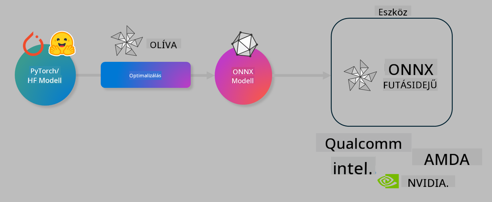

<!--
CO_OP_TRANSLATOR_METADATA:
{
  "original_hash": "6bbe47de3b974df7eea29dfeccf6032b",
  "translation_date": "2025-05-09T22:40:13+00:00",
  "source_file": "md/03.FineTuning/olive-lab/readme.md",
  "language_code": "hu"
}
-->
# Lab. AI modellek optimalizálása eszközön történő futtatáshoz

## Bevezetés

> [!IMPORTANT]  
> Ehhez a laborhoz szükség van egy **Nvidia A10 vagy A100 GPU**-ra, valamint a hozzá tartozó driverekre és a CUDA toolkit (12-es vagy újabb verzió) telepítésére.

> [!NOTE]  
> Ez egy **35 perces** labor, amely gyakorlati bevezetést nyújt az OLIVE használatával történő eszközön futó modellek optimalizálásának alapfogalmaiba.

## Tanulási célok

A labor végére képes leszel az OLIVE segítségével:

- AWQ kvantálási módszerrel kvantálni egy AI modellt.
- Finomhangolni egy AI modellt egy adott feladatra.
- LoRA adaptereket (finomhangolt modellt) generálni az ONNX Runtime eszközön hatékony futtatáshoz.

### Mi az Olive

Az Olive (*O*NNX *live*) egy modelloptimalizáló eszközkészlet, amelyhez tartozik egy parancssori felület is, és lehetővé teszi, hogy ONNX runtime +++https://onnxruntime.ai+++ környezethez minőségi és teljesítménybeli szempontból optimalizált modelleket szállíts.



Az Olive bemenete általában egy PyTorch vagy Hugging Face modell, a kimenete pedig egy optimalizált ONNX modell, amely egy ONNX runtime-ot futtató eszközön (telepítési cél) kerül végrehajtásra. Az Olive a telepítési cél AI gyorsítójára (NPU, GPU, CPU) optimalizálja a modellt, amelyet olyan hardvergyártók biztosítanak, mint a Qualcomm, AMD, Nvidia vagy Intel.

Az Olive egy *workflow*-t hajt végre, ami egy rendezett sorozata az egyes modelloptimalizációs feladatoknak, amelyeket *passes*-nek nevezünk – például modell tömörítés, gráf rögzítés, kvantálás, gráf optimalizáció. Minden pass-nek van egy paraméterhalmaza, amely finomhangolható a legjobb metrikák, például pontosság és késleltetés eléréséhez, amelyeket a megfelelő értékelő mér. Az Olive keresési stratégiát alkalmaz, amely egy keresési algoritmust használ arra, hogy automatikusan hangolja az egyes pass-eket külön-külön vagy együttesen.

#### Az Olive előnyei

- **Csökkenti a kézi próbálkozásokkal járó frusztrációt és időráfordítást** a gráf optimalizáció, tömörítés és kvantálás különböző technikáinak kipróbálásában. Határozd meg a minőségi és teljesítményi korlátokat, és az Olive automatikusan megtalálja a legjobb modellt.
- **40+ beépített modelloptimalizációs komponens**, amelyek lefedik a legmodernebb kvantálási, tömörítési, gráf optimalizációs és finomhangolási technikákat.
- **Könnyen használható CLI** a gyakori modelloptimalizációs feladatokhoz. Például: olive quantize, olive auto-opt, olive finetune.
- Beépített modellcsomagolás és telepítés.
- Támogatja a **Multi LoRA kiszolgálást**.
- YAML/JSON segítségével munkafolyamatok építése a modelloptimalizáció és telepítés feladatainak összehangolására.
- **Hugging Face** és **Azure AI** integráció.
- Beépített **gyorsítótárazási** mechanizmus a **költségmegtakarítás érdekében**.

## Labor utasítások

> [!NOTE]  
> Kérjük, győződj meg róla, hogy létrehoztad az Azure AI Hubodat és Projektedet, valamint beállítottad az A100 számítási kapacitást a Labor 1 szerint.

### 0. lépés: Kapcsolódás az Azure AI Compute-hoz

Az Azure AI számítási kapacitáshoz a **VS Code** távoli funkciójával fogsz csatlakozni.

1. Nyisd meg a **VS Code** asztali alkalmazást:  
1. Nyisd meg a **parancspalettát** a **Shift+Ctrl+P** billentyűkombinációval  
1. A parancspalettában keresd meg az **AzureML - remote: Connect to compute instance in New Window** parancsot.  
1. Kövesd a képernyőn megjelenő utasításokat a Compute-hoz való csatlakozáshoz. Ez magában foglalja az Azure-előfizetés, az erőforráscsoport, a projekt és a Labor 1-ben beállított számítási kapacitás kiválasztását.  
1. Miután csatlakoztál az Azure ML Compute node-hoz, az megjelenik a **VS Code bal alsó sarkában** `><Azure ML: Compute Name`

### 1. lépés: A repo klónozása

A VS Code-ban nyiss új terminált a **Ctrl+J**-vel, és klónozd a repót:

A terminálban megjelenik a prompt

```
azureuser@computername:~/cloudfiles/code$ 
```  
Klónozd a megoldást

```bash
cd ~/localfiles
git clone https://github.com/microsoft/phi-3cookbook.git
```

### 2. lépés: Mappa megnyitása a VS Code-ban

A terminálban futtasd a következő parancsot, amely megnyit egy új ablakot a megfelelő mappában:

```bash
code phi-3cookbook/code/04.Finetuning/Olive-lab
```

Alternatívaként a mappát megnyithatod a **File** > **Open Folder** menüpontból is.

### 3. lépés: Függőségek telepítése

Nyiss egy terminált a VS Code-ban az Azure AI Compute példányodon (tipp: **Ctrl+J**) és futtasd az alábbi parancsokat a függőségek telepítéséhez:

```bash
conda create -n olive-ai python=3.11 -y
conda activate olive-ai
pip install -r requirements.txt
az extension remove -n azure-cli-ml
az extension add -n ml
```

> [!NOTE]  
> A függőségek telepítése körülbelül 5 percet vesz igénybe.

Ebben a laborban modelleket fogsz letölteni és feltölteni az Azure AI Model katalógusába. A katalógus eléréséhez jelentkezz be az Azure-ba a következő parancs segítségével:

```bash
az login
```

> [!NOTE]  
> A bejelentkezés során ki kell választanod az előfizetésedet. Győződj meg róla, hogy a laborhoz biztosított előfizetést választod.

### 4. lépés: Olive parancsok futtatása

Nyiss egy terminált a VS Code-ban az Azure AI Compute példányodon (tipp: **Ctrl+J**) és győződj meg róla, hogy az `olive-ai` conda környezet aktív:

```bash
conda activate olive-ai
```

Ezután futtasd az alábbi Olive parancsokat a parancssorban.

1. **Adatok megtekintése:** Ebben a példában a Phi-3.5-Mini modellt finomhangolod, hogy utazással kapcsolatos kérdések megválaszolására specializálódjon. Az alábbi kód megjeleníti az adatállomány első néhány rekordját, amely JSON lines formátumban van:

    ```bash
    head data/data_sample_travel.jsonl
    ```

1. **A modell kvantálása:** A modell tanítása előtt kvantáljuk az alábbi paranccsal, amely egy Active Aware Quantization (AWQ) nevű technikát használ +++https://arxiv.org/abs/2306.00978+++. Az AWQ a modell súlyait úgy kvantálja, hogy figyelembe veszi a futtatás közben keletkező aktivációkat. Ez azt jelenti, hogy a kvantálási folyamat az aktivációk valós adateloszlását is figyelembe veszi, ami jobb pontosságmegőrzést eredményez a hagyományos súlykvantálási módszerekhez képest.

    ```bash
    olive quantize \
       --model_name_or_path microsoft/Phi-3.5-mini-instruct \
       --trust_remote_code \
       --algorithm awq \
       --output_path models/phi/awq \
       --log_level 1
    ```

    Az AWQ kvantálás **~8 percet** vesz igénybe, és a modell méretét **~7,5GB-ról ~2,5GB-ra csökkenti**.

    Ebben a laborban azt is bemutatjuk, hogyan lehet Hugging Face-ről (például: `microsoft/Phi-3.5-mini-instruct`). However, Olive also allows you to input models from the Azure AI catalog by updating the `model_name_or_path` argument to an Azure AI asset ID (for example:  `azureml://registries/azureml/models/Phi-3.5-mini-instruct/versions/4`). 

1. **Train the model:** Next, the `olive finetune` parancs finomhangolja a kvantált modellt. A kvantálás *finomhangolás előtti* elvégzése jobb pontosságot eredményez, mivel a finomhangolás részben helyreállítja a kvantálás okozta pontosságvesztést.

    ```bash
    olive finetune \
        --method lora \
        --model_name_or_path models/phi/awq \
        --data_files "data/data_sample_travel.jsonl" \
        --data_name "json" \
        --text_template "<|user|>\n{prompt}<|end|>\n<|assistant|>\n{response}<|end|>" \
        --max_steps 100 \
        --output_path ./models/phi/ft \
        --log_level 1
    ```

    A finomhangolás (100 lépéssel) **~6 percet** vesz igénybe.

1. **Optimalizálás:** A betanított modell után optimalizáld a modellt az Olive `auto-opt` command, which will capture the ONNX graph and automatically perform a number of optimizations to improve the model performance for CPU by compressing the model and doing fusions. It should be noted, that you can also optimize for other devices such as NPU or GPU by just updating the `--device` and `--provider` argumentumaival – de a labor során CPU-t fogunk használni.

    ```bash
    olive auto-opt \
       --model_name_or_path models/phi/ft/model \
       --adapter_path models/phi/ft/adapter \
       --device cpu \
       --provider CPUExecutionProvider \
       --use_ort_genai \
       --output_path models/phi/onnx-ao \
       --log_level 1
    ```

    Az optimalizálás **~5 percet** vesz igénybe.

### 5. lépés: Gyors teszt a modell inferenciájához

A modell inferenciájának teszteléséhez hozz létre egy Python fájlt a mappádban **app.py** néven, és másold be az alábbi kódot:

```python
import onnxruntime_genai as og
import numpy as np

print("loading model and adapters...", end="", flush=True)
model = og.Model("models/phi/onnx-ao/model")
adapters = og.Adapters(model)
adapters.load("models/phi/onnx-ao/model/adapter_weights.onnx_adapter", "travel")
print("DONE!")

tokenizer = og.Tokenizer(model)
tokenizer_stream = tokenizer.create_stream()

params = og.GeneratorParams(model)
params.set_search_options(max_length=100, past_present_share_buffer=False)
user_input = "what is the best thing to see in chicago"
params.input_ids = tokenizer.encode(f"<|user|>\n{user_input}<|end|>\n<|assistant|>\n")

generator = og.Generator(model, params)

generator.set_active_adapter(adapters, "travel")

print(f"{user_input}")

while not generator.is_done():
    generator.compute_logits()
    generator.generate_next_token()

    new_token = generator.get_next_tokens()[0]
    print(tokenizer_stream.decode(new_token), end='', flush=True)

print("\n")
```

Futtasd a kódot a következő paranccsal:

```bash
python app.py
```

### 6. lépés: Modell feltöltése az Azure AI-ba

A modell feltöltése az Azure AI modell tárába lehetővé teszi, hogy a modell megosztható legyen a fejlesztőcsapat tagjai között, és kezeli a modell verziókövetését is. A modell feltöltéséhez futtasd az alábbi parancsot:

> [!NOTE]  
> Frissítsd a `{}` helyőrzőket a `resourceGroup` és az Azure AI Projekt nevével, majd futtasd a következő parancsot:

```
az ml workspace show
```

Vagy látogass el a +++ai.azure.com+++ oldalra, és válaszd a **management center** **project** **overview** menüpontot.

Cseréld ki a `{}` helyőrzőket a saját erőforráscsoportod és Azure AI Projekted nevére.

```bash
az ml model create \
    --name ft-for-travel \
    --version 1 \
    --path ./models/phi/onnx-ao \
    --resource-group {RESOURCE_GROUP_NAME} \
    --workspace-name {PROJECT_NAME}
```  
Ezután megtekintheted a feltöltött modellt és telepítheted azt a https://ml.azure.com/model/list oldalon.

**Jogi nyilatkozat**:  
Ez a dokumentum az AI fordító szolgáltatás, a [Co-op Translator](https://github.com/Azure/co-op-translator) segítségével készült. Bár igyekszünk a pontosságra, kérjük, vegye figyelembe, hogy az automatikus fordítások hibákat vagy pontatlanságokat tartalmazhatnak. Az eredeti dokumentum az anyanyelvén tekintendő hiteles forrásnak. Kritikus információk esetén professzionális emberi fordítást javaslunk. Nem vállalunk felelősséget az ebből a fordításból eredő félreértésekért vagy téves értelmezésekért.