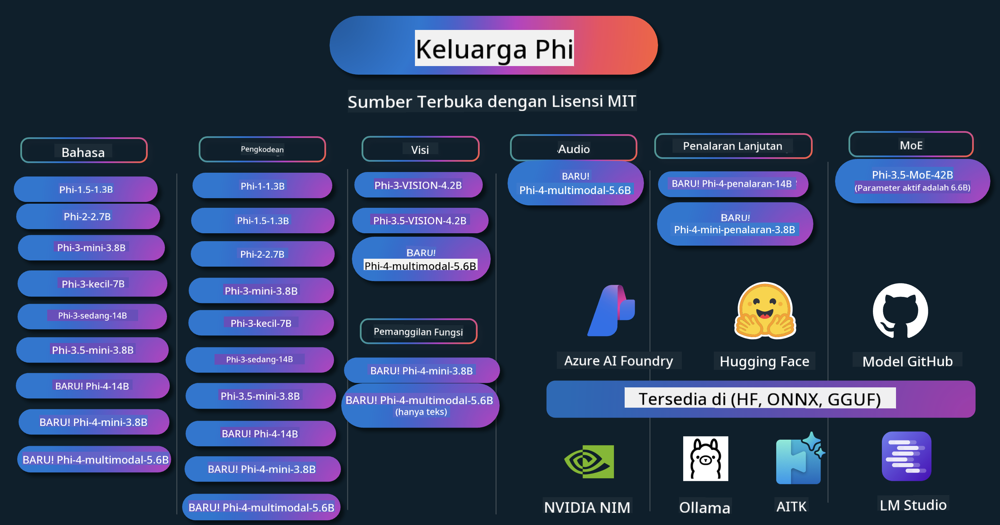

<!--
CO_OP_TRANSLATOR_METADATA:
{
  "original_hash": "1cab9282e04f2e1c388a38dca7763c16",
  "translation_date": "2025-05-09T04:04:59+00:00",
  "source_file": "README.md",
  "language_code": "id"
}
-->
# Phi Cookbook: Contoh Praktis dengan Model Phi dari Microsoft

Phi adalah serangkaian model AI open source yang dikembangkan oleh Microsoft.

Phi saat ini adalah model bahasa kecil (SLM) yang paling kuat dan hemat biaya, dengan tolok ukur yang sangat baik dalam berbagai bahasa, penalaran, generasi teks/chat, pemrograman, gambar, audio, dan skenario lainnya.

Anda dapat menerapkan Phi ke cloud atau perangkat edge, dan dengan mudah membangun aplikasi AI generatif meskipun dengan daya komputasi terbatas.

Ikuti langkah-langkah berikut untuk mulai menggunakan sumber daya ini:
1. **Fork Repository**: Klik 
2. **Clone Repository**: `git clone https://github.com/microsoft/PhiCookBook.git`
3. [**Bergabung dengan Komunitas Microsoft AI Discord dan temui para ahli serta pengembang lainnya**](https://discord.com/invite/ByRwuEEgH4?WT.mc_id=aiml-137032-kinfeylo)

## 🌐 Dukungan Multi-Bahasa

### Didukung melalui GitHub Action (Otomatis & Selalu Terbaru)

[Prancis](../fr/README.md) | [Spanyol](../es/README.md) | [Jerman](../de/README.md) | [Rusia](../ru/README.md) | [Arab](../ar/README.md) | [Persia (Farsi)](../fa/README.md) | [Urdu](../ur/README.md) | [Mandarin (Sederhana)](../zh/README.md) | [Mandarin (Tradisional, Makau)](../mo/README.md) | [Mandarin (Tradisional, Hong Kong)](../hk/README.md) | [Mandarin (Tradisional, Taiwan)](../tw/README.md) | [Jepang](../ja/README.md) | [Korea](../ko/README.md) | [Hindi](../hi/README.md)

### Didukung melalui CLI
## Daftar Isi

- Pendahuluan
- [Selamat datang di Keluarga Phi](./md/01.Introduction/01/01.PhiFamily.md)
  - [Menyiapkan lingkungan Anda](./md/01.Introduction/01/01.EnvironmentSetup.md)
  - [Memahami Teknologi Kunci](./md/01.Introduction/01/01.Understandingtech.md)
  - [Keamanan AI untuk Model Phi](./md/01.Introduction/01/01.AISafety.md)
  - [Dukungan Perangkat Keras Phi](./md/01.Introduction/01/01.Hardwaresupport.md)
  - [Model Phi & Ketersediaan di berbagai platform](./md/01.Introduction/01/01.Edgeandcloud.md)
  - [Menggunakan Guidance-ai dan Phi](./md/01.Introduction/01/01.Guidance.md)
  - [Model Marketplace GitHub](https://github.com/marketplace/models)
  - [Katalog Model Azure AI](https://ai.azure.com)

- Inference Phi di lingkungan berbeda
    -  [Hugging face](./md/01.Introduction/02/01.HF.md)
    -  [Model GitHub](./md/01.Introduction/02/02.GitHubModel.md)
    -  [Katalog Model Azure AI Foundry](./md/01.Introduction/02/03.AzureAIFoundry.md)
    -  [Ollama](./md/01.Introduction/02/04.Ollama.md)
    -  [AI Toolkit VSCode (AITK)](./md/01.Introduction/02/05.AITK.md)
    -  [NVIDIA NIM](./md/01.Introduction/02/06.NVIDIA.md)

- Inference Keluarga Phi
    - [Inference Phi di iOS](./md/01.Introduction/03/iOS_Inference.md)
    - [Inference Phi di Android](./md/01.Introduction/03/Android_Inference.md)
    - [Inference Phi di Jetson](./md/01.Introduction/03/Jetson_Inference.md)
    - [Inference Phi di AI PC](./md/01.Introduction/03/AIPC_Inference.md)
    - [Inference Phi dengan Apple MLX Framework](./md/01.Introduction/03/MLX_Inference.md)
    - [Inference Phi di Server Lokal](./md/01.Introduction/03/Local_Server_Inference.md)
    - [Inference Phi di Server Jarak Jauh menggunakan AI Toolkit](./md/01.Introduction/03/Remote_Interence.md)
    - [Inference Phi dengan Rust](./md/01.Introduction/03/Rust_Inference.md)
    - [Inference Phi--Vision di Lokal](./md/01.Introduction/03/Vision_Inference.md)
    - [Inference Phi dengan Kaito AKS, Azure Containers (dukungan resmi)](./md/01.Introduction/03/Kaito_Inference.md)
-  [Mengkuantifikasi Keluarga Phi](./md/01.Introduction/04/QuantifyingPhi.md)
    - [Mengkuantisasi Phi-3.5 / 4 menggunakan llama.cpp](./md/01.Introduction/04/UsingLlamacppQuantifyingPhi.md)
    - [Mengkuantisasi Phi-3.5 / 4 menggunakan ekstensi Generative AI untuk onnxruntime](./md/01.Introduction/04/UsingORTGenAIQuantifyingPhi.md)
    - [Mengkuantisasi Phi-3.5 / 4 menggunakan Intel OpenVINO](./md/01.Introduction/04/UsingIntelOpenVINOQuantifyingPhi.md)
    - [Mengkuantisasi Phi-3.5 / 4 menggunakan Apple MLX Framework](./md/01.Introduction/04/UsingAppleMLXQuantifyingPhi.md)

-  Evaluasi Phi
- [Response AI](./md/01.Introduction/05/ResponsibleAI.md)
    - [Azure AI Foundry untuk Evaluasi](./md/01.Introduction/05/AIFoundry.md)
    - [Menggunakan Promptflow untuk Evaluasi](./md/01.Introduction/05/Promptflow.md)
 
- RAG dengan Azure AI Search
    - [Cara menggunakan Phi-4-mini dan Phi-4-multimodal(RAG) dengan Azure AI Search](https://github.com/microsoft/PhiCookBook/blob/main/code/06.E2E/E2E_Phi-4-RAG-Azure-AI-Search.ipynb)

- Contoh pengembangan aplikasi Phi
  - Aplikasi Teks & Chat
    - Contoh Phi-4 🆕
      - [📓] [Chat Dengan Model Phi-4-mini ONNX](./md/02.Application/01.TextAndChat/Phi4/ChatWithPhi4ONNX/README.md)
      - [Chat dengan Model ONNX lokal Phi-4 .NET](../../md/04.HOL/dotnet/src/LabsPhi4-Chat-01OnnxRuntime)
      - [Chat Aplikasi Konsol .NET dengan Phi-4 ONNX menggunakan Semantic Kernel](../../md/04.HOL/dotnet/src/LabsPhi4-Chat-02SK)
    - Contoh Phi-3 / 3.5
      - [Chatbot Lokal di browser menggunakan Phi3, ONNX Runtime Web dan WebGPU](https://github.com/microsoft/onnxruntime-inference-examples/tree/main/js/chat)
      - [OpenVino Chat](./md/02.Application/01.TextAndChat/Phi3/E2E_OpenVino_Chat.md)
      - [Multi Model - Phi-3-mini interaktif dan OpenAI Whisper](./md/02.Application/01.TextAndChat/Phi3/E2E_Phi-3-mini_with_whisper.md)
      - [MLFlow - Membangun pembungkus dan menggunakan Phi-3 dengan MLFlow](./md//02.Application/01.TextAndChat/Phi3/E2E_Phi-3-MLflow.md)
      - [Optimasi Model - Cara mengoptimalkan model Phi-3-mini untuk ONNX Runtime Web dengan Olive](https://github.com/microsoft/Olive/tree/main/examples/phi3)
      - [Aplikasi WinUI3 dengan Phi-3 mini-4k-instruct-onnx](https://github.com/microsoft/Phi3-Chat-WinUI3-Sample/)
      -[Contoh Aplikasi Catatan Multi Model AI Powered WinUI3](https://github.com/microsoft/ai-powered-notes-winui3-sample)
      - [Fine-tune dan Integrasikan model Phi-3 kustom dengan Prompt flow](./md/02.Application/01.TextAndChat/Phi3/E2E_Phi-3-FineTuning_PromptFlow_Integration.md)
      - [Fine-tune dan Integrasikan model Phi-3 kustom dengan Prompt flow di Azure AI Foundry](./md/02.Application/01.TextAndChat/Phi3/E2E_Phi-3-FineTuning_PromptFlow_Integration_AIFoundry.md)
      - [Evaluasi Model Phi-3 / Phi-3.5 yang sudah di-fine-tune di Azure AI Foundry dengan fokus pada Prinsip Responsible AI Microsoft](./md/02.Application/01.TextAndChat/Phi3/E2E_Phi-3-Evaluation_AIFoundry.md)
      - [📓] [Contoh prediksi bahasa Phi-3.5-mini-instruct (Mandarin/Inggris)](../../md/02.Application/01.TextAndChat/Phi3/phi3-instruct-demo.ipynb)
      - [Phi-3.5-Instruct WebGPU RAG Chatbot](./md/02.Application/01.TextAndChat/Phi3/WebGPUWithPhi35Readme.md)
      - [Menggunakan GPU Windows untuk membuat solusi Prompt flow dengan Phi-3.5-Instruct ONNX](./md/02.Application/01.TextAndChat/Phi3/UsingPromptFlowWithONNX.md)
      - [Menggunakan Microsoft Phi-3.5 tflite untuk membuat aplikasi Android](./md/02.Application/01.TextAndChat/Phi3/UsingPhi35TFLiteCreateAndroidApp.md)
      - [Contoh Q&A .NET menggunakan model ONNX Phi-3 lokal dengan Microsoft.ML.OnnxRuntime](../../md/04.HOL/dotnet/src/LabsPhi301)
      - [Aplikasi chat konsol .NET dengan Semantic Kernel dan Phi-3](../../md/04.HOL/dotnet/src/LabsPhi302)

  - Contoh Berbasis Kode SDK Azure AI Inference 
    - Contoh Phi-4 🆕
      - [📓] [Menghasilkan kode proyek menggunakan Phi-4-multimodal](./md/02.Application/02.Code/Phi4/GenProjectCode/README.md)
    - Contoh Phi-3 / 3.5
      - [Buat Visual Studio Code GitHub Copilot Chat Anda sendiri dengan Microsoft Phi-3 Family](./md/02.Application/02.Code/Phi3/VSCodeExt/README.md)
      - [Buat Agen Chat Copilot Visual Studio Code Anda sendiri dengan Phi-3.5 menggunakan Model GitHub](/md/02.Application/02.Code/Phi3/CreateVSCodeChatAgentWithGitHubModels.md)

  - Contoh Penalaran Lanjutan
    - Contoh Phi-4 🆕
      - [📓] [Contoh Phi-4-mini-reasoning atau Phi-4-reasoning](./md/02.Application/03.AdvancedReasoning/Phi4/AdvancedResoningPhi4mini/README.md)
      - [📓] [Fine-tuning Phi-4-mini-reasoning dengan Microsoft Olive](../../md/02.Application/03.AdvancedReasoning/Phi4/AdvancedResoningPhi4mini/olive_ft_phi_4_reasoning_with_medicaldata.ipynb)
      - [📓] [Fine-tuning Phi-4-mini-reasoning dengan Apple MLX](../../md/02.Application/03.AdvancedReasoning/Phi4/AdvancedResoningPhi4mini/mlx_ft_phi_4_reasoning_with_medicaldata.ipynb)
      - [📓] [Phi-4-mini-reasoning dengan Model GitHub](../../md/02.Application/02.Code/Phi4r/github_models_inference.ipynb)
- [📓] [Phi-4-mini reasoning dengan Azure AI Foundry Models](../../md/02.Application/02.Code/Phi4r/azure_models_inference.ipynb)
  - Demo
      - [Phi-4-mini demo yang dihosting di Hugging Face Spaces](https://huggingface.co/spaces/microsoft/phi-4-mini?WT.mc_id=aiml-137032-kinfeylo)
      - [Phi-4-multimodal demo yang dihosting di Hugging Face Spaces](https://huggingface.co/spaces/microsoft/phi-4-multimodal?WT.mc_id=aiml-137032-kinfeylo)
  - Contoh Vision
    - Contoh Phi-4 🆕
      - [📓] [Menggunakan Phi-4-multimodal untuk membaca gambar dan menghasilkan kode](./md/02.Application/04.Vision/Phi4/CreateFrontend/README.md) 
    - Contoh Phi-3 / 3.5
      -  [📓][Phi-3-vision-Image teks ke teks](../../md/02.Application/04.Vision/Phi3/E2E_Phi-3-vision-image-text-to-text-online-endpoint.ipynb)
      - [Phi-3-vision-ONNX](https://onnxruntime.ai/docs/genai/tutorials/phi3-v.html)
      - [📓][Phi-3-vision CLIP Embedding](../../md/02.Application/04.Vision/Phi3/E2E_Phi-3-vision-image-text-to-text-online-endpoint.ipynb)
      - [DEMO: Phi-3 Recycling](https://github.com/jennifermarsman/PhiRecycling/)
      - [Phi-3-vision - Asisten bahasa visual - dengan Phi3-Vision dan OpenVINO](https://docs.openvino.ai/nightly/notebooks/phi-3-vision-with-output.html)
      - [Phi-3 Vision Nvidia NIM](./md/02.Application/04.Vision/Phi3/E2E_Nvidia_NIM_Vision.md)
      - [Phi-3 Vision OpenVino](./md/02.Application/04.Vision/Phi3/E2E_OpenVino_Phi3Vision.md)
      - [📓][Phi-3.5 Vision multi-frame atau multi-image contoh](../../md/02.Application/04.Vision/Phi3/phi3-vision-demo.ipynb)
      - [Phi-3 Vision Local ONNX Model menggunakan Microsoft.ML.OnnxRuntime .NET](../../md/04.HOL/dotnet/src/LabsPhi303)
      - [Menu berbasis Phi-3 Vision Local ONNX Model menggunakan Microsoft.ML.OnnxRuntime .NET](../../md/04.HOL/dotnet/src/LabsPhi304)

  - Contoh Audio
    - Contoh Phi-4 🆕
      - [📓] [Mengekstrak transkrip audio menggunakan Phi-4-multimodal](./md/02.Application/05.Audio/Phi4/Transciption/README.md)
      - [📓] [Contoh Audio Phi-4-multimodal](../../md/02.Application/05.Audio/Phi4/Siri/demo.ipynb)
      - [📓] [Contoh Terjemahan Ucapan Phi-4-multimodal](../../md/02.Application/05.Audio/Phi4/Translate/demo.ipynb)
      - [Aplikasi konsol .NET menggunakan Phi-4-multimodal Audio untuk menganalisis file audio dan menghasilkan transkrip](../../md/04.HOL/dotnet/src/LabsPhi4-MultiModal-02Audio)

  - Contoh MOE
    - Contoh Phi-3 / 3.5
      - [📓] [Model Mixture of Experts (MoEs) Phi-3.5 untuk Media Sosial](../../md/02.Application/06.MoE/Phi3/phi3_moe_demo.ipynb)
      - [📓] [Membangun Pipeline Retrieval-Augmented Generation (RAG) dengan NVIDIA NIM Phi-3 MOE, Azure AI Search, dan LlamaIndex](../../md/02.Application/06.MoE/Phi3/azure-ai-search-nvidia-rag.ipynb)
  - Contoh Function Calling
    - Contoh Phi-4 🆕
      -  [📓] [Menggunakan Function Calling dengan Phi-4-mini](./md/02.Application/07.FunctionCalling/Phi4/FunctionCallingBasic/README.md)
      -  [📓] [Menggunakan Function Calling untuk membuat multi-agents dengan Phi-4-mini](../../md/02.Application/07.FunctionCalling/Phi4/Multiagents/Phi_4_mini_multiagent.ipynb)
      -  [📓] [Menggunakan Function Calling dengan Ollama](../../md/02.Application/07.FunctionCalling/Phi4/Ollama/ollama_functioncalling.ipynb)
  - Contoh Multimodal Mixing
    - Contoh Phi-4 🆕
      -  [📓] [Menggunakan Phi-4-multimodal sebagai jurnalis teknologi](../../md/02.Application/08.Multimodel/Phi4/TechJournalist/phi_4_mm_audio_text_publish_news.ipynb)
      - [Aplikasi konsol .NET menggunakan Phi-4-multimodal untuk menganalisis gambar](../../md/04.HOL/dotnet/src/LabsPhi4-MultiModal-01Images)

- Contoh Fine-tuning Phi
  - [Skenario Fine-tuning](./md/03.FineTuning/FineTuning_Scenarios.md)
  - [Fine-tuning vs RAG](./md/03.FineTuning/FineTuning_vs_RAG.md)
  - [Fine-tuning Membiarkan Phi-3 menjadi ahli industri](./md/03.FineTuning/LetPhi3gotoIndustriy.md)
  - [Fine-tuning Phi-3 dengan AI Toolkit untuk VS Code](./md/03.FineTuning/Finetuning_VSCodeaitoolkit.md)
  - [Fine-tuning Phi-3 dengan Azure Machine Learning Service](./md/03.FineTuning/Introduce_AzureML.md)
- [Fine-tuning Phi-3 dengan Lora](./md/03.FineTuning/FineTuning_Lora.md)
  - [Fine-tuning Phi-3 dengan QLora](./md/03.FineTuning/FineTuning_Qlora.md)
  - [Fine-tuning Phi-3 dengan Azure AI Foundry](./md/03.FineTuning/FineTuning_AIFoundry.md)
  - [Fine-tuning Phi-3 dengan Azure ML CLI/SDK](./md/03.FineTuning/FineTuning_MLSDK.md)
  - [Fine-tuning dengan Microsoft Olive](./md/03.FineTuning/FineTuning_MicrosoftOlive.md)
  - [Fine-tuning dengan Microsoft Olive Hands-On Lab](./md/03.FineTuning/olive-lab/readme.md)
  - [Fine-tuning Phi-3-vision dengan Weights and Bias](./md/03.FineTuning/FineTuning_Phi-3-visionWandB.md)
  - [Fine-tuning Phi-3 dengan Apple MLX Framework](./md/03.FineTuning/FineTuning_MLX.md)
  - [Fine-tuning Phi-3-vision (dukungan resmi)](./md/03.FineTuning/FineTuning_Vision.md)
  - [Fine-Tuning Phi-3 dengan Kaito AKS, Azure Containers (dukungan resmi)](./md/03.FineTuning/FineTuning_Kaito.md)
  - [Fine-Tuning Phi-3 dan 3.5 Vision](https://github.com/2U1/Phi3-Vision-Finetune)

- Hands on Lab
  - [Menjelajahi model terkini: LLMs, SLMs, pengembangan lokal, dan lainnya](https://github.com/microsoft/aitour-exploring-cutting-edge-models)
  - [Membuka Potensi NLP: Fine-Tuning dengan Microsoft Olive](https://github.com/azure/Ignite_FineTuning_workshop)

- Makalah Penelitian Akademik dan Publikasi
  - [Textbooks Are All You Need II: laporan teknis phi-1.5](https://arxiv.org/abs/2309.05463)
  - [Laporan Teknis Phi-3: Model Bahasa Berkapasitas Tinggi secara Lokal di Ponsel Anda](https://arxiv.org/abs/2404.14219)
  - [Laporan Teknis Phi-4](https://arxiv.org/abs/2412.08905)
  - [Laporan Teknis Phi-4-Mini: Model Bahasa Multimodal yang Kompak namun Kuat melalui Mixture-of-LoRAs](https://arxiv.org/abs/2503.01743)
  - [Mengoptimalkan Model Bahasa Kecil untuk Pemanggilan Fungsi dalam Kendaraan](https://arxiv.org/abs/2501.02342)
  - [(WhyPHI) Fine-Tuning PHI-3 untuk Menjawab Pertanyaan Pilihan Ganda: Metodologi, Hasil, dan Tantangan](https://arxiv.org/abs/2501.01588)
  - [Laporan Teknis Phi-4-reasoning](https://www.microsoft.com/en-us/research/wp-content/uploads/2025/04/phi_4_reasoning.pdf)
  - [Laporan Teknis Phi-4-mini-reasoning](https://huggingface.co/microsoft/Phi-4-mini-reasoning/blob/main/Phi-4-Mini-Reasoning.pdf)

## Menggunakan Model Phi

### Phi di Azure AI Foundry

Anda dapat mempelajari cara menggunakan Microsoft Phi dan bagaimana membangun solusi E2E di berbagai perangkat keras Anda. Untuk merasakan Phi secara langsung, mulailah dengan mencoba model dan menyesuaikan Phi untuk skenario Anda menggunakan [Azure AI Foundry Azure AI Model Catalog](https://aka.ms/phi3-azure-ai). Anda dapat mempelajari lebih lanjut di Memulai dengan [Azure AI Foundry](/md/02.QuickStart/AzureAIFoundry_QuickStart.md)

**Playground**  
Setiap model memiliki playground khusus untuk menguji model [Azure AI Playground](https://aka.ms/try-phi3).

### Phi di Model GitHub

Anda dapat mempelajari cara menggunakan Microsoft Phi dan bagaimana membangun solusi E2E di berbagai perangkat keras Anda. Untuk merasakan Phi secara langsung, mulailah dengan mencoba model dan menyesuaikan Phi untuk skenario Anda menggunakan [GitHub Model Catalog](https://github.com/marketplace/models?WT.mc_id=aiml-137032-kinfeylo). Anda dapat mempelajari lebih lanjut di Memulai dengan [GitHub Model Catalog](/md/02.QuickStart/GitHubModel_QuickStart.md)

**Playground**  
Setiap model memiliki [playground untuk menguji model](/md/02.QuickStart/GitHubModel_QuickStart.md).

### Phi di Hugging Face

Anda juga dapat menemukan model ini di [Hugging Face](https://huggingface.co/microsoft)

**Playground**  
[Hugging Chat playground](https://huggingface.co/chat/models/microsoft/Phi-3-mini-4k-instruct)

## AI yang Bertanggung Jawab

Microsoft berkomitmen membantu pelanggan kami menggunakan produk AI secara bertanggung jawab, berbagi pembelajaran kami, dan membangun kemitraan yang berbasis kepercayaan melalui alat seperti Transparency Notes dan Impact Assessments. Banyak sumber daya ini dapat ditemukan di [https://aka.ms/RAI](https://aka.ms/RAI).  
Pendekatan Microsoft terhadap AI yang bertanggung jawab didasarkan pada prinsip AI kami yaitu keadilan, keandalan dan keselamatan, privasi dan keamanan, inklusivitas, transparansi, dan akuntabilitas.
Model bahasa alami, gambar, dan suara berskala besar - seperti yang digunakan dalam contoh ini - berpotensi berperilaku dengan cara yang tidak adil, tidak dapat diandalkan, atau menyinggung, yang pada gilirannya dapat menyebabkan kerugian. Silakan lihat [Azure OpenAI service Transparency note](https://learn.microsoft.com/legal/cognitive-services/openai/transparency-note?tabs=text) untuk mendapatkan informasi tentang risiko dan keterbatasan.

Pendekatan yang direkomendasikan untuk mengurangi risiko ini adalah dengan menyertakan sistem keamanan dalam arsitektur Anda yang dapat mendeteksi dan mencegah perilaku berbahaya. [Azure AI Content Safety](https://learn.microsoft.com/azure/ai-services/content-safety/overview) menyediakan lapisan perlindungan independen, yang mampu mendeteksi konten berbahaya yang dibuat oleh pengguna maupun AI dalam aplikasi dan layanan. Azure AI Content Safety mencakup API teks dan gambar yang memungkinkan Anda mendeteksi materi yang berbahaya. Dalam Azure AI Foundry, layanan Content Safety memungkinkan Anda melihat, menjelajahi, dan mencoba contoh kode untuk mendeteksi konten berbahaya di berbagai modalitas. Dokumentasi [quickstart berikut](https://learn.microsoft.com/azure/ai-services/content-safety/quickstart-text?tabs=visual-studio%2Clinux&pivots=programming-language-rest) akan memandu Anda dalam membuat permintaan ke layanan ini.

Aspek lain yang perlu diperhatikan adalah kinerja keseluruhan aplikasi. Dengan aplikasi multi-modal dan multi-model, kami menganggap kinerja sebagai sistem yang berjalan sesuai dengan yang Anda dan pengguna harapkan, termasuk tidak menghasilkan keluaran yang berbahaya. Penting untuk menilai kinerja aplikasi Anda secara keseluruhan menggunakan [Performance and Quality and Risk and Safety evaluators](https://learn.microsoft.com/azure/ai-studio/concepts/evaluation-metrics-built-in). Anda juga dapat membuat dan menilai dengan [custom evaluators](https://learn.microsoft.com/azure/ai-studio/how-to/develop/evaluate-sdk#custom-evaluators).

Anda dapat mengevaluasi aplikasi AI Anda di lingkungan pengembangan menggunakan [Azure AI Evaluation SDK](https://microsoft.github.io/promptflow/index.html). Dengan menggunakan dataset uji atau target, generasi aplikasi AI generatif Anda diukur secara kuantitatif dengan evaluator bawaan atau evaluator khusus pilihan Anda. Untuk memulai dengan azure ai evaluation sdk dalam mengevaluasi sistem Anda, Anda dapat mengikuti [panduan quickstart](https://learn.microsoft.com/azure/ai-studio/how-to/develop/flow-evaluate-sdk). Setelah menjalankan evaluasi, Anda dapat [memvisualisasikan hasilnya di Azure AI Foundry](https://learn.microsoft.com/azure/ai-studio/how-to/evaluate-flow-results).

## Merek Dagang

Proyek ini mungkin berisi merek dagang atau logo untuk proyek, produk, atau layanan. Penggunaan merek dagang atau logo Microsoft yang sah tunduk pada dan harus mengikuti [Microsoft's Trademark & Brand Guidelines](https://www.microsoft.com/legal/intellectualproperty/trademarks/usage/general).  
Penggunaan merek dagang atau logo Microsoft dalam versi modifikasi proyek ini tidak boleh menyebabkan kebingungan atau menyiratkan sponsor dari Microsoft. Setiap penggunaan merek dagang atau logo pihak ketiga tunduk pada kebijakan pihak ketiga tersebut.

**Penafian**:  
Dokumen ini telah diterjemahkan menggunakan layanan terjemahan AI [Co-op Translator](https://github.com/Azure/co-op-translator). Meskipun kami berupaya untuk memberikan terjemahan yang akurat, harap diperhatikan bahwa terjemahan otomatis mungkin mengandung kesalahan atau ketidakakuratan. Dokumen asli dalam bahasa aslinya harus dianggap sebagai sumber yang sahih. Untuk informasi penting, disarankan menggunakan terjemahan profesional oleh manusia. Kami tidak bertanggung jawab atas kesalahpahaman atau kesalahan tafsir yang timbul dari penggunaan terjemahan ini.