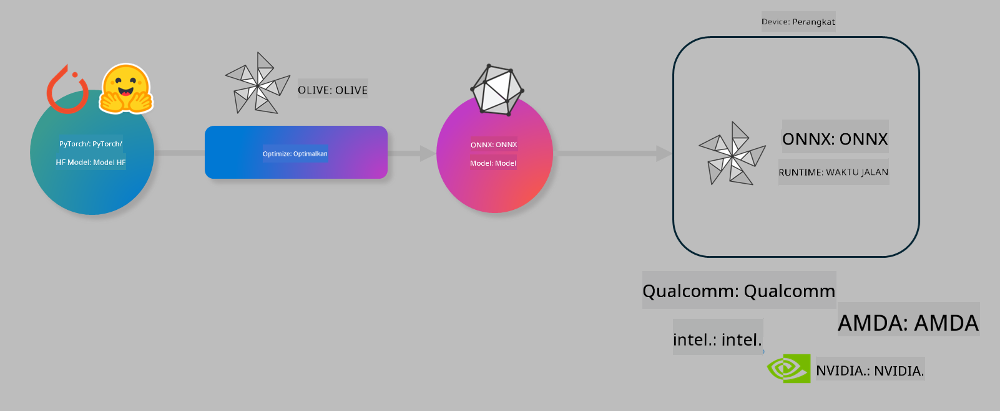

<!--
CO_OP_TRANSLATOR_METADATA:
{
  "original_hash": "6bbe47de3b974df7eea29dfeccf6032b",
  "translation_date": "2025-05-09T04:40:33+00:00",
  "source_file": "code/04.Finetuning/olive-lab/readme.md",
  "language_code": "id"
}
-->
# Lab. Optimalkan model AI untuk inferensi di perangkat

## Pendahuluan

> [!IMPORTANT]
> Lab ini memerlukan **GPU Nvidia A10 atau A100** dengan driver dan toolkit CUDA (versi 12+) yang terpasang.

> [!NOTE]
> Ini adalah lab berdurasi **35 menit** yang akan memberikan pengenalan langsung tentang konsep inti mengoptimalkan model untuk inferensi di perangkat menggunakan OLIVE.

## Tujuan Pembelajaran

Di akhir lab ini, Anda akan dapat menggunakan OLIVE untuk:

- Mengkuantisasi Model AI menggunakan metode kuantisasi AWQ.
- Melakukan fine-tuning model AI untuk tugas spesifik.
- Menghasilkan adapter LoRA (model yang sudah di-fine-tune) untuk inferensi efisien di perangkat menggunakan ONNX Runtime.

### Apa itu Olive

Olive (*O*NNX *live*) adalah toolkit optimasi model dengan CLI pendamping yang memungkinkan Anda mengirimkan model untuk ONNX runtime +++https://onnxruntime.ai+++ dengan kualitas dan performa.



Input ke Olive biasanya model PyTorch atau Hugging Face dan outputnya adalah model ONNX yang sudah dioptimalkan dan dijalankan pada perangkat (target deployment) yang menggunakan ONNX runtime. Olive akan mengoptimalkan model untuk akselerator AI target deployment (NPU, GPU, CPU) yang disediakan oleh vendor hardware seperti Qualcomm, AMD, Nvidia, atau Intel.

Olive menjalankan *workflow*, yaitu urutan terstruktur dari tugas optimasi model individu yang disebut *passes* - contoh passes termasuk: kompresi model, penangkapan grafik, kuantisasi, optimasi grafik. Setiap pass memiliki parameter yang bisa disesuaikan untuk mencapai metrik terbaik, misalnya akurasi dan latensi, yang dievaluasi oleh evaluator terkait. Olive menggunakan strategi pencarian dengan algoritma pencarian untuk mengatur auto-tuning setiap pass satu per satu atau beberapa pass sekaligus.

#### Manfaat Olive

- **Mengurangi frustrasi dan waktu** eksperimen manual trial-and-error dengan teknik berbeda untuk optimasi grafik, kompresi, dan kuantisasi. Tentukan batasan kualitas dan performa Anda dan biarkan Olive secara otomatis menemukan model terbaik untuk Anda.
- **40+ komponen optimasi model bawaan** yang mencakup teknik mutakhir dalam kuantisasi, kompresi, optimasi grafik, dan fine-tuning.
- **CLI yang mudah digunakan** untuk tugas optimasi model umum. Contohnya, olive quantize, olive auto-opt, olive finetune.
- Pengemasan dan deployment model sudah terintegrasi.
- Mendukung pembuatan model untuk **Multi LoRA serving**.
- Membuat workflow menggunakan YAML/JSON untuk mengatur tugas optimasi dan deployment model.
- Integrasi dengan **Hugging Face** dan **Azure AI**.
- Mekanisme **caching** bawaan untuk **menghemat biaya**.

## Instruksi Lab

> [!NOTE]
> Pastikan Anda telah menyediakan Azure AI Hub dan Project serta mengatur compute A100 sesuai Lab 1.

### Langkah 0: Sambungkan ke Azure AI Compute Anda

Anda akan terhubung ke Azure AI compute menggunakan fitur remote di **VS Code**.

1. Buka aplikasi desktop **VS Code** Anda:
1. Buka **command palette** dengan **Shift+Ctrl+P**
1. Cari di command palette **AzureML - remote: Connect to compute instance in New Window**.
1. Ikuti petunjuk di layar untuk menghubungkan ke Compute. Ini melibatkan memilih Azure Subscription, Resource Group, Project, dan nama Compute yang sudah Anda atur di Lab 1.
1. Setelah terhubung ke node Azure ML Compute Anda, ini akan ditampilkan di **pojok kiri bawah Visual Code** `><Azure ML: Compute Name`

### Langkah 1: Clone repo ini

Di VS Code, buka terminal baru dengan **Ctrl+J** dan clone repo ini:

Di terminal Anda akan melihat prompt

```
azureuser@computername:~/cloudfiles/code$ 
```
Clone solusi

```bash
cd ~/localfiles
git clone https://github.com/microsoft/phi-3cookbook.git
```

### Langkah 2: Buka Folder di VS Code

Untuk membuka VS Code di folder yang relevan jalankan perintah berikut di terminal, yang akan membuka jendela baru:

```bash
code phi-3cookbook/code/04.Finetuning/Olive-lab
```

Alternatifnya, Anda bisa membuka folder dengan memilih **File** > **Open Folder**.

### Langkah 3: Dependencies

Buka jendela terminal di VS Code pada Azure AI Compute Instance Anda (tips: **Ctrl+J**) dan jalankan perintah berikut untuk memasang dependencies:

```bash
conda create -n olive-ai python=3.11 -y
conda activate olive-ai
pip install -r requirements.txt
az extension remove -n azure-cli-ml
az extension add -n ml
```

> [!NOTE]
> Proses pemasangan dependencies akan memakan waktu sekitar 5 menit.

Di lab ini Anda akan mengunduh dan mengunggah model ke katalog Model Azure AI. Agar bisa mengakses katalog model, Anda perlu login ke Azure menggunakan:

```bash
az login
```

> [!NOTE]
> Saat login Anda akan diminta memilih subscription. Pastikan Anda memilih subscription yang disediakan untuk lab ini.

### Langkah 4: Jalankan perintah Olive

Buka jendela terminal di VS Code pada Azure AI Compute Instance Anda (tips: **Ctrl+J**) dan pastikan environment `olive-ai` sudah aktif:

```bash
conda activate olive-ai
```

Selanjutnya, jalankan perintah Olive berikut di command line.

1. **Periksa data:** Pada contoh ini, Anda akan melakukan fine-tuning model Phi-3.5-Mini agar khusus menjawab pertanyaan terkait perjalanan. Kode di bawah menampilkan beberapa data awal dari dataset dalam format JSON lines:

    ```bash
    head data/data_sample_travel.jsonl
    ```
1. **Kuantisasi model:** Sebelum melatih model, Anda perlu mengkuantisasi terlebih dahulu dengan perintah berikut yang menggunakan teknik Active Aware Quantization (AWQ) +++https://arxiv.org/abs/2306.00978+++. AWQ mengkuantisasi bobot model dengan mempertimbangkan aktivasi yang dihasilkan selama inferensi. Ini berarti proses kuantisasi memperhitungkan distribusi data aktual dalam aktivasi, sehingga mempertahankan akurasi model lebih baik dibandingkan metode kuantisasi bobot tradisional.

    ```bash
    olive quantize \
       --model_name_or_path microsoft/Phi-3.5-mini-instruct \
       --trust_remote_code \
       --algorithm awq \
       --output_path models/phi/awq \
       --log_level 1
    ```

    Proses kuantisasi AWQ memakan waktu sekitar **8 menit**, yang akan **mengurangi ukuran model dari ~7.5GB menjadi ~2.5GB**.

   Di lab ini, kami menunjukkan cara memasukkan model dari Hugging Face (contoh: `microsoft/Phi-3.5-mini-instruct`). However, Olive also allows you to input models from the Azure AI catalog by updating the `model_name_or_path` argument to an Azure AI asset ID (for example:  `azureml://registries/azureml/models/Phi-3.5-mini-instruct/versions/4`). 

1. **Train the model:** Next, the `olive finetune` perintah ini melakukan fine-tuning pada model yang sudah dikuantisasi. Mengkuantisasi model *sebelum* fine-tuning memberikan akurasi lebih baik karena proses fine-tuning memulihkan sebagian kehilangan akibat kuantisasi.

    ```bash
    olive finetune \
        --method lora \
        --model_name_or_path models/phi/awq \
        --data_files "data/data_sample_travel.jsonl" \
        --data_name "json" \
        --text_template "<|user|>\n{prompt}<|end|>\n<|assistant|>\n{response}<|end|>" \
        --max_steps 100 \
        --output_path ./models/phi/ft \
        --log_level 1
    ```

    Proses fine-tuning memakan waktu sekitar **6 menit** (dengan 100 langkah).

1. **Optimasi:** Setelah model dilatih, sekarang optimalkan model menggunakan perintah `auto-opt` command, which will capture the ONNX graph and automatically perform a number of optimizations to improve the model performance for CPU by compressing the model and doing fusions. It should be noted, that you can also optimize for other devices such as NPU or GPU by just updating the `--device` and `--provider` dari Olive - tapi untuk lab ini kita gunakan CPU.

    ```bash
    olive auto-opt \
       --model_name_or_path models/phi/ft/model \
       --adapter_path models/phi/ft/adapter \
       --device cpu \
       --provider CPUExecutionProvider \
       --use_ort_genai \
       --output_path models/phi/onnx-ao \
       --log_level 1
    ```

    Proses optimasi memakan waktu sekitar **5 menit**.

### Langkah 5: Tes cepat inferensi model

Untuk menguji inferensi model, buat file Python di folder Anda bernama **app.py** dan salin-tempel kode berikut:

```python
import onnxruntime_genai as og
import numpy as np

print("loading model and adapters...", end="", flush=True)
model = og.Model("models/phi/onnx-ao/model")
adapters = og.Adapters(model)
adapters.load("models/phi/onnx-ao/model/adapter_weights.onnx_adapter", "travel")
print("DONE!")

tokenizer = og.Tokenizer(model)
tokenizer_stream = tokenizer.create_stream()

params = og.GeneratorParams(model)
params.set_search_options(max_length=100, past_present_share_buffer=False)
user_input = "what is the best thing to see in chicago"
params.input_ids = tokenizer.encode(f"<|user|>\n{user_input}<|end|>\n<|assistant|>\n")

generator = og.Generator(model, params)

generator.set_active_adapter(adapters, "travel")

print(f"{user_input}")

while not generator.is_done():
    generator.compute_logits()
    generator.generate_next_token()

    new_token = generator.get_next_tokens()[0]
    print(tokenizer_stream.decode(new_token), end='', flush=True)

print("\n")
```

Jalankan kode menggunakan:

```bash
python app.py
```

### Langkah 6: Unggah model ke Azure AI

Mengunggah model ke repositori model Azure AI membuat model bisa dibagikan dengan anggota tim pengembangan lain dan juga menangani kontrol versi model. Untuk mengunggah model jalankan perintah berikut:

> [!NOTE]
> Perbarui `{}` placeholders with the name of your resource group and Azure AI Project Name. 

To find your resource group `"resourceGroup"` dan nama Project Azure AI, lalu jalankan perintah berikut

```
az ml workspace show
```

Atau dengan membuka +++ai.azure.com+++ dan memilih **management center** **project** **overview**

Perbarui placeholder `{}` dengan nama resource group dan nama Project Azure AI Anda.

```bash
az ml model create \
    --name ft-for-travel \
    --version 1 \
    --path ./models/phi/onnx-ao \
    --resource-group {RESOURCE_GROUP_NAME} \
    --workspace-name {PROJECT_NAME}
```

Anda kemudian dapat melihat model yang sudah diunggah dan melakukan deployment model di https://ml.azure.com/model/list

**Penafian**:  
Dokumen ini telah diterjemahkan menggunakan layanan terjemahan AI [Co-op Translator](https://github.com/Azure/co-op-translator). Meskipun kami berusaha untuk akurasi, harap diingat bahwa terjemahan otomatis mungkin mengandung kesalahan atau ketidakakuratan. Dokumen asli dalam bahasa aslinya harus dianggap sebagai sumber yang sahih. Untuk informasi penting, disarankan menggunakan terjemahan profesional oleh manusia. Kami tidak bertanggung jawab atas kesalahpahaman atau penafsiran yang salah yang timbul dari penggunaan terjemahan ini.