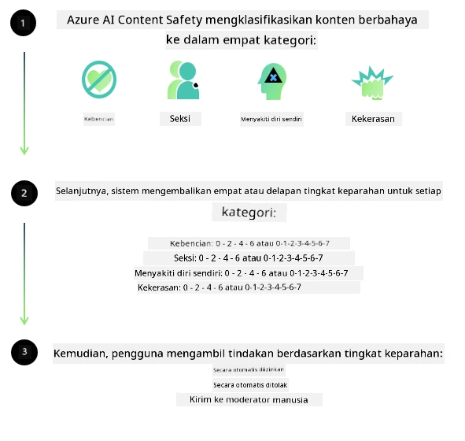
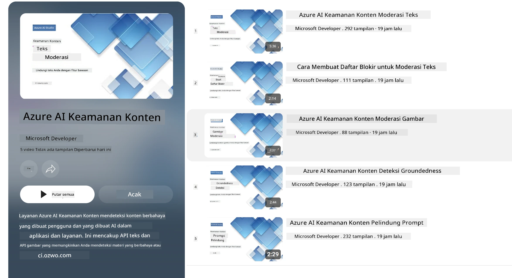

<!--
CO_OP_TRANSLATOR_METADATA:
{
  "original_hash": "839ccc4b3886ef10cfd4e64977f5792d",
  "translation_date": "2026-01-05T08:58:02+00:00",
  "source_file": "md/01.Introduction/01/01.AISafety.md",
  "language_code": "id"
}
-->
# Keamanan AI untuk model Phi
Keluarga model Phi dikembangkan sesuai dengan [Microsoft Responsible AI Standard](https://www.microsoft.com/ai/principles-and-approach#responsible-ai-standard), yang merupakan seperangkat persyaratan di seluruh perusahaan berdasarkan enam prinsip berikut: akuntabilitas, transparansi, keadilan, keandalan dan keselamatan, privasi dan keamanan, serta inklusivitas yang membentuk [prinsip Responsible AI Microsoft](https://www.microsoft.com/ai/responsible-ai).

Seperti model Phi sebelumnya, pendekatan evaluasi keamanan multi-faceted dan pasca-pelatihan keamanan diadopsi, dengan langkah-langkah tambahan yang diambil untuk mempertimbangkan kemampuan multibahasa dari rilis ini. Pendekatan kami terhadap pelatihan dan evaluasi keamanan termasuk pengujian di berbagai bahasa dan kategori risiko dijelaskan dalam [Phi Safety Post-Training Paper](https://arxiv.org/abs/2407.13833). Meskipun model Phi mendapat manfaat dari pendekatan ini, pengembang harus menerapkan praktik terbaik AI yang bertanggung jawab, termasuk memetakan, mengukur, dan mengurangi risiko yang terkait dengan kasus penggunaan mereka serta konteks budaya dan linguistik.

## Praktik Terbaik

Seperti model lain, keluarga model Phi berpotensi berperilaku secara tidak adil, tidak dapat diandalkan, atau menyinggung.

Beberapa perilaku pembatas dari SLM dan LLM yang perlu Anda ketahui meliputi:

- **Kualitas Layanan:** Model Phi terutama dilatih pada teks bahasa Inggris. Bahasa selain bahasa Inggris akan mengalami kinerja yang lebih buruk. Variasi bahasa Inggris dengan representasi yang lebih sedikit dalam data pelatihan mungkin mengalami kinerja yang lebih rendah dibandingkan dengan bahasa Inggris Amerika standar.
- **Representasi Kerugian & Pelembagaan Stereotip:** Model ini dapat melebih-lebihkan atau mengabaikan kelompok orang tertentu, menghapus representasi beberapa kelompok, atau memperkuat stereotip yang merendahkan atau negatif. Meskipun sudah ada pasca-pelatihan keamanan, keterbatasan ini mungkin masih ada karena tingkat representasi yang berbeda dari kelompok yang berbeda atau prevalensi contoh stereotip negatif dalam data pelatihan yang mencerminkan pola dunia nyata dan bias sosial.
- **Konten Tidak Pantas atau Menyinggung:** Model ini mungkin menghasilkan jenis konten lain yang tidak pantas atau menyinggung, yang dapat membuatnya tidak cocok untuk diterapkan dalam konteks sensitif tanpa mitigasi tambahan yang spesifik untuk kasus penggunaan.
Keandalan Informasi: Model bahasa dapat menghasilkan konten yang tidak masuk akal atau memalsukan konten yang terdengar masuk akal tetapi tidak akurat atau sudah usang.
- **Ruang Lingkup Terbatas untuk Kode:** Mayoritas data pelatihan Phi-3 berbasis Python dan menggunakan paket umum seperti "typing, math, random, collections, datetime, itertools". Jika model menghasilkan skrip Python yang menggunakan paket lain atau skrip dalam bahasa lain, kami sangat menyarankan pengguna untuk memverifikasi secara manual semua penggunaan API.

Pengembang harus menerapkan praktik terbaik AI yang bertanggung jawab dan bertanggung jawab untuk memastikan bahwa kasus penggunaan tertentu mematuhi hukum dan peraturan yang relevan (misalnya privasi, perdagangan, dll.).

## Pertimbangan Responsible AI

Seperti model bahasa lainnya, model seri Phi berpotensi berperilaku secara tidak adil, tidak dapat diandalkan, atau menyinggung. Beberapa perilaku pembatas yang perlu diwaspadai meliputi:

**Kualitas Layanan:** Model Phi terutama dilatih pada teks bahasa Inggris. Bahasa selain bahasa Inggris akan mengalami kinerja yang lebih buruk. Variasi bahasa Inggris dengan representasi yang lebih sedikit dalam data pelatihan mungkin mengalami kinerja yang lebih rendah dibandingkan bahasa Inggris Amerika standar.

**Representasi Kerugian & Pelembagaan Stereotip:** Model ini dapat melebih-lebihkan atau mengabaikan kelompok orang tertentu, menghapus representasi beberapa kelompok, atau memperkuat stereotip yang merendahkan atau negatif. Meskipun sudah ada pasca-pelatihan keamanan, keterbatasan ini mungkin masih ada karena tingkat representasi yang berbeda dari kelompok yang berbeda atau prevalensi contoh stereotip negatif dalam data pelatihan yang mencerminkan pola dunia nyata dan bias sosial.

**Konten Tidak Pantas atau Menyinggung:** Model ini mungkin menghasilkan jenis konten lain yang tidak pantas atau menyinggung, yang dapat membuatnya tidak cocok untuk diterapkan dalam konteks sensitif tanpa mitigasi tambahan yang spesifik untuk kasus penggunaan.
Keandalan Informasi: Model bahasa dapat menghasilkan konten yang tidak masuk akal atau memalsukan konten yang terdengar masuk akal tetapi tidak akurat atau sudah usang.

**Ruang Lingkup Terbatas untuk Kode:** Mayoritas data pelatihan Phi-3 berbasis Python dan menggunakan paket umum seperti "typing, math, random, collections, datetime, itertools". Jika model menghasilkan skrip Python yang menggunakan paket lain atau skrip dalam bahasa lain, kami sangat menyarankan pengguna untuk memverifikasi secara manual semua penggunaan API.

Pengembang harus menerapkan praktik terbaik AI yang bertanggung jawab dan bertanggung jawab untuk memastikan bahwa kasus penggunaan tertentu mematuhi hukum dan peraturan yang relevan (misalnya privasi, perdagangan, dll.). Area penting yang perlu dipertimbangkan meliputi:

**Alokasi:** Model mungkin tidak cocok untuk skenario yang dapat memiliki dampak signifikan pada status hukum atau alokasi sumber daya atau kesempatan hidup (misalnya: perumahan, pekerjaan, kredit, dll.) tanpa penilaian lebih lanjut dan teknik debiasing tambahan.

**Skenario Risiko Tinggi:** Pengembang harus menilai kelayakan penggunaan model dalam skenario risiko tinggi di mana output yang tidak adil, tidak dapat diandalkan, atau menyinggung mungkin sangat mahal atau menyebabkan kerugian. Ini termasuk memberikan saran dalam domain sensitif atau ahli di mana akurasi dan keandalan sangat penting (misalnya: saran hukum atau kesehatan). Perlindungan tambahan harus diterapkan pada tingkat aplikasi sesuai dengan konteks penerapan.

**Informasi Salah:** Model dapat menghasilkan informasi yang tidak akurat. Pengembang harus mengikuti praktik terbaik transparansi dan memberitahu pengguna akhir bahwa mereka berinteraksi dengan sistem AI. Pada tingkat aplikasi, pengembang dapat membangun mekanisme umpan balik dan pipeline untuk mendasarkan respons pada informasi kontekstual spesifik kasus penggunaan, sebuah teknik yang dikenal sebagai Retrieval Augmented Generation (RAG).

**Pembuatan Konten Berbahaya:** Pengembang harus menilai output sesuai konteks dan menggunakan pengklasifikasi keamanan yang tersedia atau solusi kustom yang sesuai untuk kasus penggunaan mereka.

**Penyalahgunaan:** Bentuk penyalahgunaan lain seperti penipuan, spam, atau produksi malware mungkin saja, dan pengembang harus memastikan bahwa aplikasi mereka tidak melanggar hukum dan peraturan yang berlaku.

### Fine-tuning dan Keamanan Konten AI

Setelah melakukan fine-tuning model, kami sangat menyarankan memanfaatkan langkah-langkah [Azure AI Content Safety](https://learn.microsoft.com/azure/ai-services/content-safety/overview) untuk memantau konten yang dihasilkan oleh model, mengidentifikasi, dan memblokir potensi risiko, ancaman, dan masalah kualitas.

[Azure AI Content Safety](https://learn.microsoft.com/azure/ai-services/content-safety/overview) mendukung konten teks dan gambar. Ini dapat diterapkan di cloud, kontainer yang terputus, dan pada perangkat tepi/embedded.

## Ikhtisar Azure AI Content Safety

Azure AI Content Safety bukanlah solusi satu ukuran untuk semua; dapat disesuaikan agar selaras dengan kebijakan spesifik bisnis. Selain itu, model multibahasanya memungkinkan pemahaman berbagai bahasa secara bersamaan.

- **Azure AI Content Safety**
- **Microsoft Developer**
- **5 video**

Layanan Azure AI Content Safety mendeteksi konten berbahaya yang dihasilkan pengguna dan AI dalam aplikasi dan layanan. Ini mencakup API teks dan gambar yang memungkinkan Anda mendeteksi materi berbahaya atau tidak pantas.

[AI Content Safety Playlist](https://www.youtube.com/playlist?list=PLlrxD0HtieHjaQ9bJjyp1T7FeCbmVcPkQ)

---

<!-- CO-OP TRANSLATOR DISCLAIMER START -->
**Penafian**:
Dokumen ini telah diterjemahkan menggunakan layanan terjemahan AI [Co-op Translator](https://github.com/Azure/co-op-translator). Meskipun kami berusaha untuk memberikan terjemahan yang akurat, harap diingat bahwa terjemahan otomatis mungkin mengandung kesalahan atau ketidakakuratan. Dokumen asli dalam bahasa aslinya harus dianggap sebagai sumber yang sah. Untuk informasi yang penting, disarankan menggunakan jasa terjemahan profesional oleh manusia. Kami tidak bertanggung jawab atas kesalahpahaman atau penafsiran yang salah yang timbul dari penggunaan terjemahan ini.
<!-- CO-OP TRANSLATOR DISCLAIMER END -->