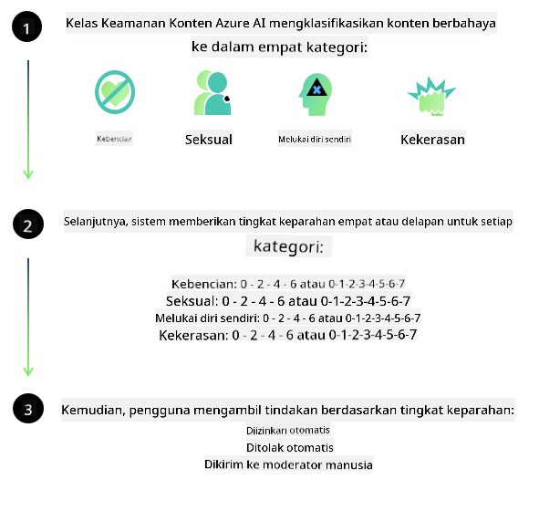

<!--
CO_OP_TRANSLATOR_METADATA:
{
  "original_hash": "c8273672cc57df2be675407a1383aaf0",
  "translation_date": "2025-05-09T06:11:53+00:00",
  "source_file": "md/01.Introduction/01/01.AISafety.md",
  "language_code": "id"
}
-->
# Keamanan AI untuk model Phi  
Keluarga model Phi dikembangkan sesuai dengan [Microsoft Responsible AI Standard](https://query.prod.cms.rt.microsoft.com/cms/api/am/binary/RE5cmFl), yaitu seperangkat persyaratan perusahaan yang didasarkan pada enam prinsip berikut: akuntabilitas, transparansi, keadilan, keandalan dan keamanan, privasi dan keamanan, serta inklusivitas yang membentuk [prinsip Responsible AI Microsoft](https://www.microsoft.com/ai/responsible-ai).  

Seperti model Phi sebelumnya, pendekatan evaluasi keamanan multifaset dan pasca-pelatihan keamanan diadopsi, dengan langkah tambahan untuk memperhitungkan kemampuan multi-bahasa dari rilis ini. Pendekatan kami terhadap pelatihan dan evaluasi keamanan termasuk pengujian lintas bahasa dan kategori risiko dijelaskan dalam [Phi Safety Post-Training Paper](https://arxiv.org/abs/2407.13833). Meskipun model Phi mendapat manfaat dari pendekatan ini, pengembang harus menerapkan praktik AI bertanggung jawab terbaik, termasuk memetakan, mengukur, dan mengurangi risiko yang terkait dengan kasus penggunaan spesifik serta konteks budaya dan linguistik mereka.  

## Praktik Terbaik  

Seperti model lainnya, keluarga model Phi berpotensi berperilaku dengan cara yang tidak adil, tidak dapat diandalkan, atau menyinggung.  

Beberapa perilaku pembatas dari SLM dan LLM yang perlu Anda ketahui meliputi:  

- **Kualitas Layanan:** Model Phi terutama dilatih dengan teks berbahasa Inggris. Bahasa selain Inggris akan mengalami kinerja yang lebih buruk. Varian bahasa Inggris yang kurang terwakili dalam data pelatihan mungkin mengalami kinerja yang lebih buruk dibandingkan bahasa Inggris Amerika standar.  
- **Representasi Bahaya & Perpetuasi Stereotip:** Model ini dapat melebih-lebihkan atau kurang mewakili kelompok orang tertentu, menghapus representasi beberapa kelompok, atau memperkuat stereotip yang merendahkan atau negatif. Meskipun sudah ada pelatihan pasca-keamanan, keterbatasan ini mungkin masih ada karena perbedaan tingkat representasi kelompok yang berbeda atau prevalensi contoh stereotip negatif dalam data pelatihan yang mencerminkan pola dunia nyata dan bias sosial.  
- **Konten Tidak Pantas atau Menyinggung:** Model ini mungkin menghasilkan jenis konten tidak pantas atau menyinggung lainnya, yang dapat membuatnya tidak cocok digunakan dalam konteks sensitif tanpa mitigasi tambahan yang spesifik untuk kasus penggunaannya.  
- **Keandalan Informasi:** Model bahasa dapat menghasilkan konten yang tidak masuk akal atau membuat konten yang terdengar masuk akal tetapi tidak akurat atau sudah usang.  
- **Cakupan Terbatas untuk Kode:** Sebagian besar data pelatihan Phi-3 berbasis Python dan menggunakan paket umum seperti "typing, math, random, collections, datetime, itertools". Jika model menghasilkan skrip Python yang menggunakan paket lain atau skrip dalam bahasa lain, kami sangat menyarankan pengguna memverifikasi semua penggunaan API secara manual.  

Pengembang harus menerapkan praktik AI bertanggung jawab terbaik dan bertanggung jawab memastikan bahwa kasus penggunaan tertentu mematuhi hukum dan peraturan yang relevan (misalnya privasi, perdagangan, dll.).  

## Pertimbangan Responsible AI  

Seperti model bahasa lainnya, seri model Phi berpotensi berperilaku dengan cara yang tidak adil, tidak dapat diandalkan, atau menyinggung. Beberapa perilaku pembatas yang perlu diperhatikan meliputi:  

**Kualitas Layanan:** Model Phi terutama dilatih dengan teks berbahasa Inggris. Bahasa selain Inggris akan mengalami kinerja yang lebih buruk. Varian bahasa Inggris yang kurang terwakili dalam data pelatihan mungkin mengalami kinerja yang lebih buruk dibandingkan bahasa Inggris Amerika standar.  

**Representasi Bahaya & Perpetuasi Stereotip:** Model ini dapat melebih-lebihkan atau kurang mewakili kelompok orang tertentu, menghapus representasi beberapa kelompok, atau memperkuat stereotip yang merendahkan atau negatif. Meskipun sudah ada pelatihan pasca-keamanan, keterbatasan ini mungkin masih ada karena perbedaan tingkat representasi kelompok yang berbeda atau prevalensi contoh stereotip negatif dalam data pelatihan yang mencerminkan pola dunia nyata dan bias sosial.  

**Konten Tidak Pantas atau Menyinggung:** Model ini mungkin menghasilkan jenis konten tidak pantas atau menyinggung lainnya, yang dapat membuatnya tidak cocok digunakan dalam konteks sensitif tanpa mitigasi tambahan yang spesifik untuk kasus penggunaannya.  
Keandalan Informasi: Model bahasa dapat menghasilkan konten yang tidak masuk akal atau membuat konten yang terdengar masuk akal tetapi tidak akurat atau sudah usang.  

**Cakupan Terbatas untuk Kode:** Sebagian besar data pelatihan Phi-3 berbasis Python dan menggunakan paket umum seperti "typing, math, random, collections, datetime, itertools". Jika model menghasilkan skrip Python yang menggunakan paket lain atau skrip dalam bahasa lain, kami sangat menyarankan pengguna memverifikasi semua penggunaan API secara manual.  

Pengembang harus menerapkan praktik AI bertanggung jawab terbaik dan bertanggung jawab memastikan bahwa kasus penggunaan tertentu mematuhi hukum dan peraturan yang relevan (misalnya privasi, perdagangan, dll.). Area penting untuk dipertimbangkan meliputi:  

**Alokasi:** Model mungkin tidak cocok untuk skenario yang dapat berdampak signifikan pada status hukum atau alokasi sumber daya atau peluang hidup (misalnya: perumahan, pekerjaan, kredit, dll.) tanpa penilaian lebih lanjut dan teknik debiasing tambahan.  

**Skenario Risiko Tinggi:** Pengembang harus menilai kesesuaian penggunaan model dalam skenario risiko tinggi di mana keluaran yang tidak adil, tidak dapat diandalkan, atau menyinggung bisa sangat merugikan atau menyebabkan bahaya. Ini termasuk memberikan saran di domain sensitif atau ahli di mana akurasi dan keandalan sangat penting (misalnya: saran hukum atau kesehatan). Pengamanan tambahan harus diterapkan pada tingkat aplikasi sesuai dengan konteks penerapan.  

**Misinformasi:** Model dapat menghasilkan informasi yang tidak akurat. Pengembang harus mengikuti praktik terbaik transparansi dan memberi tahu pengguna akhir bahwa mereka berinteraksi dengan sistem AI. Pada tingkat aplikasi, pengembang dapat membangun mekanisme umpan balik dan pipeline untuk mendasarkan respons pada informasi kontekstual spesifik kasus penggunaan, sebuah teknik yang dikenal sebagai Retrieval Augmented Generation (RAG).  

**Generasi Konten Berbahaya:** Pengembang harus menilai keluaran berdasarkan konteksnya dan menggunakan pengklasifikasi keamanan yang tersedia atau solusi kustom yang sesuai untuk kasus penggunaannya.  

**Penyalahgunaan:** Bentuk penyalahgunaan lain seperti penipuan, spam, atau produksi malware mungkin saja terjadi, dan pengembang harus memastikan aplikasi mereka tidak melanggar hukum dan peraturan yang berlaku.  

### Finetuning dan Keamanan Konten AI  

Setelah melakukan fine-tuning model, kami sangat menyarankan memanfaatkan langkah-langkah [Azure AI Content Safety](https://learn.microsoft.com/azure/ai-services/content-safety/overview) untuk memantau konten yang dihasilkan oleh model, mengidentifikasi dan memblokir potensi risiko, ancaman, dan masalah kualitas.  

  

[Azure AI Content Safety](https://learn.microsoft.com/azure/ai-services/content-safety/overview) mendukung konten teks dan gambar. Layanan ini dapat diterapkan di cloud, container yang terputus, dan perangkat edge/embedded.  

## Gambaran Umum Azure AI Content Safety  

Azure AI Content Safety bukan solusi satu ukuran untuk semua; layanan ini dapat disesuaikan agar sesuai dengan kebijakan bisnis spesifik. Selain itu, model multi-bahasa memungkinkan layanan ini memahami beberapa bahasa secara bersamaan.  

  

- **Azure AI Content Safety**  
- **Microsoft Developer**  
- **5 video**  

Layanan Azure AI Content Safety mendeteksi konten berbahaya yang dihasilkan pengguna maupun AI dalam aplikasi dan layanan. Layanan ini mencakup API teks dan gambar yang memungkinkan Anda mendeteksi materi berbahaya atau tidak pantas.  

[AI Content Safety Playlist](https://www.youtube.com/playlist?list=PLlrxD0HtieHjaQ9bJjyp1T7FeCbmVcPkQ)

**Penafian**:  
Dokumen ini telah diterjemahkan menggunakan layanan terjemahan AI [Co-op Translator](https://github.com/Azure/co-op-translator). Meskipun kami berusaha untuk akurasi, harap diingat bahwa terjemahan otomatis mungkin mengandung kesalahan atau ketidakakuratan. Dokumen asli dalam bahasa aslinya harus dianggap sebagai sumber yang otoritatif. Untuk informasi penting, disarankan menggunakan terjemahan profesional oleh manusia. Kami tidak bertanggung jawab atas kesalahpahaman atau salah tafsir yang timbul dari penggunaan terjemahan ini.