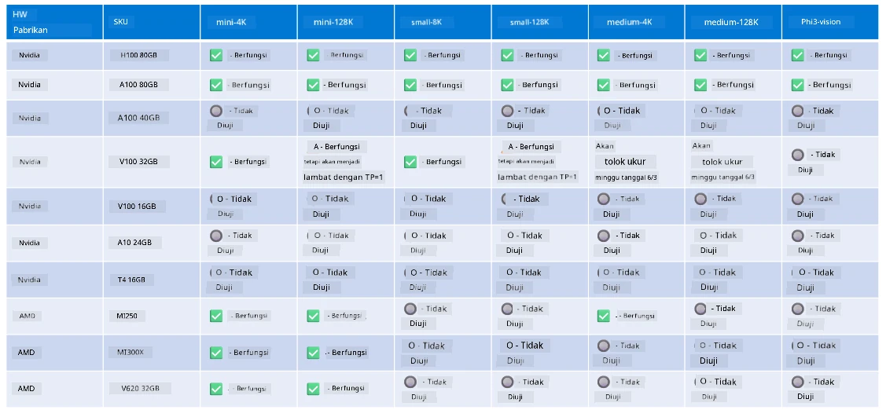

<!--
CO_OP_TRANSLATOR_METADATA:
{
  "original_hash": "8cdc17ce0f10535da30b53d23fe1a795",
  "translation_date": "2025-07-16T18:26:18+00:00",
  "source_file": "md/01.Introduction/01/01.Hardwaresupport.md",
  "language_code": "id"
}
-->
# Dukungan Perangkat Keras Phi

Microsoft Phi telah dioptimalkan untuk ONNX Runtime dan mendukung Windows DirectML. Ini bekerja dengan baik di berbagai jenis perangkat keras, termasuk GPU, CPU, dan bahkan perangkat mobile.

## Perangkat Keras

Secara spesifik, perangkat keras yang didukung meliputi:

- GPU SKU: RTX 4090 (DirectML)
- GPU SKU: 1 A100 80GB (CUDA)
- CPU SKU: Standard F64s v2 (64 vCPU, 128 GiB memori)

## SKU Mobile

- Android - Samsung Galaxy S21
- Apple iPhone 14 atau lebih tinggi dengan Prosesor A16/A17

## Spesifikasi Perangkat Keras Phi

- Konfigurasi Minimum yang Diperlukan.
- Windows: GPU yang mendukung DirectX 12 dan minimal 4GB RAM gabungan

CUDA: GPU NVIDIA dengan Compute Capability >= 7.02



## Menjalankan onnxruntime pada beberapa GPU

Model Phi ONNX yang tersedia saat ini hanya untuk 1 GPU. Mendukung multi-GPU untuk model Phi memang memungkinkan, tetapi ORT dengan 2 GPU tidak menjamin akan memberikan throughput lebih tinggi dibandingkan dengan 2 instance ORT. Silakan lihat [ONNX Runtime](https://onnxruntime.ai/) untuk pembaruan terbaru.

Pada [Build 2024, Tim GenAI ONNX](https://youtu.be/WLW4SE8M9i8?si=EtG04UwDvcjunyfC) mengumumkan bahwa mereka telah mengaktifkan multi-instance sebagai pengganti multi-GPU untuk model Phi.

Saat ini, ini memungkinkan Anda menjalankan satu instance onnxruntime atau onnxruntime-genai dengan variabel lingkungan CUDA_VISIBLE_DEVICES seperti ini.

```Python
CUDA_VISIBLE_DEVICES=0 python infer.py
CUDA_VISIBLE_DEVICES=1 python infer.py
```

Jangan ragu untuk menjelajahi Phi lebih lanjut di [Azure AI Foundry](https://ai.azure.com)

**Penafian**:  
Dokumen ini telah diterjemahkan menggunakan layanan terjemahan AI [Co-op Translator](https://github.com/Azure/co-op-translator). Meskipun kami berupaya untuk mencapai akurasi, harap diketahui bahwa terjemahan otomatis mungkin mengandung kesalahan atau ketidakakuratan. Dokumen asli dalam bahasa aslinya harus dianggap sebagai sumber yang sahih. Untuk informasi penting, disarankan menggunakan terjemahan profesional oleh manusia. Kami tidak bertanggung jawab atas kesalahpahaman atau penafsiran yang keliru yang timbul dari penggunaan terjemahan ini.