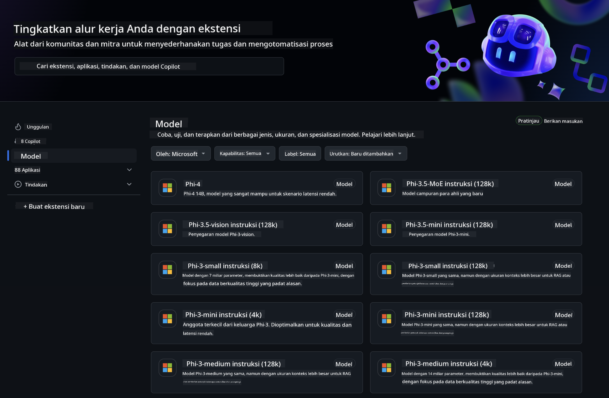
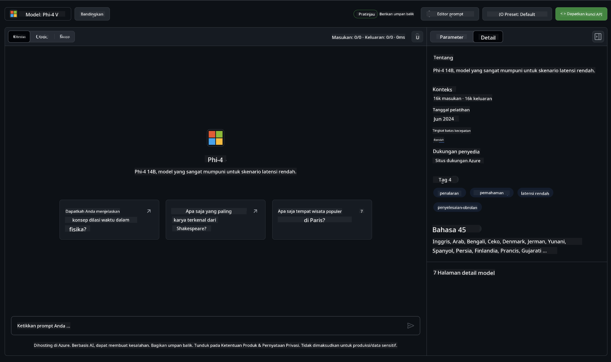
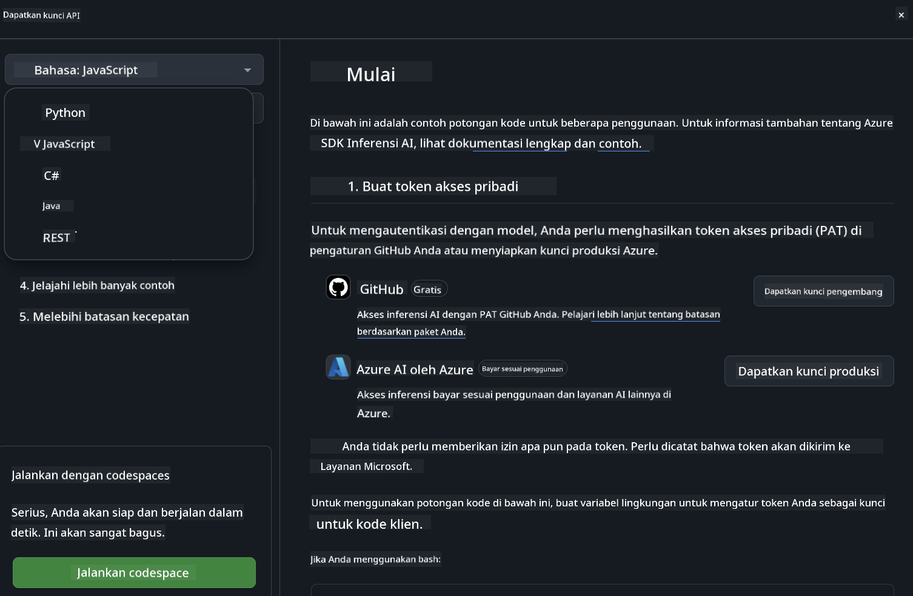
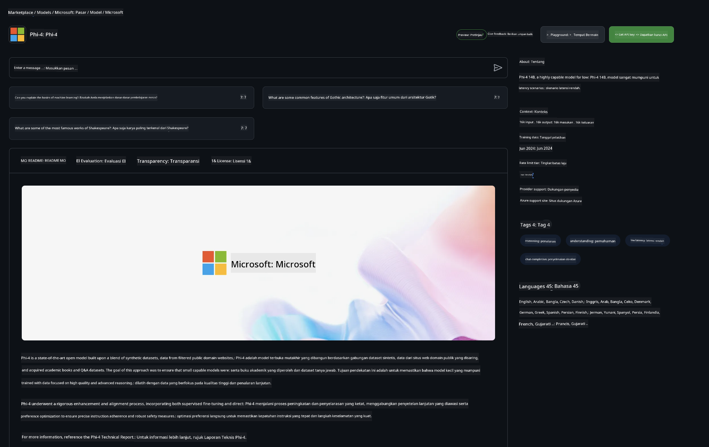

<!--
CO_OP_TRANSLATOR_METADATA:
{
  "original_hash": "fb67a08b9fc911a10ed58081fadef416",
  "translation_date": "2025-05-09T08:55:27+00:00",
  "source_file": "md/01.Introduction/02/02.GitHubModel.md",
  "language_code": "id"
}
-->
## Keluarga Phi di GitHub Models

Selamat datang di [GitHub Models](https://github.com/marketplace/models)! Kami sudah siap untuk Anda menjelajahi Model AI yang dihosting di Azure AI.



Untuk informasi lebih lanjut tentang Model yang tersedia di GitHub Models, lihat [GitHub Model Marketplace](https://github.com/marketplace/models)

## Model yang Tersedia

Setiap model memiliki playground dan contoh kode khusus



### Keluarga Phi di Katalog Model GitHub

- [Phi-4](https://github.com/marketplace/models/azureml/Phi-4)

- [Phi-3.5-MoE instruct (128k)](https://github.com/marketplace/models/azureml/Phi-3-5-MoE-instruct)

- [Phi-3.5-vision instruct (128k)](https://github.com/marketplace/models/azureml/Phi-3-5-vision-instruct)

- [Phi-3.5-mini instruct (128k)](https://github.com/marketplace/models/azureml/Phi-3-5-mini-instruct)

- [Phi-3-Medium-128k-Instruct](https://github.com/marketplace/models/azureml/Phi-3-medium-128k-instruct)

- [Phi-3-medium-4k-instruct](https://github.com/marketplace/models/azureml/Phi-3-medium-4k-instruct)

- [Phi-3-mini-128k-instruct](https://github.com/marketplace/models/azureml/Phi-3-mini-128k-instruct)

- [Phi-3-mini-4k-instruct](https://github.com/marketplace/models/azureml/Phi-3-mini-4k-instruct)

- [Phi-3-small-128k-instruct](https://github.com/marketplace/models/azureml/Phi-3-small-128k-instruct)

- [Phi-3-small-8k-instruct](https://github.com/marketplace/models/azureml/Phi-3-small-8k-instruct)

## Memulai

Ada beberapa contoh dasar yang siap untuk Anda jalankan. Anda bisa menemukannya di direktori samples. Jika Anda ingin langsung menggunakan bahasa favorit Anda, contoh-contoh tersebut tersedia dalam Bahasa berikut:

- Python
- JavaScript
- C#
- Java
- cURL

Tersedia juga lingkungan Codespaces khusus untuk menjalankan contoh dan model.




## Contoh Kode

Berikut adalah potongan kode contoh untuk beberapa kasus penggunaan. Untuk informasi lebih lanjut tentang Azure AI Inference SDK, lihat dokumentasi lengkap dan contoh.

## Setup

1. Buat personal access token  
Anda tidak perlu memberikan izin apapun pada token. Perlu diingat bahwa token akan dikirim ke layanan Microsoft.

Untuk menggunakan potongan kode di bawah, buat variabel lingkungan untuk menetapkan token Anda sebagai kunci untuk kode klien.

Jika Anda menggunakan bash:  
```
export GITHUB_TOKEN="<your-github-token-goes-here>"
```  
Jika Anda menggunakan powershell:  

```
$Env:GITHUB_TOKEN="<your-github-token-goes-here>"
```  

Jika Anda menggunakan Windows command prompt:  

```
set GITHUB_TOKEN=<your-github-token-goes-here>
```  

## Contoh Python

### Instal dependensi  
Instal Azure AI Inference SDK menggunakan pip (Memerlukan: Python >=3.8):

```
pip install azure-ai-inference
```  
### Jalankan contoh kode dasar

Contoh ini menunjukkan panggilan dasar ke API chat completion. Ini menggunakan endpoint inferensi model AI GitHub dan token GitHub Anda. Panggilan ini bersifat sinkron.

```python
import os
from azure.ai.inference import ChatCompletionsClient
from azure.ai.inference.models import SystemMessage, UserMessage
from azure.core.credentials import AzureKeyCredential

endpoint = "https://models.inference.ai.azure.com"
model_name = "Phi-4"
token = os.environ["GITHUB_TOKEN"]

client = ChatCompletionsClient(
    endpoint=endpoint,
    credential=AzureKeyCredential(token),
)

response = client.complete(
    messages=[
        UserMessage(content="I have $20,000 in my savings account, where I receive a 4% profit per year and payments twice a year. Can you please tell me how long it will take for me to become a millionaire? Also, can you please explain the math step by step as if you were explaining it to an uneducated person?"),
    ],
    temperature=0.4,
    top_p=1.0,
    max_tokens=2048,
    model=model_name
)

print(response.choices[0].message.content)
```

### Jalankan percakapan multi-turn

Contoh ini menunjukkan percakapan multi-turn dengan API chat completion. Saat menggunakan model untuk aplikasi chat, Anda perlu mengelola riwayat percakapan dan mengirim pesan terbaru ke model.

```
import os
from azure.ai.inference import ChatCompletionsClient
from azure.ai.inference.models import AssistantMessage, SystemMessage, UserMessage
from azure.core.credentials import AzureKeyCredential

token = os.environ["GITHUB_TOKEN"]
endpoint = "https://models.inference.ai.azure.com"
# Replace Model_Name
model_name = "Phi-4"

client = ChatCompletionsClient(
    endpoint=endpoint,
    credential=AzureKeyCredential(token),
)

messages = [
    SystemMessage(content="You are a helpful assistant."),
    UserMessage(content="What is the capital of France?"),
    AssistantMessage(content="The capital of France is Paris."),
    UserMessage(content="What about Spain?"),
]

response = client.complete(messages=messages, model=model_name)

print(response.choices[0].message.content)
```

### Streaming output

Untuk pengalaman pengguna yang lebih baik, Anda bisa melakukan streaming respons model sehingga token pertama muncul lebih cepat dan Anda tidak perlu menunggu respons yang lama.

```
import os
from azure.ai.inference import ChatCompletionsClient
from azure.ai.inference.models import SystemMessage, UserMessage
from azure.core.credentials import AzureKeyCredential

token = os.environ["GITHUB_TOKEN"]
endpoint = "https://models.inference.ai.azure.com"
# Replace Model_Name
model_name = "Phi-4"

client = ChatCompletionsClient(
    endpoint=endpoint,
    credential=AzureKeyCredential(token),
)

response = client.complete(
    stream=True,
    messages=[
        SystemMessage(content="You are a helpful assistant."),
        UserMessage(content="Give me 5 good reasons why I should exercise every day."),
    ],
    model=model_name,
)

for update in response:
    if update.choices:
        print(update.choices[0].delta.content or "", end="")

client.close()
```

## Penggunaan GRATIS dan Batasan Rate untuk GitHub Models



[Batas rate untuk playground dan penggunaan API gratis](https://docs.github.com/en/github-models/prototyping-with-ai-models#rate-limits) ditujukan untuk membantu Anda bereksperimen dengan model dan membuat prototipe aplikasi AI Anda. Untuk penggunaan di luar batas tersebut, dan untuk mengembangkan aplikasi Anda ke skala lebih besar, Anda harus menyediakan sumber daya dari akun Azure, dan melakukan autentikasi dari sana alih-alih menggunakan personal access token GitHub Anda. Anda tidak perlu mengubah apapun di kode Anda. Gunakan tautan ini untuk mengetahui cara melewati batas tier gratis di Azure AI.


### Pengungkapan

Ingat, saat berinteraksi dengan model Anda sedang bereksperimen dengan AI, jadi kesalahan konten mungkin terjadi.

Fitur ini memiliki berbagai batasan (termasuk permintaan per menit, permintaan per hari, token per permintaan, dan permintaan bersamaan) dan tidak dirancang untuk kasus penggunaan produksi.

GitHub Models menggunakan Azure AI Content Safety. Filter ini tidak dapat dimatikan sebagai bagian dari pengalaman GitHub Models. Jika Anda memutuskan menggunakan model melalui layanan berbayar, harap konfigurasikan filter konten Anda sesuai kebutuhan.

Layanan ini berada di bawah Ketentuan Prarilis GitHub.

**Penafian**:  
Dokumen ini telah diterjemahkan menggunakan layanan terjemahan AI [Co-op Translator](https://github.com/Azure/co-op-translator). Meskipun kami berusaha untuk akurasi, harap diketahui bahwa terjemahan otomatis mungkin mengandung kesalahan atau ketidakakuratan. Dokumen asli dalam bahasa aslinya harus dianggap sebagai sumber yang sahih. Untuk informasi penting, disarankan menggunakan terjemahan profesional oleh manusia. Kami tidak bertanggung jawab atas kesalahpahaman atau salah tafsir yang timbul dari penggunaan terjemahan ini.