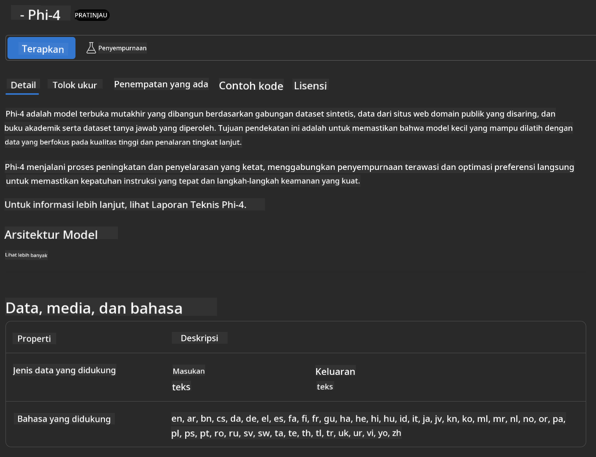
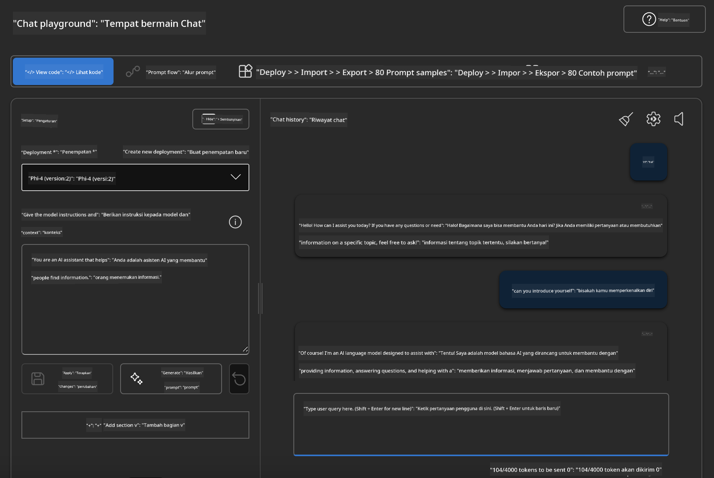

<!--
CO_OP_TRANSLATOR_METADATA:
{
  "original_hash": "3ae21dc5554e888defbe57946ee995ee",
  "translation_date": "2025-07-16T19:10:24+00:00",
  "source_file": "md/01.Introduction/02/03.AzureAIFoundry.md",
  "language_code": "id"
}
-->
## Keluarga Phi di Azure AI Foundry

[Azure AI Foundry](https://ai.azure.com) adalah platform terpercaya yang memberdayakan pengembang untuk mendorong inovasi dan membentuk masa depan dengan AI secara aman, terlindungi, dan bertanggung jawab.

[Azure AI Foundry](https://ai.azure.com) dirancang untuk pengembang agar dapat:

- Membangun aplikasi AI generatif di platform kelas perusahaan.
- Menjelajahi, membangun, menguji, dan menerapkan menggunakan alat AI dan model ML terkini, dengan dasar praktik AI yang bertanggung jawab.
- Bekerja sama dalam tim untuk seluruh siklus hidup pengembangan aplikasi.

Dengan Azure AI Foundry, Anda dapat menjelajahi berbagai model, layanan, dan kemampuan, serta mulai membangun aplikasi AI yang paling sesuai dengan tujuan Anda. Platform Azure AI Foundry memudahkan skalabilitas untuk mengubah proof of concept menjadi aplikasi produksi penuh dengan mudah. Pemantauan dan penyempurnaan berkelanjutan mendukung kesuksesan jangka panjang.


Selain menggunakan Azure AOAI Service di Azure AI Foundry, Anda juga dapat menggunakan model pihak ketiga di Azure AI Foundry Model Catalog. Ini adalah pilihan yang baik jika Anda ingin menggunakan Azure AI Foundry sebagai platform solusi AI Anda.

Kita dapat dengan cepat menerapkan Model Keluarga Phi melalui Model Catalog di Azure AI Foundry

[Microsoft Phi Models in Azure AI Foundry Models](https://ai.azure.com/explore/models/?selectedCollection=phi)


### **Menerapkan Phi-4 di Azure AI Foundry**



### **Menguji Phi-4 di Azure AI Foundry Playground**



### **Menjalankan Kode Python untuk memanggil Azure AI Foundry Phi-4**

```python

import os  
import base64
from openai import AzureOpenAI  
from azure.identity import DefaultAzureCredential, get_bearer_token_provider  
        
endpoint = os.getenv("ENDPOINT_URL", "Your Azure AOAI Service Endpoint")  
deployment = os.getenv("DEPLOYMENT_NAME", "Phi-4")  
      
token_provider = get_bearer_token_provider(  
    DefaultAzureCredential(),  
    "https://cognitiveservices.azure.com/.default"  
)  
  
client = AzureOpenAI(  
    azure_endpoint=endpoint,  
    azure_ad_token_provider=token_provider,  
    api_version="2024-05-01-preview",  
)  
  

chat_prompt = [
    {
        "role": "system",
        "content": "You are an AI assistant that helps people find information."
    },
    {
        "role": "user",
        "content": "can you introduce yourself"
    }
] 
    
# Include speech result if speech is enabled  
messages = chat_prompt 

completion = client.chat.completions.create(  
    model=deployment,  
    messages=messages,
    max_tokens=800,  
    temperature=0.7,  
    top_p=0.95,  
    frequency_penalty=0,  
    presence_penalty=0,
    stop=None,  
    stream=False  
)  
  
print(completion.to_json())  

```

**Penafian**:  
Dokumen ini telah diterjemahkan menggunakan layanan terjemahan AI [Co-op Translator](https://github.com/Azure/co-op-translator). Meskipun kami berupaya untuk mencapai akurasi, harap diingat bahwa terjemahan otomatis mungkin mengandung kesalahan atau ketidakakuratan. Dokumen asli dalam bahasa aslinya harus dianggap sebagai sumber yang sahih. Untuk informasi penting, disarankan menggunakan terjemahan profesional oleh manusia. Kami tidak bertanggung jawab atas kesalahpahaman atau penafsiran yang keliru yang timbul dari penggunaan terjemahan ini.