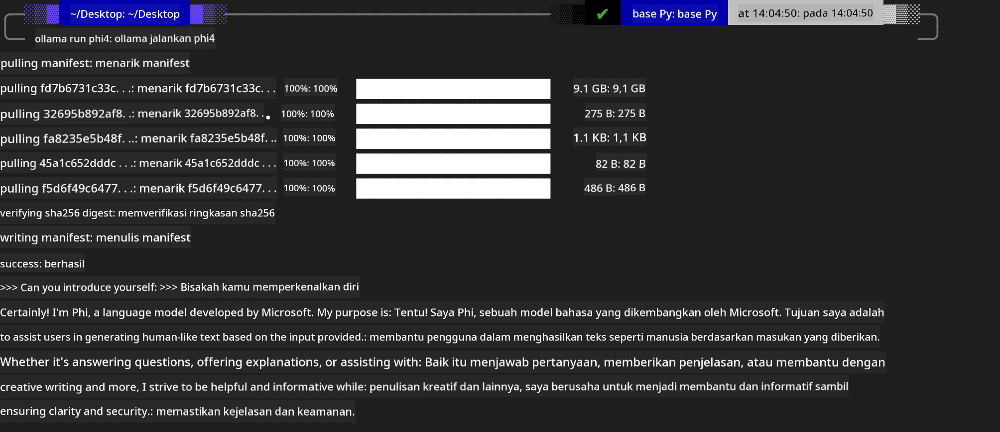

<!--
CO_OP_TRANSLATOR_METADATA:
{
  "original_hash": "2aa35f3c8b437fd5dc9995d53909d495",
  "translation_date": "2025-12-21T12:45:23+00:00",
  "source_file": "md/01.Introduction/02/04.Ollama.md",
  "language_code": "id"
}
-->
## Keluarga Phi di Ollama


[Ollama](https://ollama.com) memungkinkan lebih banyak orang untuk langsung menerapkan LLM atau SLM sumber terbuka melalui skrip sederhana, dan juga dapat membangun API untuk membantu skenario aplikasi Copilot lokal.

## **1. Instalasi**

Ollama mendukung menjalankan di Windows, macOS, dan Linux. Anda dapat memasang Ollama melalui tautan ini ([https://ollama.com/download](https://ollama.com/download)). Setelah instalasi berhasil, Anda dapat langsung menggunakan skrip Ollama untuk memanggil Phi-3 melalui jendela terminal. Anda dapat melihat semua [perpustakaan yang tersedia di Ollama](https://ollama.com/library). Jika Anda membuka repositori ini di Codespace, Ollama sudah akan terpasang.

```bash

ollama run phi4

```

> [!NOTE]
> Model akan diunduh terlebih dahulu saat Anda menjalankannya untuk pertama kali. Tentu saja, Anda juga dapat langsung menentukan model Phi-4 yang sudah diunduh. Kami mengambil WSL sebagai contoh untuk menjalankan perintah. Setelah model berhasil diunduh, Anda dapat berinteraksi langsung di terminal.



## **2. Memanggil API phi-4 dari Ollama**

Jika Anda ingin memanggil API Phi-4 yang dibuat oleh ollama, Anda dapat menggunakan perintah ini di terminal untuk memulai server ollama.

```bash

ollama serve

```

> [!NOTE]
> Jika menjalankan MacOS atau Linux, harap dicatat bahwa Anda mungkin menemui kesalahan berikut **"Error: listen tcp 127.0.0.1:11434: bind: address already in use"** Anda mungkin mendapatkan kesalahan ini saat menjalankan perintah. Anda dapat mengabaikan kesalahan tersebut, karena biasanya menandakan server sudah berjalan, atau Anda dapat menghentikan dan memulai ulang Ollama:

**macOS**

```bash

brew services restart ollama

```

**Linux**

```bash

sudo systemctl stop ollama

```

Ollama mendukung dua API: generate dan chat. Anda dapat memanggil API model yang disediakan oleh Ollama sesuai kebutuhan Anda, dengan mengirim permintaan ke layanan lokal yang berjalan pada port 11434.

**Chat**

```bash

curl http://127.0.0.1:11434/api/chat -d '{
  "model": "phi3",
  "messages": [
    {
      "role": "system",
      "content": "Your are a python developer."
    },
    {
      "role": "user",
      "content": "Help me generate a bubble algorithm"
    }
  ],
  "stream": false
  
}'
```

Ini adalah hasil di Postman


## Sumber Daya Tambahan

Lihat daftar model yang tersedia di Ollama di [perpustakaan mereka](https://ollama.com/library).

Tarik model Anda dari server Ollama menggunakan perintah ini

```bash
ollama pull phi4
```

Jalankan model menggunakan perintah ini

```bash
ollama run phi4
```

***Catatan:*** Kunjungi tautan ini [https://github.com/ollama/ollama/blob/main/docs/api.md](https://github.com/ollama/ollama/blob/main/docs/api.md) untuk mempelajari lebih lanjut

## Memanggil Ollama dari Python

Anda dapat menggunakan `requests` atau `urllib3` untuk membuat permintaan ke endpoint server lokal yang digunakan di atas. Namun, cara populer menggunakan Ollama di Python adalah melalui SDK [openai](https://pypi.org/project/openai/), karena Ollama juga menyediakan endpoint server yang kompatibel dengan OpenAI.

Berikut contoh untuk phi3-mini:

```python
import openai

client = openai.OpenAI(
    base_url="http://localhost:11434/v1",
    api_key="nokeyneeded",
)

response = client.chat.completions.create(
    model="phi4",
    temperature=0.7,
    n=1,
    messages=[
        {"role": "system", "content": "You are a helpful assistant."},
        {"role": "user", "content": "Write a haiku about a hungry cat"},
    ],
)

print("Response:")
print(response.choices[0].message.content)
```

## Memanggil Ollama dari JavaScript 

```javascript
// Contoh meringkas sebuah file dengan Phi-4
script({
    model: "ollama:phi4",
    title: "Summarize with Phi-4",
    system: ["system"],
})

// Contoh meringkas
const file = def("FILE", env.files)
$`Summarize ${file} in a single paragraph.`
```

## Memanggil Ollama dari C#

Buat aplikasi Console C# baru dan tambahkan paket NuGet berikut:

```bash
dotnet add package Microsoft.SemanticKernel --version 1.34.0
```

Kemudian ganti kode ini di berkas `Program.cs`

```csharp
using Microsoft.SemanticKernel;
using Microsoft.SemanticKernel.ChatCompletion;

// add chat completion service using the local ollama server endpoint
#pragma warning disable SKEXP0001, SKEXP0003, SKEXP0010, SKEXP0011, SKEXP0050, SKEXP0052
builder.AddOpenAIChatCompletion(
    modelId: "phi4",
    endpoint: new Uri("http://localhost:11434/"),
    apiKey: "non required");

// invoke a simple prompt to the chat service
string prompt = "Write a joke about kittens";
var response = await kernel.InvokePromptAsync(prompt);
Console.WriteLine(response.GetValue<string>());
```

Jalankan aplikasi dengan perintah:

```bash
dotnet run
```

---

<!-- CO-OP TRANSLATOR DISCLAIMER START -->
Penafian:
Dokumen ini telah diterjemahkan menggunakan layanan terjemahan AI Co‑op Translator (https://github.com/Azure/co-op-translator). Meskipun kami berupaya mencapai tingkat akurasi yang tinggi, harap diperhatikan bahwa terjemahan otomatis dapat mengandung kesalahan atau ketidaktepatan. Dokumen asli dalam bahasa aslinya harus dianggap sebagai sumber yang berwenang. Untuk informasi yang bersifat krusial, disarankan menggunakan terjemahan profesional oleh penerjemah manusia. Kami tidak bertanggung jawab atas kesalahpahaman atau salah tafsir yang timbul dari penggunaan terjemahan ini.
<!-- CO-OP TRANSLATOR DISCLAIMER END -->