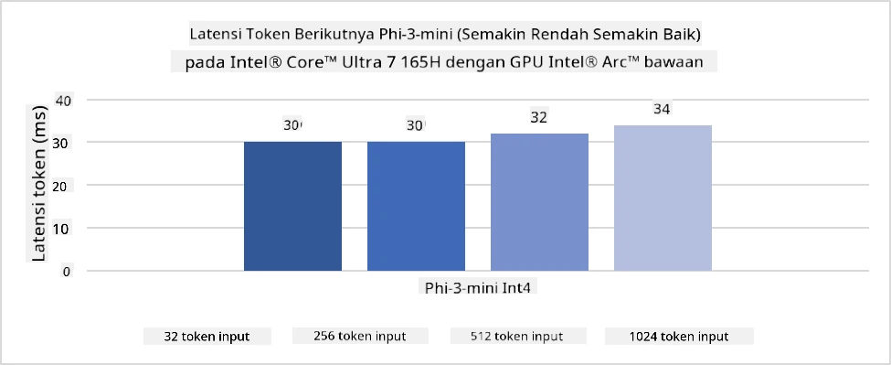
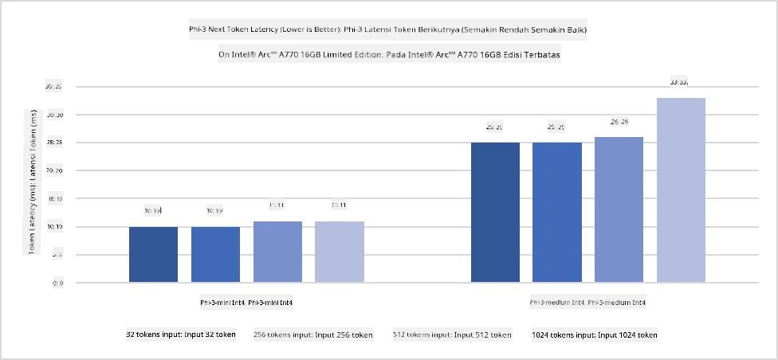
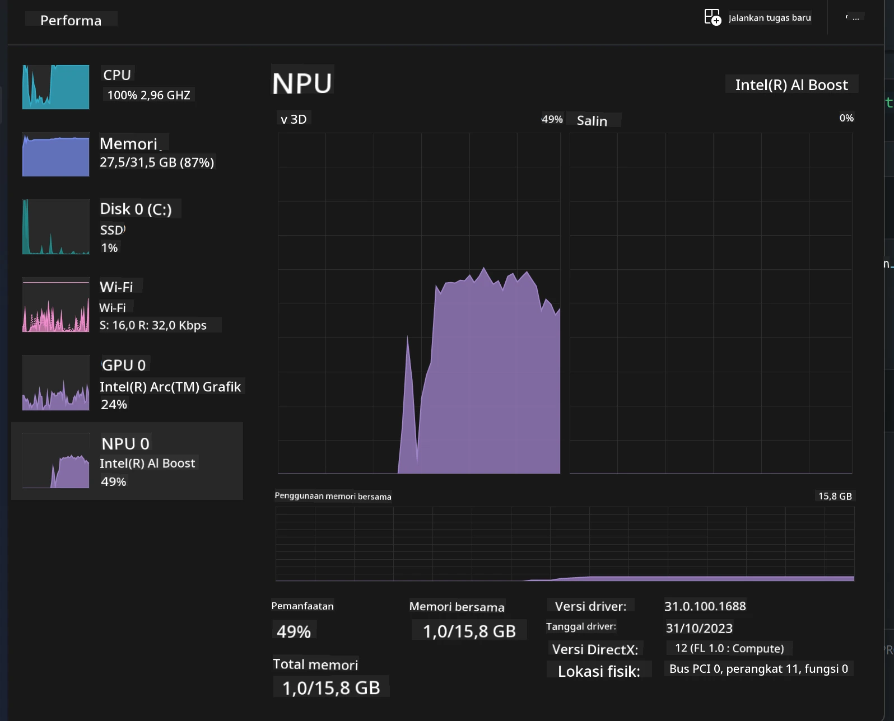
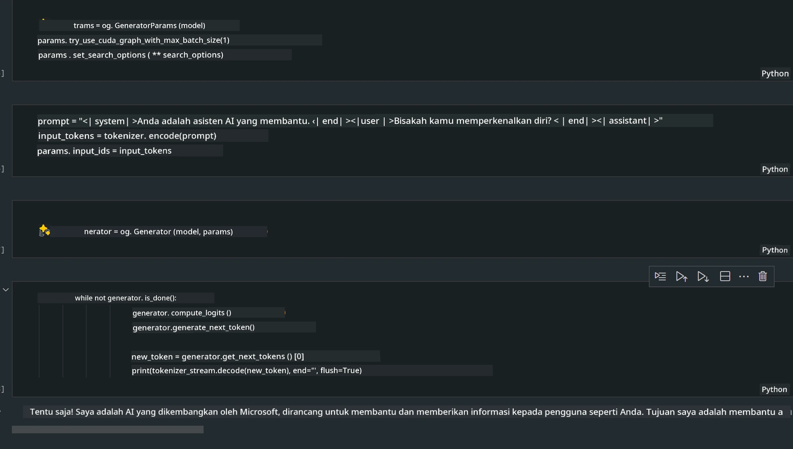
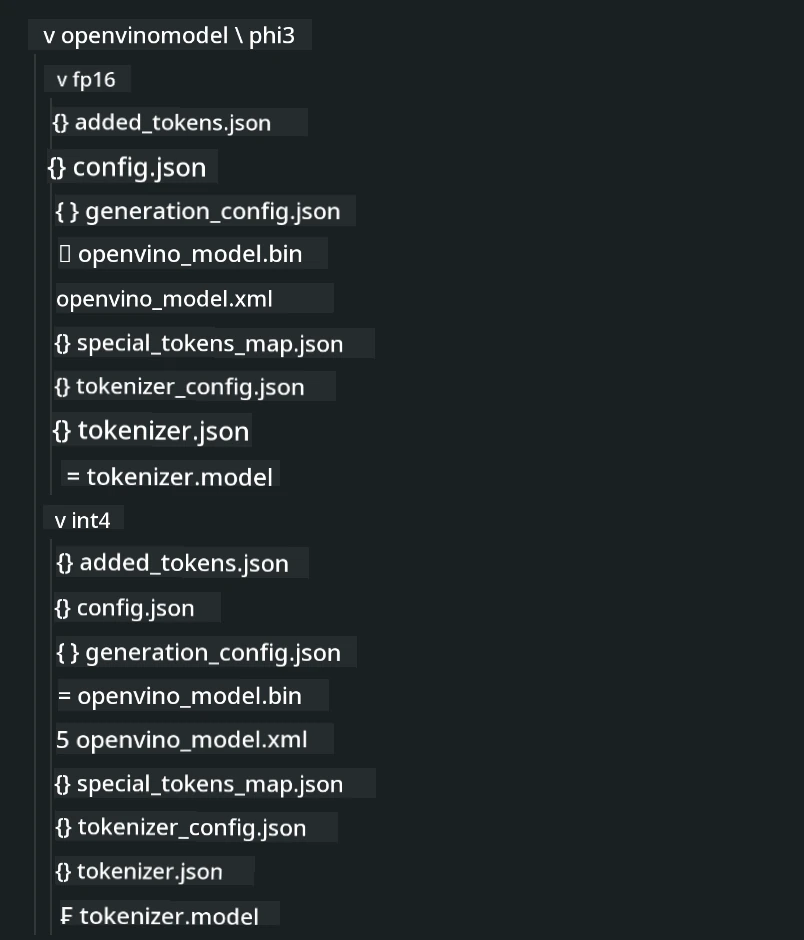
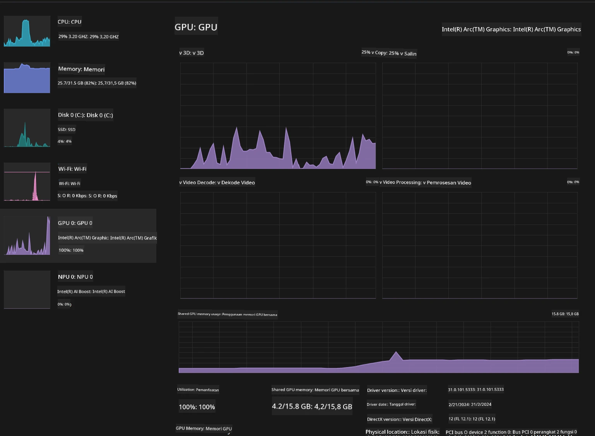

<!--
CO_OP_TRANSLATOR_METADATA:
{
  "original_hash": "e08ce816e23ad813244a09ca34ebb8ac",
  "translation_date": "2025-07-16T20:04:57+00:00",
  "source_file": "md/01.Introduction/03/AIPC_Inference.md",
  "language_code": "id"
}
-->
# **Inferensi Phi-3 di AI PC**

Dengan kemajuan AI generatif dan peningkatan kemampuan perangkat keras perangkat edge, semakin banyak model AI generatif yang kini dapat diintegrasikan ke dalam perangkat Bring Your Own Device (BYOD) pengguna. AI PC termasuk di antara model-model ini. Mulai tahun 2024, Intel, AMD, dan Qualcomm telah bekerja sama dengan produsen PC untuk memperkenalkan AI PC yang memudahkan penerapan model AI generatif lokal melalui modifikasi perangkat keras. Dalam pembahasan ini, kita akan fokus pada Intel AI PC dan mengeksplorasi cara menjalankan Phi-3 di Intel AI PC.

### Apa itu NPU

NPU (Neural Processing Unit) adalah prosesor khusus atau unit pemrosesan pada SoC yang lebih besar yang dirancang khusus untuk mempercepat operasi jaringan saraf dan tugas AI. Berbeda dengan CPU dan GPU umum, NPU dioptimalkan untuk komputasi paralel berbasis data, sehingga sangat efisien dalam memproses data multimedia besar seperti video dan gambar serta data untuk jaringan saraf. NPU sangat mahir dalam menangani tugas terkait AI, seperti pengenalan suara, pengaburan latar belakang dalam panggilan video, dan proses pengeditan foto atau video seperti deteksi objek.

## NPU vs GPU

Meskipun banyak beban kerja AI dan machine learning dijalankan di GPU, ada perbedaan penting antara GPU dan NPU.  
GPU dikenal dengan kemampuan komputasi paralelnya, tetapi tidak semua GPU sama efisiennya di luar pemrosesan grafis. Sementara itu, NPU dibuat khusus untuk komputasi kompleks yang terlibat dalam operasi jaringan saraf, sehingga sangat efektif untuk tugas AI.

Singkatnya, NPU adalah ahli matematika yang mempercepat komputasi AI, dan mereka memainkan peran kunci di era AI PC yang sedang berkembang!

***Contoh ini berdasarkan Intel Core Ultra Processor terbaru dari Intel***

## **1. Menggunakan NPU untuk menjalankan model Phi-3**

Perangkat Intel® NPU adalah akselerator inferensi AI yang terintegrasi dengan CPU klien Intel, mulai dari generasi CPU Intel® Core™ Ultra (sebelumnya dikenal sebagai Meteor Lake). Ini memungkinkan eksekusi tugas jaringan saraf buatan dengan efisiensi energi.





**Intel NPU Acceleration Library**

Intel NPU Acceleration Library [https://github.com/intel/intel-npu-acceleration-library](https://github.com/intel/intel-npu-acceleration-library) adalah pustaka Python yang dirancang untuk meningkatkan efisiensi aplikasi Anda dengan memanfaatkan kekuatan Intel Neural Processing Unit (NPU) untuk melakukan komputasi berkecepatan tinggi pada perangkat keras yang kompatibel.

Contoh Phi-3-mini di AI PC yang didukung oleh prosesor Intel® Core™ Ultra.


Pasang pustaka Python dengan pip

```bash

   pip install intel-npu-acceleration-library

```

***Catatan*** Proyek ini masih dalam pengembangan, tetapi model referensinya sudah sangat lengkap.

### **Menjalankan Phi-3 dengan Intel NPU Acceleration Library**

Dengan akselerasi Intel NPU, pustaka ini tidak memengaruhi proses encoding tradisional. Anda hanya perlu menggunakan pustaka ini untuk mengkuantisasi model Phi-3 asli, seperti FP16, INT8, INT4, contohnya

```python
from transformers import AutoTokenizer, pipeline,TextStreamer
from intel_npu_acceleration_library import NPUModelForCausalLM, int4
from intel_npu_acceleration_library.compiler import CompilerConfig
import warnings

model_id = "microsoft/Phi-3-mini-4k-instruct"

compiler_conf = CompilerConfig(dtype=int4)
model = NPUModelForCausalLM.from_pretrained(
    model_id, use_cache=True, config=compiler_conf, attn_implementation="sdpa"
).eval()

tokenizer = AutoTokenizer.from_pretrained(model_id)

text_streamer = TextStreamer(tokenizer, skip_prompt=True)
```

Setelah kuantisasi berhasil, lanjutkan eksekusi untuk memanggil NPU menjalankan model Phi-3.

```python
generation_args = {
   "max_new_tokens": 1024,
   "return_full_text": False,
   "temperature": 0.3,
   "do_sample": False,
   "streamer": text_streamer,
}

pipe = pipeline(
   "text-generation",
   model=model,
   tokenizer=tokenizer,
)

query = "<|system|>You are a helpful AI assistant.<|end|><|user|>Can you introduce yourself?<|end|><|assistant|>"

with warnings.catch_warnings():
    warnings.simplefilter("ignore")
    pipe(query, **generation_args)
```

Saat menjalankan kode, kita dapat melihat status NPU melalui Task Manager



***Contoh*** : [AIPC_NPU_DEMO.ipynb](../../../../../code/03.Inference/AIPC/AIPC_NPU_DEMO.ipynb)

## **2. Menggunakan DirectML + ONNX Runtime untuk menjalankan model Phi-3**

### **Apa itu DirectML**

[DirectML](https://github.com/microsoft/DirectML) adalah pustaka DirectX 12 yang dipercepat perangkat keras dengan performa tinggi untuk machine learning. DirectML menyediakan akselerasi GPU untuk tugas machine learning umum di berbagai perangkat keras dan driver yang didukung, termasuk semua GPU yang mendukung DirectX 12 dari vendor seperti AMD, Intel, NVIDIA, dan Qualcomm.

Saat digunakan secara mandiri, API DirectML adalah pustaka DirectX 12 tingkat rendah yang cocok untuk aplikasi berperforma tinggi dan latensi rendah seperti framework, game, dan aplikasi real-time lainnya. Interoperabilitas mulus DirectML dengan Direct3D 12 serta overhead rendah dan kesesuaian di berbagai perangkat keras membuat DirectML ideal untuk mempercepat machine learning ketika performa tinggi diinginkan, dan keandalan serta prediktabilitas hasil di berbagai perangkat keras sangat penting.

***Catatan*** : DirectML terbaru sudah mendukung NPU (https://devblogs.microsoft.com/directx/introducing-neural-processor-unit-npu-support-in-directml-developer-preview/)

### Perbandingan DirectML dan CUDA dari segi kemampuan dan performa:

**DirectML** adalah pustaka machine learning yang dikembangkan oleh Microsoft. Dirancang untuk mempercepat beban kerja machine learning di perangkat Windows, termasuk desktop, laptop, dan perangkat edge.  
- Berbasis DX12: DirectML dibangun di atas DirectX 12 (DX12), yang menyediakan dukungan perangkat keras luas di berbagai GPU, termasuk NVIDIA dan AMD.  
- Dukungan Lebih Luas: Karena memanfaatkan DX12, DirectML dapat bekerja dengan GPU apa pun yang mendukung DX12, bahkan GPU terintegrasi.  
- Pemrosesan Gambar: DirectML memproses gambar dan data lain menggunakan jaringan saraf, cocok untuk tugas seperti pengenalan gambar, deteksi objek, dan lainnya.  
- Mudah Dipasang: Pengaturan DirectML sederhana dan tidak memerlukan SDK atau pustaka khusus dari produsen GPU.  
- Performa: Dalam beberapa kasus, DirectML memiliki performa baik dan bisa lebih cepat dari CUDA, terutama untuk beban kerja tertentu.  
- Keterbatasan: Namun, ada situasi di mana DirectML bisa lebih lambat, terutama untuk batch besar float16.

**CUDA** adalah platform komputasi paralel dan model pemrograman dari NVIDIA. Memungkinkan pengembang memanfaatkan kekuatan GPU NVIDIA untuk komputasi umum, termasuk machine learning dan simulasi ilmiah.  
- Khusus NVIDIA: CUDA terintegrasi erat dengan GPU NVIDIA dan dirancang khusus untuknya.  
- Sangat Dioptimalkan: Memberikan performa luar biasa untuk tugas yang dipercepat GPU, terutama dengan GPU NVIDIA.  
- Banyak Digunakan: Banyak framework dan pustaka machine learning (seperti TensorFlow dan PyTorch) mendukung CUDA.  
- Kustomisasi: Pengembang dapat mengatur CUDA untuk tugas tertentu, menghasilkan performa optimal.  
- Keterbatasan: Ketergantungan CUDA pada perangkat keras NVIDIA bisa membatasi kompatibilitas jika ingin dukungan lebih luas di berbagai GPU.

### Memilih antara DirectML dan CUDA

Pilihan antara DirectML dan CUDA tergantung pada kasus penggunaan, ketersediaan perangkat keras, dan preferensi Anda.  
Jika menginginkan kompatibilitas lebih luas dan kemudahan pengaturan, DirectML bisa menjadi pilihan yang baik. Namun, jika Anda memiliki GPU NVIDIA dan membutuhkan performa sangat optimal, CUDA tetap pilihan kuat. Singkatnya, DirectML dan CUDA masing-masing memiliki kelebihan dan kekurangan, jadi pertimbangkan kebutuhan dan perangkat keras yang tersedia saat membuat keputusan.

### **Generative AI dengan ONNX Runtime**

Di era AI, portabilitas model AI sangat penting. ONNX Runtime memudahkan penerapan model terlatih ke berbagai perangkat. Pengembang tidak perlu memperhatikan framework inferensi dan dapat menggunakan API terpadu untuk menyelesaikan inferensi model. Di era AI generatif, ONNX Runtime juga melakukan optimasi kode (https://onnxruntime.ai/docs/genai/). Melalui ONNX Runtime yang dioptimalkan, model AI generatif yang telah dikuantisasi dapat di-infer di berbagai perangkat. Dalam Generative AI dengan ONNX Runtime, Anda dapat melakukan inferensi model AI melalui Python, C#, C/C++. Tentu saja, penerapan di iPhone dapat memanfaatkan API Generative AI dengan ONNX Runtime berbasis C++.

[Contoh Kode](https://github.com/Azure-Samples/Phi-3MiniSamples/tree/main/onnx)

***Menyusun pustaka generative AI dengan ONNX Runtime***

```bash

winget install --id=Kitware.CMake  -e

git clone https://github.com/microsoft/onnxruntime.git

cd .\onnxruntime\

./build.bat --build_shared_lib --skip_tests --parallel --use_dml --config Release

cd ../

git clone https://github.com/microsoft/onnxruntime-genai.git

cd .\onnxruntime-genai\

mkdir ort

cd ort

mkdir include

mkdir lib

copy ..\onnxruntime\include\onnxruntime\core\providers\dml\dml_provider_factory.h ort\include

copy ..\onnxruntime\include\onnxruntime\core\session\onnxruntime_c_api.h ort\include

copy ..\onnxruntime\build\Windows\Release\Release\*.dll ort\lib

copy ..\onnxruntime\build\Windows\Release\Release\onnxruntime.lib ort\lib

python build.py --use_dml


```

**Pasang pustaka**

```bash

pip install .\onnxruntime_genai_directml-0.3.0.dev0-cp310-cp310-win_amd64.whl

```

Ini adalah hasil eksekusi



***Contoh*** : [AIPC_DirectML_DEMO.ipynb](../../../../../code/03.Inference/AIPC/AIPC_DirectML_DEMO.ipynb)

## **3. Menggunakan Intel OpenVino untuk menjalankan model Phi-3**

### **Apa itu OpenVINO**

[OpenVINO](https://github.com/openvinotoolkit/openvino) adalah toolkit open-source untuk mengoptimalkan dan menerapkan model deep learning. Memberikan peningkatan performa deep learning untuk model visi, audio, dan bahasa dari framework populer seperti TensorFlow, PyTorch, dan lainnya. Mulai dengan OpenVINO. OpenVINO juga dapat digunakan bersama CPU dan GPU untuk menjalankan model Phi-3.

***Catatan***: Saat ini, OpenVINO belum mendukung NPU.

### **Pasang pustaka OpenVINO**

```bash

 pip install git+https://github.com/huggingface/optimum-intel.git

 pip install git+https://github.com/openvinotoolkit/nncf.git

 pip install openvino-nightly

```

### **Menjalankan Phi-3 dengan OpenVINO**

Seperti NPU, OpenVINO menjalankan pemanggilan model AI generatif dengan menjalankan model kuantisasi. Kita perlu mengkuantisasi model Phi-3 terlebih dahulu dan menyelesaikan kuantisasi model melalui command line menggunakan optimum-cli

**INT4**

```bash

optimum-cli export openvino --model "microsoft/Phi-3-mini-4k-instruct" --task text-generation-with-past --weight-format int4 --group-size 128 --ratio 0.6  --sym  --trust-remote-code ./openvinomodel/phi3/int4

```

**FP16**

```bash

optimum-cli export openvino --model "microsoft/Phi-3-mini-4k-instruct" --task text-generation-with-past --weight-format fp16 --trust-remote-code ./openvinomodel/phi3/fp16

```

Format hasil konversi, seperti ini



Muat jalur model (model_dir), konfigurasi terkait (ov_config = {"PERFORMANCE_HINT": "LATENCY", "NUM_STREAMS": "1", "CACHE_DIR": ""}), dan perangkat yang dipercepat perangkat keras (GPU.0) melalui OVModelForCausalLM

```python

ov_model = OVModelForCausalLM.from_pretrained(
     model_dir,
     device='GPU.0',
     ov_config=ov_config,
     config=AutoConfig.from_pretrained(model_dir, trust_remote_code=True),
     trust_remote_code=True,
)

```

Saat menjalankan kode, kita dapat melihat status GPU melalui Task Manager



***Contoh*** : [AIPC_OpenVino_Demo.ipynb](../../../../../code/03.Inference/AIPC/AIPC_OpenVino_Demo.ipynb)

### ***Catatan*** : Ketiga metode di atas masing-masing memiliki keunggulan, namun disarankan menggunakan akselerasi NPU untuk inferensi AI PC.

**Penafian**:  
Dokumen ini telah diterjemahkan menggunakan layanan terjemahan AI [Co-op Translator](https://github.com/Azure/co-op-translator). Meskipun kami berupaya untuk akurasi, harap diketahui bahwa terjemahan otomatis mungkin mengandung kesalahan atau ketidakakuratan. Dokumen asli dalam bahasa aslinya harus dianggap sebagai sumber yang sah. Untuk informasi penting, disarankan menggunakan terjemahan profesional oleh manusia. Kami tidak bertanggung jawab atas kesalahpahaman atau penafsiran yang salah yang timbul dari penggunaan terjemahan ini.