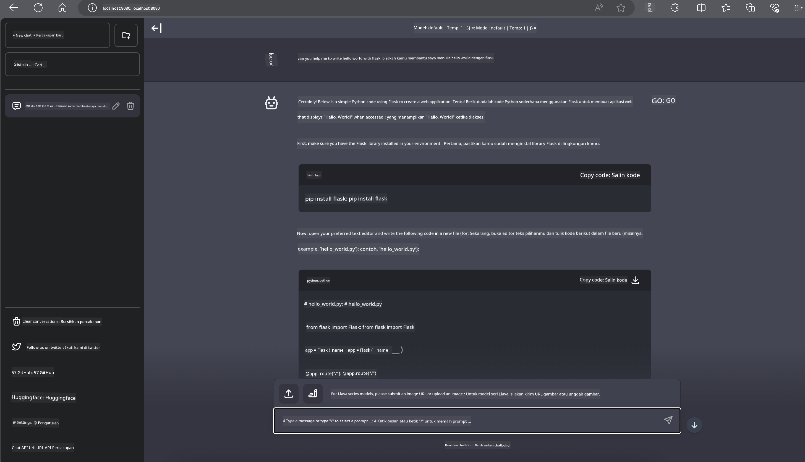

<!--
CO_OP_TRANSLATOR_METADATA:
{
  "original_hash": "be4101a30d98e95a71d42c276e8bcd37",
  "translation_date": "2025-05-09T11:41:54+00:00",
  "source_file": "md/01.Introduction/03/Jetson_Inference.md",
  "language_code": "id"
}
-->
# **Inference Phi-3 di Nvidia Jetson**

Nvidia Jetson adalah serangkaian papan komputasi tertanam dari Nvidia. Model Jetson TK1, TX1, dan TX2 semuanya menggunakan prosesor Tegra (atau SoC) dari Nvidia yang mengintegrasikan unit pemrosesan pusat (CPU) dengan arsitektur ARM. Jetson adalah sistem berdaya rendah yang dirancang untuk mempercepat aplikasi pembelajaran mesin. Nvidia Jetson digunakan oleh pengembang profesional untuk menciptakan produk AI terobosan di berbagai industri, serta oleh pelajar dan penggemar untuk pembelajaran AI secara langsung dan membuat proyek-proyek menarik. SLM diterapkan di perangkat edge seperti Jetson, yang memungkinkan implementasi skenario aplikasi AI generatif industri yang lebih baik.

## Deployment di NVIDIA Jetson:
Pengembang yang bekerja pada robotika otonom dan perangkat tertanam dapat memanfaatkan Phi-3 Mini. Ukuran Phi-3 yang relatif kecil membuatnya ideal untuk deployment di edge. Parameter telah disetel dengan cermat selama pelatihan, memastikan akurasi tinggi dalam respons.

### Optimasi TensorRT-LLM:
Perpustakaan [TensorRT-LLM NVIDIA](https://github.com/NVIDIA/TensorRT-LLM?WT.mc_id=aiml-138114-kinfeylo) mengoptimalkan inferensi model bahasa besar. Ini mendukung jendela konteks panjang Phi-3 Mini, meningkatkan throughput dan latensi. Optimasi meliputi teknik seperti LongRoPE, FP8, dan inflight batching.

### Ketersediaan dan Deployment:
Pengembang dapat menjelajahi Phi-3 Mini dengan jendela konteks 128K di [NVIDIA's AI](https://www.nvidia.com/en-us/ai-data-science/generative-ai/). Ini dikemas sebagai NVIDIA NIM, sebuah microservice dengan API standar yang bisa di-deploy di mana saja. Selain itu, ada juga [implementasi TensorRT-LLM di GitHub](https://github.com/NVIDIA/TensorRT-LLM).

## **1. Persiapan**

a. Jetson Orin NX / Jetson NX

b. JetPack 5.1.2+

c. Cuda 11.8

d. Python 3.8+

## **2. Menjalankan Phi-3 di Jetson**

Kita bisa memilih [Ollama](https://ollama.com) atau [LlamaEdge](https://llamaedge.com)

Jika ingin menggunakan gguf di cloud dan perangkat edge secara bersamaan, LlamaEdge bisa dipahami sebagai WasmEdge (WasmEdge adalah runtime WebAssembly yang ringan, berperforma tinggi, dan skalabel yang cocok untuk aplikasi cloud native, edge, dan terdesentralisasi. Mendukung aplikasi serverless, fungsi tertanam, microservices, smart contracts, dan perangkat IoT. Anda dapat mendistribusikan model kuantitatif gguf ke perangkat edge dan cloud melalui LlamaEdge).


Berikut langkah-langkah penggunaannya

1. Instal dan unduh pustaka serta file terkait

```bash

curl -sSf https://raw.githubusercontent.com/WasmEdge/WasmEdge/master/utils/install.sh | bash -s -- --plugin wasi_nn-ggml

curl -LO https://github.com/LlamaEdge/LlamaEdge/releases/latest/download/llama-api-server.wasm

curl -LO https://github.com/LlamaEdge/chatbot-ui/releases/latest/download/chatbot-ui.tar.gz

tar xzf chatbot-ui.tar.gz

```

**Catatan**: llama-api-server.wasm dan chatbot-ui harus berada di direktori yang sama

2. Jalankan skrip di terminal

```bash

wasmedge --dir .:. --nn-preload default:GGML:AUTO:{Your gguf path} llama-api-server.wasm -p phi-3-chat

```

Berikut hasil jalannya



***Kode contoh*** [Phi-3 mini WASM Notebook Sample](https://github.com/Azure-Samples/Phi-3MiniSamples/tree/main/wasm)

Singkatnya, Phi-3 Mini merupakan lompatan maju dalam pemodelan bahasa, menggabungkan efisiensi, kesadaran konteks, dan keunggulan optimasi dari NVIDIA. Baik Anda membangun robot atau aplikasi edge, Phi-3 Mini adalah alat yang kuat untuk diketahui.

**Penafian**:  
Dokumen ini telah diterjemahkan menggunakan layanan terjemahan AI [Co-op Translator](https://github.com/Azure/co-op-translator). Meskipun kami berusaha untuk akurasi, harap diketahui bahwa terjemahan otomatis mungkin mengandung kesalahan atau ketidakakuratan. Dokumen asli dalam bahasa aslinya harus dianggap sebagai sumber yang sahih. Untuk informasi penting, disarankan menggunakan terjemahan profesional oleh manusia. Kami tidak bertanggung jawab atas kesalahpahaman atau salah tafsir yang timbul dari penggunaan terjemahan ini.