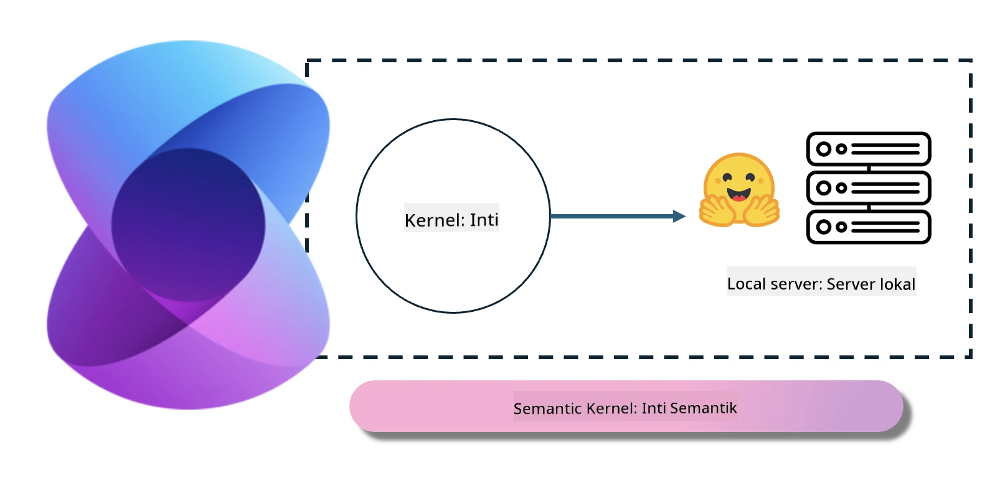
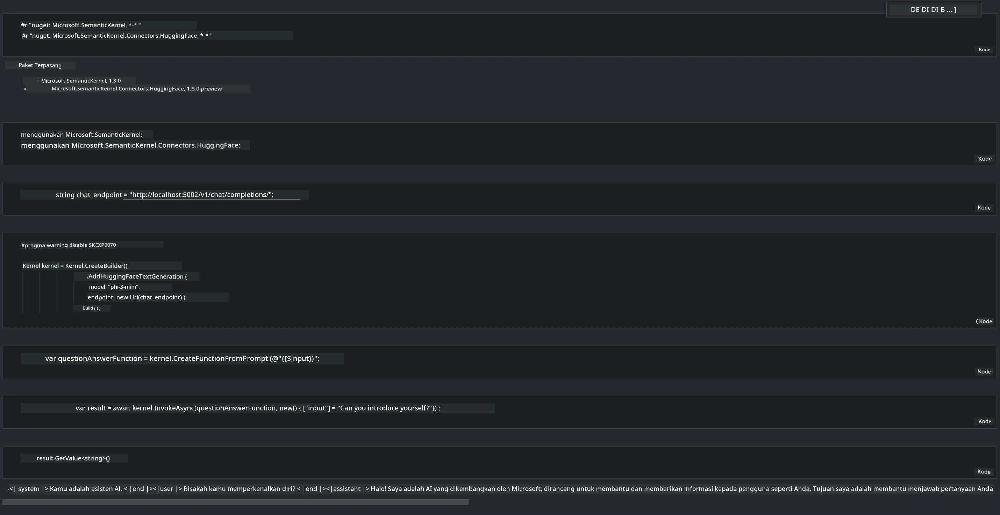

<!--
CO_OP_TRANSLATOR_METADATA:
{
  "original_hash": "bcf5dd7031db0031abdb9dd0c05ba118",
  "translation_date": "2025-07-16T20:58:23+00:00",
  "source_file": "md/01.Introduction/03/Local_Server_Inference.md",
  "language_code": "id"
}
-->
# **Inferensi Phi-3 di Server Lokal**

Kita bisa menjalankan Phi-3 di server lokal. Pengguna dapat memilih solusi [Ollama](https://ollama.com) atau [LM Studio](https://llamaedge.com), atau mereka bisa menulis kode sendiri. Kamu dapat menghubungkan layanan lokal Phi-3 melalui [Semantic Kernel](https://github.com/microsoft/semantic-kernel?WT.mc_id=aiml-138114-kinfeylo) atau [Langchain](https://www.langchain.com/) untuk membangun aplikasi Copilot.

## **Menggunakan Semantic Kernel untuk mengakses Phi-3-mini**

Dalam aplikasi Copilot, kita membuat aplikasi melalui Semantic Kernel / LangChain. Jenis kerangka aplikasi ini umumnya kompatibel dengan Azure OpenAI Service / model OpenAI, dan juga dapat mendukung model open source di Hugging Face serta model lokal. Apa yang harus kita lakukan jika ingin menggunakan Semantic Kernel untuk mengakses Phi-3-mini? Menggunakan .NET sebagai contoh, kita bisa menggabungkannya dengan Hugging Face Connector di Semantic Kernel. Secara default, ini dapat mengacu pada model id di Hugging Face (pertama kali digunakan, model akan diunduh dari Hugging Face, yang memakan waktu cukup lama). Kamu juga bisa menghubungkan ke layanan lokal yang sudah dibangun. Dibandingkan keduanya, kami menyarankan menggunakan yang terakhir karena memiliki tingkat otonomi lebih tinggi, terutama untuk aplikasi perusahaan.

Dari gambar tersebut, mengakses layanan lokal melalui Semantic Kernel dapat dengan mudah terhubung ke server model Phi-3-mini yang dibangun sendiri. Berikut adalah hasil jalannya:

***Kode Contoh*** https://github.com/kinfey/Phi3MiniSamples/tree/main/semantickernel

**Penafian**:  
Dokumen ini telah diterjemahkan menggunakan layanan terjemahan AI [Co-op Translator](https://github.com/Azure/co-op-translator). Meskipun kami berupaya untuk mencapai akurasi, harap diingat bahwa terjemahan otomatis mungkin mengandung kesalahan atau ketidakakuratan. Dokumen asli dalam bahasa aslinya harus dianggap sebagai sumber yang sahih. Untuk informasi penting, disarankan menggunakan terjemahan profesional oleh manusia. Kami tidak bertanggung jawab atas kesalahpahaman atau penafsiran yang keliru yang timbul dari penggunaan terjemahan ini.