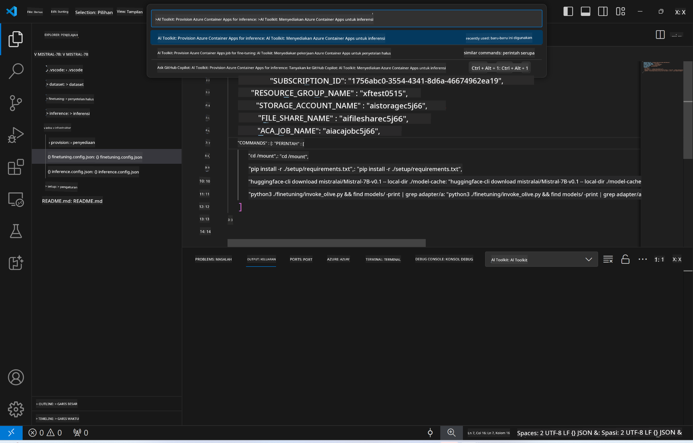
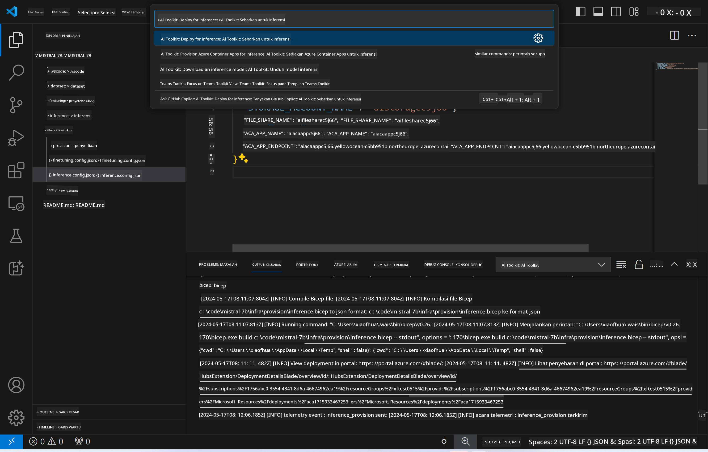
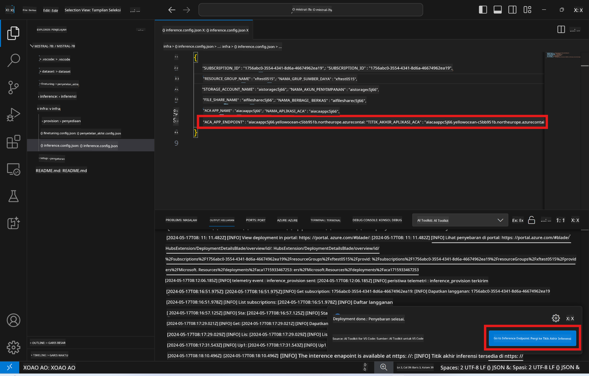

<!--
CO_OP_TRANSLATOR_METADATA:
{
  "original_hash": "a54cd3d65b6963e4e8ce21e143c3ab04",
  "translation_date": "2025-05-09T12:43:46+00:00",
  "source_file": "md/01.Introduction/03/Remote_Interence.md",
  "language_code": "id"
}
-->
# Inferensi Jarak Jauh dengan model yang sudah di-fine-tune

Setelah adapter dilatih di lingkungan jarak jauh, gunakan aplikasi Gradio sederhana untuk berinteraksi dengan model.


### Menyediakan Sumber Daya Azure
Anda perlu menyiapkan Sumber Daya Azure untuk inferensi jarak jauh dengan menjalankan `AI Toolkit: Provision Azure Container Apps for inference` dari command palette. Selama proses ini, Anda akan diminta memilih Azure Subscription dan resource group.  

   
Secara default, subscription dan resource group untuk inferensi harus sesuai dengan yang digunakan untuk fine-tuning. Inferensi akan menggunakan Azure Container App Environment yang sama dan mengakses model serta adapter model yang disimpan di Azure Files, yang dibuat selama langkah fine-tuning.

## Menggunakan AI Toolkit

### Deployment untuk Inferensi  
Jika Anda ingin mengubah kode inferensi atau memuat ulang model inferensi, jalankan perintah `AI Toolkit: Deploy for inference`. Ini akan menyinkronkan kode terbaru Anda dengan ACA dan me-restart replika.



Setelah deployment berhasil, model siap untuk dievaluasi menggunakan endpoint ini.

### Mengakses API Inferensi

Anda dapat mengakses API inferensi dengan mengklik tombol "*Go to Inference Endpoint*" yang muncul di notifikasi VSCode. Alternatifnya, endpoint web API dapat ditemukan di bawah `ACA_APP_ENDPOINT` di `./infra/inference.config.json` dan di panel output.



> **Catatan:** Endpoint inferensi mungkin memerlukan beberapa menit untuk bisa beroperasi sepenuhnya.

## Komponen Inferensi yang Termasuk dalam Template

| Folder | Isi |
| ------ |--------- |
| `infra` | Berisi semua konfigurasi yang diperlukan untuk operasi jarak jauh. |
| `infra/provision/inference.parameters.json` | Menyimpan parameter untuk template bicep, digunakan untuk penyediaan sumber daya Azure untuk inferensi. |
| `infra/provision/inference.bicep` | Berisi template untuk penyediaan sumber daya Azure untuk inferensi. |
| `infra/inference.config.json` | File konfigurasi, yang dihasilkan oleh perintah `AI Toolkit: Provision Azure Container Apps for inference`. Digunakan sebagai input untuk command palette jarak jauh lainnya. |

### Menggunakan AI Toolkit untuk mengonfigurasi Provision Azure Resource
Konfigurasikan [AI Toolkit](https://marketplace.visualstudio.com/items?itemName=ms-windows-ai-studio.windows-ai-studio)

Sediakan Azure Container Apps untuk inferensi` command.

You can find configuration parameters in `./infra/provision/inference.parameters.json` file. Here are the details:
| Parameter | Description |
| --------- |------------ |
| `defaultCommands` | This is the commands to initiate a web API. |
| `maximumInstanceCount` | This parameter sets the maximum capacity of GPU instances. |
| `location` | This is the location where Azure resources are provisioned. The default value is the same as the chosen resource group's location. |
| `storageAccountName`, `fileShareName` `acaEnvironmentName`, `acaEnvironmentStorageName`, `acaAppName`,  `acaLogAnalyticsName` | These parameters are used to name the Azure resources for provision. By default, they will be same to the fine-tuning resource name. You can input a new, unused resource name to create your own custom-named resources, or you can input the name of an already existing Azure resource if you'd prefer to use that. For details, refer to the section [Using existing Azure Resources](../../../../../md/01.Introduction/03). |

### Using Existing Azure Resources

By default, the inference provision use the same Azure Container App Environment, Storage Account, Azure File Share, and Azure Log Analytics that were used for fine-tuning. A separate Azure Container App is created solely for the inference API. 

If you have customized the Azure resources during the fine-tuning step or want to use your own existing Azure resources for inference, specify their names in the `./infra/inference.parameters.json` file. Kemudian, jalankan perintah `AI Toolkit: Provision Azure Container Apps for inference` dari command palette. Ini akan memperbarui sumber daya yang sudah ada dan membuat yang belum tersedia.

Misalnya, jika Anda memiliki lingkungan container Azure yang sudah ada, file `./infra/finetuning.parameters.json` Anda harus terlihat seperti ini:

```json
{
    "$schema": "https://schema.management.azure.com/schemas/2019-04-01/deploymentParameters.json#",
    "contentVersion": "1.0.0.0",
    "parameters": {
      ...
      "acaEnvironmentName": {
        "value": "<your-aca-env-name>"
      },
      "acaEnvironmentStorageName": {
        "value": null
      },
      ...
    }
  }
```

### Provision Manual  
Jika Anda lebih memilih untuk mengonfigurasi sumber daya Azure secara manual, Anda dapat menggunakan file bicep yang disediakan di folder `./infra/provision` folders. If you have already set up and configured all the Azure resources without using the AI Toolkit command palette, you can simply enter the resource names in the `inference.config.json`.

Contohnya:

```json
{
  "SUBSCRIPTION_ID": "<your-subscription-id>",
  "RESOURCE_GROUP_NAME": "<your-resource-group-name>",
  "STORAGE_ACCOUNT_NAME": "<your-storage-account-name>",
  "FILE_SHARE_NAME": "<your-file-share-name>",
  "ACA_APP_NAME": "<your-aca-name>",
  "ACA_APP_ENDPOINT": "<your-aca-endpoint>"
}
```

**Penafian**:  
Dokumen ini telah diterjemahkan menggunakan layanan terjemahan AI [Co-op Translator](https://github.com/Azure/co-op-translator). Meskipun kami berusaha untuk memberikan terjemahan yang akurat, harap diingat bahwa terjemahan otomatis mungkin mengandung kesalahan atau ketidakakuratan. Dokumen asli dalam bahasa aslinya harus dianggap sebagai sumber yang sahih. Untuk informasi yang penting, disarankan menggunakan terjemahan profesional oleh manusia. Kami tidak bertanggung jawab atas kesalahpahaman atau salah tafsir yang timbul dari penggunaan terjemahan ini.