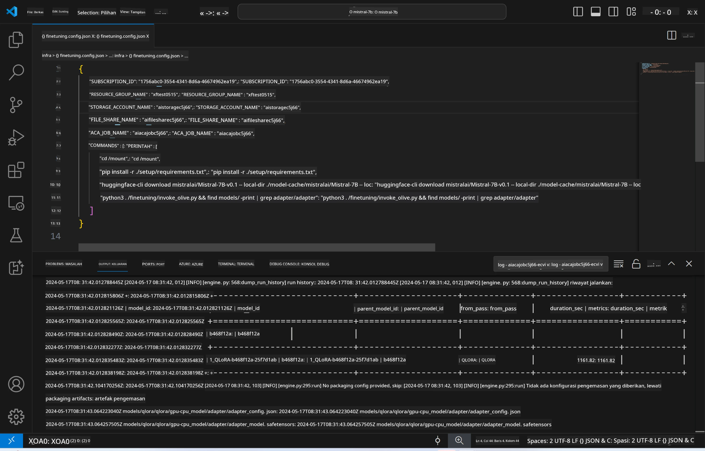
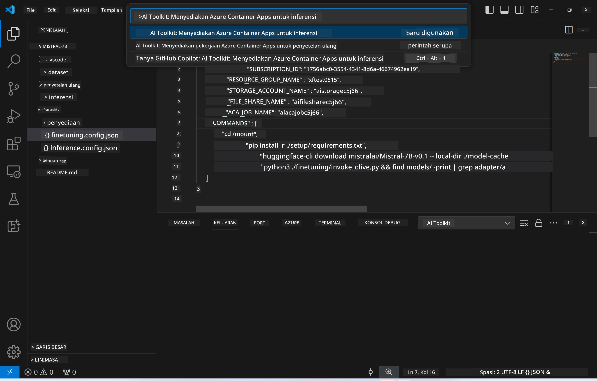
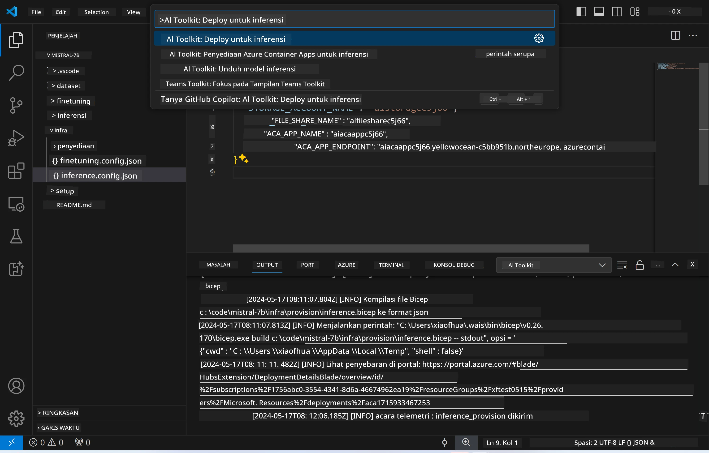
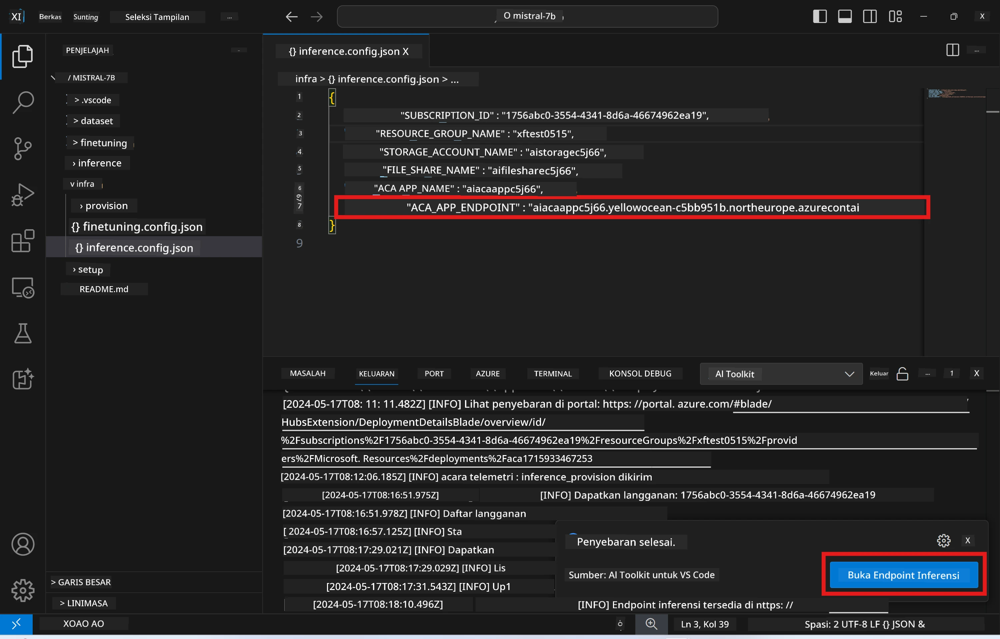

<!--
CO_OP_TRANSLATOR_METADATA:
{
  "original_hash": "a54cd3d65b6963e4e8ce21e143c3ab04",
  "translation_date": "2025-07-16T21:20:50+00:00",
  "source_file": "md/01.Introduction/03/Remote_Interence.md",
  "language_code": "id"
}
-->
# Inferensi Jarak Jauh dengan model yang sudah di-fine-tune

Setelah adapter dilatih di lingkungan jarak jauh, gunakan aplikasi Gradio sederhana untuk berinteraksi dengan model.



### Menyediakan Sumber Daya Azure  
Anda perlu menyiapkan Sumber Daya Azure untuk inferensi jarak jauh dengan menjalankan perintah `AI Toolkit: Provision Azure Container Apps for inference` dari command palette. Selama proses ini, Anda akan diminta untuk memilih Azure Subscription dan resource group Anda.  

   
Secara default, subscription dan resource group untuk inferensi harus sama dengan yang digunakan saat fine-tuning. Inferensi akan menggunakan Azure Container App Environment yang sama dan mengakses model serta adapter model yang disimpan di Azure Files, yang dibuat selama langkah fine-tuning.

## Menggunakan AI Toolkit

### Deployment untuk Inferensi  
Jika Anda ingin mengubah kode inferensi atau memuat ulang model inferensi, jalankan perintah `AI Toolkit: Deploy for inference`. Ini akan menyinkronkan kode terbaru Anda dengan ACA dan me-restart replika.



Setelah deployment berhasil, model siap untuk dievaluasi menggunakan endpoint ini.

### Mengakses API Inferensi

Anda dapat mengakses API inferensi dengan mengklik tombol "*Go to Inference Endpoint*" yang muncul di notifikasi VSCode. Alternatifnya, endpoint web API dapat ditemukan di bawah `ACA_APP_ENDPOINT` dalam file `./infra/inference.config.json` dan di panel output.



> **Note:** Endpoint inferensi mungkin membutuhkan beberapa menit agar dapat beroperasi sepenuhnya.

## Komponen Inferensi yang Termasuk dalam Template

| Folder | Isi |
| ------ |-----|
| `infra` | Berisi semua konfigurasi yang diperlukan untuk operasi jarak jauh. |
| `infra/provision/inference.parameters.json` | Menyimpan parameter untuk template bicep, digunakan untuk penyediaan sumber daya Azure untuk inferensi. |
| `infra/provision/inference.bicep` | Berisi template untuk penyediaan sumber daya Azure untuk inferensi. |
| `infra/inference.config.json` | File konfigurasi, yang dihasilkan oleh perintah `AI Toolkit: Provision Azure Container Apps for inference`. Digunakan sebagai input untuk perintah jarak jauh lainnya. |

### Menggunakan AI Toolkit untuk Mengonfigurasi Penyediaan Sumber Daya Azure  
Konfigurasikan [AI Toolkit](https://marketplace.visualstudio.com/items?itemName=ms-windows-ai-studio.windows-ai-studio)

Perintah `Provision Azure Container Apps for inference`.

Anda dapat menemukan parameter konfigurasi di file `./infra/provision/inference.parameters.json`. Berikut detailnya:  
| Parameter | Deskripsi |
| --------- |---------- |
| `defaultCommands` | Perintah untuk memulai web API. |
| `maximumInstanceCount` | Parameter ini mengatur kapasitas maksimum instance GPU. |
| `location` | Lokasi di mana sumber daya Azure akan disediakan. Nilai default sama dengan lokasi resource group yang dipilih. |
| `storageAccountName`, `fileShareName`, `acaEnvironmentName`, `acaEnvironmentStorageName`, `acaAppName`, `acaLogAnalyticsName` | Parameter ini digunakan untuk memberi nama sumber daya Azure yang akan disediakan. Secara default, nama-nama ini sama dengan nama sumber daya fine-tuning. Anda dapat memasukkan nama sumber daya baru yang belum digunakan untuk membuat sumber daya dengan nama kustom, atau memasukkan nama sumber daya Azure yang sudah ada jika ingin menggunakannya. Untuk detail, lihat bagian [Using existing Azure Resources](../../../../../md/01.Introduction/03). |

### Menggunakan Sumber Daya Azure yang Sudah Ada

Secara default, penyediaan inferensi menggunakan Azure Container App Environment, Storage Account, Azure File Share, dan Azure Log Analytics yang sama dengan yang digunakan saat fine-tuning. Azure Container App yang terpisah dibuat khusus untuk API inferensi.

Jika Anda telah menyesuaikan sumber daya Azure selama langkah fine-tuning atau ingin menggunakan sumber daya Azure Anda sendiri untuk inferensi, tentukan nama-nama tersebut di file `./infra/inference.parameters.json`. Kemudian, jalankan perintah `AI Toolkit: Provision Azure Container Apps for inference` dari command palette. Ini akan memperbarui sumber daya yang ditentukan dan membuat sumber daya yang belum ada.

Sebagai contoh, jika Anda memiliki lingkungan container Azure yang sudah ada, file `./infra/finetuning.parameters.json` Anda akan terlihat seperti ini:

```json
{
    "$schema": "https://schema.management.azure.com/schemas/2019-04-01/deploymentParameters.json#",
    "contentVersion": "1.0.0.0",
    "parameters": {
      ...
      "acaEnvironmentName": {
        "value": "<your-aca-env-name>"
      },
      "acaEnvironmentStorageName": {
        "value": null
      },
      ...
    }
  }
```

### Penyediaan Manual  
Jika Anda lebih memilih mengonfigurasi sumber daya Azure secara manual, Anda dapat menggunakan file bicep yang disediakan di folder `./infra/provision`. Jika Anda sudah menyiapkan dan mengonfigurasi semua sumber daya Azure tanpa menggunakan command palette AI Toolkit, Anda cukup memasukkan nama sumber daya di file `inference.config.json`.

Sebagai contoh:

```json
{
  "SUBSCRIPTION_ID": "<your-subscription-id>",
  "RESOURCE_GROUP_NAME": "<your-resource-group-name>",
  "STORAGE_ACCOUNT_NAME": "<your-storage-account-name>",
  "FILE_SHARE_NAME": "<your-file-share-name>",
  "ACA_APP_NAME": "<your-aca-name>",
  "ACA_APP_ENDPOINT": "<your-aca-endpoint>"
}
```

**Penafian**:  
Dokumen ini telah diterjemahkan menggunakan layanan terjemahan AI [Co-op Translator](https://github.com/Azure/co-op-translator). Meskipun kami berupaya untuk mencapai akurasi, harap diperhatikan bahwa terjemahan otomatis mungkin mengandung kesalahan atau ketidakakuratan. Dokumen asli dalam bahasa aslinya harus dianggap sebagai sumber yang sahih. Untuk informasi penting, disarankan menggunakan terjemahan profesional oleh manusia. Kami tidak bertanggung jawab atas kesalahpahaman atau penafsiran yang keliru yang timbul dari penggunaan terjemahan ini.