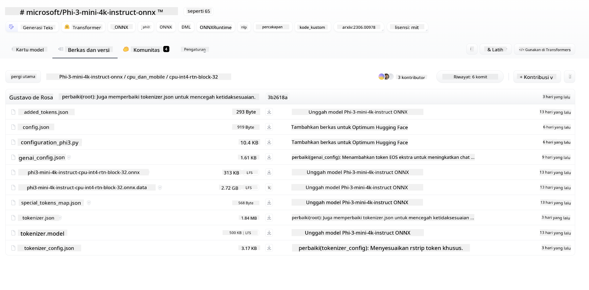
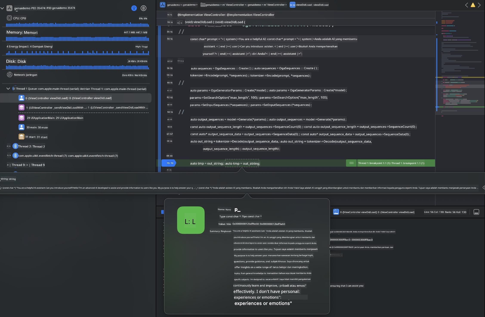

<!--
CO_OP_TRANSLATOR_METADATA:
{
  "original_hash": "82af197df38d25346a98f1f0e84d1698",
  "translation_date": "2025-07-16T20:23:17+00:00",
  "source_file": "md/01.Introduction/03/iOS_Inference.md",
  "language_code": "id"
}
-->
# **Inferensi Phi-3 di iOS**

Phi-3-mini adalah seri model baru dari Microsoft yang memungkinkan penerapan Large Language Models (LLMs) pada perangkat edge dan perangkat IoT. Phi-3-mini tersedia untuk deployment di iOS, Android, dan Edge Device, memungkinkan AI generatif untuk digunakan di lingkungan BYOD. Contoh berikut menunjukkan cara menerapkan Phi-3-mini di iOS.

## **1. Persiapan**

- **a.** macOS 14+
- **b.** Xcode 15+
- **c.** iOS SDK 17.x (iPhone 14 A16 atau lebih tinggi)
- **d.** Instal Python 3.10+ (Conda direkomendasikan)
- **e.** Instal library Python: `python-flatbuffers`
- **f.** Instal CMake

### Semantic Kernel dan Inferensi

Semantic Kernel adalah framework aplikasi yang memungkinkan Anda membuat aplikasi yang kompatibel dengan Azure OpenAI Service, model OpenAI, dan bahkan model lokal. Mengakses layanan lokal melalui Semantic Kernel memudahkan integrasi dengan server model Phi-3-mini yang Anda hosting sendiri.

### Memanggil Model Kuantisasi dengan Ollama atau LlamaEdge

Banyak pengguna lebih memilih menggunakan model kuantisasi untuk menjalankan model secara lokal. [Ollama](https://ollama.com) dan [LlamaEdge](https://llamaedge.com) memungkinkan pengguna memanggil berbagai model kuantisasi:

#### **Ollama**

Anda dapat menjalankan `ollama run phi3` secara langsung atau mengonfigurasinya secara offline. Buat Modelfile dengan path ke file `gguf` Anda. Contoh kode untuk menjalankan model Phi-3-mini kuantisasi:

```gguf
FROM {Add your gguf file path}
TEMPLATE \"\"\"<|user|> .Prompt<|end|> <|assistant|>\"\"\"
PARAMETER stop <|end|>
PARAMETER num_ctx 4096
```

#### **LlamaEdge**

Jika Anda ingin menggunakan `gguf` di cloud dan perangkat edge secara bersamaan, LlamaEdge adalah pilihan yang tepat.

## **2. Mengompilasi ONNX Runtime untuk iOS**

```bash

git clone https://github.com/microsoft/onnxruntime.git

cd onnxruntime

./build.sh --build_shared_lib --ios --skip_tests --parallel --build_dir ./build_ios --ios --apple_sysroot iphoneos --osx_arch arm64 --apple_deploy_target 17.5 --cmake_generator Xcode --config Release

cd ../

```

### **Perhatian**

- **a.** Sebelum mengompilasi, pastikan Xcode sudah dikonfigurasi dengan benar dan atur sebagai direktori pengembang aktif di terminal:

    ```bash
    sudo xcode-select -switch /Applications/Xcode.app/Contents/Developer
    ```

- **b.** ONNX Runtime perlu dikompilasi untuk berbagai platform. Untuk iOS, Anda bisa mengompilasi untuk `arm64` atau `x86_64`.

- **c.** Disarankan menggunakan iOS SDK terbaru untuk kompilasi. Namun, Anda juga bisa menggunakan versi lama jika membutuhkan kompatibilitas dengan SDK sebelumnya.

## **3. Mengompilasi Generative AI dengan ONNX Runtime untuk iOS**

> **Note:** Karena Generative AI dengan ONNX Runtime masih dalam tahap preview, harap waspada terhadap kemungkinan perubahan.

```bash

git clone https://github.com/microsoft/onnxruntime-genai
 
cd onnxruntime-genai
 
mkdir ort
 
cd ort
 
mkdir include
 
mkdir lib
 
cd ../
 
cp ../onnxruntime/include/onnxruntime/core/session/onnxruntime_c_api.h ort/include
 
cp ../onnxruntime/build_ios/Release/Release-iphoneos/libonnxruntime*.dylib* ort/lib
 
export OPENCV_SKIP_XCODEBUILD_FORCE_TRYCOMPILE_DEBUG=1
 
python3 build.py --parallel --build_dir ./build_ios --ios --ios_sysroot iphoneos --ios_arch arm64 --ios_deployment_target 17.5 --cmake_generator Xcode --cmake_extra_defines CMAKE_XCODE_ATTRIBUTE_CODE_SIGNING_ALLOWED=NO

```

## **4. Membuat aplikasi App di Xcode**

Saya memilih Objective-C sebagai metode pengembangan App, karena menggunakan Generative AI dengan ONNX Runtime C++ API, Objective-C lebih kompatibel. Tentu saja, Anda juga bisa menyelesaikan panggilan terkait melalui bridging Swift.


## **5. Menyalin model ONNX kuantisasi INT4 ke proyek aplikasi App**

Kita perlu mengimpor model kuantisasi INT4 dalam format ONNX, yang harus diunduh terlebih dahulu



Setelah diunduh, tambahkan ke direktori Resources proyek di Xcode.


## **6. Menambahkan API C++ di ViewControllers**

> **Perhatian:**

- **a.** Tambahkan file header C++ yang sesuai ke proyek.

  

- **b.** Sertakan library dinamis `onnxruntime-genai` di Xcode.

  

- **c.** Gunakan kode contoh C Samples untuk pengujian. Anda juga bisa menambahkan fitur tambahan seperti ChatUI untuk fungsi lebih lengkap.

- **d.** Karena Anda perlu menggunakan C++ dalam proyek, ubah nama `ViewController.m` menjadi `ViewController.mm` untuk mengaktifkan dukungan Objective-C++.

```objc

    NSString *llmPath = [[NSBundle mainBundle] resourcePath];
    char const *modelPath = llmPath.cString;

    auto model =  OgaModel::Create(modelPath);

    auto tokenizer = OgaTokenizer::Create(*model);

    const char* prompt = "<|system|>You are a helpful AI assistant.<|end|><|user|>Can you introduce yourself?<|end|><|assistant|>";

    auto sequences = OgaSequences::Create();
    tokenizer->Encode(prompt, *sequences);

    auto params = OgaGeneratorParams::Create(*model);
    params->SetSearchOption("max_length", 100);
    params->SetInputSequences(*sequences);

    auto output_sequences = model->Generate(*params);
    const auto output_sequence_length = output_sequences->SequenceCount(0);
    const auto* output_sequence_data = output_sequences->SequenceData(0);
    auto out_string = tokenizer->Decode(output_sequence_data, output_sequence_length);
    
    auto tmp = out_string;

```

## **7. Menjalankan Aplikasi**

Setelah pengaturan selesai, Anda bisa menjalankan aplikasi untuk melihat hasil inferensi model Phi-3-mini.



Untuk kode contoh lebih lengkap dan petunjuk detail, kunjungi [Phi-3 Mini Samples repository](https://github.com/Azure-Samples/Phi-3MiniSamples/tree/main/ios).

**Penafian**:  
Dokumen ini telah diterjemahkan menggunakan layanan terjemahan AI [Co-op Translator](https://github.com/Azure/co-op-translator). Meskipun kami berupaya untuk akurasi, harap diketahui bahwa terjemahan otomatis mungkin mengandung kesalahan atau ketidakakuratan. Dokumen asli dalam bahasa aslinya harus dianggap sebagai sumber yang sah. Untuk informasi penting, disarankan menggunakan terjemahan profesional oleh manusia. Kami tidak bertanggung jawab atas kesalahpahaman atau penafsiran yang keliru yang timbul dari penggunaan terjemahan ini.