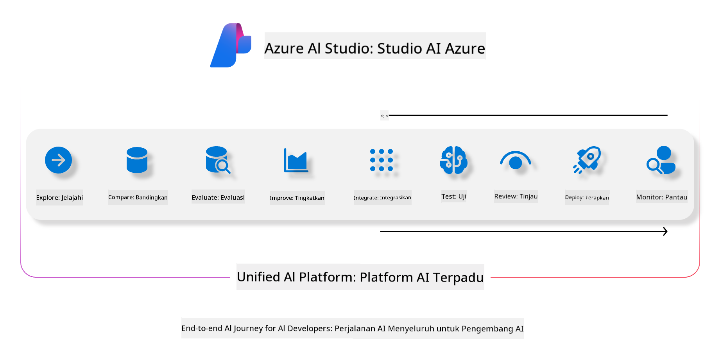
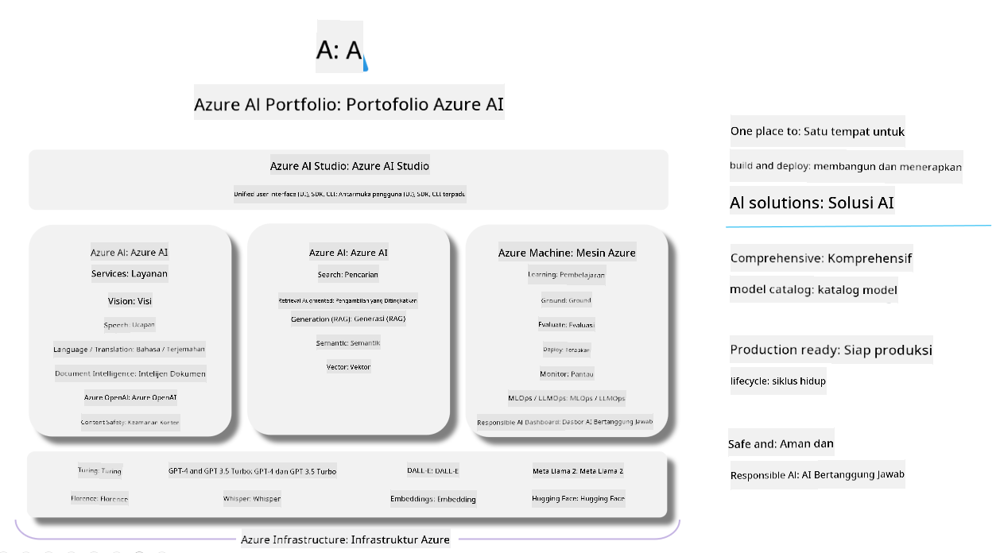

<!--
CO_OP_TRANSLATOR_METADATA:
{
  "original_hash": "7b4235159486df4000e16b7b46ddfec3",
  "translation_date": "2025-07-16T22:32:40+00:00",
  "source_file": "md/01.Introduction/05/AIFoundry.md",
  "language_code": "id"
}
-->
# **Menggunakan Azure AI Foundry untuk evaluasi**

Cara mengevaluasi aplikasi generatif AI Anda menggunakan [Azure AI Foundry](https://ai.azure.com?WT.mc_id=aiml-138114-kinfeylo). Baik Anda menilai percakapan satu putaran maupun multi putaran, Azure AI Foundry menyediakan alat untuk mengevaluasi kinerja dan keamanan model.

## Cara mengevaluasi aplikasi generatif AI dengan Azure AI Foundry  
Untuk instruksi lebih lengkap, lihat [Dokumentasi Azure AI Foundry](https://learn.microsoft.com/azure/ai-studio/how-to/evaluate-generative-ai-app?WT.mc_id=aiml-138114-kinfeylo)

Berikut langkah-langkah untuk memulai:

## Mengevaluasi Model Generatif AI di Azure AI Foundry

**Prasyarat**

- Dataset uji dalam format CSV atau JSON.  
- Model generatif AI yang sudah dideploy (seperti Phi-3, GPT 3.5, GPT 4, atau model Davinci).  
- Runtime dengan compute instance untuk menjalankan evaluasi.

## Metrik Evaluasi Bawaan

Azure AI Foundry memungkinkan Anda mengevaluasi percakapan satu putaran maupun percakapan kompleks multi putaran.  
Untuk skenario Retrieval Augmented Generation (RAG), di mana model didasarkan pada data tertentu, Anda dapat menilai kinerja menggunakan metrik evaluasi bawaan.  
Selain itu, Anda juga bisa mengevaluasi skenario tanya jawab satu putaran secara umum (non-RAG).

## Membuat Evaluasi Run

Dari UI Azure AI Foundry, navigasikan ke halaman Evaluate atau Prompt Flow.  
Ikuti wizard pembuatan evaluasi untuk mengatur evaluasi run. Berikan nama opsional untuk evaluasi Anda.  
Pilih skenario yang sesuai dengan tujuan aplikasi Anda.  
Pilih satu atau lebih metrik evaluasi untuk menilai output model.

## Alur Evaluasi Kustom (Opsional)

Untuk fleksibilitas lebih, Anda dapat membuat alur evaluasi kustom. Sesuaikan proses evaluasi berdasarkan kebutuhan spesifik Anda.

## Melihat Hasil

Setelah menjalankan evaluasi, catat, lihat, dan analisis metrik evaluasi secara detail di Azure AI Foundry. Dapatkan wawasan tentang kemampuan dan keterbatasan aplikasi Anda.

**Note** Azure AI Foundry saat ini masih dalam tahap public preview, jadi gunakan untuk eksperimen dan pengembangan. Untuk beban kerja produksi, pertimbangkan opsi lain. Jelajahi [dokumentasi AI Foundry resmi](https://learn.microsoft.com/azure/ai-studio/?WT.mc_id=aiml-138114-kinfeylo) untuk detail dan panduan langkah demi langkah.

**Penafian**:  
Dokumen ini telah diterjemahkan menggunakan layanan terjemahan AI [Co-op Translator](https://github.com/Azure/co-op-translator). Meskipun kami berupaya untuk mencapai akurasi, harap diperhatikan bahwa terjemahan otomatis mungkin mengandung kesalahan atau ketidakakuratan. Dokumen asli dalam bahasa aslinya harus dianggap sebagai sumber yang sahih. Untuk informasi penting, disarankan menggunakan terjemahan profesional oleh manusia. Kami tidak bertanggung jawab atas kesalahpahaman atau penafsiran yang keliru yang timbul dari penggunaan terjemahan ini.