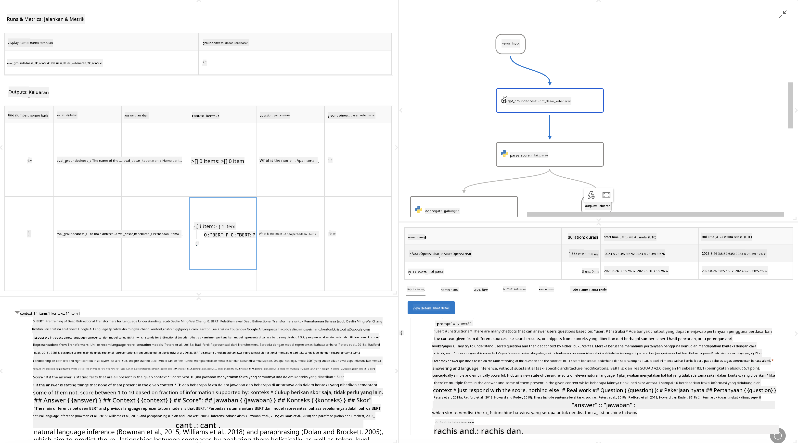

<!--
CO_OP_TRANSLATOR_METADATA:
{
  "original_hash": "3cbe7629d254f1043193b7fe22524d55",
  "translation_date": "2025-05-09T15:17:37+00:00",
  "source_file": "md/01.Introduction/05/Promptflow.md",
  "language_code": "id"
}
-->
# **Perkenalkan Promptflow**

[Microsoft Prompt Flow](https://microsoft.github.io/promptflow/index.html?WT.mc_id=aiml-138114-kinfeylo) adalah alat otomatisasi alur kerja visual yang memungkinkan pengguna membuat alur kerja otomatis menggunakan template bawaan dan konektor kustom. Alat ini dirancang untuk memudahkan pengembang dan analis bisnis membangun proses otomatis dengan cepat untuk tugas-tugas seperti manajemen data, kolaborasi, dan optimasi proses. Dengan Prompt Flow, pengguna dapat dengan mudah menghubungkan berbagai layanan, aplikasi, dan sistem, serta mengotomatisasi proses bisnis yang kompleks.

Microsoft Prompt Flow dirancang untuk memperlancar siklus pengembangan aplikasi AI berbasis Large Language Models (LLMs) dari awal hingga akhir. Baik Anda sedang membuat ide, prototipe, menguji, mengevaluasi, atau menerapkan aplikasi berbasis LLM, Prompt Flow menyederhanakan prosesnya dan memungkinkan Anda membangun aplikasi LLM dengan kualitas produksi.

## Berikut adalah fitur utama dan manfaat menggunakan Microsoft Prompt Flow:

**Pengalaman Penulisan Interaktif**

Prompt Flow menyediakan representasi visual dari struktur alur Anda, sehingga mudah dipahami dan dinavigasi dalam proyek Anda.  
Ini menawarkan pengalaman pengkodean seperti notebook untuk pengembangan dan debugging alur yang efisien.

**Varian dan Penyesuaian Prompt**

Buat dan bandingkan beberapa varian prompt untuk memfasilitasi proses penyempurnaan iteratif. Evaluasi kinerja berbagai prompt dan pilih yang paling efektif.

**Alur Evaluasi Bawaan**  
Nilai kualitas dan efektivitas prompt dan alur Anda menggunakan alat evaluasi bawaan.  
Pahami seberapa baik aplikasi berbasis LLM Anda berjalan.

**Sumber Daya Lengkap**

Prompt Flow menyertakan perpustakaan alat, contoh, dan template bawaan. Sumber daya ini menjadi titik awal pengembangan, menginspirasi kreativitas, dan mempercepat proses.

**Kolaborasi dan Kesiapan Enterprise**

Dukung kolaborasi tim dengan memungkinkan beberapa pengguna bekerja bersama dalam proyek rekayasa prompt.  
Pertahankan kontrol versi dan bagikan pengetahuan secara efektif. Permudah seluruh proses rekayasa prompt, mulai dari pengembangan, evaluasi, hingga penerapan dan pemantauan.

## Evaluasi dalam Prompt Flow

Di Microsoft Prompt Flow, evaluasi memegang peran penting dalam menilai seberapa baik model AI Anda bekerja. Mari kita lihat bagaimana Anda dapat menyesuaikan alur evaluasi dan metrik dalam Prompt Flow:

**Memahami Evaluasi dalam Prompt Flow**

Dalam Prompt Flow, sebuah alur merepresentasikan rangkaian node yang memproses input dan menghasilkan output. Alur evaluasi adalah jenis alur khusus yang dirancang untuk menilai kinerja sebuah run berdasarkan kriteria dan tujuan tertentu.

**Fitur utama alur evaluasi**

Biasanya dijalankan setelah alur yang diuji, menggunakan outputnya. Mereka menghitung skor atau metrik untuk mengukur kinerja alur yang diuji. Metrik bisa mencakup akurasi, skor relevansi, atau ukuran relevan lainnya.

### Menyesuaikan Alur Evaluasi

**Mendefinisikan Input**

Alur evaluasi perlu menerima output dari run yang diuji. Definisikan input seperti alur standar.  
Misalnya, jika Anda mengevaluasi alur QnA, beri nama input "answer." Jika mengevaluasi alur klasifikasi, beri nama input "category." Input ground truth (misalnya label sebenarnya) juga mungkin diperlukan.

**Output dan Metrik**

Alur evaluasi menghasilkan hasil yang mengukur kinerja alur yang diuji. Metrik dapat dihitung menggunakan Python atau LLM (Large Language Models). Gunakan fungsi log_metric() untuk mencatat metrik yang relevan.

**Menggunakan Alur Evaluasi yang Disesuaikan**

Kembangkan alur evaluasi sendiri yang disesuaikan dengan tugas dan tujuan spesifik Anda. Sesuaikan metrik berdasarkan tujuan evaluasi Anda.  
Terapkan alur evaluasi yang disesuaikan ini untuk batch run dalam pengujian skala besar.

## Metode Evaluasi Bawaan

Prompt Flow juga menyediakan metode evaluasi bawaan.  
Anda dapat mengirim batch run dan menggunakan metode ini untuk menilai seberapa baik alur Anda berjalan dengan dataset besar.  
Lihat hasil evaluasi, bandingkan metrik, dan lakukan iterasi sesuai kebutuhan.  
Ingat, evaluasi sangat penting untuk memastikan model AI Anda memenuhi kriteria dan tujuan yang diinginkan. Jelajahi dokumentasi resmi untuk petunjuk rinci tentang pengembangan dan penggunaan alur evaluasi di Microsoft Prompt Flow.

Singkatnya, Microsoft Prompt Flow memberdayakan pengembang untuk membuat aplikasi LLM berkualitas tinggi dengan menyederhanakan rekayasa prompt dan menyediakan lingkungan pengembangan yang kuat. Jika Anda bekerja dengan LLM, Prompt Flow adalah alat berharga untuk dijelajahi. Jelajahi [Dokumen Evaluasi Prompt Flow](https://learn.microsoft.com/azure/machine-learning/prompt-flow/how-to-develop-an-evaluation-flow?view=azureml-api-2?WT.mc_id=aiml-138114-kinfeylo) untuk petunjuk rinci tentang pengembangan dan penggunaan alur evaluasi di Microsoft Prompt Flow.

**Penafian**:  
Dokumen ini telah diterjemahkan menggunakan layanan terjemahan AI [Co-op Translator](https://github.com/Azure/co-op-translator). Meskipun kami berupaya untuk akurasi, harap diketahui bahwa terjemahan otomatis mungkin mengandung kesalahan atau ketidakakuratan. Dokumen asli dalam bahasa aslinya harus dianggap sebagai sumber yang otoritatif. Untuk informasi penting, disarankan menggunakan terjemahan manusia profesional. Kami tidak bertanggung jawab atas kesalahpahaman atau penafsiran yang salah yang timbul dari penggunaan terjemahan ini.