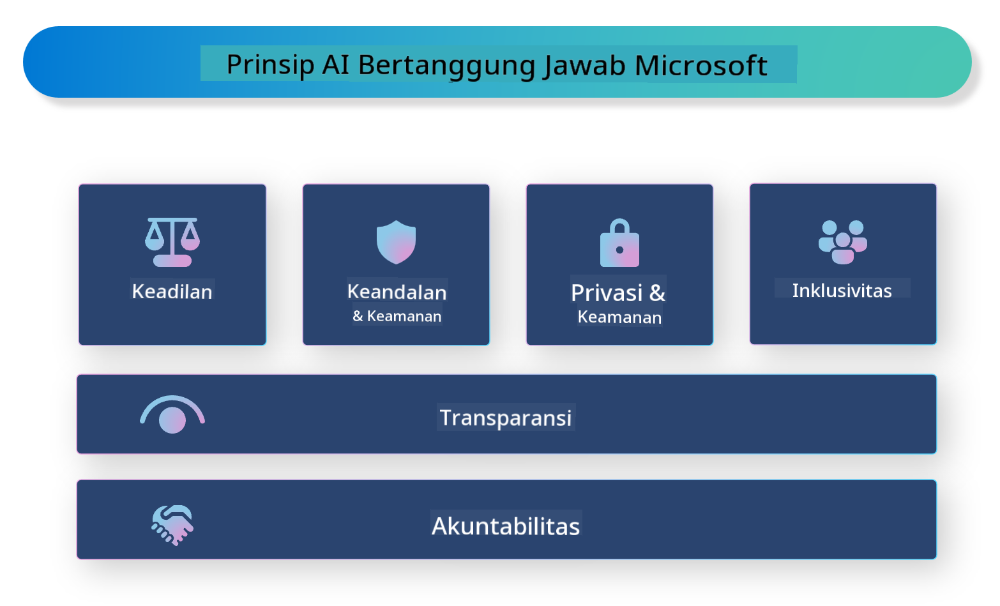

<!--
CO_OP_TRANSLATOR_METADATA:
{
  "original_hash": "805b96b20152936d8f4c587d90d6e06e",
  "translation_date": "2025-05-09T15:41:35+00:00",
  "source_file": "md/01.Introduction/05/ResponsibleAI.md",
  "language_code": "id"
}
-->
# **Memperkenalkan Responsible AI**

[Microsoft Responsible AI](https://www.microsoft.com/ai/responsible-ai?WT.mc_id=aiml-138114-kinfeylo) adalah inisiatif yang bertujuan membantu pengembang dan organisasi membangun sistem AI yang transparan, dapat dipercaya, dan bertanggung jawab. Inisiatif ini menyediakan panduan dan sumber daya untuk mengembangkan solusi AI yang bertanggung jawab sesuai dengan prinsip etika, seperti privasi, keadilan, dan transparansi. Kita juga akan membahas beberapa tantangan dan praktik terbaik yang terkait dengan pembangunan sistem AI yang bertanggung jawab.

## Ikhtisar Microsoft Responsible AI

**Prinsip Etika**

Microsoft Responsible AI dipandu oleh seperangkat prinsip etika, seperti privasi, keadilan, transparansi, akuntabilitas, dan keselamatan. Prinsip-prinsip ini dirancang untuk memastikan bahwa sistem AI dikembangkan secara etis dan bertanggung jawab.

**AI yang Transparan**

Microsoft Responsible AI menekankan pentingnya transparansi dalam sistem AI. Ini termasuk memberikan penjelasan yang jelas tentang cara kerja model AI, serta memastikan bahwa sumber data dan algoritma tersedia untuk publik.

**AI yang Bertanggung Jawab**

[Microsoft Responsible AI](https://www.microsoft.com/ai/responsible-ai?WT.mc_id=aiml-138114-kinfeylo) mendorong pengembangan sistem AI yang bertanggung jawab, yang dapat memberikan wawasan tentang bagaimana model AI membuat keputusan. Ini membantu pengguna memahami dan mempercayai hasil dari sistem AI.

**Inklusivitas**

Sistem AI harus dirancang untuk memberikan manfaat bagi semua orang. Microsoft berupaya menciptakan AI yang inklusif dengan mempertimbangkan berbagai perspektif dan menghindari bias atau diskriminasi.

**Keandalan dan Keselamatan**

Memastikan bahwa sistem AI dapat diandalkan dan aman adalah hal yang sangat penting. Microsoft fokus pada pembangunan model yang kuat, yang bekerja secara konsisten dan menghindari hasil yang merugikan.

**Keadilan dalam AI**

Microsoft Responsible AI menyadari bahwa sistem AI dapat memperkuat bias jika dilatih menggunakan data atau algoritma yang bias. Inisiatif ini memberikan panduan untuk mengembangkan sistem AI yang adil dan tidak mendiskriminasi berdasarkan faktor seperti ras, jenis kelamin, atau usia.

**Privasi dan Keamanan**

Microsoft Responsible AI menekankan pentingnya melindungi privasi pengguna dan keamanan data dalam sistem AI. Ini termasuk menerapkan enkripsi data yang kuat dan kontrol akses, serta secara rutin mengaudit sistem AI untuk menemukan kerentanan.

**Akuntabilitas dan Tanggung Jawab**

Microsoft Responsible AI mendorong akuntabilitas dan tanggung jawab dalam pengembangan dan penerapan AI. Ini termasuk memastikan bahwa pengembang dan organisasi menyadari potensi risiko yang terkait dengan sistem AI, dan mengambil langkah-langkah untuk mengurangi risiko tersebut.

## Praktik Terbaik untuk Membangun Sistem AI yang Bertanggung Jawab

**Kembangkan model AI menggunakan kumpulan data yang beragam**

Untuk menghindari bias dalam sistem AI, penting untuk menggunakan kumpulan data yang beragam yang mewakili berbagai perspektif dan pengalaman.

**Gunakan teknik AI yang dapat dijelaskan**

Teknik AI yang dapat dijelaskan membantu pengguna memahami bagaimana model AI membuat keputusan, yang dapat meningkatkan kepercayaan terhadap sistem.

**Audit secara rutin sistem AI untuk menemukan kerentanan**

Audit rutin pada sistem AI membantu mengidentifikasi potensi risiko dan kerentanan yang perlu diatasi.

**Terapkan enkripsi data yang kuat dan kontrol akses**

Enkripsi data dan kontrol akses membantu melindungi privasi dan keamanan pengguna dalam sistem AI.

**Ikuti prinsip etika dalam pengembangan AI**

Mengikuti prinsip etika seperti keadilan, transparansi, dan akuntabilitas dapat membantu membangun kepercayaan terhadap sistem AI dan memastikan pengembangannya dilakukan secara bertanggung jawab.

## Menggunakan AI Foundry untuk Responsible AI

[Azure AI Foundry](https://ai.azure.com?WT.mc_id=aiml-138114-kinfeylo) adalah platform yang kuat yang memungkinkan pengembang dan organisasi dengan cepat membuat aplikasi cerdas, mutakhir, siap pasar, dan bertanggung jawab. Berikut beberapa fitur dan kemampuan utama dari Azure AI Foundry:

**API dan Model Siap Pakai**

Azure AI Foundry menyediakan API dan model yang sudah dibuat sebelumnya dan dapat disesuaikan. Ini mencakup berbagai tugas AI, termasuk generative AI, pemrosesan bahasa alami untuk percakapan, pencarian, pemantauan, terjemahan, suara, penglihatan, dan pengambilan keputusan.

**Prompt Flow**

Prompt flow di Azure AI Foundry memungkinkan Anda membuat pengalaman AI percakapan. Fitur ini memudahkan dalam merancang dan mengelola alur percakapan, sehingga lebih mudah membangun chatbot, asisten virtual, dan aplikasi interaktif lainnya.

**Retrieval Augmented Generation (RAG)**

RAG adalah teknik yang menggabungkan pendekatan berbasis pengambilan (retrieval) dan generatif. Teknik ini meningkatkan kualitas respons yang dihasilkan dengan memanfaatkan pengetahuan yang sudah ada (retrieval) dan proses generatif (generation).

**Metrik Evaluasi dan Pemantauan untuk Generative AI**

Azure AI Foundry menyediakan alat untuk mengevaluasi dan memantau model generative AI. Anda dapat menilai kinerja, keadilan, dan metrik penting lainnya untuk memastikan penerapan yang bertanggung jawab. Selain itu, jika Anda telah membuat dashboard, Anda dapat menggunakan UI tanpa kode di Azure Machine Learning Studio untuk menyesuaikan dan menghasilkan Responsible AI Dashboard serta scorecard terkait berdasarkan [Repsonsible AI Toolbox](https://responsibleaitoolbox.ai/?WT.mc_id=aiml-138114-kinfeylo) Python Libraries. Scorecard ini membantu Anda membagikan wawasan utama terkait keadilan, pentingnya fitur, dan pertimbangan penerapan bertanggung jawab kepada pemangku kepentingan teknis maupun non-teknis.

Untuk menggunakan AI Foundry dengan responsible AI, Anda dapat mengikuti praktik terbaik berikut:

**Tentukan masalah dan tujuan sistem AI Anda**

Sebelum memulai proses pengembangan, penting untuk mendefinisikan dengan jelas masalah atau tujuan yang ingin diselesaikan oleh sistem AI Anda. Ini akan membantu Anda mengidentifikasi data, algoritma, dan sumber daya yang dibutuhkan untuk membangun model yang efektif.

**Kumpulkan dan proses data yang relevan**

Kualitas dan kuantitas data yang digunakan dalam pelatihan sistem AI sangat memengaruhi kinerjanya. Oleh karena itu, penting untuk mengumpulkan data yang relevan, membersihkannya, memprosesnya, dan memastikan bahwa data tersebut mewakili populasi atau masalah yang ingin Anda selesaikan.

**Pilih evaluasi yang tepat**

Terdapat berbagai algoritma evaluasi yang tersedia. Penting untuk memilih algoritma yang paling sesuai berdasarkan data dan masalah Anda.

**Evaluasi dan interpretasi model**

Setelah membangun model AI, penting untuk mengevaluasi kinerjanya menggunakan metrik yang tepat dan menginterpretasikan hasilnya secara transparan. Ini akan membantu Anda mengidentifikasi bias atau keterbatasan dalam model dan melakukan perbaikan jika diperlukan.

**Pastikan transparansi dan kemampuan penjelasan**

Sistem AI harus transparan dan dapat dijelaskan agar pengguna dapat memahami cara kerjanya dan bagaimana keputusan dibuat. Hal ini sangat penting untuk aplikasi yang berdampak signifikan pada kehidupan manusia, seperti di bidang kesehatan, keuangan, dan hukum.

**Pantau dan perbarui model**

Sistem AI harus terus dipantau dan diperbarui agar tetap akurat dan efektif seiring waktu. Ini memerlukan pemeliharaan, pengujian, dan pelatihan ulang model secara berkala.

Sebagai kesimpulan, Microsoft Responsible AI adalah inisiatif yang bertujuan membantu pengembang dan organisasi membangun sistem AI yang transparan, dapat dipercaya, dan bertanggung jawab. Ingatlah bahwa penerapan AI yang bertanggung jawab sangat penting, dan Azure AI Foundry bertujuan untuk membuatnya praktis bagi organisasi. Dengan mengikuti prinsip etika dan praktik terbaik, kita dapat memastikan bahwa sistem AI dikembangkan dan diterapkan secara bertanggung jawab demi manfaat masyarakat secara keseluruhan.

**Penafian**:  
Dokumen ini telah diterjemahkan menggunakan layanan terjemahan AI [Co-op Translator](https://github.com/Azure/co-op-translator). Meskipun kami berusaha untuk akurasi, harap diingat bahwa terjemahan otomatis mungkin mengandung kesalahan atau ketidakakuratan. Dokumen asli dalam bahasa aslinya harus dianggap sebagai sumber yang otoritatif. Untuk informasi penting, disarankan menggunakan terjemahan profesional oleh manusia. Kami tidak bertanggung jawab atas kesalahpahaman atau salah tafsir yang timbul dari penggunaan terjemahan ini.