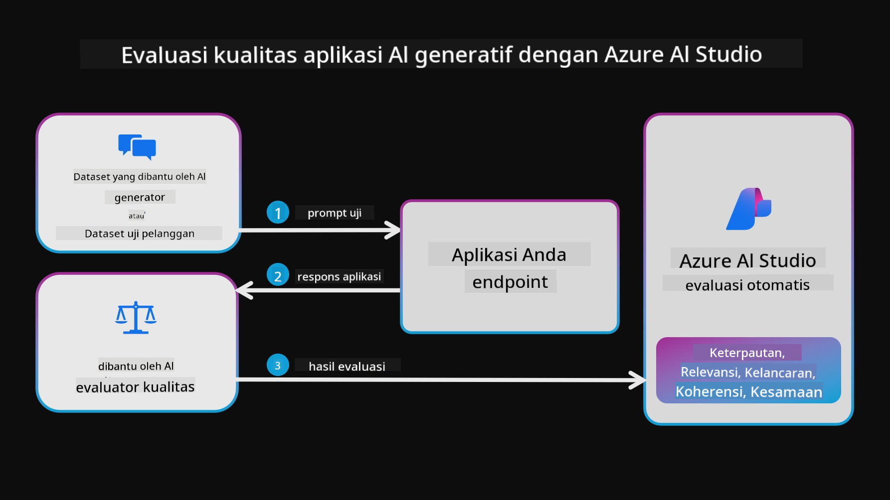
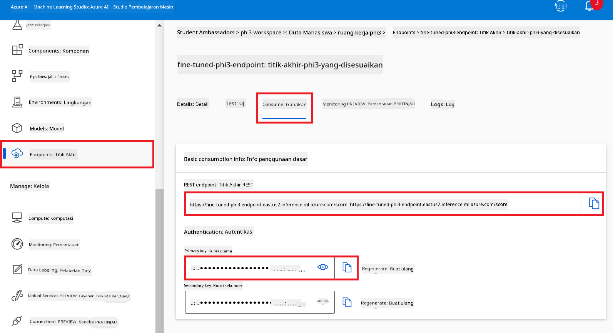
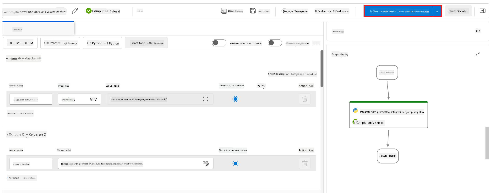

<!--
CO_OP_TRANSLATOR_METADATA:
{
  "original_hash": "80a853c08e4ee25ef9b4bfcedd8990da",
  "translation_date": "2025-07-16T23:47:37+00:00",
  "source_file": "md/02.Application/01.TextAndChat/Phi3/E2E_Phi-3-Evaluation_AIFoundry.md",
  "language_code": "id"
}
-->
# Evaluasi Model Fine-tuned Phi-3 / Phi-3.5 di Azure AI Foundry dengan Fokus pada Prinsip Responsible AI Microsoft

Contoh end-to-end (E2E) ini didasarkan pada panduan "[Evaluate Fine-tuned Phi-3 / 3.5 Models in Azure AI Foundry Focusing on Microsoft's Responsible AI](https://techcommunity.microsoft.com/blog/educatordeveloperblog/evaluate-fine-tuned-phi-3--3-5-models-in-azure-ai-studio-focusing-on-microsofts-/4227850?WT.mc_id=aiml-137032-kinfeylo)" dari Microsoft Tech Community.

## Ikhtisar

### Bagaimana cara mengevaluasi keamanan dan kinerja model fine-tuned Phi-3 / Phi-3.5 di Azure AI Foundry?

Fine-tuning model terkadang dapat menghasilkan respons yang tidak diinginkan atau tidak disengaja. Untuk memastikan model tetap aman dan efektif, penting untuk mengevaluasi potensi model dalam menghasilkan konten berbahaya serta kemampuannya menghasilkan respons yang akurat, relevan, dan koheren. Dalam tutorial ini, Anda akan belajar cara mengevaluasi keamanan dan kinerja model fine-tuned Phi-3 / Phi-3.5 yang terintegrasi dengan Prompt flow di Azure AI Foundry.

Berikut adalah proses evaluasi Azure AI Foundry.


*Sumber Gambar: [Evaluation of generative AI applications](https://learn.microsoft.com/azure/ai-studio/concepts/evaluation-approach-gen-ai?wt.mc_id%3Dstudentamb_279723)*

> [!NOTE]
>
> Untuk informasi lebih rinci dan sumber daya tambahan tentang Phi-3 / Phi-3.5, silakan kunjungi [Phi-3CookBook](https://github.com/microsoft/Phi-3CookBook?wt.mc_id=studentamb_279723).

### Prasyarat

- [Python](https://www.python.org/downloads)
- [Langganan Azure](https://azure.microsoft.com/free?wt.mc_id=studentamb_279723)
- [Visual Studio Code](https://code.visualstudio.com)
- Model Phi-3 / Phi-3.5 yang sudah di-fine-tune

### Daftar Isi

1. [**Skenario 1: Pengenalan evaluasi Prompt flow di Azure AI Foundry**](../../../../../../md/02.Application/01.TextAndChat/Phi3)

    - [Pengenalan evaluasi keamanan](../../../../../../md/02.Application/01.TextAndChat/Phi3)
    - [Pengenalan evaluasi kinerja](../../../../../../md/02.Application/01.TextAndChat/Phi3)

1. [**Skenario 2: Mengevaluasi model Phi-3 / Phi-3.5 di Azure AI Foundry**](../../../../../../md/02.Application/01.TextAndChat/Phi3)

    - [Sebelum memulai](../../../../../../md/02.Application/01.TextAndChat/Phi3)
    - [Mendeploy Azure OpenAI untuk mengevaluasi model Phi-3 / Phi-3.5](../../../../../../md/02.Application/01.TextAndChat/Phi3)
    - [Evaluasi model fine-tuned Phi-3 / Phi-3.5 menggunakan evaluasi Prompt flow Azure AI Foundry](../../../../../../md/02.Application/01.TextAndChat/Phi3)

1. [Selamat!](../../../../../../md/02.Application/01.TextAndChat/Phi3)

## **Skenario 1: Pengenalan evaluasi Prompt flow di Azure AI Foundry**

### Pengenalan evaluasi keamanan

Untuk memastikan model AI Anda etis dan aman, sangat penting untuk mengevaluasinya berdasarkan Prinsip Responsible AI Microsoft. Di Azure AI Foundry, evaluasi keamanan memungkinkan Anda menilai kerentanan model terhadap serangan jailbreak dan potensi model menghasilkan konten berbahaya, yang secara langsung sejalan dengan prinsip-prinsip tersebut.


*Sumber Gambar: [Evaluation of generative AI applications](https://learn.microsoft.com/azure/ai-studio/concepts/evaluation-approach-gen-ai?wt.mc_id%3Dstudentamb_279723)*

#### Prinsip Responsible AI Microsoft

Sebelum memulai langkah teknis, penting untuk memahami Prinsip Responsible AI Microsoft, sebuah kerangka etika yang dirancang untuk membimbing pengembangan, penerapan, dan pengoperasian sistem AI secara bertanggung jawab. Prinsip-prinsip ini mengarahkan desain, pengembangan, dan penerapan sistem AI secara bertanggung jawab, memastikan teknologi AI dibangun dengan cara yang adil, transparan, dan inklusif. Prinsip-prinsip ini menjadi dasar untuk mengevaluasi keamanan model AI.

Prinsip Responsible AI Microsoft meliputi:

- **Keadilan dan Inklusivitas**: Sistem AI harus memperlakukan semua orang secara adil dan menghindari perlakuan berbeda terhadap kelompok orang yang berada dalam situasi serupa. Misalnya, ketika sistem AI memberikan panduan tentang pengobatan medis, aplikasi pinjaman, atau pekerjaan, sistem harus memberikan rekomendasi yang sama kepada semua orang yang memiliki gejala, kondisi keuangan, atau kualifikasi profesional yang serupa.

- **Keandalan dan Keamanan**: Untuk membangun kepercayaan, sangat penting bahwa sistem AI beroperasi secara andal, aman, dan konsisten. Sistem ini harus mampu beroperasi sesuai desain awal, merespons dengan aman terhadap kondisi yang tidak terduga, dan tahan terhadap manipulasi berbahaya. Cara mereka berperilaku dan berbagai kondisi yang dapat mereka tangani mencerminkan berbagai situasi dan kondisi yang diperkirakan pengembang selama desain dan pengujian.

- **Transparansi**: Ketika sistem AI membantu mengambil keputusan yang berdampak besar pada kehidupan orang, sangat penting agar orang memahami bagaimana keputusan tersebut dibuat. Misalnya, sebuah bank mungkin menggunakan sistem AI untuk menentukan apakah seseorang layak mendapatkan kredit. Sebuah perusahaan mungkin menggunakan sistem AI untuk menentukan kandidat paling memenuhi syarat untuk dipekerjakan.

- **Privasi dan Keamanan**: Seiring AI semakin meluas, melindungi privasi dan mengamankan informasi pribadi serta bisnis menjadi semakin penting dan kompleks. Dengan AI, privasi dan keamanan data memerlukan perhatian khusus karena akses ke data sangat penting agar sistem AI dapat membuat prediksi dan keputusan yang akurat dan tepat tentang orang.

- **Akuntabilitas**: Orang yang merancang dan menerapkan sistem AI harus bertanggung jawab atas cara sistem mereka beroperasi. Organisasi harus mengacu pada standar industri untuk mengembangkan norma akuntabilitas. Norma ini dapat memastikan bahwa sistem AI bukan otoritas akhir dalam setiap keputusan yang memengaruhi kehidupan orang. Norma ini juga dapat memastikan manusia tetap memiliki kontrol bermakna atas sistem AI yang sangat otonom.


*Sumber Gambar: [What is Responsible AI?](https://learn.microsoft.com/azure/machine-learning/concept-responsible-ai?view=azureml-api-2&viewFallbackFrom=azureml-api-2%253fwt.mc_id%3Dstudentamb_279723)*

> [!NOTE]
> Untuk mempelajari lebih lanjut tentang Prinsip Responsible AI Microsoft, kunjungi [What is Responsible AI?](https://learn.microsoft.com/azure/machine-learning/concept-responsible-ai?view=azureml-api-2?wt.mc_id=studentamb_279723).

#### Metrik keamanan

Dalam tutorial ini, Anda akan mengevaluasi keamanan model fine-tuned Phi-3 menggunakan metrik keamanan Azure AI Foundry. Metrik ini membantu Anda menilai potensi model dalam menghasilkan konten berbahaya dan kerentanannya terhadap serangan jailbreak. Metrik keamanan meliputi:

- **Konten terkait Self-harm**: Mengevaluasi apakah model cenderung menghasilkan konten yang berhubungan dengan self-harm.
- **Konten Kebencian dan Tidak Adil**: Mengevaluasi apakah model cenderung menghasilkan konten yang penuh kebencian atau tidak adil.
- **Konten Kekerasan**: Mengevaluasi apakah model cenderung menghasilkan konten kekerasan.
- **Konten Seksual**: Mengevaluasi apakah model cenderung menghasilkan konten seksual yang tidak pantas.

Evaluasi aspek-aspek ini memastikan model AI tidak menghasilkan konten yang berbahaya atau menyinggung, sehingga sesuai dengan nilai sosial dan standar regulasi.


### Pengenalan evaluasi kinerja

Untuk memastikan model AI Anda berperforma sesuai harapan, penting untuk mengevaluasi kinerjanya berdasarkan metrik kinerja. Di Azure AI Foundry, evaluasi kinerja memungkinkan Anda menilai efektivitas model dalam menghasilkan respons yang akurat, relevan, dan koheren.



*Sumber Gambar: [Evaluation of generative AI applications](https://learn.microsoft.com/azure/ai-studio/concepts/evaluation-approach-gen-ai?wt.mc_id%3Dstudentamb_279723)*

#### Metrik kinerja

Dalam tutorial ini, Anda akan mengevaluasi kinerja model fine-tuned Phi-3 / Phi-3.5 menggunakan metrik kinerja Azure AI Foundry. Metrik ini membantu Anda menilai efektivitas model dalam menghasilkan respons yang akurat, relevan, dan koheren. Metrik kinerja meliputi:

- **Groundedness**: Mengevaluasi seberapa baik jawaban yang dihasilkan sesuai dengan informasi dari sumber input.
- **Relevansi**: Mengevaluasi keterkaitan respons yang dihasilkan dengan pertanyaan yang diberikan.
- **Koherensi**: Mengevaluasi kelancaran alur teks yang dihasilkan, apakah terbaca alami dan menyerupai bahasa manusia.
- **Kelancaran (Fluency)**: Mengevaluasi kemampuan bahasa dari teks yang dihasilkan.
- **Kesamaan GPT (GPT Similarity)**: Membandingkan respons yang dihasilkan dengan ground truth untuk kesamaan.
- **Skor F1**: Menghitung rasio kata yang sama antara respons yang dihasilkan dan data sumber.

Metrik-metrik ini membantu Anda mengevaluasi efektivitas model dalam menghasilkan respons yang akurat, relevan, dan koheren.


## **Skenario 2: Mengevaluasi model Phi-3 / Phi-3.5 di Azure AI Foundry**

### Sebelum memulai

Tutorial ini merupakan kelanjutan dari posting blog sebelumnya, "[Fine-Tune and Integrate Custom Phi-3 Models with Prompt Flow: Step-by-Step Guide](https://techcommunity.microsoft.com/t5/educator-developer-blog/fine-tune-and-integrate-custom-phi-3-models-with-prompt-flow/ba-p/4178612?wt.mc_id=studentamb_279723)" dan "[Fine-Tune and Integrate Custom Phi-3 Models with Prompt Flow in Azure AI Foundry](https://techcommunity.microsoft.com/t5/educator-developer-blog/fine-tune-and-integrate-custom-phi-3-models-with-prompt-flow-in/ba-p/4191726?wt.mc_id=studentamb_279723)." Dalam posting tersebut, kami membahas proses fine-tuning model Phi-3 / Phi-3.5 di Azure AI Foundry dan mengintegrasikannya dengan Prompt flow.

Dalam tutorial ini, Anda akan mendeploy model Azure OpenAI sebagai evaluator di Azure AI Foundry dan menggunakannya untuk mengevaluasi model fine-tuned Phi-3 / Phi-3.5 Anda.

Sebelum memulai tutorial ini, pastikan Anda memiliki prasyarat berikut, seperti yang dijelaskan dalam tutorial sebelumnya:

1. Dataset yang sudah disiapkan untuk mengevaluasi model fine-tuned Phi-3 / Phi-3.5.
1. Model Phi-3 / Phi-3.5 yang sudah di-fine-tune dan dideploy ke Azure Machine Learning.
1. Prompt flow yang terintegrasi dengan model fine-tuned Phi-3 / Phi-3.5 Anda di Azure AI Foundry.

> [!NOTE]
> Anda akan menggunakan file *test_data.jsonl*, yang terletak di folder data dari dataset **ULTRACHAT_200k** yang diunduh pada posting blog sebelumnya, sebagai dataset untuk mengevaluasi model fine-tuned Phi-3 / Phi-3.5.

#### Integrasi model kustom Phi-3 / Phi-3.5 dengan Prompt flow di Azure AI Foundry (Pendekatan kode terlebih dahulu)
> [!NOTE]  
> Jika Anda mengikuti pendekatan low-code yang dijelaskan dalam "[Fine-Tune and Integrate Custom Phi-3 Models with Prompt Flow in Azure AI Foundry](https://techcommunity.microsoft.com/t5/educator-developer-blog/fine-tune-and-integrate-custom-phi-3-models-with-prompt-flow-in/ba-p/4191726?wt.mc_id=studentamb_279723)", Anda bisa melewati latihan ini dan langsung ke latihan berikutnya.  
> Namun, jika Anda mengikuti pendekatan code-first yang dijelaskan dalam "[Fine-Tune and Integrate Custom Phi-3 Models with Prompt Flow: Step-by-Step Guide](https://techcommunity.microsoft.com/t5/educator-developer-blog/fine-tune-and-integrate-custom-phi-3-models-with-prompt-flow/ba-p/4178612?wt.mc_id=studentamb_279723)" untuk melakukan fine-tune dan menerapkan model Phi-3 / Phi-3.5 Anda, proses menghubungkan model Anda ke Prompt flow sedikit berbeda. Anda akan mempelajari proses ini dalam latihan ini.
Untuk melanjutkan, Anda perlu mengintegrasikan model Phi-3 / Phi-3.5 yang sudah disesuaikan ke dalam Prompt flow di Azure AI Foundry.

#### Buat Azure AI Foundry Hub

Anda perlu membuat Hub sebelum membuat Proyek. Hub berfungsi seperti Resource Group, memungkinkan Anda mengatur dan mengelola beberapa Proyek dalam Azure AI Foundry.

1. Masuk ke [Azure AI Foundry](https://ai.azure.com/?wt.mc_id=studentamb_279723).

1. Pilih **All hubs** dari tab sisi kiri.

1. Pilih **+ New hub** dari menu navigasi.

    

1. Lakukan tugas berikut:

    - Masukkan **Hub name**. Harus berupa nilai yang unik.
    - Pilih **Subscription** Azure Anda.
    - Pilih **Resource group** yang akan digunakan (buat baru jika perlu).
    - Pilih **Location** yang ingin Anda gunakan.
    - Pilih **Connect Azure AI Services** yang akan digunakan (buat baru jika perlu).
    - Pilih **Connect Azure AI Search** ke **Skip connecting**.

    

1. Pilih **Next**.

#### Buat Proyek Azure AI Foundry

1. Di Hub yang Anda buat, pilih **All projects** dari tab sisi kiri.

1. Pilih **+ New project** dari menu navigasi.

    

1. Masukkan **Project name**. Harus berupa nilai yang unik.

    

1. Pilih **Create a project**.

#### Tambahkan koneksi kustom untuk model Phi-3 / Phi-3.5 yang sudah disesuaikan

Untuk mengintegrasikan model Phi-3 / Phi-3.5 kustom Anda dengan Prompt flow, Anda perlu menyimpan endpoint dan kunci model dalam koneksi kustom. Pengaturan ini memastikan akses ke model Phi-3 / Phi-3.5 kustom Anda di Prompt flow.

#### Atur api key dan endpoint uri dari model Phi-3 / Phi-3.5 yang sudah disesuaikan

1. Kunjungi [Azure ML Studio](https://ml.azure.com/home?wt.mc_id=studentamb_279723).

1. Navigasikan ke workspace Azure Machine learning yang Anda buat.

1. Pilih **Endpoints** dari tab sisi kiri.

    

1. Pilih endpoint yang Anda buat.

    

1. Pilih **Consume** dari menu navigasi.

1. Salin **REST endpoint** dan **Primary key** Anda.

    

#### Tambahkan Koneksi Kustom

1. Kunjungi [Azure AI Foundry](https://ai.azure.com/?wt.mc_id=studentamb_279723).

1. Navigasikan ke proyek Azure AI Foundry yang Anda buat.

1. Di Proyek yang Anda buat, pilih **Settings** dari tab sisi kiri.

1. Pilih **+ New connection**.

    

1. Pilih **Custom keys** dari menu navigasi.

    

1. Lakukan tugas berikut:

    - Pilih **+ Add key value pairs**.
    - Untuk nama kunci, masukkan **endpoint** dan tempel endpoint yang Anda salin dari Azure ML Studio ke kolom nilai.
    - Pilih **+ Add key value pairs** lagi.
    - Untuk nama kunci, masukkan **key** dan tempel kunci yang Anda salin dari Azure ML Studio ke kolom nilai.
    - Setelah menambahkan kunci, pilih **is secret** untuk mencegah kunci terekspos.

    

1. Pilih **Add connection**.

#### Buat Prompt flow

Anda telah menambahkan koneksi kustom di Azure AI Foundry. Sekarang, mari buat Prompt flow dengan langkah-langkah berikut. Kemudian, Anda akan menghubungkan Prompt flow ini ke koneksi kustom untuk menggunakan model yang sudah disesuaikan dalam Prompt flow.

1. Navigasikan ke proyek Azure AI Foundry yang Anda buat.

1. Pilih **Prompt flow** dari tab sisi kiri.

1. Pilih **+ Create** dari menu navigasi.

    

1. Pilih **Chat flow** dari menu navigasi.

    

1. Masukkan **Folder name** yang akan digunakan.

    

1. Pilih **Create**.

#### Atur Prompt flow untuk mengobrol dengan model Phi-3 / Phi-3.5 kustom Anda

Anda perlu mengintegrasikan model Phi-3 / Phi-3.5 yang sudah disesuaikan ke dalam Prompt flow. Namun, Prompt flow yang ada saat ini tidak dirancang untuk tujuan ini. Oleh karena itu, Anda harus merancang ulang Prompt flow agar dapat mengintegrasikan model kustom tersebut.

1. Di Prompt flow, lakukan tugas berikut untuk membangun ulang flow yang ada:

    - Pilih **Raw file mode**.
    - Hapus semua kode yang ada di file *flow.dag.yml*.
    - Tambahkan kode berikut ke *flow.dag.yml*.

        ```yml
        inputs:
          input_data:
            type: string
            default: "Who founded Microsoft?"

        outputs:
          answer:
            type: string
            reference: ${integrate_with_promptflow.output}

        nodes:
        - name: integrate_with_promptflow
          type: python
          source:
            type: code
            path: integrate_with_promptflow.py
          inputs:
            input_data: ${inputs.input_data}
        ```

    - Pilih **Save**.

    

1. Tambahkan kode berikut ke *integrate_with_promptflow.py* untuk menggunakan model Phi-3 / Phi-3.5 kustom di Prompt flow.

    ```python
    import logging
    import requests
    from promptflow import tool
    from promptflow.connections import CustomConnection

    # Logging setup
    logging.basicConfig(
        format="%(asctime)s - %(levelname)s - %(name)s - %(message)s",
        datefmt="%Y-%m-%d %H:%M:%S",
        level=logging.DEBUG
    )
    logger = logging.getLogger(__name__)

    def query_phi3_model(input_data: str, connection: CustomConnection) -> str:
        """
        Send a request to the Phi-3 / Phi-3.5 model endpoint with the given input data using Custom Connection.
        """

        # "connection" is the name of the Custom Connection, "endpoint", "key" are the keys in the Custom Connection
        endpoint_url = connection.endpoint
        api_key = connection.key

        headers = {
            "Content-Type": "application/json",
            "Authorization": f"Bearer {api_key}"
        }
    data = {
        "input_data": [input_data],
        "params": {
            "temperature": 0.7,
            "max_new_tokens": 128,
            "do_sample": True,
            "return_full_text": True
            }
        }
        try:
            response = requests.post(endpoint_url, json=data, headers=headers)
            response.raise_for_status()
            
            # Log the full JSON response
            logger.debug(f"Full JSON response: {response.json()}")

            result = response.json()["output"]
            logger.info("Successfully received response from Azure ML Endpoint.")
            return result
        except requests.exceptions.RequestException as e:
            logger.error(f"Error querying Azure ML Endpoint: {e}")
            raise

    @tool
    def my_python_tool(input_data: str, connection: CustomConnection) -> str:
        """
        Tool function to process input data and query the Phi-3 / Phi-3.5 model.
        """
        return query_phi3_model(input_data, connection)

    ```

    

> [!NOTE]
> Untuk informasi lebih rinci tentang penggunaan Prompt flow di Azure AI Foundry, Anda dapat merujuk ke [Prompt flow in Azure AI Foundry](https://learn.microsoft.com/azure/ai-studio/how-to/prompt-flow).

1. Pilih **Chat input**, **Chat output** untuk mengaktifkan fitur obrolan dengan model Anda.

    

1. Sekarang Anda siap untuk mengobrol dengan model Phi-3 / Phi-3.5 kustom Anda. Pada latihan berikutnya, Anda akan belajar cara memulai Prompt flow dan menggunakannya untuk mengobrol dengan model Phi-3 / Phi-3.5 yang sudah disesuaikan.

> [!NOTE]
>
> Flow yang dibangun ulang harus terlihat seperti gambar di bawah ini:
>
> 
>

#### Mulai Prompt flow

1. Pilih **Start compute sessions** untuk memulai Prompt flow.

    

1. Pilih **Validate and parse input** untuk memperbarui parameter.

    

1. Pilih **Value** dari **connection** ke koneksi kustom yang Anda buat. Contohnya, *connection*.

    

#### Mengobrol dengan model Phi-3 / Phi-3.5 kustom Anda

1. Pilih **Chat**.

    

1. Berikut contoh hasilnya: Sekarang Anda dapat mengobrol dengan model Phi-3 / Phi-3.5 kustom Anda. Disarankan untuk mengajukan pertanyaan berdasarkan data yang digunakan untuk fine-tuning.

    

### Deploy Azure OpenAI untuk mengevaluasi model Phi-3 / Phi-3.5

Untuk mengevaluasi model Phi-3 / Phi-3.5 di Azure AI Foundry, Anda perlu melakukan deploy model Azure OpenAI. Model ini akan digunakan untuk menilai performa model Phi-3 / Phi-3.5.

#### Deploy Azure OpenAI

1. Masuk ke [Azure AI Foundry](https://ai.azure.com/?wt.mc_id=studentamb_279723).

1. Navigasikan ke proyek Azure AI Foundry yang Anda buat.

    

1. Di Proyek yang Anda buat, pilih **Deployments** dari tab sisi kiri.

1. Pilih **+ Deploy model** dari menu navigasi.

1. Pilih **Deploy base model**.

    

1. Pilih model Azure OpenAI yang ingin Anda gunakan. Contohnya, **gpt-4o**.

    

1. Pilih **Confirm**.

### Evaluasi model Phi-3 / Phi-3.5 yang sudah disesuaikan menggunakan evaluasi Prompt flow di Azure AI Foundry

### Mulai evaluasi baru

1. Kunjungi [Azure AI Foundry](https://ai.azure.com/?wt.mc_id=studentamb_279723).

1. Navigasikan ke proyek Azure AI Foundry yang Anda buat.

    

1. Di Proyek yang Anda buat, pilih **Evaluation** dari tab sisi kiri.

1. Pilih **+ New evaluation** dari menu navigasi.

    

1. Pilih evaluasi **Prompt flow**.

    

1. Lakukan tugas berikut:

    - Masukkan nama evaluasi. Harus berupa nilai yang unik.
    - Pilih **Question and answer without context** sebagai tipe tugas. Karena, dataset **ULTRACHAT_200k** yang digunakan dalam tutorial ini tidak mengandung konteks.
    - Pilih prompt flow yang ingin Anda evaluasi.

    

1. Pilih **Next**.

1. Lakukan tugas berikut:

    - Pilih **Add your dataset** untuk mengunggah dataset. Misalnya, Anda dapat mengunggah file dataset uji, seperti *test_data.json1*, yang disertakan saat Anda mengunduh dataset **ULTRACHAT_200k**.
    - Pilih **Dataset column** yang sesuai dengan dataset Anda. Misalnya, jika Anda menggunakan dataset **ULTRACHAT_200k**, pilih **${data.prompt}** sebagai kolom dataset.

    

1. Pilih **Next**.

1. Lakukan tugas berikut untuk mengonfigurasi metrik performa dan kualitas:

    - Pilih metrik performa dan kualitas yang ingin Anda gunakan.
    - Pilih model Azure OpenAI yang Anda buat untuk evaluasi. Contohnya, pilih **gpt-4o**.

    

1. Lakukan tugas berikut untuk mengonfigurasi metrik risiko dan keamanan:

    - Pilih metrik risiko dan keamanan yang ingin Anda gunakan.
    - Pilih ambang batas untuk menghitung tingkat cacat yang ingin Anda gunakan. Contohnya, pilih **Medium**.
    - Untuk **question**, pilih **Data source** ke **{$data.prompt}**.
    - Untuk **answer**, pilih **Data source** ke **{$run.outputs.answer}**.
    - Untuk **ground_truth**, pilih **Data source** ke **{$data.message}**.

    

1. Pilih **Next**.

1. Pilih **Submit** untuk memulai evaluasi.

1. Evaluasi akan memakan waktu beberapa saat untuk selesai. Anda dapat memantau kemajuan di tab **Evaluation**.

### Tinjau Hasil Evaluasi
> [!NOTE]
> Hasil yang disajikan di bawah ini dimaksudkan untuk mengilustrasikan proses evaluasi. Dalam tutorial ini, kami menggunakan model yang telah disesuaikan dengan dataset yang relatif kecil, yang mungkin menghasilkan hasil yang kurang optimal. Hasil sebenarnya dapat bervariasi secara signifikan tergantung pada ukuran, kualitas, dan keberagaman dataset yang digunakan, serta konfigurasi spesifik dari model tersebut.
Setelah evaluasi selesai, Anda dapat meninjau hasil untuk metrik kinerja dan keamanan.

1. Metrik kinerja dan kualitas:

    - menilai efektivitas model dalam menghasilkan respons yang koheren, lancar, dan relevan.

    

1. Metrik risiko dan keamanan:

    - Pastikan output model aman dan sesuai dengan Prinsip Responsible AI, menghindari konten yang berbahaya atau menyinggung.

    

1. Anda dapat menggulir ke bawah untuk melihat **Hasil metrik terperinci**.

    

1. Dengan mengevaluasi model kustom Phi-3 / Phi-3.5 Anda berdasarkan metrik kinerja dan keamanan, Anda dapat memastikan bahwa model tidak hanya efektif, tetapi juga mematuhi praktik AI yang bertanggung jawab, sehingga siap untuk digunakan di dunia nyata.

## Selamat!

### Anda telah menyelesaikan tutorial ini

Anda telah berhasil mengevaluasi model Phi-3 yang telah disesuaikan dan terintegrasi dengan Prompt flow di Azure AI Foundry. Ini adalah langkah penting untuk memastikan bahwa model AI Anda tidak hanya berkinerja baik, tetapi juga mematuhi prinsip Responsible AI Microsoft agar Anda dapat membangun aplikasi AI yang dapat dipercaya dan andal.


## Bersihkan Sumber Daya Azure

Bersihkan sumber daya Azure Anda untuk menghindari biaya tambahan pada akun Anda. Buka portal Azure dan hapus sumber daya berikut:

- Resource Azure Machine learning.
- Endpoint model Azure Machine learning.
- Resource Azure AI Foundry Project.
- Resource Azure AI Foundry Prompt flow.

### Langkah Selanjutnya

#### Dokumentasi

- [Assess AI systems by using the Responsible AI dashboard](https://learn.microsoft.com/azure/machine-learning/concept-responsible-ai-dashboard?view=azureml-api-2&source=recommendations?wt.mc_id=studentamb_279723)
- [Evaluation and monitoring metrics for generative AI](https://learn.microsoft.com/azure/ai-studio/concepts/evaluation-metrics-built-in?tabs=definition?wt.mc_id=studentamb_279723)
- [Azure AI Foundry documentation](https://learn.microsoft.com/azure/ai-studio/?wt.mc_id=studentamb_279723)
- [Prompt flow documentation](https://microsoft.github.io/promptflow/?wt.mc_id=studentamb_279723)

#### Konten Pelatihan

- [Introduction to Microsoft's Responsible AI Approach](https://learn.microsoft.com/training/modules/introduction-to-microsofts-responsible-ai-approach/?source=recommendations?wt.mc_id=studentamb_279723)
- [Introduction to Azure AI Foundry](https://learn.microsoft.com/training/modules/introduction-to-azure-ai-studio/?wt.mc_id=studentamb_279723)

### Referensi

- [What is Responsible AI?](https://learn.microsoft.com/azure/machine-learning/concept-responsible-ai?view=azureml-api-2?wt.mc_id=studentamb_279723)
- [Announcing new tools in Azure AI to help you build more secure and trustworthy generative AI applications](https://azure.microsoft.com/blog/announcing-new-tools-in-azure-ai-to-help-you-build-more-secure-and-trustworthy-generative-ai-applications/?wt.mc_id=studentamb_279723)
- [Evaluation of generative AI applications](https://learn.microsoft.com/azure/ai-studio/concepts/evaluation-approach-gen-ai?wt.mc_id%3Dstudentamb_279723)

**Penafian**:  
Dokumen ini telah diterjemahkan menggunakan layanan terjemahan AI [Co-op Translator](https://github.com/Azure/co-op-translator). Meskipun kami berupaya untuk mencapai akurasi, harap diperhatikan bahwa terjemahan otomatis mungkin mengandung kesalahan atau ketidakakuratan. Dokumen asli dalam bahasa aslinya harus dianggap sebagai sumber yang sahih. Untuk informasi penting, disarankan menggunakan terjemahan profesional oleh manusia. Kami tidak bertanggung jawab atas kesalahpahaman atau penafsiran yang keliru yang timbul dari penggunaan terjemahan ini.