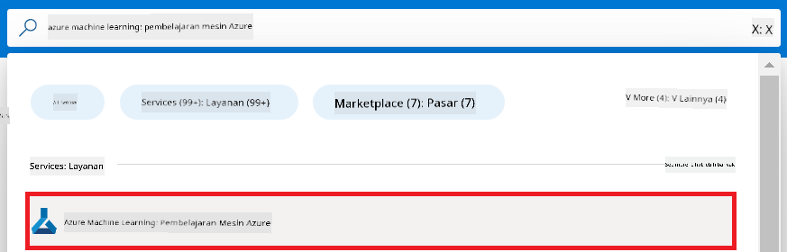
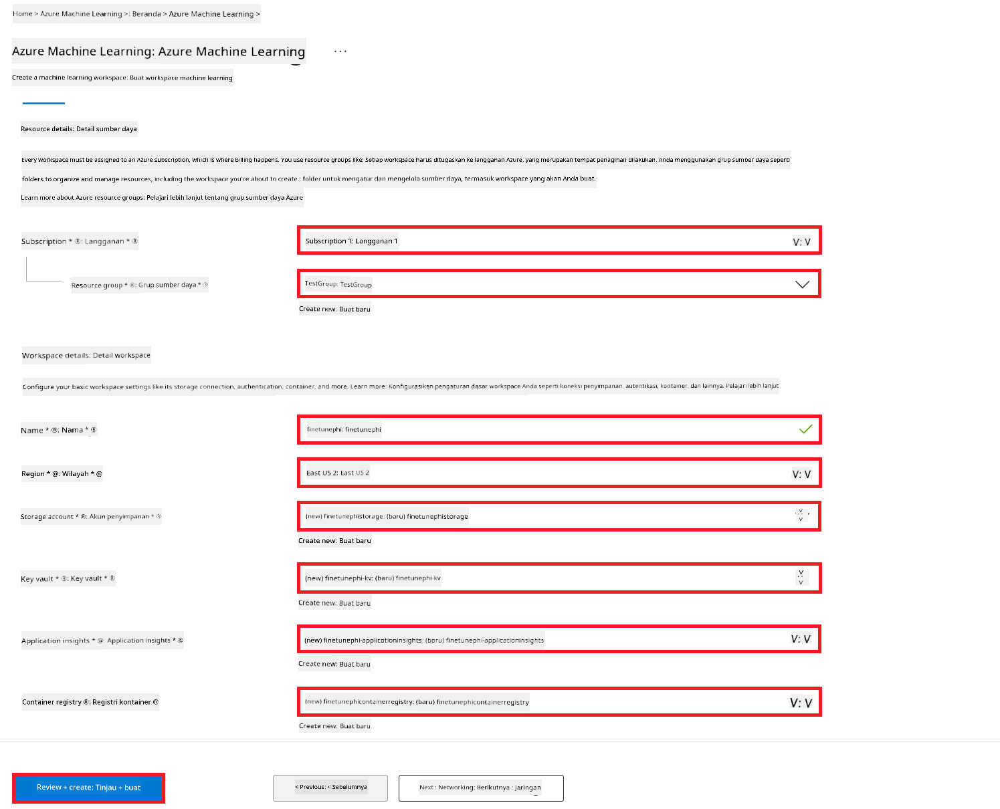
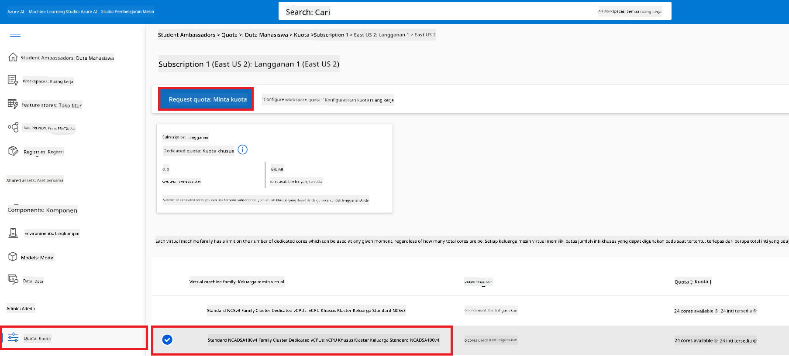
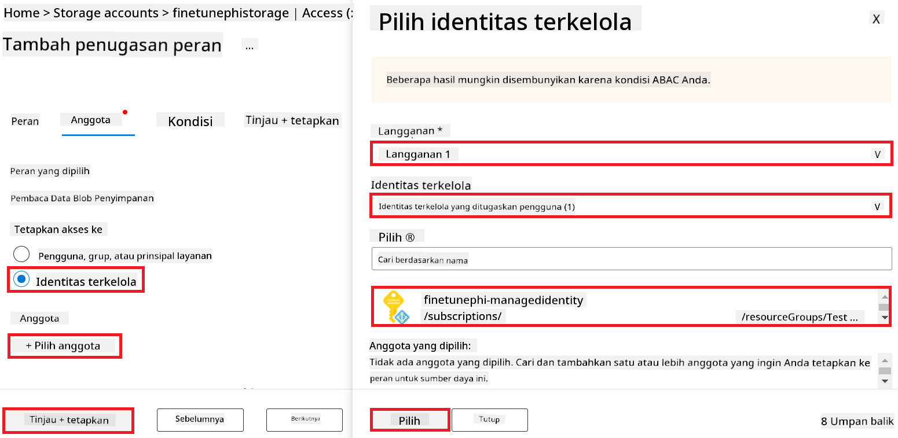
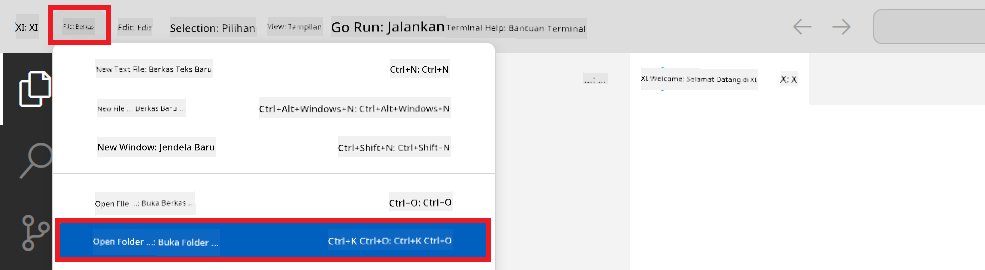
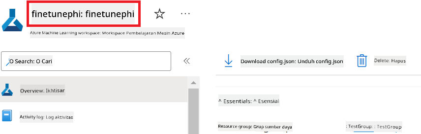
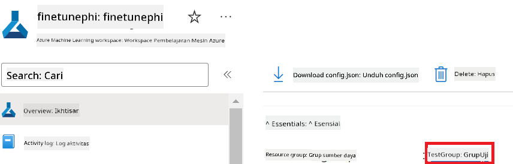
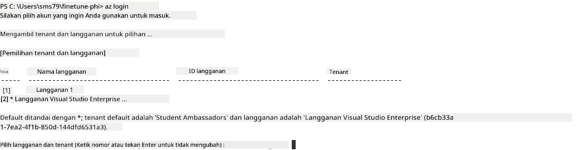
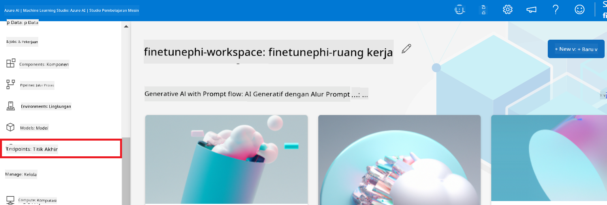
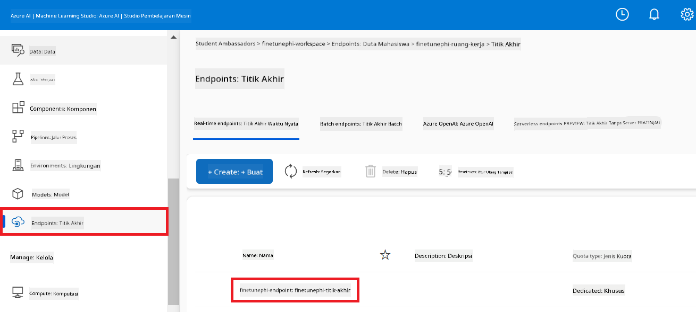

<!--
CO_OP_TRANSLATOR_METADATA:
{
  "original_hash": "7ca2c30fdb802664070e9cfbf92e24fe",
  "translation_date": "2026-01-05T08:55:53+00:00",
  "source_file": "md/02.Application/01.TextAndChat/Phi3/E2E_Phi-3-FineTuning_PromptFlow_Integration.md",
  "language_code": "id"
}
-->
# Fine-tune dan Integrasikan model Phi-3 kustom dengan Prompt flow

Contoh end-to-end (E2E) ini didasarkan pada panduan "[Fine-Tune and Integrate Custom Phi-3 Models with Prompt Flow: Step-by-Step Guide](https://techcommunity.microsoft.com/t5/educator-developer-blog/fine-tune-and-integrate-custom-phi-3-models-with-prompt-flow/ba-p/4178612?WT.mc_id=aiml-137032-kinfeylo)" dari Microsoft Tech Community. Ini memperkenalkan proses fine-tuning, penerapan, dan integrasi model Phi-3 kustom dengan Prompt flow.

## Ikhtisar

Dalam contoh E2E ini, Anda akan belajar cara melakukan fine-tuning model Phi-3 dan mengintegrasikannya dengan Prompt flow. Dengan memanfaatkan Azure Machine Learning dan Prompt flow, Anda akan membangun alur kerja untuk menerapkan dan menggunakan model AI kustom. Contoh E2E ini dibagi menjadi tiga skenario:

**Skenario 1: Menyiapkan sumber daya Azure dan Persiapan untuk fine-tuning**

**Skenario 2: Fine-tune model Phi-3 dan Terapkan di Azure Machine Learning Studio**

**Skenario 3: Integrasikan dengan Prompt flow dan Chat dengan model kustom Anda**

Berikut ikhtisar dari contoh E2E ini.


### Daftar Isi

1. **[Skenario 1: Menyiapkan sumber daya Azure dan Persiapan untuk fine-tuning](../../../../../../md/02.Application/01.TextAndChat/Phi3)**
    - [Buat Azure Machine Learning Workspace](../../../../../../md/02.Application/01.TextAndChat/Phi3)
    - [Minta kuota GPU di Azure Subscription](../../../../../../md/02.Application/01.TextAndChat/Phi3)
    - [Tambahkan penugasan peran](../../../../../../md/02.Application/01.TextAndChat/Phi3)
    - [Siapkan proyek](../../../../../../md/02.Application/01.TextAndChat/Phi3)
    - [Siapkan dataset untuk fine-tuning](../../../../../../md/02.Application/01.TextAndChat/Phi3)

1. **[Skenario 2: Fine-tune model Phi-3 dan Terapkan di Azure Machine Learning Studio](../../../../../../md/02.Application/01.TextAndChat/Phi3)**
    - [Siapkan Azure CLI](../../../../../../md/02.Application/01.TextAndChat/Phi3)
    - [Fine-tune model Phi-3](../../../../../../md/02.Application/01.TextAndChat/Phi3)
    - [Terapkan model yang sudah di-fine-tune](../../../../../../md/02.Application/01.TextAndChat/Phi3)

1. **[Skenario 3: Integrasikan dengan Prompt flow dan Chat dengan model kustom Anda](../../../../../../md/02.Application/01.TextAndChat/Phi3)**
    - [Integrasikan model Phi-3 kustom dengan Prompt flow](../../../../../../md/02.Application/01.TextAndChat/Phi3)
    - [Chat dengan model kustom Anda](../../../../../../md/02.Application/01.TextAndChat/Phi3)

## Skenario 1: Menyiapkan sumber daya Azure dan Persiapan untuk fine-tuning

### Buat Azure Machine Learning Workspace

1. Ketik *azure machine learning* di **bilah pencarian** di bagian atas halaman portal dan pilih **Azure Machine Learning** dari opsi yang muncul.

    

1. Pilih **+ Create** dari menu navigasi.

1. Pilih **New workspace** dari menu navigasi.

    

1. Lakukan tugas berikut:

    - Pilih **Subscription** Azure Anda.
    - Pilih **Resource group** yang akan digunakan (buat baru jika perlu).
    - Masukkan **Workspace Name**. Ini harus unik.
    - Pilih **Region** yang ingin Anda gunakan.
    - Pilih **Storage account** yang akan digunakan (buat baru jika perlu).
    - Pilih **Key vault** yang akan digunakan (buat baru jika perlu).
    - Pilih **Application insights** yang akan digunakan (buat baru jika perlu).
    - Pilih **Container registry** yang akan digunakan (buat baru jika perlu).

    

1. Pilih **Review + Create**.

1. Pilih **Create**.

### Minta kuota GPU di Azure Subscription

Dalam contoh E2E ini, Anda akan menggunakan *Standard_NC24ads_A100_v4 GPU* untuk fine-tuning, yang memerlukan permintaan kuota, dan *Standard_E4s_v3* CPU untuk penerapan yang tidak memerlukan permintaan kuota.

> [!NOTE]
>
> Hanya langganan Pay-As-You-Go (tipe langganan standar) yang memenuhi syarat untuk alokasi GPU; langganan berbasis manfaat saat ini tidak didukung.
>
> Bagi yang menggunakan langganan berbasis manfaat (seperti Visual Studio Enterprise Subscription) atau yang ingin menguji proses fine-tuning dan penerapan dengan cepat, tutorial ini juga menyediakan petunjuk untuk fine-tuning dengan dataset minimal menggunakan CPU. Namun, penting dicatat bahwa hasil fine-tuning jauh lebih baik saat menggunakan GPU dengan dataset yang lebih besar.

1. Kunjungi [Azure ML Studio](https://ml.azure.com/home?wt.mc_id=studentamb_279723).

1. Lakukan tugas berikut untuk meminta kuota *Standard NCADSA100v4 Family*:

    - Pilih **Quota** dari tab sisi kiri.
    - Pilih **Virtual machine family** yang digunakan. Misalnya, pilih **Standard NCADSA100v4 Family Cluster Dedicated vCPUs**, yang mencakup *Standard_NC24ads_A100_v4* GPU.
    - Pilih **Request quota** dari menu navigasi.

        

    - Di halaman Request quota, masukkan **New cores limit** yang ingin digunakan. Misalnya, 24.
    - Di halaman Request quota, pilih **Submit** untuk mengajukan permintaan kuota GPU.

> [!NOTE]
> Anda dapat memilih GPU atau CPU yang sesuai dengan kebutuhan Anda dengan merujuk pada dokumen [Ukuran Mesin Virtual di Azure](https://learn.microsoft.com/azure/virtual-machines/sizes/overview?tabs=breakdownseries%2Cgeneralsizelist%2Ccomputesizelist%2Cmemorysizelist%2Cstoragesizelist%2Cgpusizelist%2Cfpgasizelist%2Chpcsizelist).

### Tambahkan penugasan peran

Untuk melakukan fine-tuning dan menerapkan model Anda, Anda harus terlebih dahulu membuat User Assigned Managed Identity (UAI) dan memberi perizinan yang sesuai. UAI ini akan digunakan untuk otentikasi saat penerapan.

#### Buat User Assigned Managed Identity (UAI)

1. Ketik *managed identities* di **bilah pencarian** di bagian atas halaman portal dan pilih **Managed Identities** dari opsi yang muncul.

    

1. Pilih **+ Create**.

    

1. Lakukan tugas berikut:

    - Pilih Azure **Subscription** Anda.
    - Pilih **Resource group** yang akan digunakan (buat baru jika perlu).
    - Pilih **Region** yang ingin Anda gunakan.
    - Masukkan **Name**. Harus unik.

1. Pilih **Review + create**.

1. Pilih **+ Create**.

#### Tambahkan penugasan peran Contributor ke Managed Identity

1. Navigasikan ke sumber daya Managed Identity yang telah Anda buat.

1. Pilih **Azure role assignments** dari tab sisi kiri.

1. Pilih **+Add role assignment** dari menu navigasi.

1. Di halaman Add role assignment, lakukan tugas berikut:
    - Pilih **Scope** ke **Resource group**.
    - Pilih Azure **Subscription** Anda.
    - Pilih **Resource group** yang digunakan.
    - Pilih **Role** menjadi **Contributor**.

    

1. Pilih **Save**.

#### Tambahkan penugasan peran Storage Blob Data Reader ke Managed Identity

1. Ketik *storage accounts* di **bilah pencarian** di bagian atas halaman portal dan pilih **Storage accounts** dari opsi yang muncul.

    

1. Pilih akun penyimpanan yang terkait dengan Azure Machine Learning workspace yang Anda buat. Misalnya, *finetunephistorage*.

1. Lakukan tugas berikut untuk menuju ke halaman Add role assignment:

    - Navigasikan ke akun Penyimpanan Azure yang Anda buat.
    - Pilih **Access Control (IAM)** dari tab sisi kiri.
    - Pilih **+ Add** dari menu navigasi.
    - Pilih **Add role assignment** dari menu navigasi.

    

1. Di halaman Add role assignment, lakukan tugas berikut:

    - Di halaman Role, ketik *Storage Blob Data Reader* di **bilah pencarian** dan pilih **Storage Blob Data Reader** dari opsi yang muncul.
    - Di halaman Role, pilih **Next**.
    - Di halaman Members, pilih **Assign access to** **Managed identity**.
    - Di halaman Members, pilih **+ Select members**.
    - Di halaman Select managed identities, pilih Azure **Subscription** Anda.
    - Di halaman Select managed identities, pilih **Managed identity** ke **Manage Identity**.
    - Di halaman Select managed identities, pilih Manage Identity yang Anda buat. Misalnya, *finetunephi-managedidentity*.
    - Di halaman Select managed identities, pilih **Select**.

    

1. Pilih **Review + assign**.

#### Tambahkan penugasan peran AcrPull ke Managed Identity

1. Ketik *container registries* di **bilah pencarian** di bagian atas halaman portal dan pilih **Container registries** dari opsi yang muncul.

    

1. Pilih container registry yang terkait dengan Azure Machine Learning workspace. Misalnya, *finetunephicontainerregistries*

1. Lakukan tugas berikut untuk menuju ke halaman Add role assignment:

    - Pilih **Access Control (IAM)** dari tab sisi kiri.
    - Pilih **+ Add** dari menu navigasi.
    - Pilih **Add role assignment** dari menu navigasi.

1. Di halaman Add role assignment, lakukan tugas berikut:

    - Di halaman Role, ketik *AcrPull* di **bilah pencarian** dan pilih **AcrPull** dari opsi yang muncul.
    - Di halaman Role, pilih **Next**.
    - Di halaman Members, pilih **Assign access to** **Managed identity**.
    - Di halaman Members, pilih **+ Select members**.
    - Di halaman Select managed identities, pilih Azure **Subscription** Anda.
    - Di halaman Select managed identities, pilih **Managed identity** ke **Manage Identity**.
    - Di halaman Select managed identities, pilih Manage Identity yang Anda buat. Misalnya, *finetunephi-managedidentity*.
    - Di halaman Select managed identities, pilih **Select**.
    - Pilih **Review + assign**.

### Siapkan proyek

Sekarang, Anda akan membuat folder kerja dan menyiapkan lingkungan virtual untuk mengembangkan program yang berinteraksi dengan pengguna serta menggunakan riwayat chat tersimpan dari Azure Cosmos DB untuk memberikan respons.

#### Buat folder kerja

1. Buka terminal dan ketik perintah berikut untuk membuat folder bernama *finetune-phi* di path default.

    ```console
    mkdir finetune-phi
    ```

1. Ketik perintah berikut di terminal untuk masuk ke folder *finetune-phi* yang Anda buat.

    ```console
    cd finetune-phi
    ```

#### Buat lingkungan virtual

1. Ketik perintah berikut di terminal untuk membuat lingkungan virtual bernama *.venv*.

    ```console
    python -m venv .venv
    ```

1. Ketik perintah berikut di terminal untuk mengaktifkan lingkungan virtual.

    ```console
    .venv\Scripts\activate.bat
    ```

> [!NOTE]
>
> Jika berhasil, Anda akan melihat *(.venv)* sebelum prompt perintah.

#### Instal paket yang dibutuhkan

1. Ketik perintah berikut di terminal untuk menginstal paket yang dibutuhkan.

    ```console
    pip install datasets==2.19.1
    pip install transformers==4.41.1
    pip install azure-ai-ml==1.16.0
    pip install torch==2.3.1
    pip install trl==0.9.4
    pip install promptflow==1.12.0
    ```

#### Buat file proyek
Dalam latihan ini, Anda akan membuat file-file penting untuk proyek kita. File-file ini mencakup skrip untuk mengunduh dataset, menyiapkan lingkungan Azure Machine Learning, menyempurnakan model Phi-3, dan menerapkan model yang telah disempurnakan. Anda juga akan membuat file *conda.yml* untuk menyiapkan lingkungan fine-tuning.

Dalam latihan ini, Anda akan:

- Membuat file *download_dataset.py* untuk mengunduh dataset.
- Membuat file *setup_ml.py* untuk menyiapkan lingkungan Azure Machine Learning.
- Membuat file *fine_tune.py* di folder *finetuning_dir* untuk menyempurnakan model Phi-3 menggunakan dataset.
- Membuat file *conda.yml* untuk menyiapkan lingkungan fine-tuning.
- Membuat file *deploy_model.py* untuk menerapkan model yang telah disempurnakan.
- Membuat file *integrate_with_promptflow.py*, untuk mengintegrasikan model yang telah disempurnakan dan menjalankan model menggunakan Prompt flow.
- Membuat file flow.dag.yml, untuk menyiapkan struktur alur kerja di Prompt flow.
- Membuat file *config.py* untuk memasukkan informasi Azure.

> [!NOTE]
>
> Struktur folder lengkap:
>
> ```text
> └── YourUserName
> .    └── finetune-phi
> .        ├── finetuning_dir
> .        │      └── fine_tune.py
> .        ├── conda.yml
> .        ├── config.py
> .        ├── deploy_model.py
> .        ├── download_dataset.py
> .        ├── flow.dag.yml
> .        ├── integrate_with_promptflow.py
> .        └── setup_ml.py
> ```

1. Buka **Visual Studio Code**.

1. Pilih **File** dari menu bar.

1. Pilih **Open Folder**.

1. Pilih folder *finetune-phi* yang sudah Anda buat, yang terletak di *C:\Users\yourUserName\finetune-phi*.

    

1. Di panel kiri Visual Studio Code, klik kanan dan pilih **New File** untuk membuat file baru bernama *download_dataset.py*.

1. Di panel kiri Visual Studio Code, klik kanan dan pilih **New File** untuk membuat file baru bernama *setup_ml.py*.

1. Di panel kiri Visual Studio Code, klik kanan dan pilih **New File** untuk membuat file baru bernama *deploy_model.py*.

    

1. Di panel kiri Visual Studio Code, klik kanan dan pilih **New Folder** untuk membuat folder baru bernama *finetuning_dir*.

1. Di folder *finetuning_dir*, buat file baru bernama *fine_tune.py*.

#### Membuat dan Mengonfigurasi file *conda.yml*

1. Di panel kiri Visual Studio Code, klik kanan dan pilih **New File** untuk membuat file baru bernama *conda.yml*.

1. Tambahkan kode berikut ke file *conda.yml* untuk menyiapkan lingkungan fine-tuning untuk model Phi-3.

    ```yml
    name: phi-3-training-env
    channels:
      - defaults
      - conda-forge
    dependencies:
      - python=3.10
      - pip
      - numpy<2.0
      - pip:
          - torch==2.4.0
          - torchvision==0.19.0
          - trl==0.8.6
          - transformers==4.41
          - datasets==2.21.0
          - azureml-core==1.57.0
          - azure-storage-blob==12.19.0
          - azure-ai-ml==1.16
          - azure-identity==1.17.1
          - accelerate==0.33.0
          - mlflow==2.15.1
          - azureml-mlflow==1.57.0
    ```

#### Membuat dan Mengonfigurasi file *config.py*

1. Di panel kiri Visual Studio Code, klik kanan dan pilih **New File** untuk membuat file baru bernama *config.py*.

1. Tambahkan kode berikut ke file *config.py* untuk memasukkan informasi Azure Anda.

    ```python
    # Pengaturan Azure
    AZURE_SUBSCRIPTION_ID = "your_subscription_id"
    AZURE_RESOURCE_GROUP_NAME = "your_resource_group_name" # "TestGroup"

    # Pengaturan Azure Machine Learning
    AZURE_ML_WORKSPACE_NAME = "your_workspace_name" # "finetunephi-workspace"

    # Pengaturan Identitas Terkelola Azure
    AZURE_MANAGED_IDENTITY_CLIENT_ID = "your_azure_managed_identity_client_id"
    AZURE_MANAGED_IDENTITY_NAME = "your_azure_managed_identity_name" # "finetunephi-mangedidentity"
    AZURE_MANAGED_IDENTITY_RESOURCE_ID = f"/subscriptions/{AZURE_SUBSCRIPTION_ID}/resourceGroups/{AZURE_RESOURCE_GROUP_NAME}/providers/Microsoft.ManagedIdentity/userAssignedIdentities/{AZURE_MANAGED_IDENTITY_NAME}"

    # Jalur file Dataset
    TRAIN_DATA_PATH = "data/train_data.jsonl"
    TEST_DATA_PATH = "data/test_data.jsonl"

    # Pengaturan model yang sudah disesuaikan
    AZURE_MODEL_NAME = "your_fine_tuned_model_name" # "finetune-phi-model"
    AZURE_ENDPOINT_NAME = "your_fine_tuned_model_endpoint_name" # "finetune-phi-endpoint"
    AZURE_DEPLOYMENT_NAME = "your_fine_tuned_model_deployment_name" # "finetune-phi-deployment"

    AZURE_ML_API_KEY = "your_fine_tuned_model_api_key"
    AZURE_ML_ENDPOINT = "your_fine_tuned_model_endpoint_uri" # "https://{your-endpoint-name}.{your-region}.inference.ml.azure.com/score"
    ```

#### Menambahkan variabel lingkungan Azure

1. Lakukan langkah-langkah berikut untuk menambahkan Azure Subscription ID:

    - Ketik *subscriptions* di **bilah pencarian** di bagian atas halaman portal dan pilih **Subscriptions** dari opsi yang muncul.
    - Pilih Azure Subscription yang sedang Anda gunakan.
    - Salin dan tempel Subscription ID Anda ke dalam file *config.py*.

    

1. Lakukan langkah-langkah berikut untuk menambahkan Nama Workspace Azure:

    - Navigasikan ke resource Azure Machine Learning yang sudah Anda buat.
    - Salin dan tempel nama akun Anda ke dalam file *config.py*.

    

1. Lakukan langkah-langkah berikut untuk menambahkan Nama Resource Group Azure:

    - Navigasikan ke resource Azure Machine Learning yang sudah Anda buat.
    - Salin dan tempel Nama Azure Resource Group Anda ke dalam file *config.py*.

    

2. Lakukan langkah-langkah berikut untuk menambahkan nama Azure Managed Identity

    - Navigasikan ke resource Managed Identities yang Anda buat.
    - Salin dan tempel nama Azure Managed Identity Anda ke dalam file *config.py*.

    

### Mempersiapkan dataset untuk fine-tuning

Dalam latihan ini, Anda akan menjalankan file *download_dataset.py* untuk mengunduh dataset *ULTRACHAT_200k* ke lingkungan lokal Anda. Selanjutnya, Anda akan menggunakan dataset ini untuk menyempurnakan model Phi-3 di Azure Machine Learning.

#### Unduh dataset Anda menggunakan *download_dataset.py*

1. Buka file *download_dataset.py* di Visual Studio Code.

1. Tambahkan kode berikut ke dalam *download_dataset.py*.

    ```python
    import json
    import os
    from datasets import load_dataset
    from config import (
        TRAIN_DATA_PATH,
        TEST_DATA_PATH)

    def load_and_split_dataset(dataset_name, config_name, split_ratio):
        """
        Load and split a dataset.
        """
        # Muat dataset dengan nama, konfigurasi, dan rasio pembagian yang ditentukan
        dataset = load_dataset(dataset_name, config_name, split=split_ratio)
        print(f"Original dataset size: {len(dataset)}")
        
        # Pisahkan dataset menjadi set pelatihan dan pengujian (80% pelatihan, 20% pengujian)
        split_dataset = dataset.train_test_split(test_size=0.2)
        print(f"Train dataset size: {len(split_dataset['train'])}")
        print(f"Test dataset size: {len(split_dataset['test'])}")
        
        return split_dataset

    def save_dataset_to_jsonl(dataset, filepath):
        """
        Save a dataset to a JSONL file.
        """
        # Buat direktori jika belum ada
        os.makedirs(os.path.dirname(filepath), exist_ok=True)
        
        # Buka file dalam mode tulis
        with open(filepath, 'w', encoding='utf-8') as f:
            # Iterasi setiap catatan dalam dataset
            for record in dataset:
                # Dump catatan sebagai objek JSON dan tulis ke file
                json.dump(record, f)
                # Tulis karakter baris baru untuk memisahkan catatan
                f.write('\n')
        
        print(f"Dataset saved to {filepath}")

    def main():
        """
        Main function to load, split, and save the dataset.
        """
        # Muat dan bagi dataset ULTRACHAT_200k dengan konfigurasi dan rasio pembagian tertentu
        dataset = load_and_split_dataset("HuggingFaceH4/ultrachat_200k", 'default', 'train_sft[:1%]')
        
        # Ekstrak dataset pelatihan dan pengujian dari hasil pembagian
        train_dataset = dataset['train']
        test_dataset = dataset['test']

        # Simpan dataset pelatihan ke file JSONL
        save_dataset_to_jsonl(train_dataset, TRAIN_DATA_PATH)
        
        # Simpan dataset pengujian ke file JSONL terpisah
        save_dataset_to_jsonl(test_dataset, TEST_DATA_PATH)

    if __name__ == "__main__":
        main()

    ```

> [!TIP]
>
> **Panduan untuk fine-tuning dengan dataset minimal menggunakan CPU**
>
> Jika Anda ingin menggunakan CPU untuk fine-tuning, pendekatan ini ideal bagi mereka yang memiliki subscription benefit (seperti Visual Studio Enterprise Subscription) atau untuk menguji proses fine-tuning dan deployment dengan cepat.
>
> Ganti `dataset = load_and_split_dataset("HuggingFaceH4/ultrachat_200k", 'default', 'train_sft[:1%]')` dengan `dataset = load_and_split_dataset("HuggingFaceH4/ultrachat_200k", 'default', 'train_sft[:10]')`
>

1. Ketik perintah berikut di terminal Anda untuk menjalankan skrip dan mengunduh dataset ke lingkungan lokal Anda.

    ```console
    python download_data.py
    ```

1. Verifikasi bahwa dataset berhasil disimpan ke direktori lokal *finetune-phi/data*.

> [!NOTE]
>
> **Ukuran dataset dan waktu fine-tuning**
>
> Dalam contoh E2E ini, Anda hanya menggunakan 1% dari dataset (`train_sft[:1%]`). Ini secara signifikan mengurangi jumlah data, mempercepat proses upload dan fine-tuning. Anda dapat menyesuaikan persentase untuk menemukan keseimbangan yang tepat antara waktu pelatihan dan performa model. Menggunakan subset dataset yang lebih kecil mengurangi waktu yang dibutuhkan untuk fine-tuning, membuat proses lebih mudah dikelola untuk contoh E2E.

## Skenario 2: Fine-tune model Phi-3 dan Deploy di Azure Machine Learning Studio

### Menyiapkan Azure CLI

Anda perlu menyiapkan Azure CLI untuk mengautentikasi lingkungan Anda. Azure CLI memungkinkan Anda mengelola sumber daya Azure langsung dari command line dan menyediakan kredensial yang dibutuhkan Azure Machine Learning untuk mengakses sumber daya tersebut. Untuk mulai, instal [Azure CLI](https://learn.microsoft.com/cli/azure/install-azure-cli)

1. Buka jendela terminal dan ketik perintah berikut untuk login ke akun Azure Anda.

    ```console
    az login
    ```

1. Pilih akun Azure yang ingin Anda gunakan.

1. Pilih subscription Azure yang ingin Anda gunakan.

    

> [!TIP]
>
> Jika Anda mengalami kesulitan masuk ke Azure, coba gunakan kode perangkat. Buka jendela terminal dan ketik perintah berikut untuk masuk ke akun Azure Anda:
>
> ```console
> az login --use-device-code
> ```
>

### Fine-tune model Phi-3

Dalam latihan ini, Anda akan melakukan fine-tuning pada model Phi-3 menggunakan dataset yang disediakan. Pertama, Anda akan mendefinisikan proses fine-tuning di file *fine_tune.py*. Kemudian, Anda akan mengonfigurasi lingkungan Azure Machine Learning dan memulai proses fine-tuning dengan menjalankan file *setup_ml.py*. Skrip ini memastikan bahwa fine-tuning berlangsung di dalam lingkungan Azure Machine Learning.

Dengan menjalankan *setup_ml.py*, Anda akan menjalankan proses fine-tuning di lingkungan Azure Machine Learning.

#### Tambahkan kode ke file *fine_tune.py*

1. Navigasikan ke folder *finetuning_dir* dan buka file *fine_tune.py* di Visual Studio Code.

1. Tambahkan kode berikut ke dalam *fine_tune.py*.

    ```python
    import argparse
    import sys
    import logging
    import os
    from datasets import load_dataset
    import torch
    import mlflow
    from transformers import AutoModelForCausalLM, AutoTokenizer, TrainingArguments
    from trl import SFTTrainer

    # Untuk menghindari kesalahan INVALID_PARAMETER_VALUE di MLflow, nonaktifkan integrasi MLflow
    os.environ["DISABLE_MLFLOW_INTEGRATION"] = "True"

    # Pengaturan pencatatan
    logging.basicConfig(
        format="%(asctime)s - %(levelname)s - %(name)s - %(message)s",
        datefmt="%Y-%m-%d %H:%M:%S",
        handlers=[logging.StreamHandler(sys.stdout)],
        level=logging.WARNING
    )
    logger = logging.getLogger(__name__)

    def initialize_model_and_tokenizer(model_name, model_kwargs):
        """
        Initialize the model and tokenizer with the given pretrained model name and arguments.
        """
        model = AutoModelForCausalLM.from_pretrained(model_name, **model_kwargs)
        tokenizer = AutoTokenizer.from_pretrained(model_name)
        tokenizer.model_max_length = 2048
        tokenizer.pad_token = tokenizer.unk_token
        tokenizer.pad_token_id = tokenizer.convert_tokens_to_ids(tokenizer.pad_token)
        tokenizer.padding_side = 'right'
        return model, tokenizer

    def apply_chat_template(example, tokenizer):
        """
        Apply a chat template to tokenize messages in the example.
        """
        messages = example["messages"]
        if messages[0]["role"] != "system":
            messages.insert(0, {"role": "system", "content": ""})
        example["text"] = tokenizer.apply_chat_template(
            messages, tokenize=False, add_generation_prompt=False
        )
        return example

    def load_and_preprocess_data(train_filepath, test_filepath, tokenizer):
        """
        Load and preprocess the dataset.
        """
        train_dataset = load_dataset('json', data_files=train_filepath, split='train')
        test_dataset = load_dataset('json', data_files=test_filepath, split='train')
        column_names = list(train_dataset.features)

        train_dataset = train_dataset.map(
            apply_chat_template,
            fn_kwargs={"tokenizer": tokenizer},
            num_proc=10,
            remove_columns=column_names,
            desc="Applying chat template to train dataset",
        )

        test_dataset = test_dataset.map(
            apply_chat_template,
            fn_kwargs={"tokenizer": tokenizer},
            num_proc=10,
            remove_columns=column_names,
            desc="Applying chat template to test dataset",
        )

        return train_dataset, test_dataset

    def train_and_evaluate_model(train_dataset, test_dataset, model, tokenizer, output_dir):
        """
        Train and evaluate the model.
        """
        training_args = TrainingArguments(
            bf16=True,
            do_eval=True,
            output_dir=output_dir,
            eval_strategy="epoch",
            learning_rate=5.0e-06,
            logging_steps=20,
            lr_scheduler_type="cosine",
            num_train_epochs=3,
            overwrite_output_dir=True,
            per_device_eval_batch_size=4,
            per_device_train_batch_size=4,
            remove_unused_columns=True,
            save_steps=500,
            seed=0,
            gradient_checkpointing=True,
            gradient_accumulation_steps=1,
            warmup_ratio=0.2,
        )

        trainer = SFTTrainer(
            model=model,
            args=training_args,
            train_dataset=train_dataset,
            eval_dataset=test_dataset,
            max_seq_length=2048,
            dataset_text_field="text",
            tokenizer=tokenizer,
            packing=True
        )

        train_result = trainer.train()
        trainer.log_metrics("train", train_result.metrics)

        mlflow.transformers.log_model(
            transformers_model={"model": trainer.model, "tokenizer": tokenizer},
            artifact_path=output_dir,
        )

        tokenizer.padding_side = 'left'
        eval_metrics = trainer.evaluate()
        eval_metrics["eval_samples"] = len(test_dataset)
        trainer.log_metrics("eval", eval_metrics)

    def main(train_file, eval_file, model_output_dir):
        """
        Main function to fine-tune the model.
        """
        model_kwargs = {
            "use_cache": False,
            "trust_remote_code": True,
            "torch_dtype": torch.bfloat16,
            "device_map": None,
            "attn_implementation": "eager"
        }

        # pretrained_model_name = "microsoft/Phi-3-mini-4k-instruct"
        pretrained_model_name = "microsoft/Phi-3.5-mini-instruct"

        with mlflow.start_run():
            model, tokenizer = initialize_model_and_tokenizer(pretrained_model_name, model_kwargs)
            train_dataset, test_dataset = load_and_preprocess_data(train_file, eval_file, tokenizer)
            train_and_evaluate_model(train_dataset, test_dataset, model, tokenizer, model_output_dir)

    if __name__ == "__main__":
        parser = argparse.ArgumentParser()
        parser.add_argument("--train-file", type=str, required=True, help="Path to the training data")
        parser.add_argument("--eval-file", type=str, required=True, help="Path to the evaluation data")
        parser.add_argument("--model_output_dir", type=str, required=True, help="Directory to save the fine-tuned model")
        args = parser.parse_args()
        main(args.train_file, args.eval_file, args.model_output_dir)

    ```

1. Simpan dan tutup file *fine_tune.py*.

> [!TIP]
> **Anda dapat melakukan fine-tune model Phi-3.5**
>
> Di file *fine_tune.py*, Anda dapat mengubah `pretrained_model_name` dari `"microsoft/Phi-3-mini-4k-instruct"` menjadi model lain yang ingin Anda fine-tune. Misalnya, jika Anda mengubahnya menjadi `"microsoft/Phi-3.5-mini-instruct"`, Anda akan menggunakan model Phi-3.5-mini-instruct untuk fine-tuning. Untuk menemukan dan menggunakan nama model yang Anda inginkan, kunjungi [Hugging Face](https://huggingface.co/), cari model yang Anda minati, lalu salin dan tempel namanya ke dalam kolom `pretrained_model_name` di skrip Anda.
>
> <image type="content" src="../../../../imgs/02/FineTuning-PromptFlow/finetunephi3.5.png" alt-text="Fine tune Phi-3.5.">
>

#### Tambahkan kode ke file *setup_ml.py*

1. Buka file *setup_ml.py* di Visual Studio Code.

1. Tambahkan kode berikut ke dalam *setup_ml.py*.

    ```python
    import logging
    from azure.ai.ml import MLClient, command, Input
    from azure.ai.ml.entities import Environment, AmlCompute
    from azure.identity import AzureCliCredential
    from config import (
        AZURE_SUBSCRIPTION_ID,
        AZURE_RESOURCE_GROUP_NAME,
        AZURE_ML_WORKSPACE_NAME,
        TRAIN_DATA_PATH,
        TEST_DATA_PATH
    )

    # Konstanta

    # Hapus komentar baris berikut untuk menggunakan instance CPU untuk pelatihan
    # COMPUTE_INSTANCE_TYPE = "Standard_E16s_v3" # cpu
    # COMPUTE_NAME = "cpu-e16s-v3"
    # DOCKER_IMAGE_NAME = "mcr.microsoft.com/azureml/openmpi4.1.0-ubuntu20.04:latest"

    # Hapus komentar baris berikut untuk menggunakan instance GPU untuk pelatihan
    COMPUTE_INSTANCE_TYPE = "Standard_NC24ads_A100_v4"
    COMPUTE_NAME = "gpu-nc24s-a100-v4"
    DOCKER_IMAGE_NAME = "mcr.microsoft.com/azureml/curated/acft-hf-nlp-gpu:59"

    CONDA_FILE = "conda.yml"
    LOCATION = "eastus2" # Ganti dengan lokasi klaster komputasi Anda
    FINETUNING_DIR = "./finetuning_dir" # Jalur ke skrip fine-tuning
    TRAINING_ENV_NAME = "phi-3-training-environment" # Nama environment pelatihan
    MODEL_OUTPUT_DIR = "./model_output" # Jalur ke direktori keluaran model di azure ml

    # Pengaturan pencatatan untuk melacak proses
    logger = logging.getLogger(__name__)
    logging.basicConfig(
        format="%(asctime)s - %(levelname)s - %(name)s - %(message)s",
        datefmt="%Y-%m-%d %H:%M:%S",
        level=logging.WARNING
    )

    def get_ml_client():
        """
        Initialize the ML Client using Azure CLI credentials.
        """
        credential = AzureCliCredential()
        return MLClient(credential, AZURE_SUBSCRIPTION_ID, AZURE_RESOURCE_GROUP_NAME, AZURE_ML_WORKSPACE_NAME)

    def create_or_get_environment(ml_client):
        """
        Create or update the training environment in Azure ML.
        """
        env = Environment(
            image=DOCKER_IMAGE_NAME,  # Docker image untuk environment
            conda_file=CONDA_FILE,  # File environment Conda
            name=TRAINING_ENV_NAME,  # Nama environment
        )
        return ml_client.environments.create_or_update(env)

    def create_or_get_compute_cluster(ml_client, compute_name, COMPUTE_INSTANCE_TYPE, location):
        """
        Create or update the compute cluster in Azure ML.
        """
        try:
            compute_cluster = ml_client.compute.get(compute_name)
            logger.info(f"Compute cluster '{compute_name}' already exists. Reusing it for the current run.")
        except Exception:
            logger.info(f"Compute cluster '{compute_name}' does not exist. Creating a new one with size {COMPUTE_INSTANCE_TYPE}.")
            compute_cluster = AmlCompute(
                name=compute_name,
                size=COMPUTE_INSTANCE_TYPE,
                location=location,
                tier="Dedicated",  # Tingkat klaster komputasi
                min_instances=0,  # Jumlah minimum instance
                max_instances=1  # Jumlah maksimum instance
            )
            ml_client.compute.begin_create_or_update(compute_cluster).wait()  # Tunggu sampai klaster dibuat
        return compute_cluster

    def create_fine_tuning_job(env, compute_name):
        """
        Set up the fine-tuning job in Azure ML.
        """
        return command(
            code=FINETUNING_DIR,  # Jalur ke fine_tune.py
            command=(
                "python fine_tune.py "
                "--train-file ${{inputs.train_file}} "
                "--eval-file ${{inputs.eval_file}} "
                "--model_output_dir ${{inputs.model_output}}"
            ),
            environment=env,  # Environment pelatihan
            compute=compute_name,  # Klaster komputasi yang digunakan
            inputs={
                "train_file": Input(type="uri_file", path=TRAIN_DATA_PATH),  # Jalur ke file data pelatihan
                "eval_file": Input(type="uri_file", path=TEST_DATA_PATH),  # Jalur ke file data evaluasi
                "model_output": MODEL_OUTPUT_DIR
            }
        )

    def main():
        """
        Main function to set up and run the fine-tuning job in Azure ML.
        """
        # Inisialisasi ML Client
        ml_client = get_ml_client()

        # Buat Environment
        env = create_or_get_environment(ml_client)
        
        # Buat atau dapatkan klaster komputasi yang sudah ada
        create_or_get_compute_cluster(ml_client, COMPUTE_NAME, COMPUTE_INSTANCE_TYPE, LOCATION)

        # Buat dan Kirim Job Fine-Tuning
        job = create_fine_tuning_job(env, COMPUTE_NAME)
        returned_job = ml_client.jobs.create_or_update(job)  # Kirim job
        ml_client.jobs.stream(returned_job.name)  # Streaming log job
        
        # Tangkap nama job
        job_name = returned_job.name
        print(f"Job name: {job_name}")

    if __name__ == "__main__":
        main()

    ```

1. Ganti `COMPUTE_INSTANCE_TYPE`, `COMPUTE_NAME`, dan `LOCATION` dengan detail spesifik Anda.

    ```python
   # Hapus komentar pada baris berikut untuk menggunakan instance GPU untuk pelatihan
    COMPUTE_INSTANCE_TYPE = "Standard_NC24ads_A100_v4"
    COMPUTE_NAME = "gpu-nc24s-a100-v4"
    ...
    LOCATION = "eastus2" # Ganti dengan lokasi cluster komputasi Anda
    ```

> [!TIP]
>
> **Panduan untuk fine-tuning dengan dataset minimal menggunakan CPU**
>
> Jika Anda ingin menggunakan CPU untuk fine-tuning, pendekatan ini ideal bagi mereka yang memiliki subscription benefit (seperti Visual Studio Enterprise Subscription) atau untuk menguji proses fine-tuning dan deployment dengan cepat.
>
> 1. Buka file *setup_ml*.
> 1. Ganti `COMPUTE_INSTANCE_TYPE`, `COMPUTE_NAME`, dan `DOCKER_IMAGE_NAME` dengan yang berikut. Jika Anda tidak memiliki akses ke *Standard_E16s_v3*, Anda bisa menggunakan instance CPU setara atau mengajukan kuota baru.
> 1. Ganti `LOCATION` dengan detail spesifik Anda.
>
>    ```python
>    # Uncomment the following lines to use a CPU instance for training
>    COMPUTE_INSTANCE_TYPE = "Standard_E16s_v3" # cpu
>    COMPUTE_NAME = "cpu-e16s-v3"
>    DOCKER_IMAGE_NAME = "mcr.microsoft.com/azureml/openmpi4.1.0-ubuntu20.04:latest"
>    LOCATION = "eastus2" # Replace with the location of your compute cluster
>    ```
>

1. Ketik perintah berikut untuk menjalankan skrip *setup_ml.py* dan memulai proses fine-tuning di Azure Machine Learning.

    ```python
    python setup_ml.py
    ```

1. Dalam latihan ini, Anda berhasil melakukan fine-tuning model Phi-3 menggunakan Azure Machine Learning. Dengan menjalankan skrip *setup_ml.py*, Anda telah menyiapkan lingkungan Azure Machine Learning dan memulai proses fine-tuning yang didefinisikan dalam file *fine_tune.py*. Harap diketahui bahwa proses fine-tuning mungkin memakan waktu yang cukup lama. Setelah menjalankan perintah `python setup_ml.py`, Anda harus menunggu proses selesai. Anda dapat memantau status pekerjaan fine-tuning dengan mengikuti tautan yang diberikan di terminal ke portal Azure Machine Learning.

    

### Deploy model yang telah disempurnakan

Untuk mengintegrasikan model Phi-3 yang telah disempurnakan dengan Prompt Flow, Anda perlu menerapkan model tersebut agar dapat diakses untuk inferensi waktu nyata. Proses ini mencakup mendaftarkan model, membuat endpoint online, dan melakukan deployment model.

#### Atur nama model, nama endpoint, dan nama deployment untuk deployment

1. Buka file *config.py*.

1. Ganti `AZURE_MODEL_NAME = "your_fine_tuned_model_name"` dengan nama yang diinginkan untuk model Anda.

1. Ganti `AZURE_ENDPOINT_NAME = "your_fine_tuned_model_endpoint_name"` dengan nama yang diinginkan untuk endpoint Anda.

1. Ganti `AZURE_DEPLOYMENT_NAME = "your_fine_tuned_model_deployment_name"` dengan nama yang diinginkan untuk deployment Anda.

#### Tambahkan kode ke file *deploy_model.py*

Menjalankan file *deploy_model.py* mengotomatisasi seluruh proses deployment. File ini akan mendaftarkan model, membuat endpoint, dan menjalankan deployment berdasarkan pengaturan yang tercantum di dalam file config.py, termasuk nama model, nama endpoint, dan nama deployment.

1. Buka file *deploy_model.py* di Visual Studio Code.

1. Tambahkan kode berikut ke dalam *deploy_model.py*.

    ```python
    import logging
    from azure.identity import AzureCliCredential
    from azure.ai.ml import MLClient
    from azure.ai.ml.entities import Model, ProbeSettings, ManagedOnlineEndpoint, ManagedOnlineDeployment, IdentityConfiguration, ManagedIdentityConfiguration, OnlineRequestSettings
    from azure.ai.ml.constants import AssetTypes

    # Impor konfigurasi
    from config import (
        AZURE_SUBSCRIPTION_ID,
        AZURE_RESOURCE_GROUP_NAME,
        AZURE_ML_WORKSPACE_NAME,
        AZURE_MANAGED_IDENTITY_RESOURCE_ID,
        AZURE_MANAGED_IDENTITY_CLIENT_ID,
        AZURE_MODEL_NAME,
        AZURE_ENDPOINT_NAME,
        AZURE_DEPLOYMENT_NAME
    )

    # Konstanta
    JOB_NAME = "your-job-name"
    COMPUTE_INSTANCE_TYPE = "Standard_E4s_v3"

    deployment_env_vars = {
        "SUBSCRIPTION_ID": AZURE_SUBSCRIPTION_ID,
        "RESOURCE_GROUP_NAME": AZURE_RESOURCE_GROUP_NAME,
        "UAI_CLIENT_ID": AZURE_MANAGED_IDENTITY_CLIENT_ID,
    }

    # Pengaturan logging
    logging.basicConfig(
        format="%(asctime)s - %(levelname)s - %(name)s - %(message)s",
        datefmt="%Y-%m-%d %H:%M:%S",
        level=logging.DEBUG
    )
    logger = logging.getLogger(__name__)

    def get_ml_client():
        """Initialize and return the ML Client."""
        credential = AzureCliCredential()
        return MLClient(credential, AZURE_SUBSCRIPTION_ID, AZURE_RESOURCE_GROUP_NAME, AZURE_ML_WORKSPACE_NAME)

    def register_model(ml_client, model_name, job_name):
        """Register a new model."""
        model_path = f"azureml://jobs/{job_name}/outputs/artifacts/paths/model_output"
        logger.info(f"Registering model {model_name} from job {job_name} at path {model_path}.")
        run_model = Model(
            path=model_path,
            name=model_name,
            description="Model created from run.",
            type=AssetTypes.MLFLOW_MODEL,
        )
        model = ml_client.models.create_or_update(run_model)
        logger.info(f"Registered model ID: {model.id}")
        return model

    def delete_existing_endpoint(ml_client, endpoint_name):
        """Delete existing endpoint if it exists."""
        try:
            endpoint_result = ml_client.online_endpoints.get(name=endpoint_name)
            logger.info(f"Deleting existing endpoint {endpoint_name}.")
            ml_client.online_endpoints.begin_delete(name=endpoint_name).result()
            logger.info(f"Deleted existing endpoint {endpoint_name}.")
        except Exception as e:
            logger.info(f"No existing endpoint {endpoint_name} found to delete: {e}")

    def create_or_update_endpoint(ml_client, endpoint_name, description=""):
        """Create or update an endpoint."""
        delete_existing_endpoint(ml_client, endpoint_name)
        logger.info(f"Creating new endpoint {endpoint_name}.")
        endpoint = ManagedOnlineEndpoint(
            name=endpoint_name,
            description=description,
            identity=IdentityConfiguration(
                type="user_assigned",
                user_assigned_identities=[ManagedIdentityConfiguration(resource_id=AZURE_MANAGED_IDENTITY_RESOURCE_ID)]
            )
        )
        endpoint_result = ml_client.online_endpoints.begin_create_or_update(endpoint).result()
        logger.info(f"Created new endpoint {endpoint_name}.")
        return endpoint_result

    def create_or_update_deployment(ml_client, endpoint_name, deployment_name, model):
        """Create or update a deployment."""

        logger.info(f"Creating deployment {deployment_name} for endpoint {endpoint_name}.")
        deployment = ManagedOnlineDeployment(
            name=deployment_name,
            endpoint_name=endpoint_name,
            model=model.id,
            instance_type=COMPUTE_INSTANCE_TYPE,
            instance_count=1,
            environment_variables=deployment_env_vars,
            request_settings=OnlineRequestSettings(
                max_concurrent_requests_per_instance=3,
                request_timeout_ms=180000,
                max_queue_wait_ms=120000
            ),
            liveness_probe=ProbeSettings(
                failure_threshold=30,
                success_threshold=1,
                period=100,
                initial_delay=500,
            ),
            readiness_probe=ProbeSettings(
                failure_threshold=30,
                success_threshold=1,
                period=100,
                initial_delay=500,
            ),
        )
        deployment_result = ml_client.online_deployments.begin_create_or_update(deployment).result()
        logger.info(f"Created deployment {deployment.name} for endpoint {endpoint_name}.")
        return deployment_result

    def set_traffic_to_deployment(ml_client, endpoint_name, deployment_name):
        """Set traffic to the specified deployment."""
        try:
            # Mengambil detail endpoint saat ini
            endpoint = ml_client.online_endpoints.get(name=endpoint_name)
            
            # Mencatat alokasi trafik saat ini untuk debugging
            logger.info(f"Current traffic allocation: {endpoint.traffic}")
            
            # Mengatur alokasi trafik untuk deployment
            endpoint.traffic = {deployment_name: 100}
            
            # Memperbarui endpoint dengan alokasi trafik baru
            endpoint_poller = ml_client.online_endpoints.begin_create_or_update(endpoint)
            updated_endpoint = endpoint_poller.result()
            
            # Mencatat alokasi trafik yang diperbarui untuk debugging
            logger.info(f"Updated traffic allocation: {updated_endpoint.traffic}")
            logger.info(f"Set traffic to deployment {deployment_name} at endpoint {endpoint_name}.")
            return updated_endpoint
        except Exception as e:
            # Mencatat setiap kesalahan yang terjadi selama proses
            logger.error(f"Failed to set traffic to deployment: {e}")
            raise


    def main():
        ml_client = get_ml_client()

        registered_model = register_model(ml_client, AZURE_MODEL_NAME, JOB_NAME)
        logger.info(f"Registered model ID: {registered_model.id}")

        endpoint = create_or_update_endpoint(ml_client, AZURE_ENDPOINT_NAME, "Endpoint for finetuned Phi-3 model")
        logger.info(f"Endpoint {AZURE_ENDPOINT_NAME} is ready.")

        try:
            deployment = create_or_update_deployment(ml_client, AZURE_ENDPOINT_NAME, AZURE_DEPLOYMENT_NAME, registered_model)
            logger.info(f"Deployment {AZURE_DEPLOYMENT_NAME} is created for endpoint {AZURE_ENDPOINT_NAME}.")

            set_traffic_to_deployment(ml_client, AZURE_ENDPOINT_NAME, AZURE_DEPLOYMENT_NAME)
            logger.info(f"Traffic is set to deployment {AZURE_DEPLOYMENT_NAME} at endpoint {AZURE_ENDPOINT_NAME}.")
        except Exception as e:
            logger.error(f"Failed to create or update deployment: {e}")

    if __name__ == "__main__":
        main()

    ```

1. Lakukan langkah-langkah berikut untuk mendapatkan `JOB_NAME`:

    - Navigasikan ke resource Azure Machine Learning yang sudah Anda buat.
    - Pilih **Studio web URL** untuk membuka workspace Azure Machine Learning.
    - Pilih **Jobs** dari tab sisi kiri.
    - Pilih eksperimen untuk fine-tuning. Misalnya, *finetunephi*.
    - Pilih job yang sudah Anda buat.
- Salin dan tempel Nama pekerjaan Anda ke dalam `JOB_NAME = "your-job-name"` di file *deploy_model.py*.

1. Ganti `COMPUTE_INSTANCE_TYPE` dengan detail spesifik Anda.

1. Ketikkan perintah berikut untuk menjalankan skrip *deploy_model.py* dan memulai proses deployment di Azure Machine Learning.

    ```python
    python deploy_model.py
    ```

> [!WARNING]
> Untuk menghindari biaya tambahan pada akun Anda, pastikan untuk menghapus endpoint yang dibuat di workspace Azure Machine Learning.
>

#### Periksa status deployment di Azure Machine Learning Workspace

1. Kunjungi [Azure ML Studio](https://ml.azure.com/home?wt.mc_id=studentamb_279723).

1. Navigasikan ke workspace Azure Machine Learning yang telah Anda buat.

1. Pilih **Studio web URL** untuk membuka workspace Azure Machine Learning.

1. Pilih **Endpoints** dari tab sisi kiri.

    

2. Pilih endpoint yang Anda buat.

    

3. Pada halaman ini, Anda dapat mengelola endpoint yang dibuat selama proses deployment.

## Skenario 3: Integrasi dengan Prompt flow dan Chat dengan model kustom Anda

### Integrasikan model Phi-3 kustom dengan Prompt flow

Setelah berhasil melakukan deployment model fine-tuned Anda, Anda sekarang dapat mengintegrasikannya dengan Prompt flow untuk menggunakan model Anda dalam aplikasi real-time, memungkinkan berbagai tugas interaktif dengan model Phi-3 kustom Anda.

#### Atur api key dan endpoint uri dari model Phi-3 fine-tuned

1. Navigasikan ke workspace Azure Machine Learning yang telah Anda buat.
1. Pilih **Endpoints** dari tab sisi kiri.
1. Pilih endpoint yang Anda buat.
1. Pilih **Consume** dari menu navigasi.
1. Salin dan tempel **REST endpoint** Anda ke dalam file *config.py*, menggantikan `AZURE_ML_ENDPOINT = "your_fine_tuned_model_endpoint_uri"` dengan **REST endpoint** Anda.
1. Salin dan tempel **Primary key** Anda ke dalam file *config.py*, menggantikan `AZURE_ML_API_KEY = "your_fine_tuned_model_api_key"` dengan **Primary key** Anda.

    

#### Tambahkan kode ke file *flow.dag.yml*

1. Buka file *flow.dag.yml* di Visual Studio Code.

1. Tambahkan kode berikut ke dalam *flow.dag.yml*.

    ```yml
    inputs:
      input_data:
        type: string
        default: "Who founded Microsoft?"

    outputs:
      answer:
        type: string
        reference: ${integrate_with_promptflow.output}

    nodes:
    - name: integrate_with_promptflow
      type: python
      source:
        type: code
        path: integrate_with_promptflow.py
      inputs:
        input_data: ${inputs.input_data}
    ```

#### Tambahkan kode ke file *integrate_with_promptflow.py*

1. Buka file *integrate_with_promptflow.py* di Visual Studio Code.

1. Tambahkan kode berikut ke dalam *integrate_with_promptflow.py*.

    ```python
    import logging
    import requests
    from promptflow.core import tool
    import asyncio
    import platform
    from config import (
        AZURE_ML_ENDPOINT,
        AZURE_ML_API_KEY
    )

    # Pengaturan pencatatan/logging
    logging.basicConfig(
        format="%(asctime)s - %(levelname)s - %(name)s - %(message)s",
        datefmt="%Y-%m-%d %H:%M:%S",
        level=logging.DEBUG
    )
    logger = logging.getLogger(__name__)

    def query_azml_endpoint(input_data: list, endpoint_url: str, api_key: str) -> str:
        """
        Send a request to the Azure ML endpoint with the given input data.
        """
        headers = {
            "Content-Type": "application/json",
            "Authorization": f"Bearer {api_key}"
        }
        data = {
            "input_data": [input_data],
            "params": {
                "temperature": 0.7,
                "max_new_tokens": 128,
                "do_sample": True,
                "return_full_text": True
            }
        }
        try:
            response = requests.post(endpoint_url, json=data, headers=headers)
            response.raise_for_status()
            result = response.json()[0]
            logger.info("Successfully received response from Azure ML Endpoint.")
            return result
        except requests.exceptions.RequestException as e:
            logger.error(f"Error querying Azure ML Endpoint: {e}")
            raise

    def setup_asyncio_policy():
        """
        Setup asyncio event loop policy for Windows.
        """
        if platform.system() == 'Windows':
            asyncio.set_event_loop_policy(asyncio.WindowsSelectorEventLoopPolicy())
            logger.info("Set Windows asyncio event loop policy.")

    @tool
    def my_python_tool(input_data: str) -> str:
        """
        Tool function to process input data and query the Azure ML endpoint.
        """
        setup_asyncio_policy()
        return query_azml_endpoint(input_data, AZURE_ML_ENDPOINT, AZURE_ML_API_KEY)

    ```

### Chat dengan model kustom Anda

1. Ketik perintah berikut untuk menjalankan skrip *deploy_model.py* dan memulai proses deployment di Azure Machine Learning.

    ```python
    pf flow serve --source ./ --port 8080 --host localhost
    ```

1. Berikut adalah contoh hasilnya: Sekarang Anda dapat chat dengan model Phi-3 kustom Anda. Disarankan untuk mengajukan pertanyaan berdasarkan data yang digunakan untuk fine-tuning.

    

---

<!-- CO-OP TRANSLATOR DISCLAIMER START -->
**Penafian**:
Dokumen ini telah diterjemahkan menggunakan layanan terjemahan AI [Co-op Translator](https://github.com/Azure/co-op-translator). Meskipun kami berusaha untuk akurasi, harap diketahui bahwa terjemahan otomatis mungkin mengandung kesalahan atau ketidakakuratan. Dokumen asli dalam bahasa aslinya harus dianggap sebagai sumber yang sah. Untuk informasi penting, disarankan menggunakan terjemahan profesional oleh manusia. Kami tidak bertanggung jawab atas kesalahpahaman atau penafsiran yang timbul dari penggunaan terjemahan ini.
<!-- CO-OP TRANSLATOR DISCLAIMER END -->