<!--
CO_OP_TRANSLATOR_METADATA:
{
  "original_hash": "0df910a227098303cc392b6ad204c271",
  "translation_date": "2026-01-06T04:54:32+00:00",
  "source_file": "md/02.Application/01.TextAndChat/Phi3/E2E_Phi-3-FineTuning_PromptFlow_Integration_AIFoundry.md",
  "language_code": "id"
}
-->
# Menyesuaikan dan Mengintegrasikan model Phi-3 khusus dengan Prompt flow di Azure AI Foundry

Contoh ujung-ke-ujung (E2E) ini didasarkan pada panduan "[Menyesuaikan dan Mengintegrasikan Model Phi-3 Khusus dengan Prompt Flow di Azure AI Foundry](https://techcommunity.microsoft.com/t5/educator-developer-blog/fine-tune-and-integrate-custom-phi-3-models-with-prompt-flow-in/ba-p/4191726?WT.mc_id=aiml-137032-kinfeylo)" dari Microsoft Tech Community. Ini memperkenalkan proses penyesuaian, penyebaran, dan integrasi model Phi-3 khusus dengan Prompt flow di Azure AI Foundry. Berbeda dengan contoh E2E, "[Menyesuaikan dan Mengintegrasikan Model Phi-3 Khusus dengan Prompt Flow](./E2E_Phi-3-FineTuning_PromptFlow_Integration.md)", yang melibatkan menjalankan kode secara lokal, tutorial ini sepenuhnya fokus pada penyesuaian dan integrasi model Anda di dalam Azure AI / ML Studio.

## Ikhtisar

Dalam contoh E2E ini, Anda akan mempelajari cara menyesuaikan model Phi-3 dan mengintegrasikannya dengan Prompt flow di Azure AI Foundry. Dengan memanfaatkan Azure AI / ML Studio, Anda akan membangun alur kerja untuk menyebarkan dan menggunakan model AI khusus. Contoh E2E ini dibagi menjadi tiga skenario:

**Skenario 1: Menyiapkan sumber daya Azure dan Mempersiapkan penyesuaian**

**Skenario 2: Menyesuaikan model Phi-3 dan Menyebarkan di Azure Machine Learning Studio**

**Skenario 3: Mengintegrasikan dengan Prompt flow dan Berkomunikasi dengan model khusus Anda di Azure AI Foundry**

Berikut adalah ikhtisar dari contoh E2E ini.


### Daftar Isi

1. **[Skenario 1: Menyiapkan sumber daya Azure dan Mempersiapkan penyesuaian](../../../../../../md/02.Application/01.TextAndChat/Phi3)**
    - [Membuat Azure Machine Learning Workspace](../../../../../../md/02.Application/01.TextAndChat/Phi3)
    - [Meminta kuota GPU dalam Azure Subscription](../../../../../../md/02.Application/01.TextAndChat/Phi3)
    - [Menambahkan penugasan peran](../../../../../../md/02.Application/01.TextAndChat/Phi3)
    - [Menyiapkan proyek](../../../../../../md/02.Application/01.TextAndChat/Phi3)
    - [Mempersiapkan dataset untuk penyesuaian](../../../../../../md/02.Application/01.TextAndChat/Phi3)

1. **[Skenario 2: Menyesuaikan model Phi-3 dan Menyebarkan di Azure Machine Learning Studio](../../../../../../md/02.Application/01.TextAndChat/Phi3)**
    - [Menyesuaikan model Phi-3](../../../../../../md/02.Application/01.TextAndChat/Phi3)
    - [Menyebarkan model Phi-3 yang sudah disesuaikan](../../../../../../md/02.Application/01.TextAndChat/Phi3)

1. **[Skenario 3: Mengintegrasikan dengan Prompt flow dan Berkomunikasi dengan model khusus Anda di Azure AI Foundry](../../../../../../md/02.Application/01.TextAndChat/Phi3)**
    - [Mengintegrasikan model Phi-3 khusus dengan Prompt flow](../../../../../../md/02.Application/01.TextAndChat/Phi3)
    - [Berkomunikasi dengan model Phi-3 khusus Anda](../../../../../../md/02.Application/01.TextAndChat/Phi3)

## Skenario 1: Menyiapkan sumber daya Azure dan Mempersiapkan penyesuaian

### Membuat Azure Machine Learning Workspace

1. Ketik *azure machine learning* di **bar pencarian** di bagian atas halaman portal dan pilih **Azure Machine Learning** dari opsi yang muncul.

    

2. Pilih **+ Create** dari menu navigasi.

3. Pilih **New workspace** dari menu navigasi.

    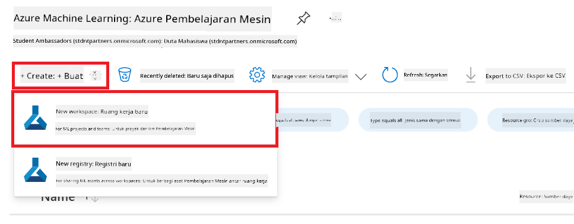

4. Lakukan tugas berikut:

    - Pilih **Subscription** Azure Anda.
    - Pilih **Resource group** yang akan digunakan (buat yang baru jika perlu).
    - Masukkan **Workspace Name**. Harus berupa nilai unik.
    - Pilih **Region** yang ingin Anda gunakan.
    - Pilih **Storage account** yang akan digunakan (buat yang baru jika perlu).
    - Pilih **Key vault** yang akan digunakan (buat yang baru jika perlu).
    - Pilih **Application insights** yang akan digunakan (buat yang baru jika perlu).
    - Pilih **Container registry** yang akan digunakan (buat yang baru jika perlu).

    

5. Pilih **Review + Create**.

6. Pilih **Create**.

### Meminta kuota GPU dalam Azure Subscription

Dalam tutorial ini, Anda akan belajar cara menyesuaikan dan menyebarkan model Phi-3, menggunakan GPU. Untuk penyesuaian, Anda akan menggunakan GPU *Standard_NC24ads_A100_v4*, yang memerlukan permintaan kuota. Untuk penyebaran, Anda akan menggunakan GPU *Standard_NC6s_v3*, yang juga memerlukan permintaan kuota.

> [!NOTE]
>
> Hanya langganan Pay-As-You-Go (jenis langganan standar) yang memenuhi syarat untuk alokasi GPU; langganan benefit saat ini tidak didukung.
>

1. Kunjungi [Azure ML Studio](https://ml.azure.com/home?wt.mc_id=studentamb_279723).

1. Lakukan langkah berikut untuk meminta kuota *Standard NCADSA100v4 Family*:

    - Pilih **Quota** dari tab sebelah kiri.
    - Pilih **Virtual machine family** yang akan digunakan. Contohnya, pilih **Standard NCADSA100v4 Family Cluster Dedicated vCPUs**, yang mencakup GPU *Standard_NC24ads_A100_v4*.
    - Pilih **Request quota** dari menu navigasi.

        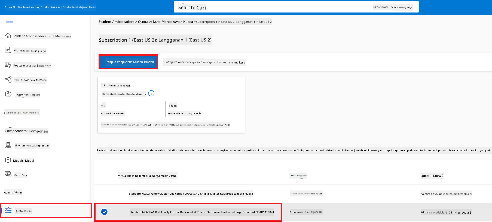

    - Di halaman Request quota, masukkan **New cores limit** yang ingin Anda gunakan. Contohnya, 24.
    - Di halaman Request quota, pilih **Submit** untuk mengirim permintaan kuota GPU.

1. Lakukan langkah berikut untuk meminta kuota *Standard NCSv3 Family*:

    - Pilih **Quota** dari tab sebelah kiri.
    - Pilih **Virtual machine family** yang akan digunakan. Contohnya, pilih **Standard NCSv3 Family Cluster Dedicated vCPUs**, yang mencakup GPU *Standard_NC6s_v3*.
    - Pilih **Request quota** dari menu navigasi.
    - Di halaman Request quota, masukkan **New cores limit** yang ingin Anda gunakan. Contohnya, 24.
    - Di halaman Request quota, pilih **Submit** untuk mengirim permintaan kuota GPU.

### Menambahkan penugasan peran

Untuk menyesuaikan dan menyebarkan model Anda, Anda harus terlebih dahulu membuat Identitas Terkelola yang Ditugaskan Pengguna (User Assigned Managed Identity, UAI) dan memberikannya izin yang sesuai. UAI ini akan digunakan untuk autentikasi selama penyebaran.

#### Membuat User Assigned Managed Identity (UAI)

1. Ketik *managed identities* di **bar pencarian** di bagian atas halaman portal dan pilih **Managed Identities** dari opsi yang muncul.

    

1. Pilih **+ Create**.

    

1. Lakukan tugas berikut:

    - Pilih **Subscription** Azure Anda.
    - Pilih **Resource group** yang akan digunakan (buat yang baru jika perlu).
    - Pilih **Region** yang ingin Anda gunakan.
    - Masukkan **Name**. Harus berupa nilai unik.

    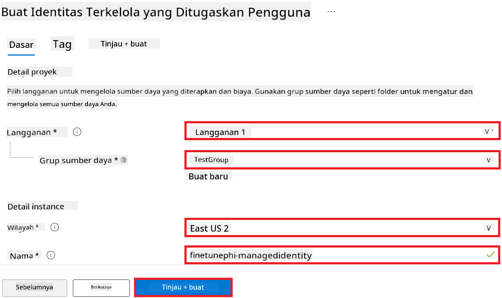

1. Pilih **Review + create**.

1. Pilih **+ Create**.

#### Menambahkan penugasan peran Contributor ke Managed Identity

1. Navigasikan ke sumber daya Managed Identity yang Anda buat.

1. Pilih **Azure role assignments** dari tab sebelah kiri.

1. Pilih **+Add role assignment** dari menu navigasi.

1. Di halaman Add role assignment, lakukan tugas berikut:
    - Pilih **Scope** ke **Resource group**.
    - Pilih **Subscription** Azure Anda.
    - Pilih **Resource group** yang akan digunakan.
    - Pilih **Role** ke **Contributor**.

    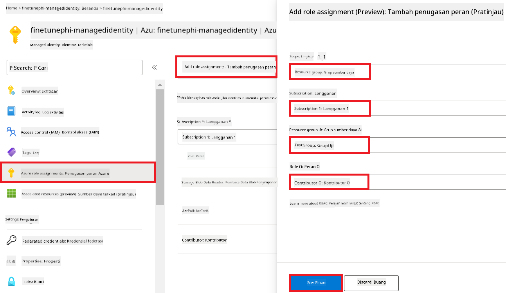

2. Pilih **Save**.

#### Menambahkan penugasan peran Storage Blob Data Reader ke Managed Identity

1. Ketik *storage accounts* di **bar pencarian** di bagian atas halaman portal dan pilih **Storage accounts** dari opsi yang muncul.

    

1. Pilih storage account yang terkait dengan Azure Machine Learning workspace yang Anda buat. Contohnya, *finetunephistorage*.

1. Lakukan tugas berikut untuk menavigasi ke halaman Add role assignment:

    - Navigasikan ke akun Azure Storage yang Anda buat.
    - Pilih **Access Control (IAM)** dari tab sebelah kiri.
    - Pilih **+ Add** dari menu navigasi.
    - Pilih **Add role assignment** dari menu navigasi.

    

1. Di halaman Add role assignment, lakukan tugas berikut:

    - Di halaman Role, ketik *Storage Blob Data Reader* di **bar pencarian** dan pilih **Storage Blob Data Reader** dari opsi yang muncul.
    - Di halaman Role, pilih **Next**.
    - Di halaman Members, pilih **Assign access to** **Managed identity**.
    - Di halaman Members, pilih **+ Select members**.
    - Di halaman Select managed identities, pilih **Subscription** Azure Anda.
    - Di halaman Select managed identities, pilih **Managed identity** ke **Manage Identity**.
    - Di halaman Select managed identities, pilih Manage Identity yang Anda buat. Contohnya, *finetunephi-managedidentity*.
    - Di halaman Select managed identities, pilih **Select**.

    

1. Pilih **Review + assign**.

#### Menambahkan penugasan peran AcrPull ke Managed Identity

1. Ketik *container registries* di **bar pencarian** di bagian atas halaman portal dan pilih **Container registries** dari opsi yang muncul.

    

1. Pilih container registry yang terkait dengan Azure Machine Learning workspace. Contohnya, *finetunephicontainerregistry*

1. Lakukan tugas berikut untuk menavigasi ke halaman Add role assignment:

    - Pilih **Access Control (IAM)** dari tab sebelah kiri.
    - Pilih **+ Add** dari menu navigasi.
    - Pilih **Add role assignment** dari menu navigasi.

1. Di halaman Add role assignment, lakukan tugas berikut:

    - Di halaman Role, ketik *AcrPull* di **bar pencarian** dan pilih **AcrPull** dari opsi yang muncul.
    - Di halaman Role, pilih **Next**.
    - Di halaman Members, pilih **Assign access to** **Managed identity**.
    - Di halaman Members, pilih **+ Select members**.
    - Di halaman Select managed identities, pilih **Subscription** Azure Anda.
    - Di halaman Select managed identities, pilih **Managed identity** ke **Manage Identity**.
    - Di halaman Select managed identities, pilih Manage Identity yang Anda buat. Contohnya, *finetunephi-managedidentity*.
    - Di halaman Select managed identities, pilih **Select**.
    - Pilih **Review + assign**.

### Menyiapkan proyek

Untuk mengunduh dataset yang dibutuhkan untuk penyesuaian, Anda akan menyiapkan lingkungan lokal.

Dalam latihan ini, Anda akan

- Membuat folder untuk bekerja di dalamnya.
- Membuat lingkungan virtual.
- Menginstal paket yang diperlukan.
- Membuat file *download_dataset.py* untuk mengunduh dataset.

#### Membuat folder untuk bekerja di dalamnya

1. Buka jendela terminal dan ketik perintah berikut untuk membuat folder bernama *finetune-phi* di jalur default.

    ```console
    mkdir finetune-phi
    ```

2. Ketik perintah berikut di terminal Anda untuk menavigasi ke folder *finetune-phi* yang telah Anda buat.

    ```console
    cd finetune-phi
    ```

#### Buat lingkungan virtual

1. Ketik perintah berikut di terminal Anda untuk membuat lingkungan virtual bernama *.venv*.

    ```console
    python -m venv .venv
    ```

2. Ketik perintah berikut di terminal Anda untuk mengaktifkan lingkungan virtual.

    ```console
    .venv\Scripts\activate.bat
    ```

> [!NOTE]
> Jika berhasil, Anda harus melihat *(.venv)* sebelum prompt perintah.

#### Instal paket yang diperlukan

1. Ketik perintah berikut di terminal Anda untuk menginstal paket yang diperlukan.

    ```console
    pip install datasets==2.19.1
    ```

#### Buat `donload_dataset.py`

> [!NOTE]
> Struktur folder lengkap:
>
> ```text
> └── YourUserName
> .    └── finetune-phi
> .        └── download_dataset.py
> ```

1. Buka **Visual Studio Code**.

1. Pilih **File** dari menu bar.

1. Pilih **Open Folder**.

1. Pilih folder *finetune-phi* yang telah Anda buat, yang terletak di *C:\Users\yourUserName\finetune-phi*.

    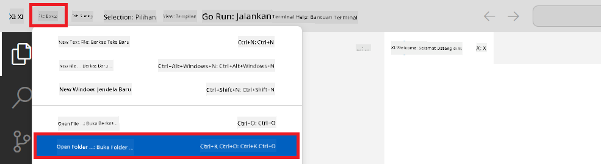

1. Di panel kiri Visual Studio Code, klik kanan dan pilih **New File** untuk membuat file baru bernama *download_dataset.py*.

    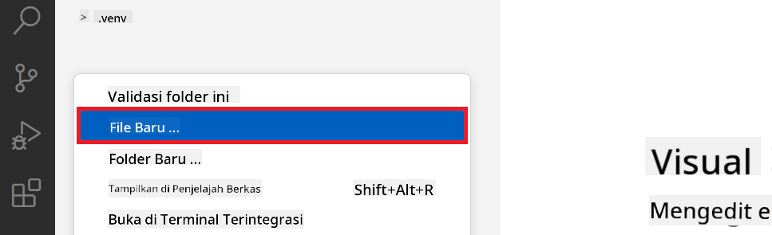

### Persiapkan dataset untuk fine-tuning

Dalam latihan ini, Anda akan menjalankan file *download_dataset.py* untuk mengunduh dataset *ultrachat_200k* ke lingkungan lokal Anda. Kemudian Anda akan menggunakan dataset ini untuk melakukan fine-tune model Phi-3 di Azure Machine Learning.

Dalam latihan ini, Anda akan:

- Menambahkan kode ke file *download_dataset.py* untuk mengunduh dataset.
- Menjalankan file *download_dataset.py* untuk mengunduh dataset ke lingkungan lokal Anda.

#### Unduh dataset Anda menggunakan *download_dataset.py*

1. Buka file *download_dataset.py* di Visual Studio Code.

1. Tambahkan kode berikut ke file *download_dataset.py*.

    ```python
    import json
    import os
    from datasets import load_dataset

    def load_and_split_dataset(dataset_name, config_name, split_ratio):
        """
        Load and split a dataset.
        """
        # Muat dataset dengan nama, konfigurasi, dan rasio pembagian yang ditentukan
        dataset = load_dataset(dataset_name, config_name, split=split_ratio)
        print(f"Original dataset size: {len(dataset)}")
        
        # Pisahkan dataset menjadi set pelatihan dan pengujian (80% pelatihan, 20% pengujian)
        split_dataset = dataset.train_test_split(test_size=0.2)
        print(f"Train dataset size: {len(split_dataset['train'])}")
        print(f"Test dataset size: {len(split_dataset['test'])}")
        
        return split_dataset

    def save_dataset_to_jsonl(dataset, filepath):
        """
        Save a dataset to a JSONL file.
        """
        # Buat direktori jika belum ada
        os.makedirs(os.path.dirname(filepath), exist_ok=True)
        
        # Buka file dalam mode tulis
        with open(filepath, 'w', encoding='utf-8') as f:
            # Iterasi setiap rekaman dalam dataset
            for record in dataset:
                # Dump rekaman sebagai objek JSON dan tulis ke file
                json.dump(record, f)
                # Tulis karakter baris baru untuk memisahkan rekaman
                f.write('\n')
        
        print(f"Dataset saved to {filepath}")

    def main():
        """
        Main function to load, split, and save the dataset.
        """
        # Muat dan pisahkan dataset ULTRACHAT_200k dengan konfigurasi dan rasio pembagian tertentu
        dataset = load_and_split_dataset("HuggingFaceH4/ultrachat_200k", 'default', 'train_sft[:1%]')
        
        # Ekstrak dataset pelatihan dan pengujian dari pembagian
        train_dataset = dataset['train']
        test_dataset = dataset['test']

        # Simpan dataset pelatihan ke file JSONL
        save_dataset_to_jsonl(train_dataset, "data/train_data.jsonl")
        
        # Simpan dataset pengujian ke file JSONL terpisah
        save_dataset_to_jsonl(test_dataset, "data/test_data.jsonl")

    if __name__ == "__main__":
        main()

    ```

1. Ketik perintah berikut di terminal Anda untuk menjalankan skrip dan mengunduh dataset ke lingkungan lokal Anda.

    ```console
    python download_dataset.py
    ```

1. Verifikasi bahwa dataset berhasil disimpan di direktori lokal *finetune-phi/data* Anda.

> [!NOTE]
>
> #### Catatan tentang ukuran dataset dan waktu fine-tuning
>
> Dalam tutorial ini, Anda hanya menggunakan 1% dari dataset (`split='train[:1%]'`). Ini secara signifikan mengurangi jumlah data, mempercepat proses pengunggahan dan fine-tuning. Anda dapat menyesuaikan persentase untuk menemukan keseimbangan antara waktu pelatihan dan performa model. Menggunakan subset dataset yang lebih kecil mengurangi waktu yang dibutuhkan untuk fine-tuning, sehingga proses menjadi lebih mudah dikelola dalam tutorial ini.

## Skenario 2: Fine-tune model Phi-3 dan Deploy di Azure Machine Learning Studio

### Fine-tune model Phi-3

Dalam latihan ini, Anda akan melakukan fine-tune model Phi-3 di Azure Machine Learning Studio.

Dalam latihan ini, Anda akan:

- Membuat klaster komputer untuk fine-tuning.
- Melakukan fine-tune model Phi-3 di Azure Machine Learning Studio.

#### Buat klaster komputer untuk fine-tuning

1. Kunjungi [Azure ML Studio](https://ml.azure.com/home?wt.mc_id=studentamb_279723).

1. Pilih **Compute** dari tab sisi kiri.

1. Pilih **Compute clusters** dari menu navigasi.

1. Pilih **+ New**.

    

1. Lakukan tugas berikut:

    - Pilih **Region** yang ingin Anda gunakan.
    - Pilih **Virtual machine tier** menjadi **Dedicated**.
    - Pilih **Virtual machine type** menjadi **GPU**.
    - Pilih filter **Virtual machine size** ke **Select from all options**.
    - Pilih **Virtual machine size** menjadi **Standard_NC24ads_A100_v4**.

    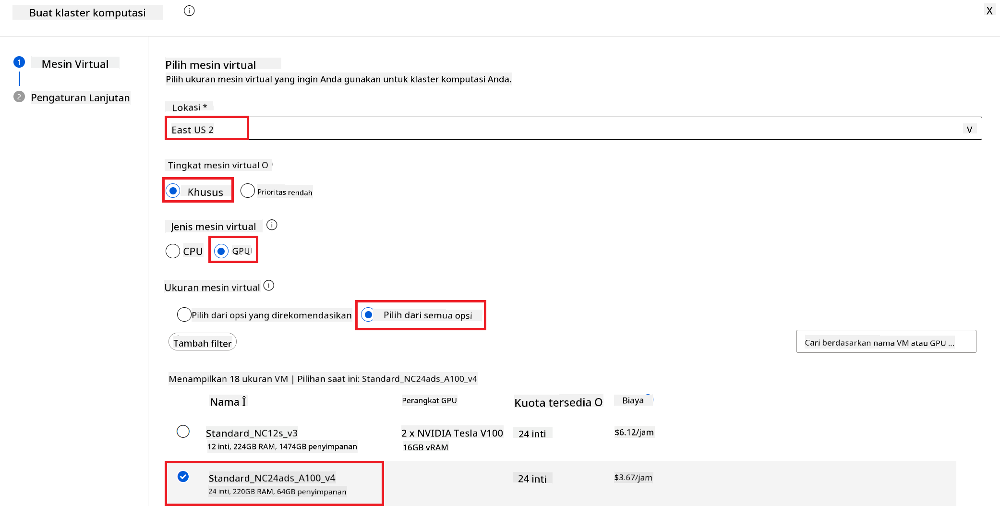

1. Pilih **Next**.

1. Lakukan tugas berikut:

    - Masukkan **Compute name**. Harus unik.
    - Pilih **Minimum number of nodes** menjadi **0**.
    - Pilih **Maximum number of nodes** menjadi **1**.
    - Pilih **Idle seconds before scale down** menjadi **120**.

    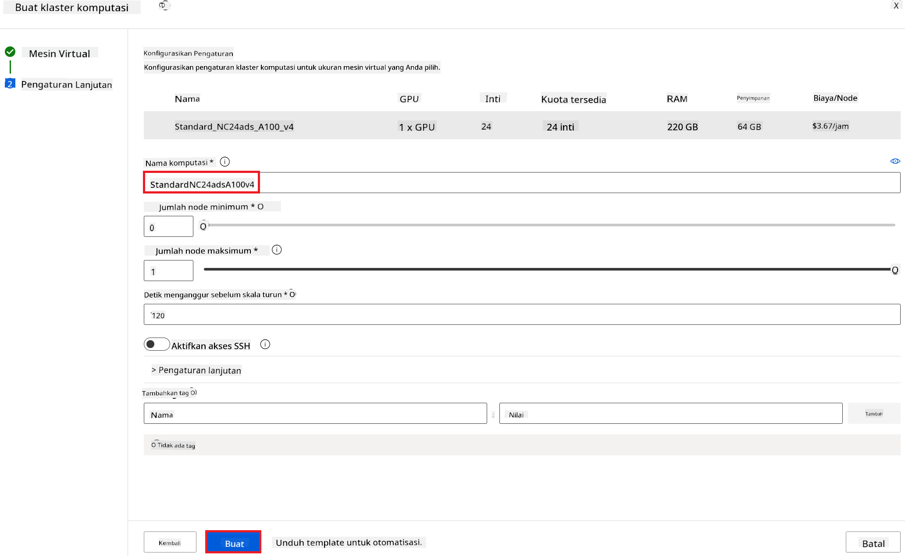

1. Pilih **Create**.

#### Fine-tune model Phi-3

1. Kunjungi [Azure ML Studio](https://ml.azure.com/home?wt.mc_id=studentamb_279723).

1. Pilih workspace Azure Machine Learning yang telah Anda buat.

    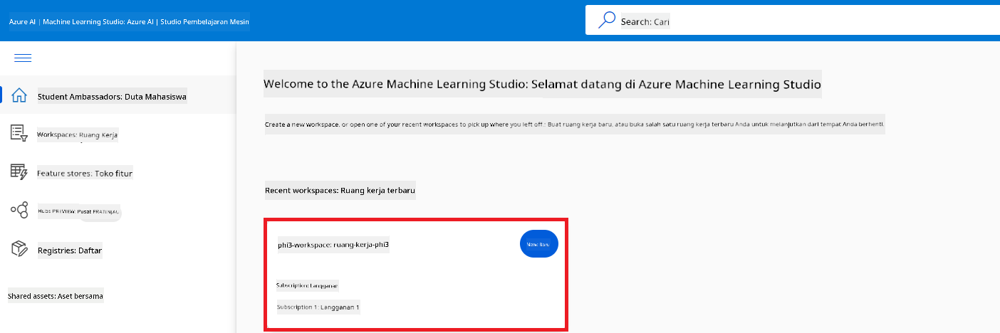

1. Lakukan tugas berikut:

    - Pilih **Model catalog** dari tab sisi kiri.
    - Ketik *phi-3-mini-4k* di **search bar** dan pilih **Phi-3-mini-4k-instruct** dari opsi yang muncul.

    

1. Pilih **Fine-tune** dari menu navigasi.

    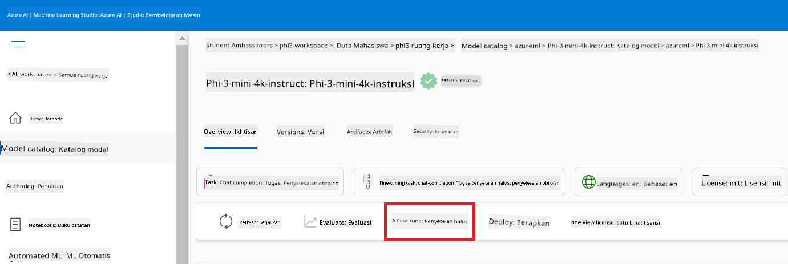

1. Lakukan tugas berikut:

    - Pilih **Select task type** menjadi **Chat completion**.
    - Pilih **+ Select data** untuk mengunggah **Traning data**.
    - Pilih tipe unggahan Validation data ke **Provide different validation data**.
    - Pilih **+ Select data** untuk mengunggah **Validation data**.

    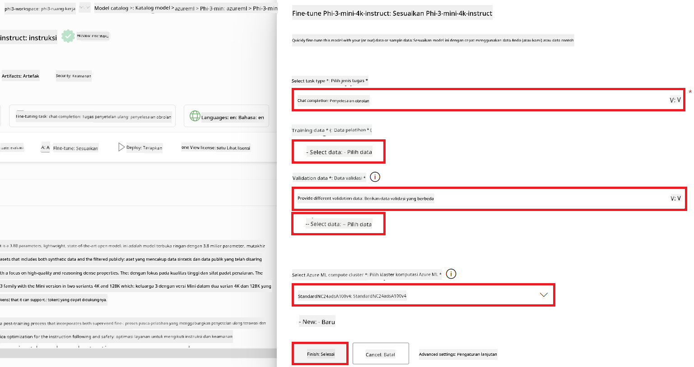

> [!TIP]
>
> Anda dapat memilih **Advanced settings** untuk menyesuaikan konfigurasi seperti **learning_rate** dan **lr_scheduler_type** guna mengoptimalkan proses fine-tuning sesuai kebutuhan Anda.

1. Pilih **Finish**.

1. Dalam latihan ini, Anda berhasil melakukan fine-tune model Phi-3 menggunakan Azure Machine Learning. Harap dicatat bahwa proses fine-tuning bisa memakan waktu cukup lama. Setelah menjalankan pekerjaan fine-tuning, Anda perlu menunggu hingga selesai. Anda dapat memantau status pekerjaan fine-tuning dengan membuka tab Jobs di sisi kiri Workspace Azure Machine Learning Anda. Dalam seri berikutnya, Anda akan melakukan deploy model yang telah di-fine-tune dan mengintegrasikannya dengan Prompt flow.

    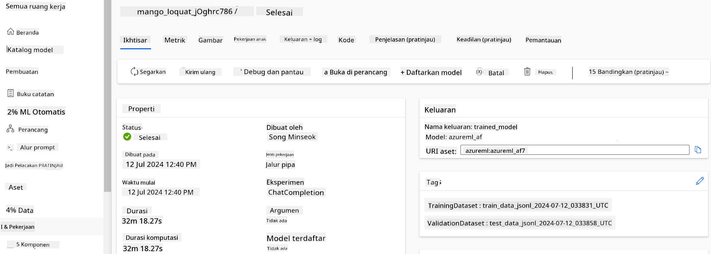

### Deploy model Phi-3 yang telah di-fine-tune

Untuk mengintegrasikan model Phi-3 yang telah di-fine-tune dengan Prompt flow, Anda perlu melakukan deploy model agar dapat diakses untuk inferensi waktu nyata. Proses ini meliputi mendaftarkan model, membuat endpoint online, dan melakukan deploy model.

Dalam latihan ini, Anda akan:

- Mendaftarkan model yang telah di-fine-tune di workspace Azure Machine Learning.
- Membuat endpoint online.
- Melakukan deploy model Phi-3 yang telah didaftarkan dan di-fine-tune.

#### Daftarkan model yang telah di-fine-tune

1. Kunjungi [Azure ML Studio](https://ml.azure.com/home?wt.mc_id=studentamb_279723).

1. Pilih workspace Azure Machine Learning yang telah Anda buat.

    

1. Pilih **Models** dari tab sisi kiri.
1. Pilih **+ Register**.
1. Pilih **From a job output**.

    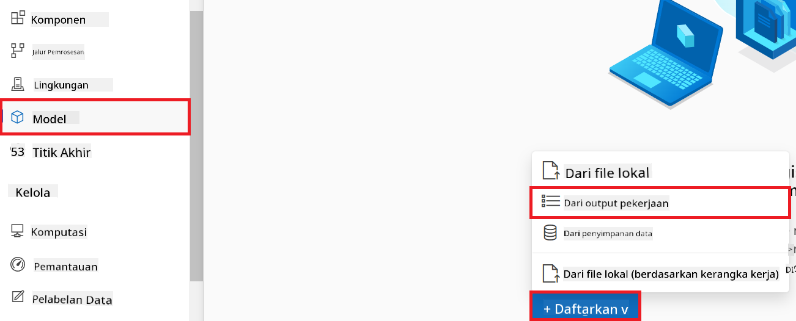

1. Pilih pekerjaan yang telah Anda buat.

    

1. Pilih **Next**.

1. Pilih **Model type** menjadi **MLflow**.

1. Pastikan **Job output** dipilih; ini akan terpilih secara otomatis.

    

2. Pilih **Next**.

3. Pilih **Register**.

    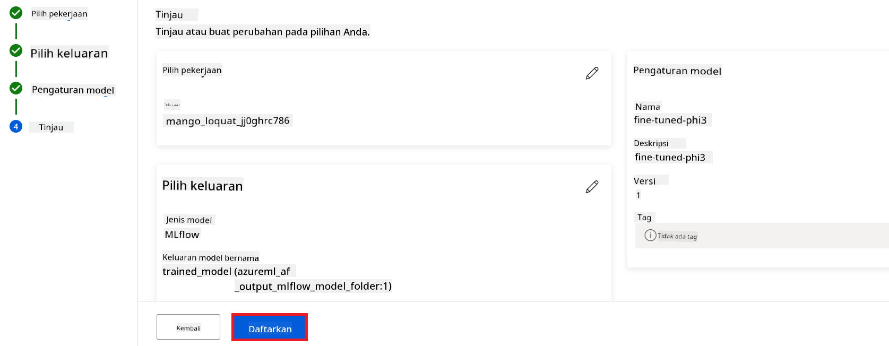

4. Anda dapat melihat model yang terdaftar dengan menavigasi ke menu **Models** dari tab sisi kiri.

    

#### Deploy model yang telah di-fine-tune

1. Navigasi ke workspace Azure Machine Learning yang telah Anda buat.

1. Pilih **Endpoints** dari tab sisi kiri.

1. Pilih **Real-time endpoints** dari menu navigasi.

    

1. Pilih **Create**.

1. Pilih model yang telah Anda daftarkan.

    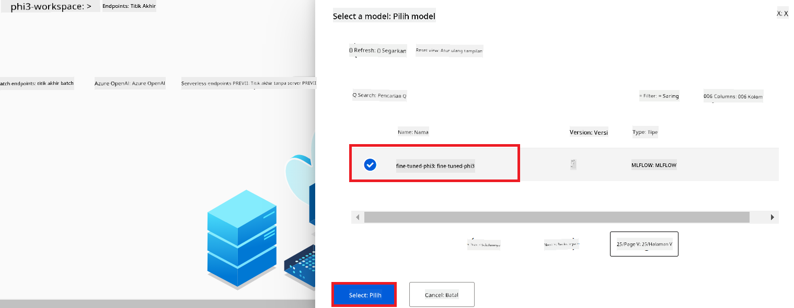

1. Pilih **Select**.

1. Lakukan tugas berikut:

    - Pilih **Virtual machine** menjadi *Standard_NC6s_v3*.
    - Pilih **Instance count** yang ingin Anda gunakan. Misalnya, *1*.
    - Pilih **Endpoint** menjadi **New** untuk membuat endpoint baru.
    - Masukkan **Endpoint name**. Harus unik.
    - Masukkan **Deployment name**. Harus unik.

    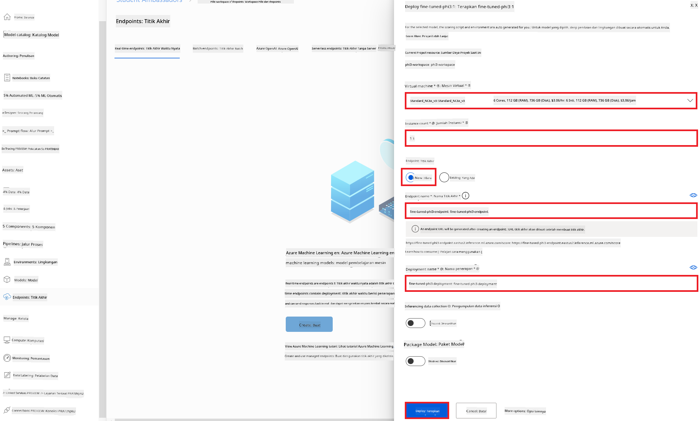

1. Pilih **Deploy**.

> [!WARNING]
> Untuk menghindari biaya tambahan pada akun Anda, pastikan untuk menghapus endpoint yang telah dibuat di workspace Azure Machine Learning.
>

#### Periksa status deployment di Azure Machine Learning Workspace

1. Navigasi ke workspace Azure Machine Learning yang telah Anda buat.

1. Pilih **Endpoints** dari tab sisi kiri.

1. Pilih endpoint yang telah Anda buat.

    

1. Pada halaman ini, Anda dapat mengelola endpoints selama proses deployment.

> [!NOTE]
> Setelah deployment selesai, pastikan **Live traffic** diatur ke **100%**. Jika belum, pilih **Update traffic** untuk menyesuaikan pengaturan lalu lintas. Perlu dicatat bahwa Anda tidak dapat menguji model jika lalu lintas diatur ke 0%.
>
> 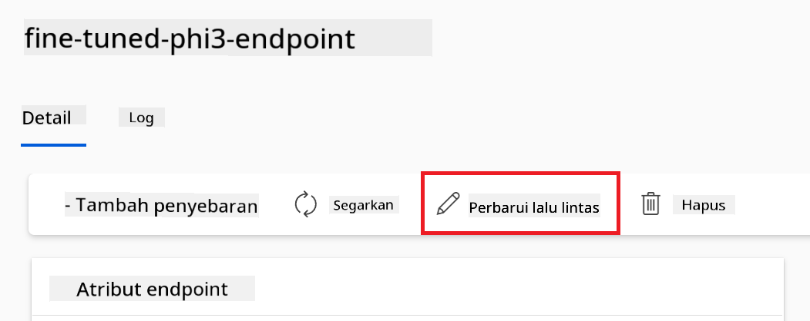
>

## Skenario 3: Integrasi dengan Prompt flow dan Mengobrol dengan model kustom Anda di Azure AI Foundry

### Integrasi model Phi-3 kustom dengan Prompt flow

Setelah berhasil melakukan deploy model yang telah di-fine-tune, sekarang Anda dapat mengintegrasikannya dengan Prompt Flow untuk menggunakan model Anda dalam aplikasi waktu nyata, memungkinkan berbagai tugas interaktif dengan model Phi-3 kustom Anda.

Dalam latihan ini, Anda akan:

- Membuat Azure AI Foundry Hub.
- Membuat Proyek Azure AI Foundry.
- Membuat Prompt flow.
- Menambahkan koneksi kustom untuk model Phi-3 yang telah di-fine-tune.
- Mengatur Prompt flow untuk mengobrol dengan model Phi-3 kustom Anda.

> [!NOTE]
> Anda juga dapat mengintegrasikan dengan Promptflow menggunakan Azure ML Studio. Proses integrasi yang sama dapat diterapkan ke Azure ML Studio.

#### Buat Azure AI Foundry Hub

Anda perlu membuat Hub sebelum membuat Proyek. Hub berfungsi seperti Resource Group, memungkinkan Anda mengorganisir dan mengelola beberapa Proyek dalam Azure AI Foundry.

1. Kunjungi [Azure AI Foundry](https://ai.azure.com/?WT.mc_id=aiml-137032-kinfeylo).

1. Pilih **All hubs** dari tab sisi kiri.

1. Pilih **+ New hub** dari menu navigasi.
    

1. Lakukan tugas-tugas berikut:

    - Masukkan **Nama Hub**. Ini harus berupa nilai unik.
    - Pilih **Subscription** Azure Anda.
    - Pilih **Resource group** yang akan digunakan (buat yang baru jika diperlukan).
    - Pilih **Location** yang ingin Anda gunakan.
    - Pilih **Connect Azure AI Services** yang akan digunakan (buat yang baru jika diperlukan).
    - Pilih **Connect Azure AI Search** ke **Skip connecting**.

    

1. Pilih **Next**.

#### Buat Proyek Azure AI Foundry

1. Di Hub yang Anda buat, pilih **All projects** dari tab sisi kiri.

1. Pilih **+ New project** dari menu navigasi.

    

1. Masukkan **Nama Proyek**. Ini harus berupa nilai unik.

    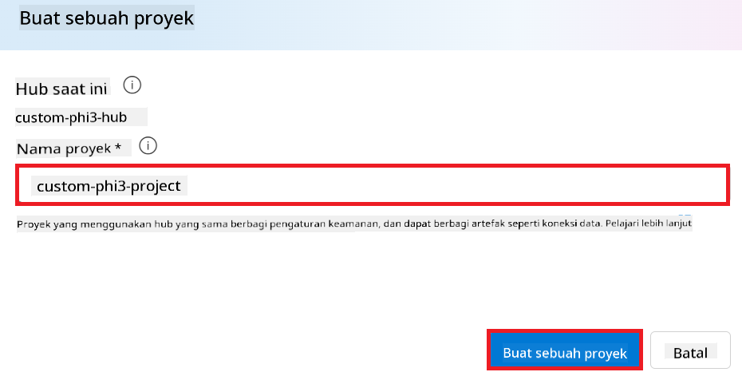

1. Pilih **Create a project**.

#### Tambahkan koneksi kustom untuk model Phi-3 yang di-fine-tune

Untuk mengintegrasikan model Phi-3 kustom Anda dengan Prompt flow, Anda perlu menyimpan endpoint dan kunci model tersebut dalam koneksi kustom. Pengaturan ini memastikan akses ke model Phi-3 kustom Anda di Prompt flow.

#### Atur kunci api dan URI endpoint dari model Phi-3 yang di-fine-tune

1. Kunjungi [Azure ML Studio](https://ml.azure.com/home?WT.mc_id=aiml-137032-kinfeylo).

1. Navigasikan ke workspace Azure Machine learning yang Anda buat.

1. Pilih **Endpoints** dari tab sisi kiri.

    

1. Pilih endpoint yang Anda buat.

    

1. Pilih **Consume** dari menu navigasi.

1. Salin **REST endpoint** dan **Primary key** Anda.

    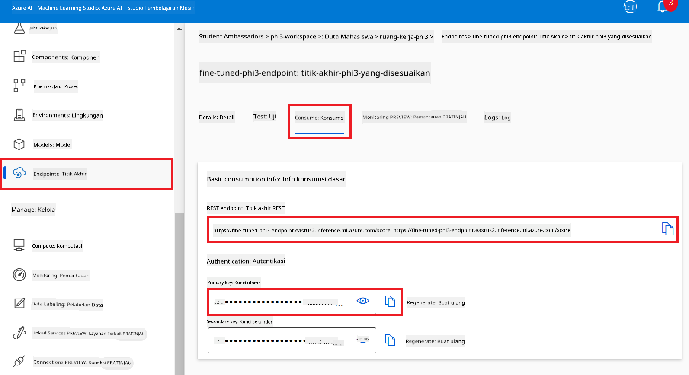

#### Tambahkan Koneksi Kustom

1. Kunjungi [Azure AI Foundry](https://ai.azure.com/?WT.mc_id=aiml-137032-kinfeylo).

1. Navigasikan ke proyek Azure AI Foundry yang Anda buat.

1. Dalam proyek yang Anda buat, pilih **Settings** dari tab sisi kiri.

1. Pilih **+ New connection**.

    

1. Pilih **Custom keys** dari menu navigasi.

    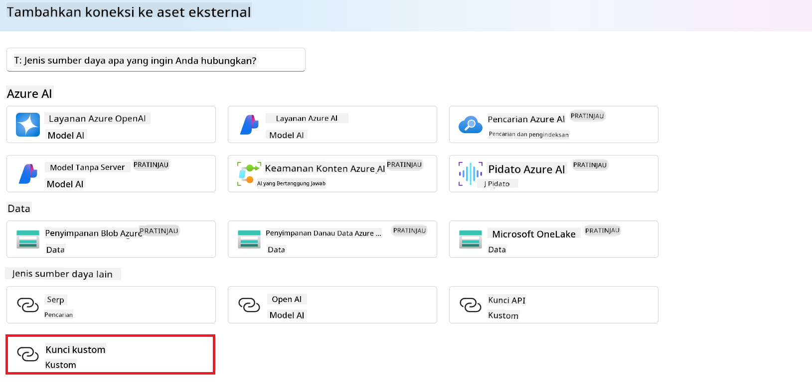

1. Lakukan tugas-tugas berikut:

    - Pilih **+ Add key value pairs**.
    - Untuk nama kunci, masukkan **endpoint** dan tempel endpoint yang Anda salin dari Azure ML Studio ke dalam bidang nilai.
    - Pilih lagi **+ Add key value pairs**.
    - Untuk nama kunci, masukkan **key** dan tempel kunci yang Anda salin dari Azure ML Studio ke dalam bidang nilai.
    - Setelah menambahkan kunci, pilih **is secret** untuk mencegah kunci terekspos.

    

1. Pilih **Add connection**.

#### Buat Prompt flow

Anda telah menambahkan koneksi kustom di Azure AI Foundry. Sekarang, mari buat Prompt flow dengan langkah-langkah berikut. Kemudian, Anda akan menghubungkan Prompt flow ini ke koneksi kustom agar Anda dapat menggunakan model yang di-fine-tune dalam Prompt flow.

1. Navigasikan ke proyek Azure AI Foundry yang Anda buat.

1. Pilih **Prompt flow** dari tab sisi kiri.

1. Pilih **+ Create** dari menu navigasi.

    

1. Pilih **Chat flow** dari menu navigasi.

    

1. Masukkan **Nama Folder** yang akan digunakan.

    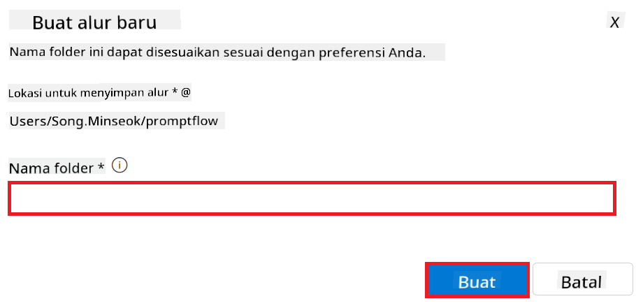

2. Pilih **Create**.

#### Atur Prompt flow untuk mengobrol dengan model Phi-3 kustom Anda

Anda perlu mengintegrasikan model Phi-3 yang di-fine-tune ke dalam Prompt flow. Namun, Prompt flow yang ada tidak dirancang untuk tujuan ini. Oleh karena itu, Anda harus mendesain ulang Prompt flow agar memungkinkan integrasi model kustom tersebut.

1. Dalam Prompt flow, lakukan tugas-tugas berikut untuk membangun ulang flow yang ada:

    - Pilih **Raw file mode**.
    - Hapus semua kode yang ada dalam file *flow.dag.yml*.
    - Tambahkan kode berikut ke file *flow.dag.yml*.

        ```yml
        inputs:
          input_data:
            type: string
            default: "Who founded Microsoft?"

        outputs:
          answer:
            type: string
            reference: ${integrate_with_promptflow.output}

        nodes:
        - name: integrate_with_promptflow
          type: python
          source:
            type: code
            path: integrate_with_promptflow.py
          inputs:
            input_data: ${inputs.input_data}
        ```

    - Pilih **Save**.

    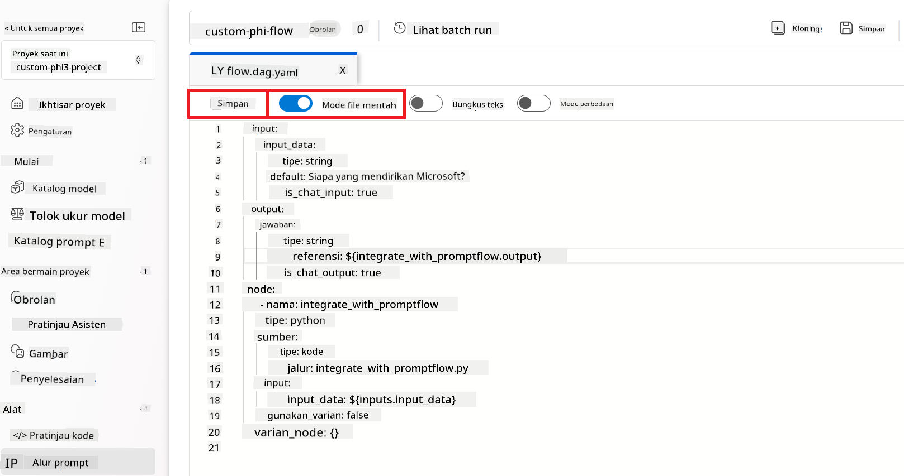

1. Tambahkan kode berikut ke file *integrate_with_promptflow.py* untuk menggunakan model Phi-3 kustom di Prompt flow.

    ```python
    import logging
    import requests
    from promptflow import tool
    from promptflow.connections import CustomConnection

    # Pengaturan logging
    logging.basicConfig(
        format="%(asctime)s - %(levelname)s - %(name)s - %(message)s",
        datefmt="%Y-%m-%d %H:%M:%S",
        level=logging.DEBUG
    )
    logger = logging.getLogger(__name__)

    def query_phi3_model(input_data: str, connection: CustomConnection) -> str:
        """
        Send a request to the Phi-3 model endpoint with the given input data using Custom Connection.
        """

        # "connection" adalah nama Koneksi Kustom, "endpoint", "key" adalah kunci dalam Koneksi Kustom
        endpoint_url = connection.endpoint
        api_key = connection.key

        headers = {
            "Content-Type": "application/json",
            "Authorization": f"Bearer {api_key}"
        }
        data = {
            "input_data": {
                "input_string": [
                    {"role": "user", "content": input_data}
                ],
                "parameters": {
                    "temperature": 0.7,
                    "max_new_tokens": 128
                }
            }
        }
        try:
            response = requests.post(endpoint_url, json=data, headers=headers)
            response.raise_for_status()
            
            # Log respons JSON lengkap
            logger.debug(f"Full JSON response: {response.json()}")

            result = response.json()["output"]
            logger.info("Successfully received response from Azure ML Endpoint.")
            return result
        except requests.exceptions.RequestException as e:
            logger.error(f"Error querying Azure ML Endpoint: {e}")
            raise

    @tool
    def my_python_tool(input_data: str, connection: CustomConnection) -> str:
        """
        Tool function to process input data and query the Phi-3 model.
        """
        return query_phi3_model(input_data, connection)

    ```

    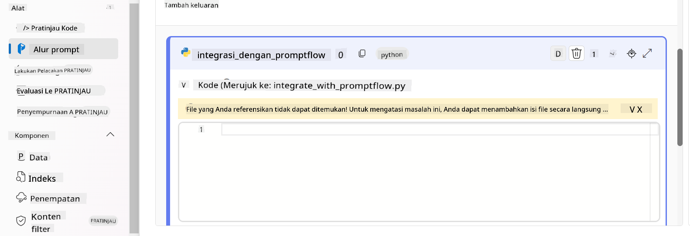

> [!NOTE]
> Untuk informasi lebih rinci mengenai penggunaan Prompt flow di Azure AI Foundry, Anda dapat merujuk ke [Prompt flow di Azure AI Foundry](https://learn.microsoft.com/azure/ai-studio/how-to/prompt-flow).

1. Pilih **Chat input**, **Chat output** untuk mengaktifkan chat dengan model Anda.

    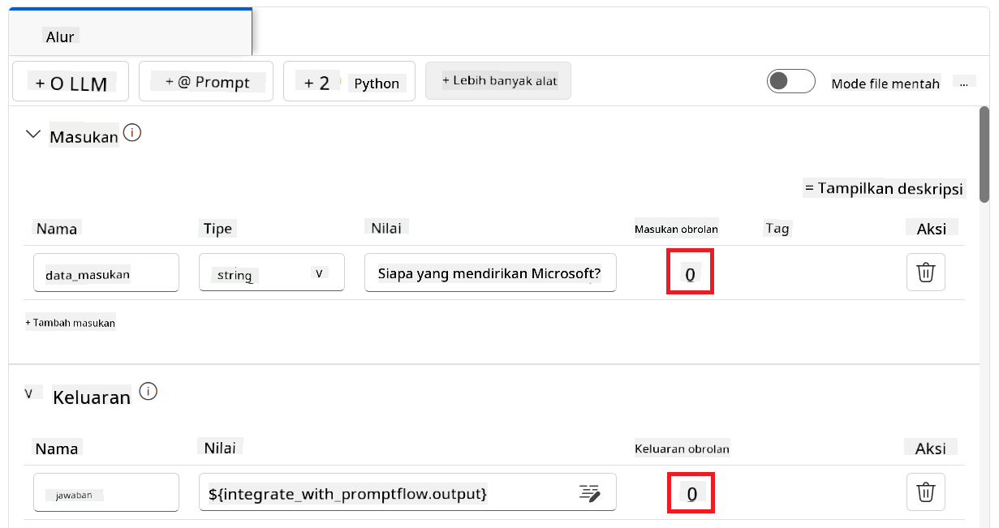

1. Sekarang Anda siap untuk mengobrol dengan model Phi-3 kustom Anda. Pada latihan berikutnya, Anda akan mempelajari cara memulai Prompt flow dan menggunakannya untuk mengobrol dengan model Phi-3 yang telah di-fine-tune.

> [!NOTE]
>
> Flow yang dibangun ulang harus terlihat seperti gambar berikut:
>
> 
>

### Mengobrol dengan model Phi-3 kustom Anda

Sekarang setelah Anda melakukan fine-tuning dan mengintegrasikan model Phi-3 kustom dengan Prompt flow, Anda siap untuk mulai berinteraksi dengannya. Latihan ini akan memandu Anda melalui proses penyiapan dan memulai chat dengan model menggunakan Prompt flow. Dengan mengikuti langkah-langkah ini, Anda akan dapat memanfaatkan sepenuhnya kemampuan model Phi-3 yang di-fine-tune untuk berbagai tugas dan percakapan.

- Mengobrol dengan model Phi-3 kustom Anda menggunakan Prompt flow.

#### Mulai Prompt flow

1. Pilih **Start compute sessions** untuk memulai Prompt flow.

    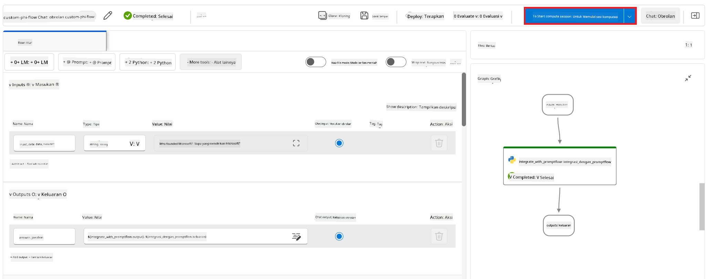

1. Pilih **Validate and parse input** untuk memperbarui parameter.

    

1. Pilih **Value** dari **connection** ke koneksi kustom yang Anda buat. Misalnya, *connection*.

    

#### Mengobrol dengan model kustom Anda

1. Pilih **Chat**.

    

1. Berikut adalah contoh hasilnya: Sekarang Anda dapat mengobrol dengan model Phi-3 kustom Anda. Disarankan untuk mengajukan pertanyaan berdasarkan data yang digunakan untuk fine-tuning.

    

---

<!-- CO-OP TRANSLATOR DISCLAIMER START -->
**Penafian**:
Dokumen ini telah diterjemahkan menggunakan layanan terjemahan AI [Co-op Translator](https://github.com/Azure/co-op-translator). Meskipun kami berusaha untuk akurasi, harap diketahui bahwa terjemahan otomatis mungkin mengandung kesalahan atau ketidakakuratan. Dokumen asli dalam bahasa aslinya harus dianggap sebagai sumber yang sah. Untuk informasi penting, disarankan menggunakan terjemahan profesional oleh manusia. Kami tidak bertanggung jawab atas kesalahpahaman atau salah interpretasi yang timbul dari penggunaan terjemahan ini.
<!-- CO-OP TRANSLATOR DISCLAIMER END -->