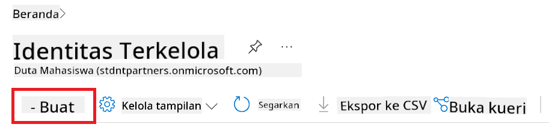
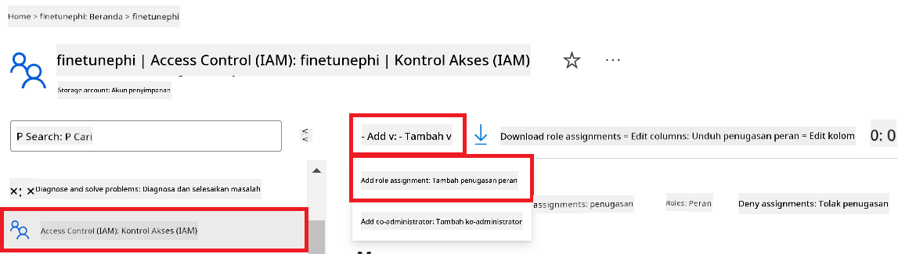
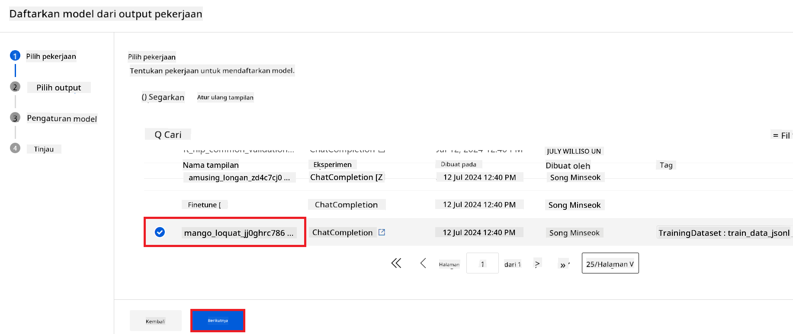
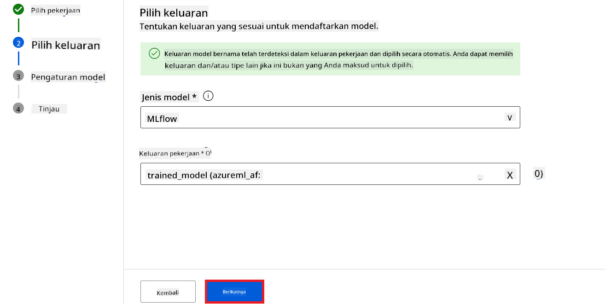

<!--
CO_OP_TRANSLATOR_METADATA:
{
  "original_hash": "ecbd9179a21edbaafaf114d47f09f3e3",
  "translation_date": "2025-05-09T18:16:40+00:00",
  "source_file": "md/02.Application/01.TextAndChat/Phi3/E2E_Phi-3-FineTuning_PromptFlow_Integration_AIFoundry.md",
  "language_code": "id"
}
-->
# Fine-tune dan Integrasikan model Phi-3 kustom dengan Prompt flow di Azure AI Foundry

Contoh end-to-end (E2E) ini berdasarkan panduan "[Fine-Tune and Integrate Custom Phi-3 Models with Prompt Flow in Azure AI Foundry](https://techcommunity.microsoft.com/t5/educator-developer-blog/fine-tune-and-integrate-custom-phi-3-models-with-prompt-flow-in/ba-p/4191726?WT.mc_id=aiml-137032-kinfeylo)" dari Microsoft Tech Community. Panduan ini memperkenalkan proses fine-tuning, deployment, dan integrasi model Phi-3 kustom dengan Prompt flow di Azure AI Foundry.  
Berbeda dengan contoh E2E, "[Fine-Tune and Integrate Custom Phi-3 Models with Prompt Flow](./E2E_Phi-3-FineTuning_PromptFlow_Integration.md)", yang melibatkan eksekusi kode secara lokal, tutorial ini sepenuhnya fokus pada fine-tuning dan integrasi model Anda dalam Azure AI / ML Studio.

## Ikhtisar

Dalam contoh E2E ini, Anda akan mempelajari cara melakukan fine-tuning model Phi-3 dan mengintegrasikannya dengan Prompt flow di Azure AI Foundry. Dengan memanfaatkan Azure AI / ML Studio, Anda akan membangun alur kerja untuk deployment dan penggunaan model AI kustom. Contoh E2E ini dibagi menjadi tiga skenario:

**Skenario 1: Menyiapkan sumber daya Azure dan Mempersiapkan fine-tuning**

**Skenario 2: Fine-tune model Phi-3 dan Deploy di Azure Machine Learning Studio**

**Skenario 3: Integrasi dengan Prompt flow dan Chat dengan model kustom Anda di Azure AI Foundry**

Berikut adalah gambaran umum dari contoh E2E ini.


### Daftar Isi

1. **[Skenario 1: Menyiapkan sumber daya Azure dan Mempersiapkan fine-tuning](../../../../../../md/02.Application/01.TextAndChat/Phi3)**
    - [Membuat Azure Machine Learning Workspace](../../../../../../md/02.Application/01.TextAndChat/Phi3)
    - [Meminta kuota GPU di Azure Subscription](../../../../../../md/02.Application/01.TextAndChat/Phi3)
    - [Menambahkan penugasan peran](../../../../../../md/02.Application/01.TextAndChat/Phi3)
    - [Menyiapkan proyek](../../../../../../md/02.Application/01.TextAndChat/Phi3)
    - [Mempersiapkan dataset untuk fine-tuning](../../../../../../md/02.Application/01.TextAndChat/Phi3)

1. **[Skenario 2: Fine-tune model Phi-3 dan Deploy di Azure Machine Learning Studio](../../../../../../md/02.Application/01.TextAndChat/Phi3)**
    - [Fine-tune model Phi-3](../../../../../../md/02.Application/01.TextAndChat/Phi3)
    - [Deploy model Phi-3 yang sudah di fine-tune](../../../../../../md/02.Application/01.TextAndChat/Phi3)

1. **[Skenario 3: Integrasi dengan Prompt flow dan Chat dengan model kustom Anda di Azure AI Foundry](../../../../../../md/02.Application/01.TextAndChat/Phi3)**
    - [Integrasikan model Phi-3 kustom dengan Prompt flow](../../../../../../md/02.Application/01.TextAndChat/Phi3)
    - [Chat dengan model Phi-3 kustom Anda](../../../../../../md/02.Application/01.TextAndChat/Phi3)

## Skenario 1: Menyiapkan sumber daya Azure dan Mempersiapkan fine-tuning

### Membuat Azure Machine Learning Workspace

1. Ketik *azure machine learning* di **bar pencarian** di bagian atas halaman portal dan pilih **Azure Machine Learning** dari opsi yang muncul.

    

2. Pilih **+ Create** dari menu navigasi.

3. Pilih **New workspace** dari menu navigasi.

    

4. Lakukan tugas berikut:

    - Pilih **Subscription** Azure Anda.
    - Pilih **Resource group** yang akan digunakan (buat yang baru jika perlu).
    - Masukkan **Workspace Name**. Harus bernilai unik.
    - Pilih **Region** yang ingin Anda gunakan.
    - Pilih **Storage account** yang akan digunakan (buat yang baru jika perlu).
    - Pilih **Key vault** yang akan digunakan (buat yang baru jika perlu).
    - Pilih **Application insights** yang akan digunakan (buat yang baru jika perlu).
    - Pilih **Container registry** yang akan digunakan (buat yang baru jika perlu).

    

5. Pilih **Review + Create**.

6. Pilih **Create**.

### Meminta kuota GPU di Azure Subscription

Dalam tutorial ini, Anda akan mempelajari cara melakukan fine-tuning dan deployment model Phi-3 menggunakan GPU. Untuk fine-tuning, Anda akan menggunakan GPU *Standard_NC24ads_A100_v4*, yang memerlukan permintaan kuota. Untuk deployment, Anda akan menggunakan GPU *Standard_NC6s_v3*, yang juga memerlukan permintaan kuota.

> [!NOTE]
>
> Hanya subscription Pay-As-You-Go (tipe subscription standar) yang berhak mendapatkan alokasi GPU; subscription benefit saat ini belum didukung.
>

1. Kunjungi [Azure ML Studio](https://ml.azure.com/home?wt.mc_id=studentamb_279723).

1. Lakukan langkah berikut untuk meminta kuota *Standard NCADSA100v4 Family*:

    - Pilih **Quota** dari tab sebelah kiri.
    - Pilih **Virtual machine family** yang akan digunakan. Contohnya, pilih **Standard NCADSA100v4 Family Cluster Dedicated vCPUs**, yang mencakup GPU *Standard_NC24ads_A100_v4*.
    - Pilih **Request quota** dari menu navigasi.

        

    - Di halaman Request quota, masukkan **New cores limit** yang ingin Anda gunakan. Contohnya, 24.
    - Di halaman Request quota, pilih **Submit** untuk mengajukan permintaan kuota GPU.

1. Lakukan langkah berikut untuk meminta kuota *Standard NCSv3 Family*:

    - Pilih **Quota** dari tab sebelah kiri.
    - Pilih **Virtual machine family** yang akan digunakan. Contohnya, pilih **Standard NCSv3 Family Cluster Dedicated vCPUs**, yang mencakup GPU *Standard_NC6s_v3*.
    - Pilih **Request quota** dari menu navigasi.
    - Di halaman Request quota, masukkan **New cores limit** yang ingin Anda gunakan. Contohnya, 24.
    - Di halaman Request quota, pilih **Submit** untuk mengajukan permintaan kuota GPU.

### Menambahkan penugasan peran

Untuk melakukan fine-tuning dan deployment model Anda, Anda harus terlebih dahulu membuat User Assigned Managed Identity (UAI) dan memberikan izin yang sesuai. UAI ini akan digunakan untuk autentikasi selama proses deployment.

#### Membuat User Assigned Managed Identity (UAI)

1. Ketik *managed identities* di **bar pencarian** di bagian atas halaman portal dan pilih **Managed Identities** dari opsi yang muncul.

    

1. Pilih **+ Create**.

    

1. Lakukan tugas berikut:

    - Pilih **Subscription** Azure Anda.
    - Pilih **Resource group** yang akan digunakan (buat yang baru jika perlu).
    - Pilih **Region** yang ingin Anda gunakan.
    - Masukkan **Name**. Harus bernilai unik.

    

1. Pilih **Review + create**.

1. Pilih **+ Create**.

#### Menambahkan penugasan peran Contributor ke Managed Identity

1. Navigasikan ke sumber daya Managed Identity yang sudah Anda buat.

1. Pilih **Azure role assignments** dari tab sebelah kiri.

1. Pilih **+Add role assignment** dari menu navigasi.

1. Di halaman Add role assignment, lakukan tugas berikut:
    - Pilih **Scope** menjadi **Resource group**.
    - Pilih **Subscription** Azure Anda.
    - Pilih **Resource group** yang akan digunakan.
    - Pilih **Role** menjadi **Contributor**.

    

2. Pilih **Save**.

#### Menambahkan penugasan peran Storage Blob Data Reader ke Managed Identity

1. Ketik *storage accounts* di **bar pencarian** di bagian atas halaman portal dan pilih **Storage accounts** dari opsi yang muncul.

    

1. Pilih storage account yang terkait dengan Azure Machine Learning workspace yang sudah Anda buat. Contohnya, *finetunephistorage*.

1. Lakukan langkah berikut untuk membuka halaman Add role assignment:

    - Navigasikan ke Azure Storage account yang Anda buat.
    - Pilih **Access Control (IAM)** dari tab sebelah kiri.
    - Pilih **+ Add** dari menu navigasi.
    - Pilih **Add role assignment** dari menu navigasi.

    

1. Di halaman Add role assignment, lakukan tugas berikut:

    - Di halaman Role, ketik *Storage Blob Data Reader* di **bar pencarian** dan pilih **Storage Blob Data Reader** dari opsi yang muncul.
    - Di halaman Role, pilih **Next**.
    - Di halaman Members, pilih **Assign access to** menjadi **Managed identity**.
    - Di halaman Members, pilih **+ Select members**.
    - Di halaman Select managed identities, pilih **Subscription** Azure Anda.
    - Di halaman Select managed identities, pilih **Managed identity** menjadi **Manage Identity**.
    - Di halaman Select managed identities, pilih Manage Identity yang sudah Anda buat. Contohnya, *finetunephi-managedidentity*.
    - Di halaman Select managed identities, pilih **Select**.

    

1. Pilih **Review + assign**.

#### Menambahkan penugasan peran AcrPull ke Managed Identity

1. Ketik *container registries* di **bar pencarian** di bagian atas halaman portal dan pilih **Container registries** dari opsi yang muncul.

    

1. Pilih container registry yang terkait dengan Azure Machine Learning workspace. Contohnya, *finetunephicontainerregistry*

1. Lakukan langkah berikut untuk membuka halaman Add role assignment:

    - Pilih **Access Control (IAM)** dari tab sebelah kiri.
    - Pilih **+ Add** dari menu navigasi.
    - Pilih **Add role assignment** dari menu navigasi.

1. Di halaman Add role assignment, lakukan tugas berikut:

    - Di halaman Role, ketik *AcrPull* di **bar pencarian** dan pilih **AcrPull** dari opsi yang muncul.
    - Di halaman Role, pilih **Next**.
    - Di halaman Members, pilih **Assign access to** menjadi **Managed identity**.
    - Di halaman Members, pilih **+ Select members**.
    - Di halaman Select managed identities, pilih **Subscription** Azure Anda.
    - Di halaman Select managed identities, pilih **Managed identity** menjadi **Manage Identity**.
    - Di halaman Select managed identities, pilih Manage Identity yang sudah Anda buat. Contohnya, *finetunephi-managedidentity*.
    - Di halaman Select managed identities, pilih **Select**.
    - Pilih **Review + assign**.

### Menyiapkan proyek

Untuk mengunduh dataset yang dibutuhkan untuk fine-tuning, Anda akan menyiapkan lingkungan lokal.

Dalam latihan ini, Anda akan:

- Membuat folder kerja.
- Membuat virtual environment.
- Menginstal paket yang diperlukan.
- Membuat file *download_dataset.py* untuk mengunduh dataset.

#### Membuat folder kerja

1. Buka terminal dan ketik perintah berikut untuk membuat folder bernama *finetune-phi* di jalur default.

    ```console
    mkdir finetune-phi
    ```

2. Ketik perintah berikut di terminal untuk masuk ke folder *finetune-phi* yang sudah dibuat.

    ```console
    cd finetune-phi
    ```

#### Membuat virtual environment

1. Ketik perintah berikut di terminal untuk membuat virtual environment bernama *.venv*.

    ```console
    python -m venv .venv
    ```

2. Ketik perintah berikut di terminal untuk mengaktifkan virtual environment.

    ```console
    .venv\Scripts\activate.bat
    ```

> [!NOTE]
> Jika berhasil, Anda akan melihat *(.venv)* sebelum prompt perintah.

#### Menginstal paket yang diperlukan

1. Ketik perintah berikut di terminal untuk menginstal paket yang diperlukan.

    ```console
    pip install datasets==2.19.1
    ```

#### Membuat `download_dataset.py`

> [!NOTE]
> Struktur folder lengkap:
>
> ```text
> └── YourUserName
> .    └── finetune-phi
> .        └── download_dataset.py
> ```

1. Buka **Visual Studio Code**.

1. Pilih **File** dari menu bar.

1. Pilih **Open Folder**.

1. Pilih folder *finetune-phi* yang sudah Anda buat, yang terletak di *C:\Users\yourUserName\finetune-phi*.

    

1. Di panel kiri Visual Studio Code, klik kanan dan pilih **New File** untuk membuat file baru bernama *download_dataset.py*.

    

### Mempersiapkan dataset untuk fine-tuning

Dalam latihan ini, Anda akan menjalankan file *download_dataset.py* untuk mengunduh dataset *ultrachat_200k* ke lingkungan lokal Anda. Dataset ini kemudian akan digunakan untuk fine-tuning model Phi-3 di Azure Machine Learning.

Dalam latihan ini, Anda akan:

- Menambahkan kode ke file *download_dataset.py* untuk mengunduh dataset.
- Menjalankan file *download_dataset.py* untuk mengunduh dataset ke lingkungan lokal Anda.

#### Mengunduh dataset menggunakan *download_dataset.py*

1. Buka file *download_dataset.py* di Visual Studio Code.

1. Tambahkan kode berikut ke dalam file *download_dataset.py*.

    ```python
    import json
    import os
    from datasets import load_dataset

    def load_and_split_dataset(dataset_name, config_name, split_ratio):
        """
        Load and split a dataset.
        """
        # Load the dataset with the specified name, configuration, and split ratio
        dataset = load_dataset(dataset_name, config_name, split=split_ratio)
        print(f"Original dataset size: {len(dataset)}")
        
        # Split the dataset into train and test sets (80% train, 20% test)
        split_dataset = dataset.train_test_split(test_size=0.2)
        print(f"Train dataset size: {len(split_dataset['train'])}")
        print(f"Test dataset size: {len(split_dataset['test'])}")
        
        return split_dataset

    def save_dataset_to_jsonl(dataset, filepath):
        """
        Save a dataset to a JSONL file.
        """
        # Create the directory if it does not exist
        os.makedirs(os.path.dirname(filepath), exist_ok=True)
        
        # Open the file in write mode
        with open(filepath, 'w', encoding='utf-8') as f:
            # Iterate over each record in the dataset
            for record in dataset:
                # Dump the record as a JSON object and write it to the file
                json.dump(record, f)
                # Write a newline character to separate records
                f.write('\n')
        
        print(f"Dataset saved to {filepath}")

    def main():
        """
        Main function to load, split, and save the dataset.
        """
        # Load and split the ULTRACHAT_200k dataset with a specific configuration and split ratio
        dataset = load_and_split_dataset("HuggingFaceH4/ultrachat_200k", 'default', 'train_sft[:1%]')
        
        # Extract the train and test datasets from the split
        train_dataset = dataset['train']
        test_dataset = dataset['test']

        # Save the train dataset to a JSONL file
        save_dataset_to_jsonl(train_dataset, "data/train_data.jsonl")
        
        # Save the test dataset to a separate JSONL file
        save_dataset_to_jsonl(test_dataset, "data/test_data.jsonl")

    if __name__ == "__main__":
        main()

    ```

1. Ketik perintah berikut di terminal untuk menjalankan skrip dan mengunduh dataset ke lingkungan lokal Anda.

    ```console
    python download_dataset.py
    ```

1. Pastikan dataset berhasil tersimpan di direktori lokal *finetune-phi/data* Anda.

> [!NOTE]
>
> #### Catatan tentang ukuran dataset dan waktu fine-tuning
>
> Dalam tutorial ini, Anda hanya menggunakan 1% dari dataset (`split='train[:1%]'`). Ini secara signifikan mengurangi jumlah data, mempercepat proses upload dan fine-tuning. Anda dapat menyesuaikan persentase ini untuk menemukan keseimbangan yang tepat antara waktu pelatihan dan performa model. Menggunakan subset dataset yang lebih kecil mengurangi waktu yang dibutuhkan untuk fine-tuning, sehingga proses ini lebih mudah dikelola dalam tutorial.

## Skenario 2: Fine-tune model Phi-3 dan Deploy di Azure Machine Learning Studio

### Fine-tune model Phi-3

Dalam latihan ini, Anda akan melakukan fine-tuning model Phi-3 di Azure Machine Learning Studio.

Dalam latihan ini, Anda akan:

- Membuat cluster komputer untuk fine-tuning.
- Melakukan fine-tuning model Phi-3 di Azure Machine Learning Studio.

#### Membuat cluster komputer untuk fine-tuning
1. Kunjungi [Azure ML Studio](https://ml.azure.com/home?wt.mc_id=studentamb_279723).

1. Pilih **Compute** dari tab sisi kiri.

1. Pilih **Compute clusters** dari menu navigasi.

1. Pilih **+ New**.

    

1. Lakukan tugas berikut:

    - Pilih **Region** yang ingin Anda gunakan.
    - Pilih **Virtual machine tier** ke **Dedicated**.
    - Pilih **Virtual machine type** ke **GPU**.
    - Pilih filter **Virtual machine size** ke **Select from all options**.
    - Pilih **Virtual machine size** ke **Standard_NC24ads_A100_v4**.

    

1. Pilih **Next**.

1. Lakukan tugas berikut:

    - Masukkan **Compute name**. Harus bernilai unik.
    - Pilih **Minimum number of nodes** ke **0**.
    - Pilih **Maximum number of nodes** ke **1**.
    - Pilih **Idle seconds before scale down** ke **120**.

    

1. Pilih **Create**.

#### Fine-tune model Phi-3

1. Kunjungi [Azure ML Studio](https://ml.azure.com/home?wt.mc_id=studentamb_279723).

1. Pilih Azure Machine Learning workspace yang sudah Anda buat.

    

1. Lakukan tugas berikut:

    - Pilih **Model catalog** dari tab sisi kiri.
    - Ketik *phi-3-mini-4k* di **search bar** dan pilih **Phi-3-mini-4k-instruct** dari opsi yang muncul.

    

1. Pilih **Fine-tune** dari menu navigasi.

    

1. Lakukan tugas berikut:

    - Pilih **Select task type** ke **Chat completion**.
    - Pilih **+ Select data** untuk mengunggah **Training data**.
    - Pilih tipe unggah Validation data ke **Provide different validation data**.
    - Pilih **+ Select data** untuk mengunggah **Validation data**.

    

    > [!TIP]
    >
    > Anda dapat memilih **Advanced settings** untuk mengatur konfigurasi seperti **learning_rate** dan **lr_scheduler_type** agar proses fine-tuning lebih optimal sesuai kebutuhan Anda.

1. Pilih **Finish**.

1. Dalam latihan ini, Anda berhasil melakukan fine-tuning model Phi-3 menggunakan Azure Machine Learning. Harap diperhatikan bahwa proses fine-tuning bisa memakan waktu cukup lama. Setelah menjalankan pekerjaan fine-tuning, Anda perlu menunggu hingga selesai. Anda dapat memantau status pekerjaan fine-tuning dengan membuka tab Jobs di sisi kiri Azure Machine Learning Workspace Anda. Pada seri berikutnya, Anda akan melakukan deployment model yang sudah di-fine-tune dan mengintegrasikannya dengan Prompt flow.

    

### Deploy model Phi-3 yang sudah di-fine-tune

Untuk mengintegrasikan model Phi-3 yang sudah di-fine-tune dengan Prompt flow, Anda perlu melakukan deployment model agar dapat diakses untuk inferensi secara real-time. Proses ini meliputi pendaftaran model, pembuatan endpoint online, dan deployment model.

Dalam latihan ini, Anda akan:

- Mendaftarkan model yang sudah di-fine-tune di Azure Machine Learning workspace.
- Membuat endpoint online.
- Melakukan deployment model Phi-3 yang sudah terdaftar dan di-fine-tune.

#### Mendaftarkan model yang sudah di-fine-tune

1. Kunjungi [Azure ML Studio](https://ml.azure.com/home?wt.mc_id=studentamb_279723).

1. Pilih Azure Machine Learning workspace yang sudah Anda buat.

    

1. Pilih **Models** dari tab sisi kiri.
1. Pilih **+ Register**.
1. Pilih **From a job output**.

    

1. Pilih pekerjaan (job) yang sudah Anda buat.

    

1. Pilih **Next**.

1. Pilih **Model type** ke **MLflow**.

1. Pastikan **Job output** sudah terpilih; ini biasanya terpilih otomatis.

    

2. Pilih **Next**.

3. Pilih **Register**.

    

4. Anda dapat melihat model yang sudah terdaftar dengan membuka menu **Models** dari tab sisi kiri.

    

#### Deploy model yang sudah di-fine-tune

1. Buka Azure Machine Learning workspace yang sudah Anda buat.

1. Pilih **Endpoints** dari tab sisi kiri.

1. Pilih **Real-time endpoints** dari menu navigasi.

    

1. Pilih **Create**.

1. Pilih model yang sudah terdaftar yang Anda buat.

    

1. Pilih **Select**.

1. Lakukan tugas berikut:

    - Pilih **Virtual machine** ke *Standard_NC6s_v3*.
    - Pilih **Instance count** yang ingin Anda gunakan. Misalnya, *1*.
    - Pilih **Endpoint** ke **New** untuk membuat endpoint baru.
    - Masukkan **Endpoint name**. Harus bernilai unik.
    - Masukkan **Deployment name**. Harus bernilai unik.

    

1. Pilih **Deploy**.

> [!WARNING]
> Untuk menghindari biaya tambahan pada akun Anda, pastikan untuk menghapus endpoint yang sudah dibuat di Azure Machine Learning workspace.
>

#### Periksa status deployment di Azure Machine Learning Workspace

1. Buka Azure Machine Learning workspace yang sudah Anda buat.

1. Pilih **Endpoints** dari tab sisi kiri.

1. Pilih endpoint yang sudah Anda buat.

    

1. Pada halaman ini, Anda dapat mengelola endpoint selama proses deployment.

> [!NOTE]
> Setelah deployment selesai, pastikan **Live traffic** diatur ke **100%**. Jika belum, pilih **Update traffic** untuk mengatur lalu lintas. Perlu dicatat bahwa Anda tidak bisa menguji model jika lalu lintas diatur ke 0%.
>
> 
>

## Skenario 3: Integrasi dengan Prompt flow dan Chat dengan model kustom Anda di Azure AI Foundry

### Integrasikan model Phi-3 kustom dengan Prompt flow

Setelah berhasil melakukan deployment model yang sudah di-fine-tune, sekarang Anda dapat mengintegrasikannya dengan Prompt Flow untuk menggunakan model Anda dalam aplikasi real-time, memungkinkan berbagai tugas interaktif dengan model Phi-3 kustom Anda.

Dalam latihan ini, Anda akan:

- Membuat Azure AI Foundry Hub.
- Membuat Azure AI Foundry Project.
- Membuat Prompt flow.
- Menambahkan koneksi kustom untuk model Phi-3 yang sudah di-fine-tune.
- Mengatur Prompt flow untuk chat dengan model Phi-3 kustom Anda.

> [!NOTE]
> Anda juga dapat mengintegrasikan dengan Promptflow menggunakan Azure ML Studio. Proses integrasi yang sama dapat diterapkan di Azure ML Studio.

#### Buat Azure AI Foundry Hub

Anda perlu membuat Hub sebelum membuat Project. Hub berfungsi seperti Resource Group, memungkinkan Anda mengatur dan mengelola beberapa Project dalam Azure AI Foundry.

1. Kunjungi [Azure AI Foundry](https://ai.azure.com/?WT.mc_id=aiml-137032-kinfeylo).

1. Pilih **All hubs** dari tab sisi kiri.

1. Pilih **+ New hub** dari menu navigasi.

    

1. Lakukan tugas berikut:

    - Masukkan **Hub name**. Harus bernilai unik.
    - Pilih **Subscription** Azure Anda.
    - Pilih **Resource group** yang akan digunakan (buat baru jika perlu).
    - Pilih **Location** yang ingin digunakan.
    - Pilih **Connect Azure AI Services** yang akan digunakan (buat baru jika perlu).
    - Pilih **Connect Azure AI Search** ke **Skip connecting**.

    

1. Pilih **Next**.

#### Buat Azure AI Foundry Project

1. Di Hub yang sudah Anda buat, pilih **All projects** dari tab sisi kiri.

1. Pilih **+ New project** dari menu navigasi.

    

1. Masukkan **Project name**. Harus bernilai unik.

    

1. Pilih **Create a project**.

#### Tambahkan koneksi kustom untuk model Phi-3 yang sudah di-fine-tune

Untuk mengintegrasikan model Phi-3 kustom Anda dengan Prompt flow, Anda perlu menyimpan endpoint dan kunci model dalam koneksi kustom. Pengaturan ini memastikan akses ke model Phi-3 kustom Anda di Prompt flow.

#### Atur api key dan endpoint uri model Phi-3 yang sudah di-fine-tune

1. Kunjungi [Azure ML Studio](https://ml.azure.com/home?WT.mc_id=aiml-137032-kinfeylo).

1. Buka Azure Machine Learning workspace yang sudah Anda buat.

1. Pilih **Endpoints** dari tab sisi kiri.

    

1. Pilih endpoint yang sudah Anda buat.

    

1. Pilih **Consume** dari menu navigasi.

1. Salin **REST endpoint** dan **Primary key** Anda.


#### Tambahkan Koneksi Kustom

1. Kunjungi [Azure AI Foundry](https://ai.azure.com/?WT.mc_id=aiml-137032-kinfeylo).

1. Arahkan ke proyek Azure AI Foundry yang telah Anda buat.

1. Di proyek yang Anda buat, pilih **Settings** dari tab sebelah kiri.

1. Pilih **+ New connection**.

    

1. Pilih **Custom keys** dari menu navigasi.

    

1. Lakukan tugas berikut:

    - Pilih **+ Add key value pairs**.
    - Untuk nama kunci, masukkan **endpoint** dan tempel endpoint yang Anda salin dari Azure ML Studio ke dalam kolom nilai.
    - Pilih **+ Add key value pairs** lagi.
    - Untuk nama kunci, masukkan **key** dan tempel key yang Anda salin dari Azure ML Studio ke dalam kolom nilai.
    - Setelah menambahkan kunci, pilih **is secret** untuk mencegah kunci terekspos.

    

1. Pilih **Add connection**.

#### Buat Prompt flow

Anda telah menambahkan koneksi kustom di Azure AI Foundry. Sekarang, mari buat Prompt flow dengan langkah-langkah berikut. Kemudian, Anda akan menghubungkan Prompt flow ini ke koneksi kustom agar bisa menggunakan model fine-tuned dalam Prompt flow.

1. Arahkan ke proyek Azure AI Foundry yang telah Anda buat.

1. Pilih **Prompt flow** dari tab sebelah kiri.

1. Pilih **+ Create** dari menu navigasi.

    

1. Pilih **Chat flow** dari menu navigasi.

    

1. Masukkan **Folder name** yang akan digunakan.

    

2. Pilih **Create**.

#### Siapkan Prompt flow untuk chat dengan model Phi-3 kustom Anda

Anda perlu mengintegrasikan model Phi-3 yang sudah di-fine-tune ke dalam Prompt flow. Namun, Prompt flow yang ada saat ini tidak dirancang untuk tujuan ini. Oleh karena itu, Anda harus mendesain ulang Prompt flow agar bisa mengintegrasikan model kustom tersebut.

1. Di Prompt flow, lakukan tugas berikut untuk membangun ulang flow yang ada:

    - Pilih **Raw file mode**.
    - Hapus semua kode yang ada di file *flow.dag.yml*.
    - Tambahkan kode berikut ke file *flow.dag.yml*.

        ```yml
        inputs:
          input_data:
            type: string
            default: "Who founded Microsoft?"

        outputs:
          answer:
            type: string
            reference: ${integrate_with_promptflow.output}

        nodes:
        - name: integrate_with_promptflow
          type: python
          source:
            type: code
            path: integrate_with_promptflow.py
          inputs:
            input_data: ${inputs.input_data}
        ```

    - Pilih **Save**.

    

1. Tambahkan kode berikut ke file *integrate_with_promptflow.py* untuk menggunakan model Phi-3 kustom di Prompt flow.

    ```python
    import logging
    import requests
    from promptflow import tool
    from promptflow.connections import CustomConnection

    # Logging setup
    logging.basicConfig(
        format="%(asctime)s - %(levelname)s - %(name)s - %(message)s",
        datefmt="%Y-%m-%d %H:%M:%S",
        level=logging.DEBUG
    )
    logger = logging.getLogger(__name__)

    def query_phi3_model(input_data: str, connection: CustomConnection) -> str:
        """
        Send a request to the Phi-3 model endpoint with the given input data using Custom Connection.
        """

        # "connection" is the name of the Custom Connection, "endpoint", "key" are the keys in the Custom Connection
        endpoint_url = connection.endpoint
        api_key = connection.key

        headers = {
            "Content-Type": "application/json",
            "Authorization": f"Bearer {api_key}"
        }
        data = {
            "input_data": {
                "input_string": [
                    {"role": "user", "content": input_data}
                ],
                "parameters": {
                    "temperature": 0.7,
                    "max_new_tokens": 128
                }
            }
        }
        try:
            response = requests.post(endpoint_url, json=data, headers=headers)
            response.raise_for_status()
            
            # Log the full JSON response
            logger.debug(f"Full JSON response: {response.json()}")

            result = response.json()["output"]
            logger.info("Successfully received response from Azure ML Endpoint.")
            return result
        except requests.exceptions.RequestException as e:
            logger.error(f"Error querying Azure ML Endpoint: {e}")
            raise

    @tool
    def my_python_tool(input_data: str, connection: CustomConnection) -> str:
        """
        Tool function to process input data and query the Phi-3 model.
        """
        return query_phi3_model(input_data, connection)

    ```

    

> [!NOTE]
> Untuk informasi lebih lengkap tentang penggunaan Prompt flow di Azure AI Foundry, Anda dapat merujuk ke [Prompt flow in Azure AI Foundry](https://learn.microsoft.com/azure/ai-studio/how-to/prompt-flow).

1. Pilih **Chat input**, **Chat output** untuk mengaktifkan chat dengan model Anda.

    

1. Sekarang Anda siap untuk chat dengan model Phi-3 kustom Anda. Pada latihan berikutnya, Anda akan belajar cara memulai Prompt flow dan menggunakannya untuk chat dengan model Phi-3 yang sudah di-fine-tune.

> [!NOTE]
>
> Flow yang telah dibangun ulang seharusnya terlihat seperti gambar berikut:
>
> 
>

### Chat dengan model Phi-3 kustom Anda

Sekarang setelah Anda berhasil melakukan fine-tuning dan mengintegrasikan model Phi-3 kustom dengan Prompt flow, Anda siap untuk mulai berinteraksi dengannya. Latihan ini akan memandu Anda dalam proses pengaturan dan memulai chat dengan model menggunakan Prompt flow. Dengan mengikuti langkah-langkah ini, Anda akan dapat memanfaatkan sepenuhnya kemampuan model Phi-3 yang sudah di-fine-tune untuk berbagai tugas dan percakapan.

- Chat dengan model Phi-3 kustom Anda menggunakan Prompt flow.

#### Mulai Prompt flow

1. Pilih **Start compute sessions** untuk memulai Prompt flow.

    

1. Pilih **Validate and parse input** untuk memperbarui parameter.

    

1. Pilih **Value** dari **connection** ke koneksi kustom yang sudah Anda buat. Contohnya, *connection*.

    

#### Chat dengan model kustom Anda

1. Pilih **Chat**.

    

1. Berikut contoh hasilnya: Sekarang Anda bisa chat dengan model Phi-3 kustom Anda. Disarankan untuk mengajukan pertanyaan berdasarkan data yang digunakan untuk fine-tuning.

    

**Penafian**:  
Dokumen ini telah diterjemahkan menggunakan layanan terjemahan AI [Co-op Translator](https://github.com/Azure/co-op-translator). Meskipun kami berupaya untuk akurasi, harap diketahui bahwa terjemahan otomatis mungkin mengandung kesalahan atau ketidakakuratan. Dokumen asli dalam bahasa aslinya harus dianggap sebagai sumber yang sahih. Untuk informasi penting, disarankan menggunakan terjemahan profesional oleh manusia. Kami tidak bertanggung jawab atas kesalahpahaman atau salah tafsir yang timbul dari penggunaan terjemahan ini.