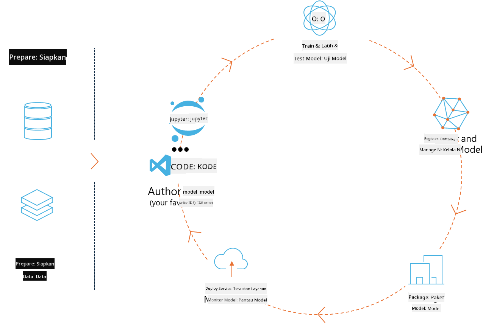
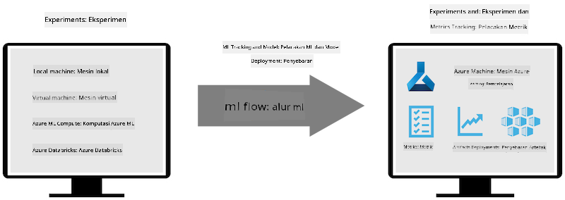
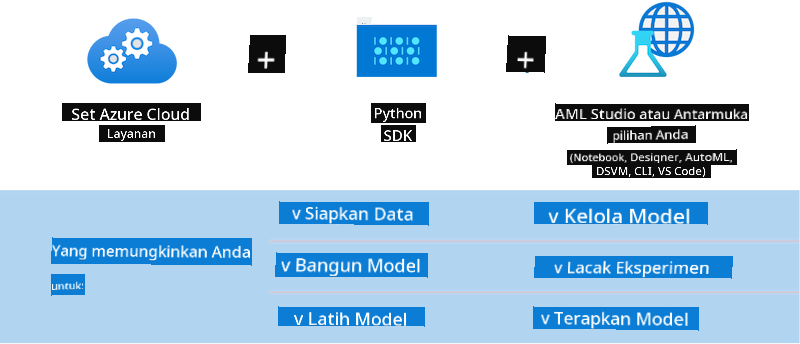

<!--
CO_OP_TRANSLATOR_METADATA:
{
  "original_hash": "f61c383bbf0c3dac97e43f833c258731",
  "translation_date": "2025-07-17T02:33:58+00:00",
  "source_file": "md/02.Application/01.TextAndChat/Phi3/E2E_Phi-3-MLflow.md",
  "language_code": "id"
}
-->
# MLflow

[MLflow](https://mlflow.org/) adalah platform open-source yang dirancang untuk mengelola siklus hidup machine learning secara menyeluruh.



MLFlow digunakan untuk mengelola siklus hidup ML, termasuk eksperimen, reproduksibilitas, deployment, dan registri model pusat. Saat ini MLflow menawarkan empat komponen.

- **MLflow Tracking:** Mencatat dan menanyakan eksperimen, kode, konfigurasi data, dan hasil.
- **MLflow Projects:** Mengemas kode data science dalam format yang dapat mereproduksi eksekusi di platform manapun.
- **Mlflow Models:** Mendeploy model machine learning di berbagai lingkungan penyajian.
- **Model Registry:** Menyimpan, memberi anotasi, dan mengelola model dalam repositori pusat.

MLFlow memiliki kemampuan untuk melacak eksperimen, mengemas kode menjadi eksekusi yang dapat direproduksi, serta berbagi dan mendeploy model. MLFlow terintegrasi dengan Databricks dan mendukung berbagai pustaka ML, sehingga bersifat agnostik terhadap pustaka. MLFlow dapat digunakan dengan pustaka machine learning apapun dan dalam bahasa pemrograman apapun, karena menyediakan REST API dan CLI untuk kemudahan penggunaan.



Fitur utama MLFlow meliputi:

- **Pelacakan Eksperimen:** Mencatat dan membandingkan parameter serta hasil.
- **Manajemen Model:** Mendeploy model ke berbagai platform penyajian dan inferensi.
- **Model Registry:** Mengelola siklus hidup MLflow Models secara kolaboratif, termasuk versioning dan anotasi.
- **Projects:** Mengemas kode ML untuk dibagikan atau digunakan dalam produksi.

MLFlow juga mendukung siklus MLOps, yang mencakup persiapan data, pendaftaran dan pengelolaan model, pengemasan model untuk eksekusi, deployment layanan, dan pemantauan model. Tujuannya adalah menyederhanakan proses dari prototipe ke alur kerja produksi, terutama di lingkungan cloud dan edge.

## Skenario E2E - Membangun wrapper dan menggunakan Phi-3 sebagai model MLFlow

Dalam contoh E2E ini, kami akan menunjukkan dua pendekatan berbeda untuk membangun wrapper di sekitar model bahasa kecil Phi-3 (SLM) dan kemudian menjalankannya sebagai model MLFlow baik secara lokal maupun di cloud, misalnya di workspace Azure Machine Learning.



| Proyek | Deskripsi | Lokasi |
| ------------ | ----------- | -------- |
| Transformer Pipeline | Transformer Pipeline adalah opsi termudah untuk membangun wrapper jika Anda ingin menggunakan model HuggingFace dengan flavour transformer eksperimental MLFlow. | [**TransformerPipeline.ipynb**](../../../../../../code/06.E2E/E2E_Phi-3-MLflow_TransformerPipeline.ipynb) |
| Custom Python Wrapper | Saat penulisan, transformer pipeline belum mendukung pembuatan wrapper MLFlow untuk model HuggingFace dalam format ONNX, bahkan dengan paket Python optimum eksperimental. Untuk kasus seperti ini, Anda dapat membangun wrapper Python kustom untuk mode MLFlow. | [**CustomPythonWrapper.ipynb**](../../../../../../code/06.E2E/E2E_Phi-3-MLflow_CustomPythonWrapper.ipynb) |

## Proyek: Transformer Pipeline

1. Anda memerlukan paket Python relevan dari MLFlow dan HuggingFace:

    ``` Python
    import mlflow
    import transformers
    ```

2. Selanjutnya, Anda harus memulai transformer pipeline dengan merujuk ke model Phi-3 target di registri HuggingFace. Seperti yang terlihat dari kartu model _Phi-3-mini-4k-instruct_, tugasnya adalah tipe “Text Generation”:

    ``` Python
    pipeline = transformers.pipeline(
        task = "text-generation",
        model = "microsoft/Phi-3-mini-4k-instruct"
    )
    ```

3. Sekarang Anda dapat menyimpan transformer pipeline model Phi-3 Anda ke format MLFlow dan memberikan detail tambahan seperti path artefak target, pengaturan konfigurasi model spesifik, dan tipe API inferensi:

    ``` Python
    model_info = mlflow.transformers.log_model(
        transformers_model = pipeline,
        artifact_path = "phi3-mlflow-model",
        model_config = model_config,
        task = "llm/v1/chat"
    )
    ```

## Proyek: Custom Python Wrapper

1. Di sini kita dapat memanfaatkan [ONNX Runtime generate() API](https://github.com/microsoft/onnxruntime-genai) dari Microsoft untuk inferensi model ONNX dan encoding/decoding token. Anda harus memilih paket _onnxruntime_genai_ sesuai target komputasi, dengan contoh di bawah ini menargetkan CPU:

    ``` Python
    import mlflow
    from mlflow.models import infer_signature
    import onnxruntime_genai as og
    ```

1. Kelas kustom kami mengimplementasikan dua metode: _load_context()_ untuk menginisialisasi **model ONNX** Phi-3 Mini 4K Instruct, **parameter generator**, dan **tokenizer**; serta _predict()_ untuk menghasilkan token output berdasarkan prompt yang diberikan:

    ``` Python
    class Phi3Model(mlflow.pyfunc.PythonModel):
        def load_context(self, context):
            # Retrieving model from the artifacts
            model_path = context.artifacts["phi3-mini-onnx"]
            model_options = {
                 "max_length": 300,
                 "temperature": 0.2,         
            }
        
            # Defining the model
            self.phi3_model = og.Model(model_path)
            self.params = og.GeneratorParams(self.phi3_model)
            self.params.set_search_options(**model_options)
            
            # Defining the tokenizer
            self.tokenizer = og.Tokenizer(self.phi3_model)
    
        def predict(self, context, model_input):
            # Retrieving prompt from the input
            prompt = model_input["prompt"][0]
            self.params.input_ids = self.tokenizer.encode(prompt)
    
            # Generating the model's response
            response = self.phi3_model.generate(self.params)
    
            return self.tokenizer.decode(response[0][len(self.params.input_ids):])
    ```

1. Sekarang Anda dapat menggunakan fungsi _mlflow.pyfunc.log_model()_ untuk menghasilkan wrapper Python kustom (dalam format pickle) untuk model Phi-3, bersama dengan model ONNX asli dan dependensi yang diperlukan:

    ``` Python
    model_info = mlflow.pyfunc.log_model(
        artifact_path = artifact_path,
        python_model = Phi3Model(),
        artifacts = {
            "phi3-mini-onnx": "cpu_and_mobile/cpu-int4-rtn-block-32-acc-level-4",
        },
        input_example = input_example,
        signature = infer_signature(input_example, ["Run"]),
        extra_pip_requirements = ["torch", "onnxruntime_genai", "numpy"],
    )
    ```

## Tanda tangan model MLFlow yang dihasilkan

1. Pada langkah 3 proyek Transformer Pipeline di atas, kami menetapkan tugas model MLFlow menjadi “_llm/v1/chat_”. Instruksi ini menghasilkan wrapper API model yang kompatibel dengan OpenAI Chat API seperti yang ditunjukkan di bawah:

    ``` Python
    {inputs: 
      ['messages': Array({content: string (required), name: string (optional), role: string (required)}) (required), 'temperature': double (optional), 'max_tokens': long (optional), 'stop': Array(string) (optional), 'n': long (optional), 'stream': boolean (optional)],
    outputs: 
      ['id': string (required), 'object': string (required), 'created': long (required), 'model': string (required), 'choices': Array({finish_reason: string (required), index: long (required), message: {content: string (required), name: string (optional), role: string (required)} (required)}) (required), 'usage': {completion_tokens: long (required), prompt_tokens: long (required), total_tokens: long (required)} (required)],
    params: 
      None}
    ```

1. Sebagai hasilnya, Anda dapat mengirimkan prompt Anda dalam format berikut:

    ``` Python
    messages = [{"role": "user", "content": "What is the capital of Spain?"}]
    ```

1. Kemudian, gunakan post-processing kompatibel OpenAI API, misalnya _response[0][‘choices’][0][‘message’][‘content’]_, untuk mempercantik output Anda menjadi seperti ini:

    ``` JSON
    Question: What is the capital of Spain?
    
    Answer: The capital of Spain is Madrid. It is the largest city in Spain and serves as the political, economic, and cultural center of the country. Madrid is located in the center of the Iberian Peninsula and is known for its rich history, art, and architecture, including the Royal Palace, the Prado Museum, and the Plaza Mayor.
    
    Usage: {'prompt_tokens': 11, 'completion_tokens': 73, 'total_tokens': 84}
    ```

1. Pada langkah 3 proyek Custom Python Wrapper di atas, kami membiarkan paket MLFlow menghasilkan tanda tangan model dari contoh input yang diberikan. Tanda tangan wrapper MLFlow kami akan terlihat seperti ini:

    ``` Python
    {inputs: 
      ['prompt': string (required)],
    outputs: 
      [string (required)],
    params: 
      None}
    ```

1. Jadi, prompt kami harus berisi kunci dictionary "prompt", seperti ini:

    ``` Python
    {"prompt": "<|system|>You are a stand-up comedian.<|end|><|user|>Tell me a joke about atom<|end|><|assistant|>",}
    ```

1. Output model kemudian akan diberikan dalam format string:

    ``` JSON
    Alright, here's a little atom-related joke for you!
    
    Why don't electrons ever play hide and seek with protons?
    
    Because good luck finding them when they're always "sharing" their electrons!
    
    Remember, this is all in good fun, and we're just having a little atomic-level humor!
    ```

**Penafian**:  
Dokumen ini telah diterjemahkan menggunakan layanan terjemahan AI [Co-op Translator](https://github.com/Azure/co-op-translator). Meskipun kami berupaya untuk mencapai akurasi, harap diingat bahwa terjemahan otomatis mungkin mengandung kesalahan atau ketidakakuratan. Dokumen asli dalam bahasa aslinya harus dianggap sebagai sumber yang sahih. Untuk informasi penting, disarankan menggunakan terjemahan profesional oleh manusia. Kami tidak bertanggung jawab atas kesalahpahaman atau penafsiran yang keliru yang timbul dari penggunaan terjemahan ini.