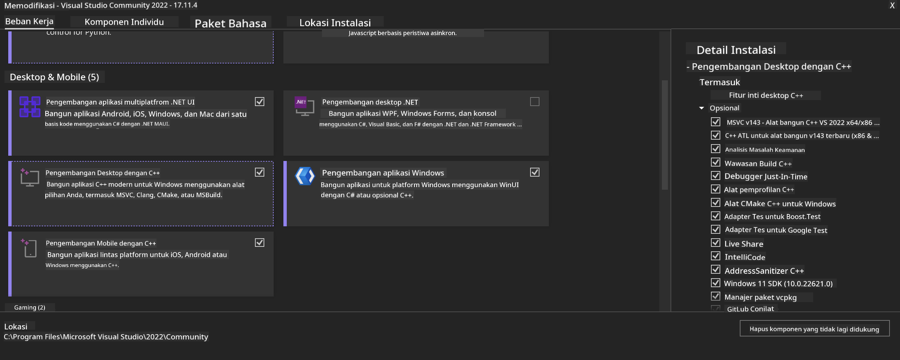
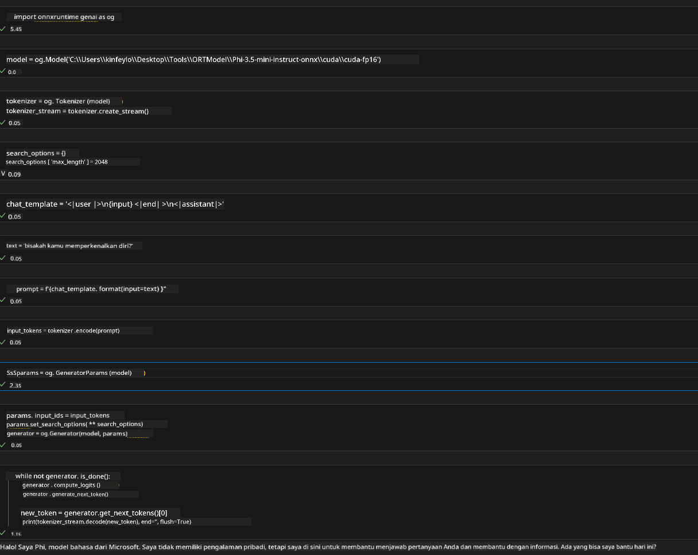
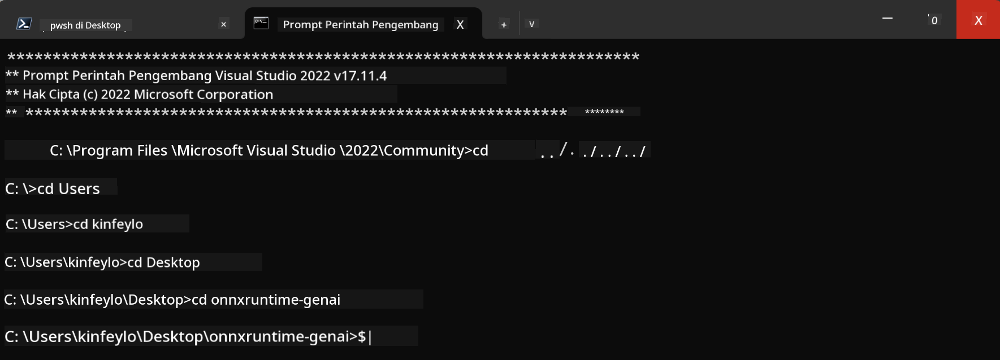

<!--
CO_OP_TRANSLATOR_METADATA:
{
  "original_hash": "b066fc29c1b2129df84e027cb75119ce",
  "translation_date": "2025-05-09T18:45:15+00:00",
  "source_file": "md/02.Application/01.TextAndChat/Phi3/ORTWindowGPUGuideline.md",
  "language_code": "id"
}
-->
# **Panduan untuk OnnxRuntime GenAI Windows GPU**

Panduan ini memberikan langkah-langkah untuk mengatur dan menggunakan ONNX Runtime (ORT) dengan GPU di Windows. Dirancang untuk membantu Anda memanfaatkan akselerasi GPU pada model Anda, meningkatkan kinerja dan efisiensi.

Dokumen ini memberikan panduan tentang:

- Pengaturan Lingkungan: Instruksi pemasangan dependensi yang diperlukan seperti CUDA, cuDNN, dan ONNX Runtime.
- Konfigurasi: Cara mengatur lingkungan dan ONNX Runtime untuk menggunakan sumber daya GPU secara efektif.
- Tips Optimasi: Saran untuk menyetel pengaturan GPU Anda agar mendapatkan kinerja optimal.

### **1. Python 3.10.x /3.11.8**

   ***Note*** Disarankan menggunakan [miniforge](https://github.com/conda-forge/miniforge/releases/latest/download/Miniforge3-Windows-x86_64.exe) sebagai lingkungan Python Anda

   ```bash

   conda create -n pydev python==3.11.8

   conda activate pydev

   ```

   ***Reminder*** Jika Anda pernah menginstal library ONNX untuk python, harap uninstall terlebih dahulu

### **2. Install CMake dengan winget**


   ```bash

   winget install -e --id Kitware.CMake

   ```

### **3. Install Visual Studio 2022 - Desktop Development with C++**

   ***Note*** Jika Anda tidak ingin melakukan kompilasi, langkah ini bisa dilewati




### **4. Install Driver NVIDIA**

1. **Driver GPU NVIDIA**  [https://www.nvidia.com/en-us/drivers/](https://www.nvidia.com/en-us/drivers/)

2. **NVIDIA CUDA 12.4** [https://developer.nvidia.com/cuda-12-4-0-download-archive](https://developer.nvidia.com/cuda-12-4-0-download-archive)

3. **NVIDIA CUDNN 9.4**  [https://developer.nvidia.com/cudnn-downloads](https://developer.nvidia.com/cudnn-downloads)

***Reminder*** Harap gunakan pengaturan default saat proses instalasi

### **5. Atur Lingkungan NVIDIA**

Salin file lib, bin, include dari NVIDIA CUDNN 9.4 ke NVIDIA CUDA 12.4 lib, bin, include

- salin file dari *'C:\Program Files\NVIDIA\CUDNN\v9.4\bin\12.6'* ke  *'C:\Program Files\NVIDIA GPU Computing Toolkit\CUDA\v12.4\bin'*

- salin file dari *'C:\Program Files\NVIDIA\CUDNN\v9.4\include\12.6'* ke  *'C:\Program Files\NVIDIA GPU Computing Toolkit\CUDA\v12.4\include'*

- salin file dari *'C:\Program Files\NVIDIA\CUDNN\v9.4\lib\12.6'* ke  *'C:\Program Files\NVIDIA GPU Computing Toolkit\CUDA\v12.4\lib\x64'*


### **6. Download Phi-3.5-mini-instruct-onnx**


   ```bash

   winget install -e --id Git.Git

   winget install -e --id GitHub.GitLFS

   git lfs install

   git clone https://huggingface.co/microsoft/Phi-3.5-mini-instruct-onnx

   ```

### **7. Menjalankan InferencePhi35Instruct.ipynb**

   Buka [Notebook](../../../../../../code/09.UpdateSamples/Aug/ortgpu-phi35-instruct.ipynb) dan jalankan





### **8. Kompilasi ORT GenAI GPU**


   ***Note*** 
   
   1. Harap uninstall semua paket terkait onnx, onnxruntime, dan onnxruntime-genai terlebih dahulu

   
   ```bash

   pip list 
   
   ```

   Kemudian uninstall semua library onnxruntime seperti 


   ```bash

   pip uninstall onnxruntime

   pip uninstall onnxruntime-genai

   pip uninstall onnxruntume-genai-cuda
   
   ```

   2. Periksa dukungan Ekstensi Visual Studio 

   Periksa folder C:\Program Files\NVIDIA GPU Computing Toolkit\CUDA\v12.4\extras untuk memastikan folder C:\Program Files\NVIDIA GPU Computing Toolkit\CUDA\v12.4\extras\visual_studio_integration ada. 
   
   Jika tidak ditemukan, cek folder driver toolkit CUDA lainnya dan salin folder visual_studio_integration beserta isinya ke C:\Program Files\NVIDIA GPU Computing Toolkit\CUDA\v12.4\extras\visual_studio_integration


   - Jika Anda tidak ingin melakukan kompilasi, langkah ini bisa dilewati


   ```bash

   git clone https://github.com/microsoft/onnxruntime-genai

   ```

   - Download [https://github.com/microsoft/onnxruntime/releases/download/v1.19.2/onnxruntime-win-x64-gpu-1.19.2.zip](https://github.com/microsoft/onnxruntime/releases/download/v1.19.2/onnxruntime-win-x64-gpu-1.19.2.zip)

   - Ekstrak onnxruntime-win-x64-gpu-1.19.2.zip, lalu ganti nama foldernya menjadi **ort**, salin folder ort ke onnxruntime-genai

   - Gunakan Windows Terminal, buka Developer Command Prompt for VS 2022 dan masuk ke onnxruntime-genai 



   - Kompilasi menggunakan lingkungan python Anda

   
   ```bash

   cd onnxruntime-genai

   python build.py --use_cuda  --cuda_home "C:\Program Files\NVIDIA GPU Computing Toolkit\CUDA\v12.4" --config Release
 

   cd build/Windows/Release/Wheel

   pip install .whl

   ```

**Penafian**:  
Dokumen ini telah diterjemahkan menggunakan layanan terjemahan AI [Co-op Translator](https://github.com/Azure/co-op-translator). Meskipun kami berusaha untuk akurasi, harap diingat bahwa terjemahan otomatis mungkin mengandung kesalahan atau ketidakakuratan. Dokumen asli dalam bahasa aslinya harus dianggap sebagai sumber yang sahih. Untuk informasi penting, disarankan menggunakan terjemahan profesional oleh manusia. Kami tidak bertanggung jawab atas kesalahpahaman atau salah tafsir yang timbul dari penggunaan terjemahan ini.